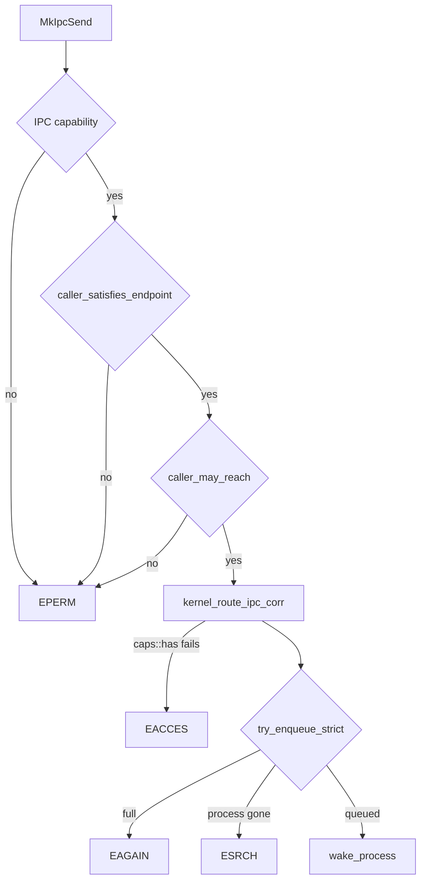

# IPC

How a [capsule](../overview/glossary.md#capsule) sends a message through the NONOS kernel: [endpoints](../overview/glossary.md#endpoint) and [inboxes](../overview/glossary.md#inbox), the size and queue limits, who may send to whom, and how a receiver blocks and times out.

## The model

Every capsule is a ring 3 process with an inbox of its own, named `proc.<pid>`. The spawn path registers it with `register_inbox`, together with a second inbox `stdin.<pid>` that the parent feeds (`src/kernel_core/process_spawn/capsule_spawn/runner/install/own_inboxes.rs:29-38`). The stdin inbox holds at most 64 messages, set by `STDIN_CAPACITY` (`src/kernel_core/process_spawn/capsule_spawn/runner/install/own_inboxes.rs:27`).

A service is an endpoint: a row in the kernel's service registry with a name, a port, the pid that serves it and the [capability](../overview/glossary.md#capability) bits a sender must hold, kept in `ServiceEndpoint` (`src/services/registry/endpoint.rs:22-27`). The registry holds at most `MAX_SERVICES` rows, 256 (`src/services/registry.rs:38`).

A message sent to any endpoint of a capsule lands in that capsule's `proc.<pid>` inbox: `kernel_route_ipc_corr` picks the destination that way unless the endpoint is owned by `KERNEL_OWNER` (`src/ipc/kernel_ipc.rs:67-73`). `KERNEL_OWNER` is pid 0 and marks a [reply inbox](../overview/glossary.md#reply-inbox) that the kernel itself drains (`src/ipc/nonos_inbox/registry.rs:44-47`).

The envelope is `IpcMessage`: sender name, destination name, payload, a millisecond timestamp, a correlation word and a 64 bit checksum (`src/ipc/nonos_channel/message.rs:24-32`). The kernel writes the sender as `proc.<caller pid>` when `kernel_route_ipc_corr` builds the envelope with `IpcMessage::new`, so a capsule cannot choose its own sender name (`src/ipc/kernel_ipc.rs:74-79`). The checksum is a keyed BLAKE3 hash over both names, the timestamp and the payload, cut to its last eight bytes in `compute_checksum` (`src/ipc/nonos_channel/hash.rs:63-80`). Its key comes from `init_ipc_secret`, which derives it with BLAKE3 from 32 random bytes at boot (`src/ipc/nonos_channel/hash.rs:25-34`); boot stops if that fails, in `init_core_services` (`src/kernel_core/init/entry/init_core_services.rs:37-38`).

## The IPC system calls

All eight calls need the `IPC` capability in the caller's token; the table entry for them is `can_ipc` (`src/syscall/contract/cap_table/mk.rs:109-116`). The numeric dispatcher passes the arguments as shown in `handle` (`src/syscall/microkernel/dispatch/ipc.rs:26-41`).

| Tag | Name | What it does |
|---|---|---|
| `MISD` | `MkIpcSend` | Send `buf[..len]` to an endpoint, by port or by `endpoint.<n>` name. |
| `MIRC` | `MkIpcRecv` | Take the next message from the caller's own inbox (endpoint 0) or from an endpoint it owns. |
| `MIRF` | `MkIpcRecvFrom` | As `MkIpcRecv`, and also write the sender's pid to a user pointer. |
| `MICL` | `MkIpcCall` | Send a request with a fresh [correlation token](../overview/glossary.md#correlation-token) and wait for the matching reply. |
| `MIRY` | `MkIpcReply` | Answer a caller that is waiting in `MkIpcCall`. |
| `MISP` | `MkIpcSendToPid` | Send straight into another process's `proc.<pid>` inbox. |
| `MSVL` | `MkServiceLookup` | Resolve a service name to its port and the pid that serves it. |
| `MSVR` | `MkServiceRegister` | Claim a service name and port at run time. |

The four letter tags are [syscall tags](../overview/glossary.md#syscall-tag); [System calls](syscalls.md) explains them.

## Limits

- A payload is at most `MAX_MESSAGE_SIZE`, 1 MiB (`src/ipc/nonos_channel/limits.rs:26`).
- `send_with_correlation` refuses a length of 0 or above `MAX_MESSAGE_SIZE` with `EINVAL` before it allocates anything (`src/syscall/microkernel/ipc/send.rs:45-47`).
- `sys_ipc_send_to_pid` (`src/syscall/microkernel/ipc/send_to_pid.rs:45-47`) and `sys_ipc_reply` (`src/syscall/microkernel/ipc/reply.rs:52-58`) apply the same `MAX_MESSAGE_SIZE` bound. `sys_ipc_call` checks the response length `resp_len` against `MAX_MESSAGE_SIZE` (`src/syscall/microkernel/ipc/call/sys_ipc_call.rs:57-59`), and its request goes through `send_with_correlation`.
- An inbox holds `DEFAULT_INBOX_CAPACITY` messages, 1024; a capacity set by hand must lie between `MIN_INBOX_CAPACITY` 16 and `MAX_INBOX_CAPACITY` 65536 (`src/ipc/nonos_inbox/registry.rs:40-42`).
- Bytes are budgeted as well as messages: `TOTAL_BYTES_MAX` is 96 MiB for every inbox together, `INBOX_BYTES_MAX` is 16 MiB for one inbox, and `SHARE_BYTES_MAX` is half of that for one sender in one inbox (`src/ipc/nonos_inbox/budget.rs:41-43`).
- Each queued message is charged its payload, both names and `MESSAGE_OVERHEAD` of 128 bytes (`src/ipc/nonos_inbox/budget.rs:44-52`).
- The kernel's own messages, sender 0, count against the inbox and the total but not against a sender share, as `admit` shows (`src/ipc/nonos_inbox/budget.rs:75-90`).
- One service has at most `MAX_PER_SERVICE` 64 calls waiting for its replies, and one caller at most `MAX_PER_CALLER` 8 of them (`src/syscall/microkernel/ipc/pending_reply/share.rs:31-38`).
- A service name passed to lookup or register is at most `NAME_MAX`, 64 bytes, in both `lookup.rs` (`src/syscall/microkernel/ipc/lookup.rs:24`) and `register.rs` (`src/syscall/microkernel/ipc/register.rs:28`).
- `register_endpoint` refuses a new endpoint once `MAX_SERVICES`, 256, are registered (`src/services/registry.rs:42-55`), and `sys_service_register` reports that as `ERRNO_NOMEM`, -12 (`src/syscall/microkernel/ipc/register.rs:53-55`).

A message that does not fit is refused, never cut on the way in: `try_enqueue` checks the count and the byte budget under one lock and hands the message back (`src/ipc/nonos_inbox/inbox.rs:97-112`).

## Who may send to whom

A send by name passes four gates, in this order.

1. The syscall contract checks the caller's [capability token](../overview/glossary.md#capability-token) for `IPC`; a refusal is `EPERM`. [Capabilities](capabilities.md) describes that check.
2. `caller_satisfies_endpoint` finds the endpoint by name or port and refuses an unknown endpoint, an endpoint whose requirement is zero, and a caller that lacks any required bit (`src/syscall/microkernel/ipc/send_caps.rs:36-49`).
3. `caller_may_reach` applies two lists that capabilities cannot express: the held endpoints and the [peer list](../overview/glossary.md#peer-list) (`src/services/registry/peers_check.rs:54-61`).
4. `kernel_route_ipc_corr` looks the endpoint up again and tests the caller's bits with `caps::has`, answering `EACCES` when they fall short (`src/ipc/kernel_ipc.rs:63-66`), then queues with `try_enqueue_strict` and wakes the receiving process with `wake_process` (`src/ipc/kernel_ipc.rs:81-89`).

A send to the sender's own reply endpoint is a reply and does not go through the router: `redirect_reply` hands it to the caller waiting in `MkIpcCall`, or leaves it in that reply inbox for the kernel when no call is pending (`src/syscall/microkernel/ipc/send.rs:136-150`).

What an endpoint requires is set when it is registered. A capsule's service endpoint is registered at spawn with `required_caps(name, IPC)` (`src/kernel_core/process_spawn/capsule_spawn/runner/install/install.rs:104-106`), and `required_caps` adds `Network` for the 11 names in `NETWORK_SERVICES`, from `net.core` to `net.socks5` (`src/services/registry/policy.rs:26-45`). A capsule's reply endpoint is created unowned before its pid exists, then claimed by `adopt_endpoint` with an `IPC` requirement (`src/kernel_core/process_spawn/capsule_spawn/runner/install/install.rs:95-96`); only an endpoint still owned by pid 0 can be adopted (`src/services/registry/adopt.rs:31-46`).

The held endpoints are driver endpoints that only named services may reach, listed in `HELD` (`src/services/registry/held_table.rs:20-36`). The wired network drivers take messages only from `net.core` and `net.l2`; the Wi-Fi drivers from `net.core`, the Settings windows and the setup wizard; `driver.xhci0` from the USB HID and storage drivers; `driver.i2c_pci0` from the I2C-HID driver; `driver.virtio_gpu0` from `compositor`; and `driver.hda0` from `audio.server`. The keyboard, pointer, USB storage and random source drivers are `KERNEL_ONLY`: no capsule may send to them, because the kernel drives them itself (`src/services/registry/held_table.rs:38-40`). A caller counts as named when it owns the endpoint of that name, which `endpoint_admits` checks (`src/services/registry/held.rs:48-52`).

The peer list holds a capsule to the endpoints named for it and nothing else. In this release it has one entry, in `PEERS`: `shield_prover` may send only to `shield.core` (`src/services/registry/peers.rs:27-31`). A capsule not on the list is not limited by it.

`MkIpcSendToPid` writes into the inbox every endpoint of the destination is read from, so `caller_satisfies_inbox` makes the caller pass the gate of each endpoint the destination serves (`src/syscall/microkernel/ipc/send_caps.rs:65-77`). `sys_ipc_send_to_pid` applies the peer list through `caller_may_reach_pid` before that (`src/syscall/microkernel/ipc/send_to_pid.rs:59-66`).

Receiving is narrower. `resolve_for_recv` maps endpoint 0 to the caller's own `proc.<pid>`, accepts another endpoint only when the caller owns it, and answers `EACCES` otherwise (`src/syscall/microkernel/ipc/inbox_name.rs:28-40`).

Registering a name at run time is refused for any name starting `proc.` or `endpoint.`, for the reserved core services and for ports 4098 to 4107, in `allowed` (`src/syscall/microkernel/ipc/register_allowed.rs:24-39`). The reserved names are `keyring`, `entropy_pool`, `crypto_pool`, `vfs_pool` and `market.index`, in `RESERVED_NAMES` (`src/services/registry/reserved.rs:19-28`). A name the caller does not already hold on that port must be one of the five network services in `RUNTIME_REGISTRABLE` (`src/services/registry/reserved.rs:32-33`), and `caller_has_register_right` asks for `RegisterService` or `Admin` (`src/services/registry/auth/caller_has_register_right.rs:17-20`).

## Blocking, waking and timeouts

`MkIpcRecv` and `MkIpcRecvFrom` block until a message arrives. A `timeout_ms` of 0 waits forever; any other value ends the wait with `ETIMEDOUT`, -110, once that many milliseconds have passed, as `recv_from_inbox` does (`src/syscall/microkernel/ipc/recv.rs:149-153`). The receiver reads its `wake_token` before it looks at the queue, so a message that lands between the empty check and the sleep is not lost (`src/syscall/microkernel/ipc/recv.rs:124-132`).

A message longer than the receive buffer is cut to the buffer and the rest is dropped: the whole message is dequeued and `copy_to_user` copies only what fits (`src/syscall/microkernel/ipc/recv.rs:133-147`). Size the buffer for the largest message the service sends.

`MkIpcCall` is a request and its reply in one call:

- `next_call_token` hands every call a nonzero correlation token (`src/syscall/microkernel/ipc/call/sys_ipc_call.rs:37-46`).
- The call records a pending entry with the server through `pending_reply::push` and fails with `EBUSY` when the server's queue or the caller's share is full (`src/syscall/microkernel/ipc/call/sys_ipc_call.rs:72-76`).
- A `timeout_ms` of 0 means 5000 ms here, not forever (`src/syscall/microkernel/ipc/call/sys_ipc_call.rs:90`).
- `recv_reply_correlated` delivers only a message whose correlation equals the token and discards every other message in the reply inbox (`src/syscall/microkernel/ipc/recv.rs:58-93`).
- A plain send carries correlation 0, which `sys_ipc_send` sets (`src/syscall/microkernel/ipc/send.rs:30-31`), so it cannot pass as a reply.
- A call that times out leaves its pending entry in place, so a late reply still pairs with the right caller and is then discarded. Apart from the reply itself, only a failed send or `clear_pid`, when either side exits, removes an entry (`src/syscall/microkernel/ipc/call/sys_ipc_call.rs:95-105`).

`MkIpcReply` takes its token from the pending entry through `pending_reply::remove`; with no pending call from that destination it drops the reply and returns 0 (`src/syscall/microkernel/ipc/reply.rs:75-78`). A server can also answer with `MkIpcSend` to its own reply endpoint; `redirect_reply` then calls `pop`, which takes the pending entry whose token matches the request the server received last, not the oldest one, and the bytes go to that caller stamped with that token (`src/syscall/microkernel/ipc/send.rs:141-150`, `src/syscall/microkernel/ipc/pending_reply/pop.rs:20-41`).

## Errors a sender sees

| Errno | Value | When |
|---|---:|---|
| `EINVAL` | -22 | Length 0, length above 1 MiB, or a bad pid or name. |
| `EFAULT` | -14 | The buffer is not readable or writable user memory. |
| `EPERM` | -1 | The caller fails a capability gate, a held endpoint or the peer list. |
| `EACCES` | -13 | A receive names an endpoint the caller does not own, or the router's own capability check fails. |
| `ENOENT` | -2 | No endpoint or inbox of that name. |
| `ESRCH` | -3 | The inbox is gone or the process that drains it has exited, from the router. |
| `EAGAIN` | -11 | The destination inbox is full, from the router. |
| `EBUSY` | -16 | A full inbox for `MkIpcSendToPid` and `MkIpcReply`, a full pending queue for `MkIpcCall`, or a name or port already taken for `MkServiceRegister`. |
| `ENOMEM` | -12 | The registry is full for `MkServiceRegister`, or the kernel could not build the message. |
| `ETIMEDOUT` | -110 | A receive or a call waited out its timeout. |

The router's constants sit beside `EACCES` in `kernel_ipc.rs` (`src/ipc/kernel_ipc.rs:39-43`), and the syscall handlers use `ERRNO_PERM` and its neighbours (`src/syscall/microkernel/errnos.rs:22-49`). The full table is on [Errors](../abi/errors.md). `ETIMEDOUT` is returned by these calls but is not listed in the `[errors]` table of [abi/syscalls.toml](../../abi/syscalls.toml).

A capsule that has exited stops receiving even while its process row still exists: `owner_lives` treats a `Zombie` or `Terminated` process as gone (`src/ipc/nonos_inbox/registry.rs:164-172`).

## When a capsule exits

At teardown `release_pending_replies_for_pid` drops every pending call the process made or was owed (`src/process/exit/teardown.rs:52`). `unregister_for_pid` removes `proc.<pid>` and `stdin.<pid>` and zeroes every payload still queued in them (`src/ipc/nonos_inbox/drop_pid.rs:30-50`). The output inbox of a finished child is kept for its parent to drain while `is_retained` says so, and only its stdin inbox goes (`src/process/exit/finalize.rs:25-32`); at most `RETAINED_CAP`, 64, such inboxes are kept (`src/process/exit/postmortem.rs:28-29`). [Processes and capsule spawn](processes-and-spawn.md) covers the rest of exit.

## Code that is present but not used

- `src/ipc/nonos_channel` also holds `bus.rs`, `channel.rs` and `stats.rs`, but its module file declares only `error`, `hash`, `limits` and `message`, so the channel bus is not compiled (`src/ipc/nonos_channel/mod.rs:21-24`).
- `kernel_route_ipc` and `kernel_check_ipc_permission` have no caller at this commit; the send path calls `kernel_route_ipc_corr` (`src/ipc/kernel_ipc.rs:45-57`).
- `src/ipc/pipe` is a byte FIFO with a `PIPE_BUF_SIZE` of 65536 bytes and at most `MAX_PIPES`, 1024, pipes (`src/ipc/pipe/types.rs:20-21`). Nothing calls `create_pipe` at this commit, so no pipe is ever made (`src/ipc/pipe/mod.rs:24`); the only use from outside is `get_fd`, which asks `is_pipe` (`src/process/fd_table.rs:105-117`).
