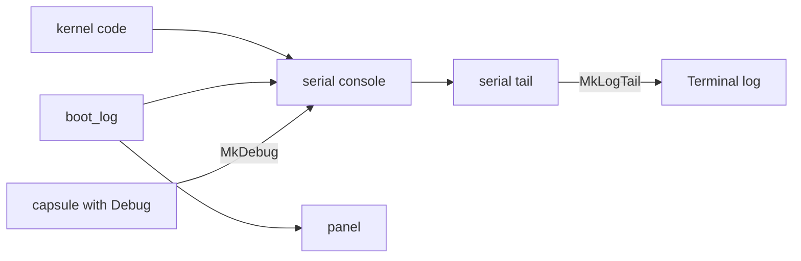

# Kernel logging

Where the NONOS kernel writes its messages, the tags they start with, and how to read them on a machine with or without a serial port.

## Where messages go

The [serial console](../overview/glossary.md#serial-console) is the main record. Kernel code writes `[TAG]` lines to it, the `boot_log` helpers write the same lines there and, when the on-screen log is built in, to the panel, and a [capsule](../overview/glossary.md#capsule) with the `Debug` [capability](../overview/glossary.md#capability) can add its own. On images built with `capsule-serial-debug`, the `standard` build profile among them, the kernel also keeps a copy in memory, the serial tail, which the Terminal's `log` command reads back.

### The serial console

On x86_64 the console is the 16550 UART at I/O port `0x3F8`, which `init` sets to 115200 baud, 8 data bits, no parity, one stop bit (`src/arch/x86_64/console.rs:27-55`). `init` first writes a pattern to the scratch register and reads it back. With no UART there, output is dropped and the boot goes on. A byte waits at most `TX_RETRIES`, 10 000 polls, for the transmitter, so a stuck port cannot hang the kernel.

### The serial tail

Every byte the console takes is also kept in memory: the first `HEAD`, 64 KiB, of the boot, which is never pushed out, and the latest `CAPACITY`, 64 KiB (`src/sys/serial/tail.rs:27-32`). A byte that arrives while the tail is being read is dropped from the tail, not waited for.

The tail exists only in kernels built with the `capsule-serial-debug` feature: without it, `keep` returns at once and nothing is kept (`src/sys/serial/tail.rs:49-54`). The `standard` build profile has the feature through `microkernel-desktop-base` (`Cargo.toml:591-594`). The `hardened` and `airgapped` build profiles drop it through `debugFeatures` (`tools/nix/config.nix:62`, `tools/nix/config.nix:84`, `tools/nix/config.nix:92`), so on those images the kernel's lines stay on the serial port only. These are build profiles, chosen when the image is made. The Hardened and Air-Gapped entries of the boot menu do not change what a kernel was built with.

### The panel

The kernel's on-screen boot log is off. `init_after_fb` prints `[fbconsole] on-screen log disabled; serial only` unless the kernel was built with `NONOS_FBCONSOLE=1` (`src/sys/boot_log/init.rs:22-39`). The panel is still used when the [boot stops](../overview/glossary.md#boot-stop) or the kernel panics; see [panic and boot stop](panic-and-boot-stop.md).

### Capsule lines

A capsule holding the `Debug` capability writes one line of up to `MAX_LEN`, 256 bytes, with `MkDebug` (`src/syscall/microkernel/debug.rs:37-69`). Its number is the tag `SYS_MK_DEBUG`, `0x4742444D` (`src/syscall/microkernel/numbers.rs:159`). A spawn grants it only in a kernel built with `capsule-serial-debug`; otherwise `serial_debug_cap` returns 0 (`src/capabilities/serial_debug.rs:34-50`). A Terminal's run of a Linux program is private: `sys_mk_debug` sends its lines only to that process's own inbox and never to the console (`src/syscall/microkernel/debug.rs:39-66`).

### The structured log and the debug ring

Two more facilities exist and are not active on a normal image:

- The `log_info!`, `log_warn!` and related macros format a message and pass it to `log::log` (`src/log/macros.rs:17-80`). A `LogManager` would keep the last `RAM_BUF_SIZE`, 1024, entries with a SHA3 hash chain and show warnings on the VGA text screen (`src/log/backend/ram_buffer.rs:20`, `src/log/manager/state.rs:30-83`). But `log` writes only when a manager is installed, and nothing in the kernel calls `init` (`src/log/manager/api.rs:26-53`). In this release these messages are dropped. The lines that reach the console are the ones written to it directly.
- With the `dbg-ring` feature, `RING_LEN`, 4096, fixed 32-byte records go to a ring in the `.nonos.dbg_ring` section, and the panic handler drains them to the console (`src/log/dbg_ring/types.rs:19-31`, `src/log/dbg_ring/drain.rs:24-39`). Without the feature, every ring call compiles to nothing.
