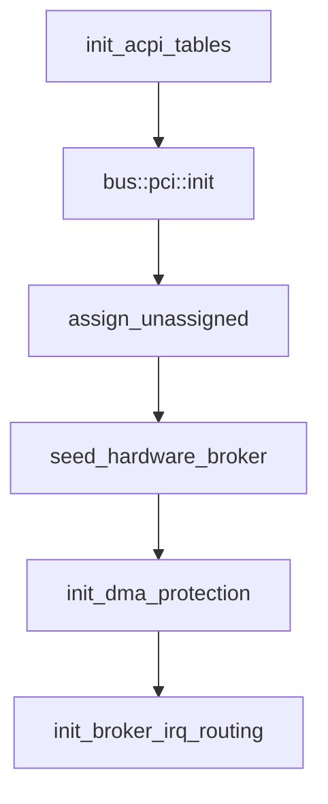

# PCI and ACPI

How the NONOS kernel learns what hardware a machine has on x86_64: which ACPI tables it reads and what it takes from each, how it scans PCI and reaches configuration space, and what it leaves alone.

## Order at boot

`init_core_systems` reads the ACPI tables with `init_acpi_tables`, scans PCI with `bus::pci::init`, then runs the platform baseline (`src/boot/main/core_init/init_core_systems.rs:35-68`). The baseline maps the PCI windows again, assigns any BAR firmware left empty with `assign_unassigned`, and fills the [hardware broker](hardware-broker.md)'s table with `seed_hardware_broker` (`src/kernel_core/init/platform/baseline.rs:39-57`). Later `microkernel_init` brings the IOMMU up with `init_dma_protection` once paging exists (`src/kernel_core/init/entry/microkernel_init.rs:49-52`), and `init_device_routing` programs the interrupt routes with `init_broker_irq_routing` before any [capsule](../overview/glossary.md#capsule) starts (`src/kernel_core/init/entry/init_runtime.rs:23-41`).

## Finding the tables

`init_acpi_tables` takes the RSDP address from the bootloader's handoff when there is one and prints `[NONOS] ACPI tables parsed` or `[NONOS] ACPI init failed; legacy fallbacks engaged` (`src/boot/main/core_init/acpi_tables.rs:19-33`). Without a handoff address, or when nothing valid sits at it, `find_rsdp` searches the EBDA and then the BIOS ROM range (`src/arch/x86_64/acpi/parser/rsdp.rs:29-55`).

`init` reads the XSDT with `parse_xsdt` when the RSDP has one and falls back to `parse_rsdt` only when there is no XSDT or it cannot be read (`src/arch/x86_64/acpi/parser/init.rs:41-55`). A missing or unreadable FADT fails the whole parse in `parse_fadt`; the other tables are optional (`src/arch/x86_64/acpi/parser/init.rs:61-70`).

## What each table gives

| Table | What the kernel takes | Used for |
|---|---|---|
| FADT | PM profile, SCI interrupt, the 8042 flag, PM1 and GPE blocks, the PM timer, the reset register, the sleep registers | power button, reset, sleep, timer calibration |
| MADT | local APIC address, the legacy PIC flag, entries of types 0, 1, 2, 4, 5, 9 and 10 | CPUs, IO-APIC routes, NMI lines |
| MCFG | each segment's ECAM base and bus range | read only access to the extended config space of segment 0, for AER reports |
| DMAR | the register base and device scope of each segment 0 remapping unit | VT-d |
| IVRS | the AMD IOMMU bases and the requester ids they cover | taking AMD-Vi units back from firmware |
| HPET | the HPET base address | timers |
| SRAT | memory and processor affinity | recorded |
| TPM2 | the TPM's control area | the TPM driver |
| DSDT and SSDTs | AML for `\_S5`, power devices, I2C and GPIO controllers | soft off, the power button, the touchpad and its controllers |

The sources, one per table:

- The FADT fields are the ones in `FadtInfo` (`src/arch/x86_64/acpi/hw/fadt_decode.rs:86-120`). A bad checksum is warned about and the table used anyway, as `parse_fadt` does, because refusing it would leave a laptop with no power control (`src/arch/x86_64/acpi/parser/fadt.rs:50-68`). The TSC rate is measured against the PM timer when nothing better gave it, in `calibrate_against_pm_timer` (`src/boot/main/core_init/acpi_tables.rs:42-58`).
- `parse_madt` reads the entry types listed in the table by `entry_type` and skips every other type (`src/arch/x86_64/acpi/parser/madt/parse.rs:58-66`). `init_from_acpi` turns its IO-APICs, overrides and NMI entries into the interrupt routes (`src/arch/x86_64/interrupt/ioapic/init_from_acpi.rs:25-62`).
- `parse_mcfg` drops an entry with an inverted bus range or a zero base, as Linux does (`src/arch/x86_64/acpi/parser/other/mcfg.rs:23-53`).
- `parse_dmar` checks the table's checksum, keeps at most 8 segment 0 units with their scopes and counts the units on other segments (`src/arch/x86_64/acpi/parser/other/dmar.rs:56-114`). Only DRHD structures are read; the other DMAR structure types are skipped.
- `parse_ivrs` checks the checksum and reads at most `MAX_IVRS_BYTES`, 64 KiB, of the table (`src/arch/x86_64/acpi/parser/other/ivrs.rs:28-69`).
- `parse_hpet` records the HPET base when the table is valid (`src/arch/x86_64/acpi/parser/other/hpet.rs:22-35`).
- The TPM driver looks the TPM2 table up by signature with `table_address` (`src/security/tpm/transport/acpi.rs:57-62`).
- `aml_blocks` returns the DSDT and every SSDT the root table listed (`src/arch/x86_64/acpi/aml/tables.rs:100-118`). `init` reads `\_S5` from them once with `find_in_blocks`, while the heap and the tables are known to be intact, and warns when there is none, in which case soft off is not available (`src/arch/x86_64/acpi/parser/init.rs:89-105`).

What is ignored: any table not named above. The SLIT has a signature constant, `SIG_SLIT`, and types, but `init` never parses it (`src/arch/x86_64/acpi/tables/mod.rs:65`). MADT entry types other than the seven listed are skipped. The kernel has no AML interpreter: the scanner in `scan` reads the bytes for the objects above and never executes AML (`src/arch/x86_64/acpi/aml/mod.rs:17-30`).
