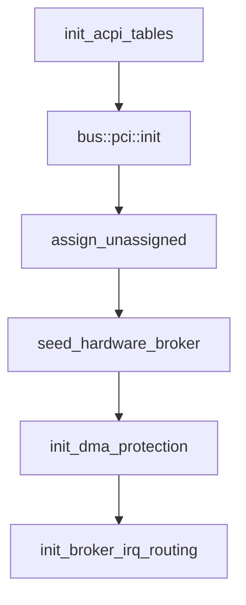

# PCI and ACPI

How the NONOS kernel learns what hardware a machine has on x86_64: which ACPI tables it reads and what it takes from each, how it scans PCI and reaches configuration space, and what it leaves alone.

## Order at boot

`init_core_systems` reads the ACPI tables with `init_acpi_tables`, scans PCI with `bus::pci::init`, then runs the platform baseline (`src/boot/main/core_init/init_core_systems.rs:35-68`). The baseline maps the PCI windows again, assigns any BAR firmware left empty with `assign_unassigned`, and fills the [hardware broker](hardware-broker.md)'s table with `seed_hardware_broker` (`src/kernel_core/init/platform/baseline.rs:39-57`). Later `microkernel_init` brings the IOMMU up with `init_dma_protection` once paging exists (`src/kernel_core/init/entry/microkernel_init.rs:49-52`), and `init_device_routing` programs the interrupt routes with `init_broker_irq_routing` before any [capsule](../overview/glossary.md#capsule) starts (`src/kernel_core/init/entry/init_runtime.rs:23-41`).
