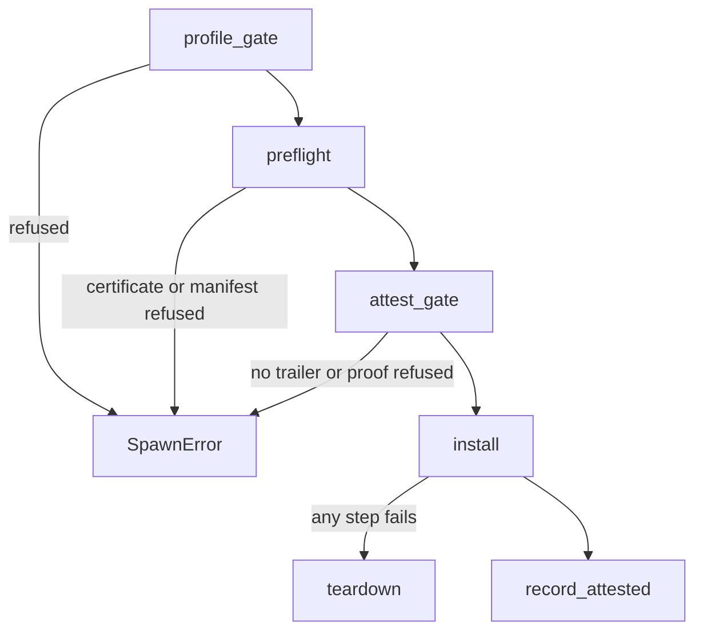

# Processes and capsule spawn

How the NONOS kernel turns a signed [capsule](../overview/glossary.md#capsule) into a running process: the gate it must pass, the ELF loader, the address space and stacks, and what happens when the process ends.

## Processes and address spaces

Every ring 3 program is a process with its own address space. `create_address_space` gives each one a fresh top level page table and copies the kernel half into it (`src/memory/paging/manager/address_space/create.rs:39-48`), and `allocate` records that table for the process (`src/process/address_space/lifecycle/setup.rs:26-49`). A thread shares its process's tables through `inherit` (`src/process/address_space/lifecycle/setup.rs:76-78`) and is held to its process's name and limits when it sends IPC, through `caller_group` (`src/services/registry/peers_check.rs:23-36`).

A process moves through the states of `ProcessState`: `New`, `Ready`, `Running`, `Sleeping`, `Stopped`, then `Zombie` and `Terminated` with an exit code (`src/process/core/types.rs:26-33`). [Memory and paging](memory-and-paging.md) and [Scheduler and SMP](scheduler-and-smp.md) cover the tables and the run queues.

## Where capsules come from

- Built into the image. The kernel embeds a capsule's ELF, identity certificate, [manifest](../overview/glossary.md#manifest) and [attestation trailer](../overview/glossary.md#attestation-trailer) with `include_bytes!`, as `HELLO_ELF` and its neighbours do (`src/userspace/capsule_hello/embed.rs:17-35`). A spawn site gives the name, the service and reply ports and the [capabilities](../overview/glossary.md#capability) it is willing to grant, as `spawn_hello_capsule` does for `app.hello` on port 4810 with reply port 4811 (`src/userspace/capsule_hello/spawn.rs:28-58`). Its `HELLO_ELF` is embedded only in a kernel built with the `nonos-capsule-hello` feature (`src/userspace/capsule_hello/embed.rs:17-23`).
- Installed later. The installer reads the same four artifacts from the store and passes them to `MkCapsuleLoad` by pointer; `load_capsule_from_vfs` takes the service name and both [endpoints](../overview/glossary.md#endpoint) from the signed manifest and limits the requested bits to what the manifest declares (`src/kernel_core/process_spawn/capsule_spawn/from_vfs/load/spawn.rs:34-68`). The call needs `CoreExec`, `IPC` and `Memory` (`src/syscall/contract/cap_table/mk.rs:85-88`).
- On behalf of another process. A caller holding `SpawnBroker` may name a live pid as the new capsule's parent; `attest` is the only way to build that attribution (`src/kernel_core/process_spawn/capsule_spawn/attested_parent.rs:36-46`).
- Linux guests. `MkForeignSpawn` creates a process for the [Linux personality](../overview/glossary.md#linux-personality) that holds no capabilities at all: `install_spawn` gives it an empty word (`src/process/foreign/spawn.rs:65-68`); its system calls go to the supervising capsule. [Linux personality](../userland/linux-personality.md) covers it.

## The spawn gate

Every verified capsule, built in or installed, goes through `spawn_verified_as`, and any refusal comes back as a `SpawnError` (`src/kernel_core/process_spawn/capsule_spawn/runner/verified.rs:38-82`).

1. The [boot profile](../overview/glossary.md#boot-profile) may refuse the capsule by name; `check` in `profile_gate` prints a `[PROFILE]` line and returns `ProfileRefused` (`src/kernel_core/process_spawn/capsule_spawn/runner/profile_gate.rs:31-46`).
2. `run` in `preflight` decodes the identity certificate with `decode_id_cert` and checks it against the baked trust anchor with `verify_id_cert` (`src/kernel_core/process_spawn/capsule_spawn/runner/preflight.rs:41-44`).
3. `verify_with_publisher` checks the manifest and its publisher signature against the ELF, the target triple, the requested capabilities and the two declared endpoints, and returns the capabilities to install (`src/kernel_core/process_spawn/capsule_spawn/runner/preflight.rs:46-67`). The manifest may not ask for any bit above the `allowed_caps_ceiling` of the identity certificate, which `check_ceiling` enforces (`src/security/capsule_manifest/verify/caps.rs:21-29`).
4. `classify` puts a capsule in the `systems.nonos` namespace in the `Enrolled` tier and any other in the `Publisher` tier (`src/kernel_core/process_spawn/capsule_spawn/runner/tier.rs:22-28`). Both tiers end in the same `attest_gate` (`src/kernel_core/process_spawn/capsule_spawn/runner/publisher_gate.rs:28-33`), which `run` calls with the manifest's `required_caps` (`src/kernel_core/process_spawn/capsule_spawn/runner/preflight.rs:70-77`).
5. `attest_gate` refuses a capsule with no trailer and otherwise calls `verify_capsule_attestation`, printing a `[ZK-ATTEST]` line either way (`src/kernel_core/process_spawn/capsule_spawn/runner/attest_gate.rs:23-63`).
6. `install` creates the process (below).
7. `record_attested` enters the pid, the proved measurement, the [capability word](../overview/glossary.md#capability-word) and the authority that vouched in the attestation registry (`src/kernel_core/process_spawn/capsule_spawn/runner/verified.rs:64-80`).

What the attestation check does, from the kernel side: `measure` takes the BLAKE3 digest of the ELF (`src/security/capsule_attest/measure.rs:26-32`), and `verify_capsule_attestation` tries the vendor's policy root first and then each root a person enrolled on the machine (`src/security/capsule_attest/verify.rs:33-63`). Against a root, `verify_against` builds the leaf from that digest, the capability word it is given and the policy epoch, folds the trailer's path to the kernel's own root, and checks the STARK proof over the same statement (`src/security/capsule_attest/path.rs:35-54`). The word it is given is the manifest's required capabilities; the optional bits a spawn site adds are bounded by the signed manifest and the certificate ceiling, not by the proof. A capsule whose bytes or required capabilities differ from what was proved is refused. Against an enrolled root, a trailer that starts with the `local_build` magic, for a capsule this machine built itself, carries a keyed tag only this kernel can mint or check, and `local_build::verify` checks that tag instead of a STARK proof (`src/security/capsule_attest/against_root.rs:34-45`). The proof system itself is on [STARK attestation](../security/stark-attestation.md), and signatures on [Signing and publisher keys](../userland/signing-and-publisher-keys.md).

A development image may admit capsules on the path alone with `nonos-dev-attest`; `compile_error` refuses that feature together with `nonos-release` (`src/lib.rs:43-47`).

The spawn site does not choose the capabilities. The word installed comes from the verified manifest, and `requested_caps` is only an upper bound for optional bits (`src/kernel_core/process_spawn/capsule_spawn/runner/verified.rs:25-27`).

## Install

`run` in `install` does the work in an order that leaves nothing behind on failure (`src/kernel_core/process_spawn/capsule_spawn/runner/install/install.rs:28-77`):

1. An empty ELF is refused, and so is a [reply inbox](../overview/glossary.md#reply-inbox) name that `InboxName` cannot hold, before anything is registered (`src/kernel_core/process_spawn/capsule_spawn/runner/install/install.rs:30-40`).
2. The reply inbox and its endpoint are registered unowned, because the pid does not exist yet, through `register_or_get_bootstrap_inbox` (`src/kernel_core/process_spawn/capsule_spawn/runner/install/install.rs:41-43`).
3. `create_process_with_parent` makes the process in the `Ready` state with its scheduling band (`src/kernel_core/process_spawn/capsule_spawn/runner/install/install.rs:44-56`).
4. `finish` claims the reply endpoint, registers `proc.<pid>` and `stdin.<pid>`, loads the ELF, installs the capabilities, allocates the kernel and user stacks, sets the first user context, registers the service endpoint and puts the process on the run queue (`src/kernel_core/process_spawn/capsule_spawn/runner/install/install.rs:88-117`).
5. If any step after the pid exists fails, `teardown` ends the process with status -1, as an exit would (`src/kernel_core/process_spawn/capsule_spawn/runner/install/install.rs:70-80`).

`install_caps` trims the word through the boot profile, which removes `Network` on a boot that runs no network, then calls `install_spawn` once (`src/kernel_core/process_spawn/capsule_spawn/runner/install/install_caps.rs:20-24`). `for_capsule` starts 4 interactive, 7 network and 4 storage capsules in the `High` band and every other capsule in `Normal` (`src/kernel_core/process_spawn/capsule_spawn/runner/install/priority.rs:64-70`).
