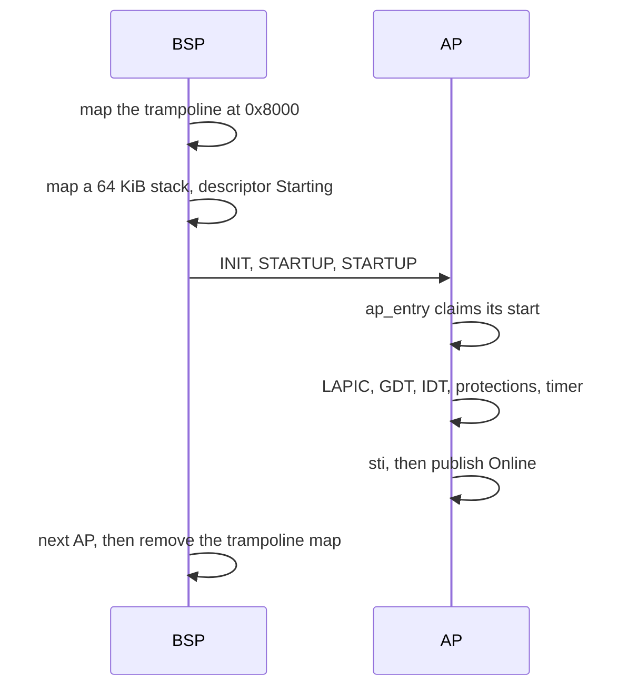

# Scheduler and SMP

How the NONOS kernel starts every CPU in the machine, what it keeps per CPU, and how each CPU decides which process to run next.

## How many CPUs run

Every CPU the firmware enables is started, within the limits below. The build configuration sets `smp` to true in `nonos.toml:20`, which is also the default in `tools/nix/config.nix:127`, and that adds the `nonos-smp` kernel feature to the image's `features` (`tools/nix/config.nix:144`). A kernel built without that feature runs on one CPU.

The number comes from the ACPI MADT. `secondaries` keeps every enabled processor entry and drops duplicates, placeholders, entries past the limit, and APIC ids above `0xFE` while the APIC is in xAPIC mode (`src/smp/topology/detection/probe_x86_64/mod.rs:74-114`). CPUID's count is used only on a machine with no MADT. It prints one line, for example `[SMP] madt aps=3 disabled=0 duplicate=0 invalid=0 unaddressable=0 over_limit=0`. The limit is `MAX_CPUS`, 256 (`src/smp/constants.rs:17`).

The boot CPU registers itself first. `init_bsp` records its APIC id, marks descriptor 0 online, runs the topology detection and fills per-CPU block 0 (`src/smp/init/bsp.rs:24-54`).

## Starting the other CPUs

Each [application processor](../overview/glossary.md#application-processor) (AP) is started by the boot CPU (BSP) in `start_aps`, the last stage of kernel init (`src/smp/init/ap_start.rs:22-84`).

1. The real-mode trampoline sits at physical `AP_TRAMPOLINE_ADDR`, `0x8000` (`src/smp/constants.rs:21`). The low half of the kernel's tables is empty by now, so `install` maps 16 pages there read and execute for the duration (`src/smp/init/ap_identity.rs:40-61`).
2. For each AP, `allocate` maps a 64 KiB stack at `PERCPU_STACKS_BASE` plus the CPU number times 64 KiB (`src/smp/init/stack.rs:22-32`), and `configure_descriptor` marks the CPU's descriptor `Starting` (`src/smp/init/ap_unit.rs:110-117`). `write_per_ap_context` patches the page-table root, stack, entry point and CPU number into the trampoline, and refuses a page-table root above 4 GiB (`src/smp/trampoline/install.rs:66-69`).
3. `start_ap` sends INIT and two STARTUP interrupts. The boot CPU waits `AP_ENTRY_TIMEOUT_MS`, 1000 ms, for the AP to enter, then `AP_ONLINE_TIMEOUT_MS`, 1000 ms, for it to come online (`src/smp/init/ap_unit.rs:38-39`). An AP that never entered is parked with INIT by `abandon` (`src/smp/init/ap_unit.rs:91-99`). One that entered and is slow is left running and counts itself when it gets there.
4. CPU numbers come from `next_cpu_id` and are never reused, even for an AP that failed, so the numbers of live CPUs can have gaps (`src/smp/init/ap_start.rs:39-57`).

On the AP, `ap_entry` first claims its start, so an AP the boot CPU gave up on never runs as that CPU number (`src/smp/ap/entry.rs:25-46`). `bring_up` then sets up its local APIC, its per-CPU block, its GDT and TSS, its extended state, its stack guards, the shared IDT, its syscall registers and CPU protections, and its own 100 Hz timer, all with interrupts masked (`src/smp/ap/bring_up.rs:24-75`). `go_live` enables interrupts and only then calls `publish`, because being online makes the CPU a target that must answer [TLB shootdowns](../overview/glossary.md#tlb-shootdown) (`src/smp/ap/go_live.rs:23-55`, `src/smp/ap/online.rs:37-42`).

For each AP the boot CPU prints `[SMP] ap=N apic=M` followed by `online`, `no response, parked` or `timeout after entry` (`src/smp/init/ap_unit.rs:66-86`). After the last one, `start_aps` reads `cpus_online` and prints `[SMP] answered=N online=M` (`src/smp/init/ap_start.rs:78-83`), and `start_secondary_cpus` prints one summary, such as `[SMP-PROOF] cpu_count=4 PASS` when any AP came up, `UP` when none did, or `FAIL` with a reason (`src/kernel_core/init/start_secondary.rs:17-47`). The count is the number of CPUs online, the boot CPU included.

An AP runs user processes only if its syscall registers were set and its CPU protections match the boot CPU's. Otherwise `finish` prints `[SMP] cpu=N runs no user code` and the CPU only takes interrupts and shootdowns (`src/smp/ap/user_setup.rs:46-59`).

## Per-CPU state

Each CPU has one 4096-byte `PerCpuData` block in a static array of `MAX_CPUS` blocks (`src/smp/percpu/types.rs:28-68`, `src/smp/percpu/operations.rs:22-25`). Assembly reads four fields at fixed offsets, and `SELF_PTR` and its neighbours are asserted at build time, so the syscall stub fails to build if the struct moves (`src/smp/percpu/layout.rs:33-37`).

| Offset | Field | Use |
|---|---|---|
| `0x00` | `self_ptr` | address of this block |
| `0x08` | `cpu_id` | CPU number |
| `0x20` | `kernel_stack_top` | the stack the syscall entry switches to |
| `0x28` | `user_stack_saved` | the user stack saved on syscall entry |

The other fields are read from Rust only: the current process, the time slice and reschedule flag, whether the current tick came from user mode, the active address-space id for shootdown targeting, and the time of the last tick. In kernel mode the GS base points at the block, and in user mode it is zero, as `init_bsp` and the entry paths arrange (`src/smp/percpu/operations.rs:27-52`).

`cpu_id` finds the current CPU from its local APIC id, not from GS, and halts a CPU whose id is in no descriptor rather than guess (`src/smp/cpu_id.rs:24-43`). Guessing 0 would let it act as the boot CPU with that CPU's current process and [capabilities](../overview/glossary.md#capability).
