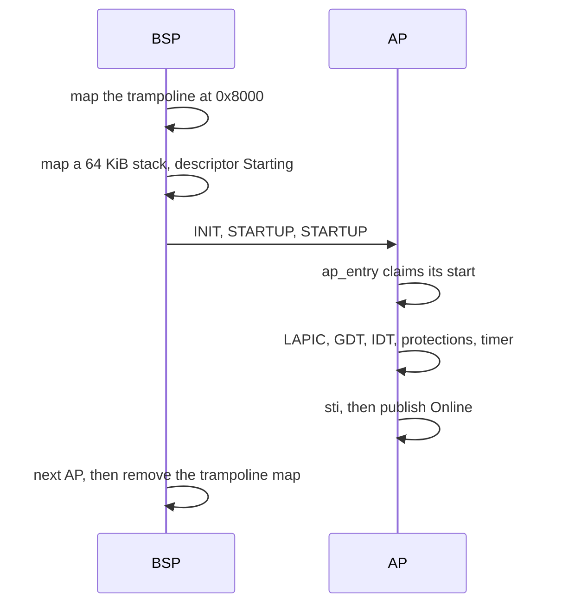

# Scheduler and SMP

How the NONOS kernel starts every CPU in the machine, what it keeps per CPU, and how each CPU decides which process to run next.

## How many CPUs run

NONOS runs [SMP](../overview/glossary.md#smp): it starts every CPU the firmware enables in the ACPI MADT, up to `MAX_CPUS`, 256 (`src/smp/constants.rs:17`). `secondaries` keeps every enabled processor entry and drops duplicates, placeholders, entries past the limit, and APIC ids above `0xFE` while the APIC is in xAPIC mode (`src/smp/topology/detection/probe_x86_64/mod.rs:74-114`). CPUID's count is used only on a machine with no MADT. It prints one line, for example `[SMP] madt aps=3 disabled=0 duplicate=0 invalid=0 unaddressable=0 over_limit=0`.

This needs the `nonos-smp` kernel feature. The build configuration sets `smp` to true in `nonos.toml:20`, which is also the default in `tools/nix/config.nix:127`, and that adds `nonos-smp` to the image's `features` (`tools/nix/config.nix:144`). None of the six `profiles` drops it, so every image built from the shipped `nonos.toml` starts every core (`tools/nix/config.nix:69-118`). On x86_64 a kernel built without the feature runs everything on the boot CPU, because `start_secondary_cpus` then does nothing (`src/kernel_core/init/start_secondary.rs:17-27`). A `nonos.toml` with `smp = false` builds one, and so do most of the older `mk/` targets, whose `nonos_kernel_build` calls leave the feature out, `nonos-mk-desktop-gui-prod` among them (`mk/20-build.mk:1126-1130`).

The boot CPU registers itself first. `init_bsp` records its APIC id, marks descriptor 0 online, runs the topology detection and fills per-CPU block 0 (`src/smp/init/bsp.rs:24-54`).

## Starting the other CPUs

Each [application processor](../overview/glossary.md#application-processor) (AP) is started by the boot CPU (BSP) in `start_aps`, the last stage of kernel init (`src/smp/init/ap_start.rs:22-84`).

1. The real-mode trampoline sits at physical `AP_TRAMPOLINE_ADDR`, `0x8000` (`src/smp/constants.rs:21`). The low half of the kernel's tables is empty by now, so `install` maps 16 pages there read and execute for the duration (`src/smp/init/ap_identity.rs:40-61`).
2. For each AP, `allocate` maps a 64 KiB stack at `PERCPU_STACKS_BASE` plus the CPU number times 64 KiB (`src/smp/init/stack.rs:22-32`), and `configure_descriptor` marks the CPU's descriptor `Starting` (`src/smp/init/ap_unit.rs:110-117`). `write_per_ap_context` patches the page-table root, stack, entry point and CPU number into the trampoline, and refuses a page-table root above 4 GiB (`src/smp/trampoline/install.rs:66-69`).
3. `start_ap` sends INIT and two STARTUP interrupts. The boot CPU waits `AP_ENTRY_TIMEOUT_MS`, 1000 ms, for the AP to enter, then `AP_ONLINE_TIMEOUT_MS`, 1000 ms, for it to come online (`src/smp/init/ap_unit.rs:38-39`). An AP that never entered is parked with INIT by `abandon` (`src/smp/init/ap_unit.rs:91-99`). One that entered and is slow is left running and counts itself when it gets there.
4. CPU numbers come from `next_cpu_id` and are never reused, even for an AP that failed, so the numbers of live CPUs can have gaps (`src/smp/init/ap_start.rs:39-57`).

On the AP, `ap_entry` first claims its start, so an AP the boot CPU gave up on never runs as that CPU number (`src/smp/ap/entry.rs:25-46`). `bring_up` then sets up its local APIC, its per-CPU block, its GDT and TSS, its extended state, its stack guards, the shared IDT, its syscall registers and CPU protections, and its own 100 Hz timer, all with interrupts masked (`src/smp/ap/bring_up.rs:24-75`). `go_live` enables interrupts and only then calls `publish`, because being online makes the CPU a target that must answer [TLB shootdowns](../overview/glossary.md#tlb-shootdown) (`src/smp/ap/go_live.rs:23-55`, `src/smp/ap/online.rs:37-42`).

For each AP the boot CPU prints `[SMP] ap=N apic=M` followed by `online`, `no response, parked`, `timeout after entry`, or `startup failed:` with the reason the IPIs could not be sent (`src/smp/init/ap_unit.rs:54-86`). After the last one, `start_aps` reads `cpus_online` and prints `[SMP] answered=N online=M` (`src/smp/init/ap_start.rs:78-83`), and `start_secondary_cpus` prints one summary, such as `[SMP-PROOF] cpu_count=4 PASS` when any AP came up, `UP` when none did, or `FAIL` with a reason (`src/kernel_core/init/start_secondary.rs:17-47`). The count is the number of CPUs online, the boot CPU included.

An AP runs user processes only if its syscall registers were set and its CPU protections match the boot CPU's. Otherwise `finish` prints `[SMP] cpu=N runs no user code` and the CPU only takes interrupts and shootdowns (`src/smp/ap/user_setup.rs:46-59`).

## Per-CPU state

Each CPU has one 4096-byte `PerCpuData` block in a static array of `MAX_CPUS` blocks (`src/smp/percpu/types.rs:28-68`, `src/smp/percpu/operations.rs:22-25`). The syscall entry stub and some inline assembly address the block by fixed offsets, so the offsets of four fields are asserted at build time: a change that moves `SELF_PTR` or its neighbours fails the build rather than the stub (`src/smp/percpu/layout.rs:33-37`).

| Offset | Field | Use |
|---|---|---|
| `0x00` | `self_ptr` | address of this block |
| `0x08` | `cpu_id` | CPU number |
| `0x20` | `kernel_stack_top` | the stack the syscall entry switches to |
| `0x28` | `user_stack_saved` | the user stack saved on syscall entry |

The other fields are read from Rust only: the current process, the time slice and reschedule flag, whether the current tick came from user mode, the active address-space id for shootdown targeting, and the time of the last tick. In kernel mode the GS base points at the block, and in user mode it is zero, as `init_bsp` and the entry paths arrange (`src/smp/percpu/operations.rs:27-52`).

Not every entry path swaps the base yet. The NMI, `#NM`, `#MF` and `#VE` vectors, the keyboard and mouse vectors and `int 0x80` can arrive from user mode without a `swapgs`, so kernel code there runs on the user's GS base. That is why `cpu_id` finds the current CPU from its local APIC id, not from GS, and halts a CPU whose id is in no descriptor rather than guess (`src/smp/cpu_id.rs:24-43`). Guessing 0 would let it act as the boot CPU with that CPU's current process and [capabilities](../overview/glossary.md#capability).

## Choosing what runs

Every process is in one of five priority bands, `RealTime`, `High`, `Normal`, `Low` and `Idle`, counted by `BANDS` (`src/process/scheduler/selection/band_choice.rs:20-21`, `src/process/scheduler/selection/band_scan.rs:52-61`).

Runnable processes wait in one queue for the whole machine, `PID_RUN_QUEUE` (`src/process/scheduler/dispatch/run_queue.rs:39`). `insert` refuses a pid already queued (`src/process/scheduler/dispatch/run_queue.rs:60-72`). The order in the queue does not decide who runs: `pick` sorts the queued pids before it chooses (`src/process/scheduler/selection/pick.rs:28-37`).

The candidates are the queued processes in `Ready`, less the one this CPU is switching away from and any that another CPU still holds (`src/process/scheduler/selection/band_scan.rs:32-50`). The process a CPU was running is picked again only when nothing else is ready, through `select_fallback` (`src/process/scheduler/selection/band_scan.rs:63-75`).

To pick, `choose` takes the highest band that has a candidate and, within it, the lowest pid above that band's last pick, or the lowest pid once every pid had a turn: round robin by pid (`src/process/scheduler/selection/band_choice.rs:23-41`). `select_next_process` then claims the pick, trying at most `CLAIM_ATTEMPTS`, 8 times (`src/process/scheduler/selection/select.rs:30-45`). `claim` moves the process from `Ready` to `Running` under its state lock, and only if no other CPU still runs it or is still leaving it (`src/process/scheduler/selection/claim.rs:23-35`). Each CPU names the pid it runs in `OWNED` and the pid it is switching away from in `LEAVING`, so two CPUs never resume one process on the same kernel stack (`src/process/scheduler/selection/on_cpu.rs:41-64`).

The band a [capsule](../overview/glossary.md#capsule) starts in comes from `for_capsule` (`src/kernel_core/process_spawn/capsule_spawn/runner/install/priority.rs:27-70`). These start in `High`, and everything else in `Normal`:

- the input and display path: `driver.ps2_kbd0`, `input_router`, `compositor` and `driver.virtio_gpu0`;
- the packet path: the virtio-net, e1000, RTL8169, RTL8139, iwlwifi and RTL8821CE [driver capsules](../overview/glossary.md#driver-capsule) and `net.core`;
- the storage drivers: virtio-blk, AHCI, NVMe and USB mass storage.

`net.sockets` and `net.tcp` stay in `Normal` on purpose: they wait for a connection by yielding in a loop, and two of them in `High` could hold the band for a whole connect timeout (`src/kernel_core/process_spawn/capsule_spawn/runner/install/priority.rs:39-41`).

The `init` process starts in `High` and drops to `Low` with `lower_init_priority` once it has spawned the system (`src/userspace/init/entry.rs:170-179`).

`band_choice` is compiled into the `kernel_proofs` [proof crate](../overview/glossary.md#proof-crate), which holds it to the band-by-band scan it replaced (`userland/kernel_proofs/src/sched_pick/mod.rs:22-23`). That crate passes on this commit.

## How work spreads across CPUs

There are no per-CPU run queues and there is no separate balancer. Every CPU takes work from the same queue, so an idle CPU picks up whatever is runnable. The threads of a Linux program are kernel processes too and spread the same way, although the [Linux personality](../overview/glossary.md#linux-personality) tells most programs they have one CPU.

When a pid is queued, `wake_for` tells the CPU that still holds it with a reschedule interrupt, or, if no CPU holds it, wakes one idle CPU (`src/process/scheduler/selection/on_cpu_wake.rs:38-65`). `wake_idle_cpu` wakes at most one, not all (`src/smp/ipi_handler.rs:39-58`). On a hybrid Intel part, `wake_pass` offers the work to an idle performance core before an efficiency core (`src/smp/topology/core_kind.rs:61-70`).

An idle AP runs `ap_idle_loop`: with interrupts masked it marks itself idle, checks the queue and halts only if it is empty, so work queued in between is never missed (`src/smp/ap/idle.rs:29-63`). `take_work` claims a pid and switches to it (`src/smp/ap/idle_steps.rs:35-47`). From then on that CPU schedules the same way the boot CPU does.

## Time slices and preemption

Each CPU's local APIC timer fires at `TICK_HZ`, 100 Hz (`src/arch/x86_64/interrupt/apic/preemption/install.rs:25`). A slice is `DEFAULT_TIME_SLICE`, 10 ticks, so 100 ms (`src/process/scheduler/preemption/state.rs:20`). See [timers](timers.md) for how the timer is calibrated.

On each tick, `tick` charges the tick to the running process or to idle and spends one tick of the slice (`src/process/scheduler/preemption/tick.rs:23-72`). It asks for a reschedule when:

- the slice runs out and kernel preemption is on, which `KERNEL_PREEMPT` makes the default (`src/sys/policy/kernel_preempt.rs:19`);
- a `High` or `RealTime` process was just woken while this CPU runs a lower band, through one of eight `SLOTS` read by `give_way` (`src/process/scheduler/preemption/band_wake.rs:35-67`);
- a kernel task waits in the real-time task queue, as `has_realtime_tasks` reports (`src/process/scheduler/preemption/tick.rs:57-59`);
- the running process was killed from another CPU, which `is_dead` reports, checked only when the tick interrupted user mode (`src/process/scheduler/preemption/tick.rs:65-71`).

The switch happens only when the tick interrupted user mode, preemption is not disabled on this CPU, and `need_reschedule` is set (`src/interrupts/timer/tick.rs:50-71`). Kernel code holds plain spin locks with interrupts open, and a switch inside one could hand the CPU to a task that spins on the same lock. Kernel code gives up the CPU by calling `yield_now` (`src/process/scheduler/preemption/yield_impl.rs:22-27`). A reschedule interrupt from another CPU only sets the flag; `reschedule` does not switch inside the handler (`src/smp/ipi_dispatch/handlers.rs:35-42`).

## Sleep and wake

A process sleeps until a deadline in milliseconds of elapsed time. `enter_sleep` takes the process's state lock, leaves the run queue, marks it sleeping and records the deadline, unless a wake arrived after the caller read its wake token (`src/process/scheduler/dispatch/sleep_enter.rs:45-58`). The tokens are `WAKE_SLOTS`, 1024 counters indexed by pid modulo 1024 (`src/process/scheduler/dispatch/wake_gen.rs:37-48`). Two pids that share a slot can only make a sleep end early; they never let one sleep through a wake. Every tick, `check_sleeping_processes` wakes up to 64 sleepers whose deadline has passed (`src/process/scheduler/dispatch/sweep.rs:23-51`). The [futex](futex.md) is built on this.

## Shootdowns and stopping the other CPUs

A TLB shootdown is how a CPU that changed a page table makes the others drop the old translation. `select` sends a round to every other online CPU for a kernel mapping, and for a process's mapping only to the CPUs running that address space (`src/memory/paging/manager/shootdown/select.rs:25-65`). A CPU spinning for a scheduler lock with interrupts masked still answers, because `lock_responsive` serves pending shootdowns while it waits (`src/smp/responsive.rs:45-53`). A round that is still unanswered after `SHOOTDOWN_WARN_MS`, 50 ms, is sent again as an NMI; after `SHOOTDOWN_TIMEOUT_MS`, 2000 ms, the machine stops (`src/memory/paging/manager/shootdown/request.rs:32-35`). A stale translation could reach freed memory, so the kernel does not carry on past that point.

To stop the machine for a panic, `send_panic_ipi` sends every other CPU an NMI, which reaches a CPU even while it spins with interrupts masked (`src/smp/panic_ipi.rs:26-31`). See [panic and boot stop](panic-and-boot-stop.md).

## Limits

- The kernel has a table of Linux-style scheduling attributes, `SCHED_REGISTRY`, but nothing in the kernel calls its setters, and selection reads only the process's band (`src/process/scheduler/policy.rs:25`).
- There is no CPU affinity for processes. Any CPU may run any ready process that no other CPU holds.
- There is no aging. A busy process gives way at each switch, since the pick skips it, but a band that keeps more processes ready than there are CPUs starves the bands below it.
- The tick preempts only user code. A process looping inside the kernel without yielding keeps its CPU.
- A CPU is started once, at boot. Nothing starts it again after it halts.
- Secondary CPU stacks are mapped back to back by `allocate`, with no guard page between them (`src/smp/init/stack.rs:22-32`).

## See also

- [Timers](timers.md)
- [Futex](futex.md)
- [Memory and paging](memory-and-paging.md)
- [Processes and spawn](processes-and-spawn.md)
- [Panic and boot stop](panic-and-boot-stop.md)
- [Linux personality](../userland/linux-personality.md)
- [x86_64](../architectures/x86_64.md)
