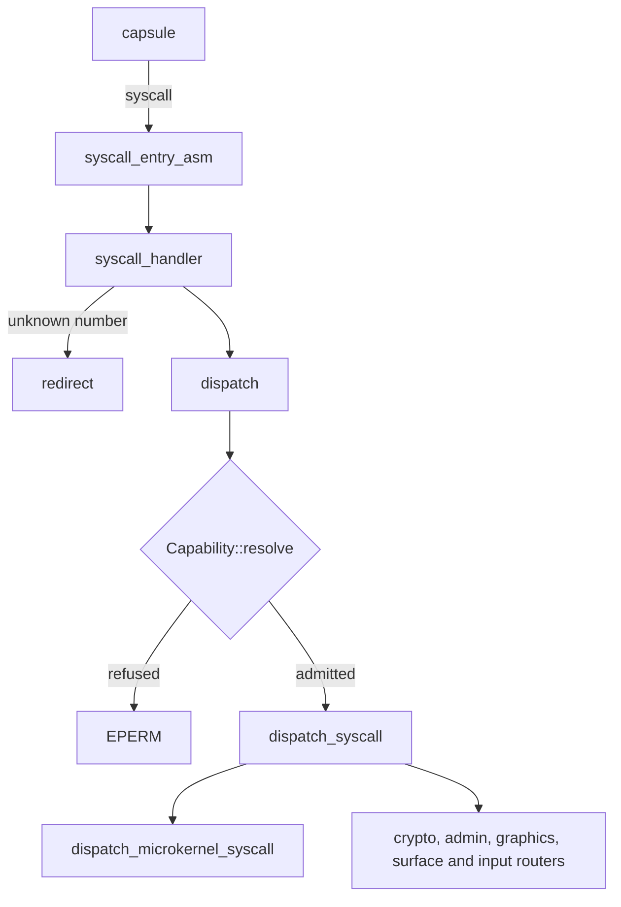

# System calls

How a system call travels from a [capsule](../overview/glossary.md#capsule) into the NONOS kernel and back: the numbers, the registers, the entry code, the dispatch and the [capability](../overview/glossary.md#capability) check, and how many calls there are.

## How many there are

NONOS 0.9.2 has 130 system calls. The count was taken three ways at this commit, and all three agree:

- `abi/syscalls.toml` lists 130 tags under `[numbers]`, starting at `APPS` (`abi/syscalls.toml:54-55`), and 130 `[desc.TAG]` blocks, one per call.
- The kernel enum `SyscallNumber` has 130 variants (`src/syscall/numbers/defs.rs:17-150`). Sorted, its tags are the same set as the ones in the toml file.
- The kernel's `REGISTRY` joins four tables: 114 microkernel, 12 crypto, 3 admin and 1 graphics entry (`src/syscall/abi/registry/mod.rs:24-28`).

`scripts/check_syscall_abi.py` goes further and checks that every published call reaches a handler:

```
$ python3 scripts/check_syscall_abi.py
syscall-abi: 130 published syscalls reach a handler
```

| Family | Calls | Tags | Routed to |
|---|---:|---|---|
| Microkernel | 114 | four letters starting with `M` | `microkernel_ops`, `surface_ops`, `input_ops` |
| Crypto | 12 | `CRND` to `CMKY` | the crypto router |
| Admin | 3 | `ARBT`, `ASDN`, `APPS` | the admin router |
| Graphics | 1 | `GDIM` | `graphics_backend` |

The full list, with each call's arguments and the capability it needs, is on [Syscall ABI](../abi/syscalls.md).

## Numbers are tags

A system call number is four ASCII letters packed into a `u64` by `tag4`, first letter in the lowest byte (`src/syscall/abi/tag.rs:17-22`). These are the [syscall tags](../overview/glossary.md#syscall-tag). `MkIpcSend` is `MISD`, which is `0x4453494D` (`abi/syscalls.toml:150`), and a memory dump of the number reads `MISD`.

`SyscallNumber::from_u64` calls `lookup_id`, which searches the registry (`src/syscall/abi/mod.rs:31-40`). A number that is not there gets `ENOSYS`, -38, unless the caller is a Linux guest, described below.

## Calling convention

The `[wire]` table states it: the `syscall` instruction, the number in `rax`, up to six arguments in `rdi`, `rsi`, `rdx`, `r10`, `r8` and `r9`, and the result in `rax`, under the key `reg_abi` (`abi/syscalls.toml:9-15`). A result from -4095 to -1 is a negative errno, as `errno_range` says (`abi/syscalls.toml:17-19`); anything else is success.

The CPU itself overwrites `rcx` and `r11`. The entry code saves the caller's `rdi`, `rsi` and `rdx` and writes them back on return, so a caller may keep values there across a call (`src/arch/x86_64/asm/syscall.S:36-41`). It also saves `rbx` and `r12` to `r15` and returns them unchanged (`src/arch/x86_64/asm/syscall.S:42-54`).

## The entry path on x86_64



1. At boot each CPU runs `program_this_cpu`, which writes `STAR`, points `LSTAR` at `syscall_entry_asm`, sets the flag mask, enables `EFER.SCE`, and reads `STAR` back to confirm the selectors (`src/arch/x86_64/syscall/manager/program.rs:23-47`). `init_ap` refuses to program an application processor before the boot CPU has passed those checks (`src/arch/x86_64/syscall/manager/init.rs:40-49`).
2. `setup_fmask` makes the CPU clear `IF`, `TF`, `DF` and `AC` on every entry, so the kernel starts with interrupts off (`src/arch/x86_64/syscall/msr.rs:108-111`).
3. `syscall_entry_asm` swaps to the kernel `GS` base, clears the direction flag, moves to the per CPU kernel stack and saves the caller's registers; it refuses to assemble if the count differs from `SYSCALL_FRAME_WORDS` (`src/arch/x86_64/asm/syscall.S:29-69`). That count is 17 words, set in `SYSCALL_FRAME_WORDS` (`src/arch/x86_64/asm/syscall_frame.inc:4`).
4. `syscall_handler` first runs `kernel_entry`, which applies the Spectre mitigations for entering the kernel, then decodes the number with `SyscallNumber::from_u64`, counts the call and hands it to the contract dispatch (`src/arch/x86_64/syscall/manager/entry.rs:23-61`).
5. An unknown number goes to `redirect` (`src/arch/x86_64/syscall/manager/entry.rs:38-53`). For a process hosted under the [Linux personality](../overview/glossary.md#linux-personality), `redirect` parks the call and wakes the supervising capsule, which answers it; for any other process it returns nothing and the call gets `ENOSYS` (`src/process/foreign/trap.rs:28-41`).
6. On the way out the entry code runs the signal hook `syscall_return_signal_hook`, restores the registers and sets `IF` in the returned flags (`src/arch/x86_64/asm/syscall.S:100-139`). It returns with `sysretq` only when bits 63 to 47 of the return address are clear, and with `iretq` otherwise, because `sysretq` faults in ring 0 on a non-canonical address (`src/arch/x86_64/asm/syscall.S:141-164`).

## Dispatch and the capability check

`dispatch` is the single way into the handlers: it runs `Capability::resolve` and returns `EPERM` when the caller's token does not admit the call (`src/syscall/contract/dispatch.rs:25-40`). The five checks inside `resolve` are on [Capabilities](capabilities.md).

`handle_syscall_dispatch` counts every call, successes and failures, and writes an audit record when the handler asks for one (`src/syscall/dispatch/router/entry.rs:29-52`). `dispatch_syscall` then picks the family: the 12 crypto calls, the admin calls, the 105 calls `microkernel_ops` matches, the graphics query, the 6 surface calls and the 3 input calls (`src/syscall/dispatch/router/dispatch_fn.rs:22-59`). The 105 are listed in `matches` (`src/syscall/dispatch/router/microkernel_ops.rs:18-127`).

A microkernel call goes to `dispatch_microkernel_syscall`, whose `route` offers it to the IPC, process, capability, device and IRQ handlers, then to MMIO, DMA, PIO, debug and data, and returns -1 when none takes it (`src/syscall/microkernel/dispatch/route.rs:33-69`). Each handler group matches on the `SYS_*` constants, which repeat the tags, for example `SYS_IPC_SEND` (`src/syscall/microkernel/numbers.rs:21`).

## Results

A handler returns a non-negative value on success and a negative errno on failure. The values are on [Errors](../abi/errors.md). A few calls return a positive status that is not an error; `MkIrqWait` returns 1 when it slept out its whole timeout ([Hardware broker](hardware-broker.md)).

Every entry in the registry is marked `Routed`. The status `Unavailable` exists in `AbiStatus` but no entry uses it (`src/syscall/abi/status.rs:17-21`).

## Adding a system call

A call is reachable only when all of these agree, which is why `scripts/check_syscall_abi.py` checks each one, starting from `from_u64` (`scripts/check_syscall_abi.py:23-36`):

1. The tag in `[numbers]` and a `[desc.TAG]` block with its gate in [abi/syscalls.toml](../../abi/syscalls.toml).
2. The variant in `src/syscall/numbers/defs.rs`.
3. A row in the family table under `src/syscall/abi/registry`.
4. The gate in the cap table under `src/syscall/contract/cap_table`. A call no table claims is refused for everyone.
5. The route in `src/syscall/dispatch/router`, and for a microkernel call its `SYS_*` constant in `src/syscall/microkernel/numbers.rs` and an arm under `src/syscall/microkernel/dispatch`.

Then run `scripts/check_syscall_abi.py` and `scripts/check_syscall_caps.py`; [Contributing: tests and proofs](../contributing/tests-and-proofs.md) lists the other checks.

## Other architectures

The aarch64 `svc` handler and the riscv64 `syscall` handler decode the number the same way and call the same `dispatch` (`src/syscall/contract/mod.rs:17-24`). Both architectures build only with the `nonos-arch-preview` feature; without it `compile_error` stops the build (`src/lib.rs:28-35`). See [aarch64](../architectures/aarch64.md) and [riscv64](../architectures/riscv64.md).

## See also

- [Syscall ABI](../abi/syscalls.md): every call with its arguments and gate.
- [Capabilities](capabilities.md): the check in front of every handler.
- [IPC](ipc.md): the eight IPC calls.
- [Hardware broker](hardware-broker.md): the device calls.
- [Linux personality](../userland/linux-personality.md): what a Linux program's system calls become.
- [x86_64](../architectures/x86_64.md): the release architecture.
