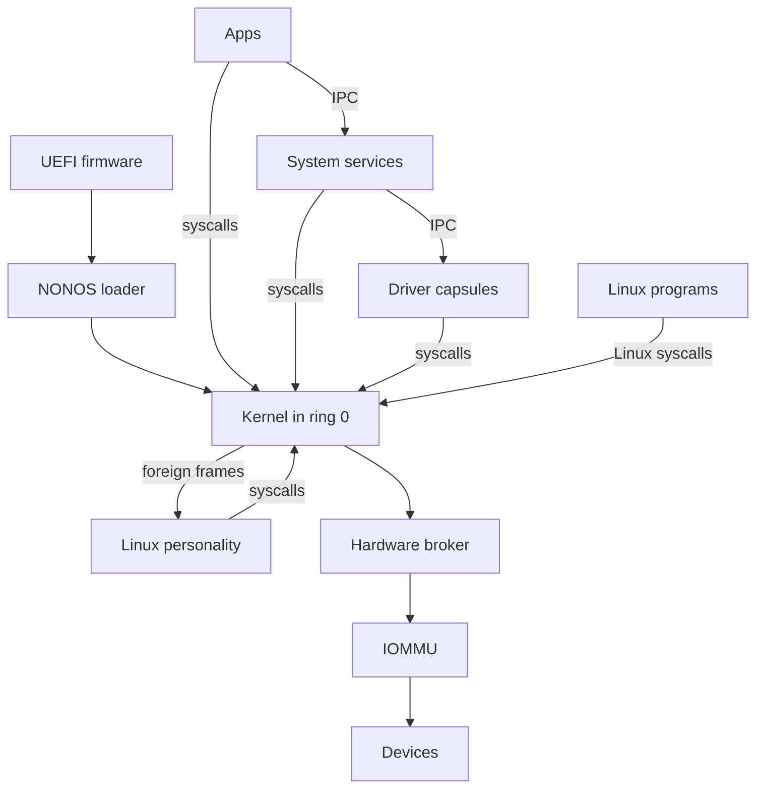

# Architecture

The whole of NONOS in one diagram, then one section for each part, with links to the pages that cover it in depth.

## The system in one diagram



Read it from the top. UEFI firmware starts the NONOS loader, which starts the kernel after the checks its boot menu names. Apps, System services, [Driver capsules](glossary.md#driver-capsule) and the [Linux personality](glossary.md#linux-personality) are [capsules](glossary.md#capsule) in ring 3: they reach the kernel only through syscalls, and each other only through IPC. Linux programs make Linux syscalls, which the kernel does not answer itself: it parks each one as a foreign frame for the Linux personality. Driver capsules reach Devices only through the [Hardware broker](glossary.md#hardware-broker), and on Intel VT-d machines the [IOMMU](glossary.md#iommu) confines device DMA: each PCI device a driver claims reaches only the buffers granted to that driver.

## UEFI firmware and the NONOS loader

The loader in `nonos-bootloader/` is a UEFI application. Its menu has seven entries: Standard, Hardened, Safe Mode, Air-Gapped, Recovery, `Install NØNOS` and Shut down (`ENTRIES` in `nonos-bootloader/src/bootmenu/entries.rs:33-56`). Under every entry that boots, the menu names what the loader checks before the kernel runs: Ed25519, ML-DSA-65, STARK, rollback and RNG, with [Secure Boot](glossary.md#secure-boot) and [TPM](glossary.md#tpm) 2.0 added under Hardened (`STD` in `nonos-bootloader/src/bootmenu/entries.rs:40-59`). The code that runs those checks is the loader's verification module, which these pages do not describe; the security pages say what the loader does with its verdict. The loader then hands the kernel a boot record (`BootHandoffV1` in `src/boot/handoff/types/handoff.rs:28`). Before init, the kernel checks the loader in turn against the signed [boot-root record](glossary.md#boot-root-record), and starts no program when that check fails (`check_bootloader` in `src/kernel_core/init/entry/microkernel_main.rs:24-27`). [Boot chain and signatures](../security/boot-chain-and-signatures.md), [Rollback protection](../security/rollback-protection.md) and [Measured boot and the TPM](../security/measured-boot-and-tpm.md) cover the checks, [Boot handoff](../kernel/boot-handoff.md) covers the record, and [Boot modes](../install/boot-modes.md) covers the menu.

## Kernel in ring 0

The kernel is a Rust microkernel of 300,321 lines in 5,761 Rust files under `src/` (see [Counting the tree](#counting-the-tree)). It runs on every core: it starts every CPU the firmware enables, up to 256, and every one of them takes processes from one run queue shared by the whole machine. That holds for every image built from the shipped `nonos.toml`, which sets `smp` to true (`nonos.toml:20`); [Scheduler and SMP](../kernel/scheduler-and-smp.md) says what a build without it does. It keeps address spaces and page tables (`src/memory/`), the scheduler and the other CPUs (`src/process/scheduler/`, `src/smp/`), IPC (`src/ipc/`), capabilities (`src/capabilities/`), the syscall boundary (`src/syscall/`), process creation and capsule spawn (`src/kernel_core/process_spawn/`) and init, which starts the capsules (`src/userspace/init/`). In this release it also keeps the TPM driver (`src/security/tpm/`) and the encrypted [data volume](glossary.md#data-volume) (`src/fs/`). For its own boot it keeps PCI enumeration and a virtio-rng entropy probe (`init_pci` and `init_virtio_rng` in `src/drivers/mod.rs:17-35`).

Every syscall number the kernel knows goes through `dispatch`, which resolves the caller's capability for that call and refuses with EPERM when it does not resolve (`src/syscall/contract/dispatch.rs:25-40`). A number it does not know is parked for the caller's supervisor, as for a Linux program, or else answered with ENOSYS (`syscall_handler` in `src/arch/x86_64/syscall/manager/entry.rs:24-53`). The kernel defines 130 syscalls (`SyscallNumber` in `src/syscall/numbers/defs.rs:19-150`) and 36 capability bits (`capability_table` in `src/capabilities/types/defs.rs:21-83`). Messages between capsules wait in kernel [inboxes](glossary.md#inbox): all of them together hold at most 96 MiB, one inbox at most 16 MiB, and one sender at most half of any one inbox (`TOTAL_BYTES_MAX`, `INBOX_BYTES_MAX` and `SHARE_BYTES_MAX` in `src/ipc/nonos_inbox/budget.rs:41-43`).

[Kernel](../kernel/README.md) is the entry point. [Memory and paging](../kernel/memory-and-paging.md), [Scheduler and SMP](../kernel/scheduler-and-smp.md), [IPC](../kernel/ipc.md), [Capabilities](../kernel/capabilities.md), [Syscalls](../kernel/syscalls.md) and [Processes and spawn](../kernel/processes-and-spawn.md) go deeper.

## Hardware broker, IOMMU and devices

No driver capsule touches a device on its own. It claims the device from the hardware broker in the kernel (`src/hardware/broker/`), then asks for grants on it: MMIO windows, DMA buffers, interrupt bindings and, on x86_64 only, port I/O. Each kind of call needs its own bit: claiming needs Driver, an MMIO window Mmio, an interrupt binding Irq, a DMA buffer Dma and port I/O Pio (`MkDeviceClaim`, `MkMmioMap`, `MkIrqBind`, `MkDmaMap` and `MkPioGrant` in `src/syscall/contract/cap_table/mk.rs:124-136`).

The broker gives each driver capsule its own [IOMMU domain](glossary.md#iommu-domain), which every device that capsule claims shares (`attach` in `src/hardware/broker/confine/attach.rs:30-101`). This kernel drives Intel VT-d, and every image turns its translation on at boot, with `nonos-iommu-enforce` in `microkernel-core` (`Cargo.toml:240-249`). When a claim is released, the broker turns the device's bus mastering off, then detaches it from its domain (`release` in `src/hardware/broker/claim/release.rs:24-36`).

Confinement does not reach every device. A device found at boot that no driver claims stays in the [identity domain](glossary.md#identity-domain), and a device with no PCI requester id, such as a controller found through ACPI, gets no domain (`pci_address` in `src/hardware/broker/confine/table.rs:35-43`). The AMD-Vi backend sits behind the `nonos-iommu-amdvi` feature and interrupt remapping behind `nonos-iommu-intremap`, and no [build profile](glossary.md#build-profile) in `tools/nix/config.nix` turns either on (`Cargo.toml:879-891`). When no remapping unit is in service, because the firmware describes none, the one found did not come up, or it is AMD-Vi, a claim goes ahead with the device unconfined, and so does a claim on a device that no unit in service covers. The serial log names each such claim. Where a unit in service covers the device and cannot take it, the claim is refused (`unconfined_allowed` in `src/hardware/broker/confine/posture.rs:17-50`, `amd_vi` in `src/arch/x86_64/iommu/backend/refuse.rs:22-31`).

[Hardware broker](../kernel/hardware-broker.md), [IOMMU](../kernel/iommu.md), [PCI and ACPI](../kernel/pci-and-acpi.md) and the driver side, [Broker API](../drivers/broker-api.md), go deeper.

## Driver capsules

Each driver is a capsule in ring 3, in a directory named `userland/capsule_driver_<name>`. Of the 26 such directories with a `Capsule.mk`, the build catalogue `tools/nix/capsules.json` lists 18, and those are the drivers this release builds: `ahci`, `e1000`, `hda`, `i2c_hid`, `i2c_pci`, `iwlwifi`, `nvme`, `ps2_input`, `rtl8139`, `rtl8169`, `rtl8821ce`, `usb_hid`, `usb_msc`, `virtio_blk`, `virtio_gpu`, `virtio_net`, `virtio_rng` and `xhci`. The other eight, `ax88179`, `cdc_ecm`, `cdc_ncm`, `e1000e`, `igc`, `rndis`, `rtl8153` and `rtsx`, are in the tree with [proof crates](glossary.md#proof-crate) but not in this release's catalogue, so no image carries them. A 27th directory, `capsule_driver_bga`, has no `Capsule.mk`.

When a driver ends, by exit or by fault, the process teardown gives back every claim and grant it held (`release_all_for_pid` in `src/process/exit/teardown.rs:47-51`). The NVMe, AHCI and virtio-blk drivers serve raw sectors only to the kernel's own client and to holders of StoreWrite, and ask the kernel on every request (`permits` in `userland/capsule_driver_nvme/src/server/medium.rs:17-30`).

[Drivers](../drivers/README.md) describes the driver model, [Writing a driver](../drivers/writing-a-driver.md) builds one, and the [support matrix](../hardware/MATRIX.md) lists each device class and chip with its id.

## System services

System services are capsules that other capsules reach by name over IPC: the [file store](glossary.md#file-store) (`vfs`, `ramfs`), keys and randomness (`keyring`, `entropy`, `crypto`), settings (`policy`), attestation (`attest`), the network stack (`net.core` and `net.sockets` on the desktop images), the anonymity transports (`net.nym`, `net.anon`, `net.socks5`), audio, input routing, and the display (`compositor`, `wm`, `desktop_shell`). Init, which runs in the kernel, starts them in a fixed order: ramfs, the core services, the display core, the drivers, vfs, the network, the desktop, the market and the apps (`run_init` in `src/userspace/init/entry.rs:20-48`). When a service on its watch list of 30 names ends, init starts it again (`WATCHED` in `src/userspace/init/supervisor/watch_rule.rs:17-59`), at most 8 times (`DEFAULT_MAX_RESTARTS` in `src/services/lifecycle/state/constants.rs:17`). Drivers, apps, setup, the installer and the Linux personality end on purpose, so the list leaves them out. Reaching any of the 11 services that carry traffic off the machine takes the Network bit as well as IPC (`NETWORK_SERVICES` in `src/services/registry/policy.rs:19-45`).

[IPC services](../userland/ipc-services.md) lists them with their [endpoints](glossary.md#endpoint), [IPC](../kernel/ipc.md) covers the kernel side, and [How the Nym and Anyone transports are built](../security/anonymity-transports.md) covers `net.nym` and `net.anon`.

## Apps

Apps are capsules as well: the terminal, files, the text editor, settings, the browser, the wallet, the marketplace, the media players and the rest of the desktop. So is each command-line tool the Terminal starts, such as `tokei` or `csview`. At spawn, an app's [capability word](glossary.md#capability-word) holds the required bits its [manifest](glossary.md#manifest) declares, plus those of its optional bits the spawning code allows, and nothing else (`install_caps` in `src/security/capsule_manifest/verify/caps_bits.rs:38-47`). The kernel installs the word at spawn from the verified manifest (`spawn_verified` in `src/kernel_core/process_spawn/capsule_spawn/runner/verified.rs:25-33`). On an Air-Gapped, Safe Mode or Recovery boot, the [spawn gate](glossary.md#spawn-gate) starts no network driver or service and takes Network from every other capsule (`check` and `caps` in `src/kernel_core/process_spawn/capsule_spawn/runner/profile_gate.rs:17-55`).

[Using NONOS](../using/README.md) covers the apps from the keyboard, with [Everyday apps](../using/apps.md) and [Command-line tools](../using/command-line-tools.md) for the small ones. [The capsule model](../userland/README.md) and [Manifests and capabilities](../userland/manifests-and-capabilities.md) cover them from the code, and [Writing an app](../userland/writing-an-app.md) builds one.

## Linux personality and Linux programs

The Linux personality, `userland/capsule_linux`, runs unmodified x86_64 Linux programs. It is the only capsule that holds `ForeignExec`, the right to create a process the kernel has not verified, build its address space and answer the calls it makes (`userland/capsule_linux/Capsule.mk:4-9`, `src/capabilities/types/defs.rs:72-74`). A Linux program holds no NONOS capabilities. When it makes a syscall, the kernel parks the call as a `ForeignFrame` and wakes the personality to answer it (`redirect` in `src/process/foreign/trap.rs:26-54`). A call the personality does not serve gets ENOSYS and a log line with its number (`unserved` in `userland/capsule_linux/src/linux/serve/unserved.rs:21-41`). Only the personality's install role asks for Network; the run and terminal roles do not, and every network service requires that bit (`INSTALL`, `RUN` and `TERMINAL` in `src/userspace/capsule_linux/roles.rs:35-67`). A Linux program read from the store runs only if the proof kept beside it verifies (`resolve` in `userland/capsule_linux/src/linux/call/spawn/exec_resolve.rs:40-60`).

[Linux personality](../userland/linux-personality.md) says which Linux syscalls are served and which are refused, and [Linux programs](../using/linux-programs.md) covers running them.

## Counting the tree

The counts on this page come from these commands, run at this commit from the repository root:

```sh
find src -name '*.rs' | wc -l                                  # 5761
find src -name '*.rs' -print0 | xargs -0 cat | wc -l           # 300321
ls -d userland/*/Cargo.toml | wc -l                            # 271
ls userland/*/Capsule.mk | wc -l                               # 107
ls -d userland/capsule_driver_*/ | wc -l                       # 27
ls userland/capsule_driver_*/Capsule.mk | wc -l                # 26
grep -c 'tag4(b"' src/syscall/numbers/defs.rs                  # 130
grep -c ' = 1 << ' src/capabilities/types/defs.rs              # 36
python3 -c "import json; print(len(json.load(open('tools/nix/capsules.json'))))"   # 116
python3 -c "import json; print(sum(e['slug'].startswith('driver-') for e in json.load(open('tools/nix/capsules.json'))))"   # 18
python3 -c "import json; print(sum(e['dir'] == 'userland/linux_userland' for e in json.load(open('tools/nix/capsules.json'))))"   # 19
```

| What | Count |
|---|---|
| Rust files under `src/` | 5,761 |
| Lines in those files | 300,321 |
| Crates directly under `userland/` (directories with a `Cargo.toml`) | 271 |
| Directories under `userland/` with a `Capsule.mk` | 107 |
| Driver capsule directories, `userland/capsule_driver_*` | 27 |
| Those with a `Capsule.mk` | 26 |
| Entries in the build catalogue `tools/nix/capsules.json` | 116 |
| Driver capsules in that catalogue | 18 |
| Linux userland programs in that catalogue | 19 |
| Syscalls | 130 |
| Capability bits | 36 |

## See also

- [Overview](README.md)
- [Design principles](design-principles.md)
- [Threat model](threat-model.md)
- [Kernel](../kernel/README.md)
- [Drivers](../drivers/README.md)
- [Userland](../userland/README.md)
- [Security](../security/README.md)
