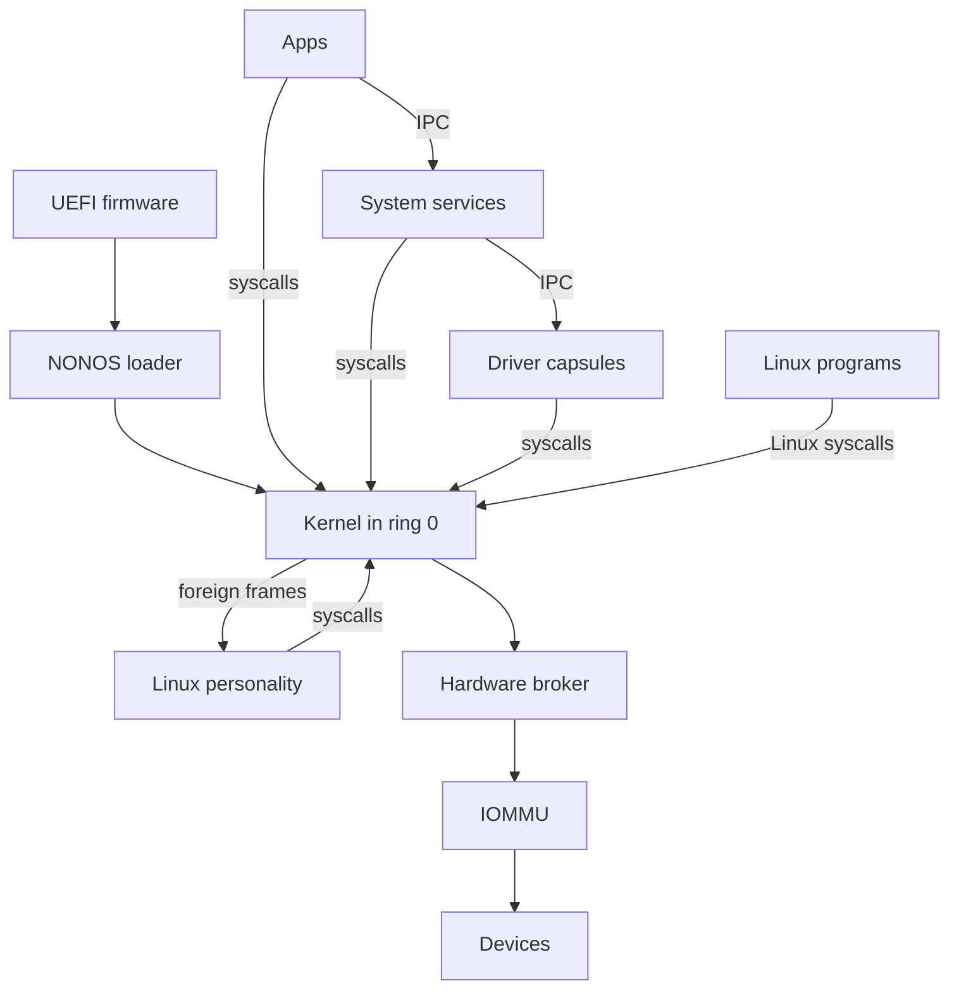

# Architecture

The whole of NONOS in one diagram, then one section for each part, with links to the pages that cover it in depth.

## The system in one diagram

Read it from the top. UEFI firmware starts the NONOS loader, which starts the kernel after the checks its boot menu names. Apps, System services, Driver capsules and the [Linux personality](glossary.md#linux-personality) are [capsules](glossary.md#capsule) in ring 3: they reach the kernel only through syscalls, and each other only through IPC. Linux programs make Linux syscalls, which the kernel does not answer itself: it parks each one as a foreign frame for the Linux personality. Driver capsules reach Devices only through the Hardware broker, and a PCI device's DMA passes the IOMMU where a unit in service covers it.

## UEFI firmware and the NONOS loader

The loader in `nonos-bootloader/` is a UEFI application. Its menu has seven entries: Standard, Hardened, Safe Mode, Air-Gapped, Recovery, `Install NØNOS` and Shut down (`ENTRIES` in `nonos-bootloader/src/bootmenu/entries.rs:33-56`). Under every entry that boots, the menu names what the loader checks before the kernel runs: Ed25519, ML-DSA-65, STARK, rollback and RNG, with Secure Boot and TPM 2.0 added under Hardened (`STD` in `nonos-bootloader/src/bootmenu/entries.rs:40-59`). The loader's verification code is described on the security pages. The loader then hands the kernel a boot record (`BootHandoffV1` in `src/boot/handoff/types/handoff.rs:28`). [Boot chain and signatures](../security/boot-chain-and-signatures.md), [Rollback protection](../security/rollback-protection.md) and [Measured boot and the TPM](../security/measured-boot-and-tpm.md) cover the checks, [Boot handoff](../kernel/boot-handoff.md) covers the record, and [Boot modes](../install/boot-modes.md) covers the menu.
