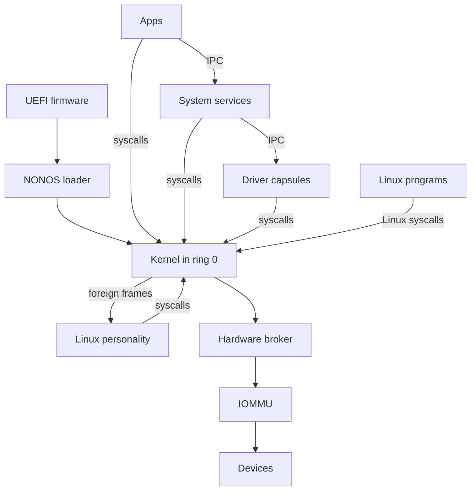

# Architecture

The whole of NONOS in one diagram, then one section for each part, with links to the pages that cover it in depth.

## The system in one diagram

Read it from the top. UEFI firmware starts the NONOS loader, which starts the kernel after the checks its boot menu names. Apps, System services, Driver capsules and the [Linux personality](glossary.md#linux-personality) are [capsules](glossary.md#capsule) in ring 3: they reach the kernel only through syscalls, and each other only through IPC. Linux programs make Linux syscalls, which the kernel does not answer itself: it parks each one as a foreign frame for the Linux personality. Driver capsules reach Devices only through the Hardware broker, and a PCI device's DMA passes the IOMMU where a unit in service covers it.

## UEFI firmware and the NONOS loader

The loader in `nonos-bootloader/` is a UEFI application. Its menu has seven entries: Standard, Hardened, Safe Mode, Air-Gapped, Recovery, `Install NØNOS` and Shut down (`ENTRIES` in `nonos-bootloader/src/bootmenu/entries.rs:33-56`). Under every entry that boots, the menu names what the loader checks before the kernel runs: Ed25519, ML-DSA-65, STARK, rollback and RNG, with Secure Boot and TPM 2.0 added under Hardened (`STD` in `nonos-bootloader/src/bootmenu/entries.rs:40-59`). The loader's verification code is described on the security pages. The loader then hands the kernel a boot record (`BootHandoffV1` in `src/boot/handoff/types/handoff.rs:28`). [Boot chain and signatures](../security/boot-chain-and-signatures.md), [Rollback protection](../security/rollback-protection.md) and [Measured boot and the TPM](../security/measured-boot-and-tpm.md) cover the checks, [Boot handoff](../kernel/boot-handoff.md) covers the record, and [Boot modes](../install/boot-modes.md) covers the menu.

## Kernel in ring 0

The kernel is a Rust microkernel of 300,321 lines in 5,761 files under `src/` (see [Counting the tree](#counting-the-tree)). It keeps address spaces and page tables (`src/memory/`), the scheduler and the other CPUs (`src/sched/`, `src/smp/`), IPC (`src/ipc/`), capabilities (`src/capabilities/`), the syscall boundary (`src/syscall/`), process creation and capsule spawn (`src/kernel_core/process_spawn/`) and init, which starts the capsules (`src/userspace/init/`). In this release it also keeps the TPM driver (`src/security/tpm/`) and the encrypted data volume (`src/fs/`). For its own boot it keeps PCI enumeration and a virtio-rng entropy probe (`init_pci` and `init_virtio_rng` in `src/drivers/mod.rs:17-35`).

Every syscall number the kernel knows goes through `dispatch`, which resolves the caller's capability for that call and refuses with EPERM when it does not resolve (`src/syscall/contract/dispatch.rs:25-40`). A number it does not know is parked for the caller's supervisor, as for a Linux program, or else answered with ENOSYS (`syscall_handler` in `src/arch/x86_64/syscall/manager/entry.rs:24-53`). The kernel defines 130 syscalls (`SyscallNumber` in `src/syscall/numbers/defs.rs:19-150`) and 36 capability bits (`capability_table` in `src/capabilities/types/defs.rs:21-83`). Messages between capsules wait in kernel inboxes: all of them together hold at most 96 MiB, one inbox at most 16 MiB, and one sender at most half of any one inbox (`TOTAL_BYTES_MAX`, `INBOX_BYTES_MAX` and `SHARE_BYTES_MAX` in `src/ipc/nonos_inbox/budget.rs:41-43`).

[Kernel](../kernel/README.md) is the entry point. [Memory and paging](../kernel/memory-and-paging.md), [Scheduler and SMP](../kernel/scheduler-and-smp.md), [IPC](../kernel/ipc.md), [Capabilities](../kernel/capabilities.md), [Syscalls](../kernel/syscalls.md) and [Processes and spawn](../kernel/processes-and-spawn.md) go deeper.

## Hardware broker, IOMMU and devices

No driver capsule touches a device on its own. It claims the device from the [hardware broker](glossary.md#hardware-broker) in the kernel (`src/hardware/broker/`), then asks for grants on it: MMIO windows, DMA buffers, interrupt bindings and, on x86_64 only, port I/O. Each kind of call needs its own bit: claiming needs Driver, an MMIO window Mmio, an interrupt binding Irq, a DMA buffer Dma and port I/O Pio (`MkDeviceClaim`, `MkMmioMap`, `MkIrqBind`, `MkDmaMap` and `MkPioGrant` in `src/syscall/contract/cap_table/mk.rs:124-136`).

The broker gives each driver capsule its own [IOMMU](glossary.md#iommu) domain, which every device that capsule claims shares (`attach` in `src/hardware/broker/confine/attach.rs:30-101`). This kernel drives Intel VT-d. Its AMD-Vi backend sits behind the `nonos-iommu-amdvi` feature in `Cargo.toml`, which no build profile in `tools/nix/config.nix` turns on. When no remapping unit is in service, because the firmware describes none, the one found did not come up, or it is AMD-Vi, a claim goes ahead with the device unconfined. A claim on a device that no unit in service covers goes ahead unconfined too. The serial log names each such claim. Where a unit in service covers the device and cannot take it, the claim is refused (`unconfined_allowed` in `src/hardware/broker/confine/posture.rs:17-50`, `amd_vi` in `src/memory/iommu/backend_x86_64/refuse.rs:22-31`). When a claim is released, the broker turns the device's bus mastering off, then detaches it from its domain (`release` in `src/hardware/broker/claim/release.rs:24-36`).

[Hardware broker](../kernel/hardware-broker.md), [IOMMU](../kernel/iommu.md), [PCI and ACPI](../kernel/pci-and-acpi.md) and the driver side, [Broker API](../drivers/broker-api.md), go deeper.

## Driver capsules

Each driver is a capsule in ring 3, in a directory named `userland/capsule_driver_<name>`. Of the 26 such directories with a `Capsule.mk`, the build catalogue `tools/nix/capsules.json` lists 18, and those are the drivers this release builds: `ahci`, `e1000`, `hda`, `i2c_hid`, `i2c_pci`, `iwlwifi`, `nvme`, `ps2_input`, `rtl8139`, `rtl8169`, `rtl8821ce`, `usb_hid`, `usb_msc`, `virtio_blk`, `virtio_gpu`, `virtio_net`, `virtio_rng` and `xhci`. The other eight, `ax88179`, `cdc_ecm`, `cdc_ncm`, `e1000e`, `igc`, `rndis`, `rtl8153` and `rtsx`, are in the tree with proof crates but not in this release's catalogue, so no image carries them. A 27th directory, `capsule_driver_bga`, has no `Capsule.mk`.

When a driver ends, by exit or by fault, the process teardown gives back every claim and grant it held (`release_all_for_pid` in `src/process/exit/teardown.rs:47-51`). The NVMe, AHCI and virtio-blk drivers serve raw sectors only to the kernel's own client and to holders of StoreWrite, and ask the kernel on every request (`permits` in `userland/capsule_driver_nvme/src/server/medium.rs:17-30`).

[Drivers](../drivers/README.md) describes the driver model, [Writing a driver](../drivers/writing-a-driver.md) builds one, and the [support matrix](../hardware/MATRIX.md) lists each device class and chip with its id.
