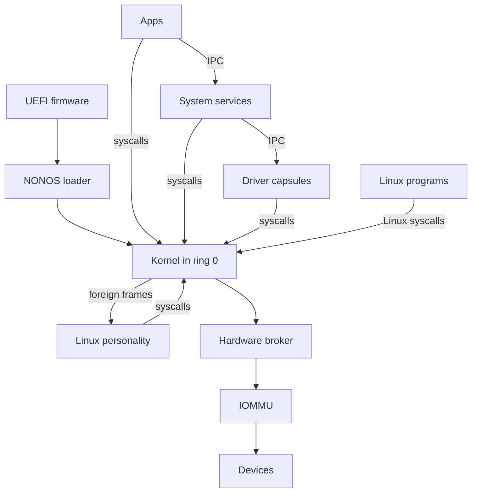

# Architecture

The whole of NONOS in one diagram, then one section for each part, with links to the pages that cover it in depth.

## The system in one diagram

Read it from the top. UEFI firmware starts the NONOS loader, which starts the kernel after the checks its boot menu names. Apps, System services, Driver capsules and the [Linux personality](glossary.md#linux-personality) are [capsules](glossary.md#capsule) in ring 3: they reach the kernel only through syscalls, and each other only through IPC. Linux programs make Linux syscalls, which the kernel does not answer itself: it parks each one as a foreign frame for the Linux personality. Driver capsules reach Devices only through the Hardware broker, and a PCI device's DMA passes the IOMMU where a unit in service covers it.
