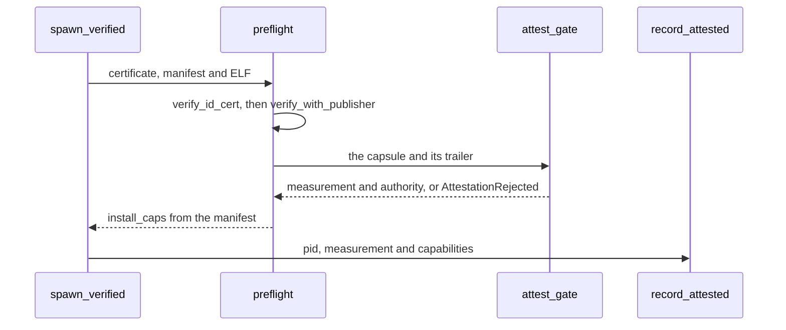

# Design principles

The rules the NONOS code follows, each with the code or the check that holds it, and the places where it does not hold yet.

## Least privilege by capability word

Every process holds a [capability word](glossary.md#capability-word), a mask over the 36 capability bits the kernel defines (`capability_table` in `src/capabilities/types/defs.rs:21-83`). A capsule's word comes from its signed [manifest](glossary.md#manifest): its required bits, plus those of its optional bits the spawning code allows (`install_caps` in `src/security/capsule_manifest/verify/caps_bits.rs:38-47`). A grant outside the manifest is refused with `GrantOutsideManifest` (`check_grant` in `src/security/capsule_manifest/verify/caps.rs:31-39`). Every syscall the kernel knows then passes `dispatch`, which refuses with EPERM when the caller's capability does not resolve for that call (`src/syscall/contract/dispatch.rs:25-40`).

Services hold the same line. The file store answers only the kernel and holders of FileSystem (`CAP_FILE_SYSTEM` in `userland/capsule_vfs/src/server/fs_gate.rs:17-40`). The NVMe, AHCI and virtio-blk drivers serve raw sectors only to the kernel's own client and to holders of StoreWrite (`permits` in `userland/capsule_driver_nvme/src/server/medium.rs:17-30`). Each asks the kernel on every request instead of caching the answer, so a verdict never outlives the process it was about.

The checks: `scripts/cap_audit.py --strict` holds every capsule's mask to the calls its code makes, and `scripts/check_mirror_caps.py` holds each kernel spawn file and README to its manifest. `nonos-ci/run-static-checks.sh` runs both inside the `static-tree` flake check. On this commit both report ok, and `static-tree` fails on a different rule.

The limits: two bits, `IO` and `Hardware`, enforce nothing (`src/capabilities/types/defs.rs:23-31`). Exiting, yielding, futex waits, reading the clock and reading process stats take no bit, only a valid capability token (`check` in `src/syscall/contract/cap_table/mk.rs:20-35`).

## Drivers run in ring 3

A device driver is a capsule like any other, with no more reach than its bits allow. It touches its device only through the [hardware broker](glossary.md#hardware-broker): claiming a device needs Driver, mapping its registers needs Mmio, and a DMA buffer needs Dma (`MkDeviceClaim`, `MkMmioMap` and `MkDmaMap` in `src/syscall/contract/cap_table/mk.rs:124-131`). A driver that crashes ends as a process, and the process teardown releases its claims and grants on the way out (`release_all_for_pid` in `src/process/exit/teardown.rs:47-51`).

Of device code, the kernel keeps PCI enumeration and a virtio-rng entropy probe for its own boot (`init_pci` and `init_virtio_rng` in `src/drivers/mod.rs:17-35`), plus the interrupt controllers, the timers and the TPM.

The limits: device DMA is confined only where an Intel VT-d unit in service covers the device, and then to the one domain its driver capsule holds, which every device that capsule claims shares (`attach` in `src/hardware/broker/confine/attach.rs:30-101`). With AMD-Vi, which no build profile drives, or with no remapping unit at all, a claimed device can reach all of physical memory (`unconfined_allowed` in `src/hardware/broker/confine/posture.rs:17-50`).

## Everything that runs is signed and measured

A capsule runs only after `spawn_verified` has passed it through `preflight`. Before that, the profile gate refuses a capsule the boot's menu entry rules out, such as a network driver on an Air-Gapped boot (`check` in `src/kernel_core/process_spawn/capsule_spawn/runner/profile_gate.rs:17-31`).

1. `verify_id_cert` checks the capsule's NONOS-ID certificate against the trust anchor under `NONOS_PRODUCTION_POLICY`, which requires both Ed25519 and ML-DSA-65 (`src/security/nonos_id_cert/policy.rs:30-32`).
2. `verify_with_publisher` checks the manifest and the ELF image under the same policy and returns `install_caps`, the capabilities to install (`src/kernel_core/process_spawn/capsule_spawn/runner/preflight.rs:55-67`).
3. The capsule and its trailer then pass `attest_gate`: an empty [attestation trailer](glossary.md#attestation-trailer), or one whose proof does not verify, ends the spawn with `AttestationRejected` (`src/kernel_core/process_spawn/capsule_spawn/runner/attest_gate.rs:23-34`). A capsule in the `systems.nonos` namespace goes straight to it; any other is in the publisher tier and reaches the same gate through `publisher_gate` (`src/kernel_core/process_spawn/capsule_spawn/runner/preflight.rs:72-77`, `src/kernel_core/process_spawn/capsule_spawn/runner/publisher_gate.rs:20-33`).
4. Once a pid exists, `record_attested` writes the capsule's measurement and capabilities into the attestation registry (`src/security/attest_registry/record.rs:31`). The measurement is the BLAKE3 digest of the ELF (`measure` in `src/security/capsule_attest/measure.rs:17-26`).

The Linux personality holds Linux programs to the same rule. A program read from the store runs only if the trailer kept beside it verifies, and an exec of one that does not gets EPERM (`resolve` in `userland/capsule_linux/src/linux/call/spawn/exec_resolve.rs:40-60`). The built-in BusyBox is part of the personality's own measured image.

The kernel image comes before any of this. The loader's menu names Ed25519, ML-DSA-65, STARK, rollback and RNG as the checks for every entry that boots (`STD` in `nonos-bootloader/src/bootmenu/entries.rs:58-59`), and [Boot chain and signatures](../security/boot-chain-and-signatures.md) covers the loader's side.

The limit: a `dev` image admits capsules on their path alone, without the STARK proof, and the seal refuses it for release (`tools/nix/config.nix:102-109`).
