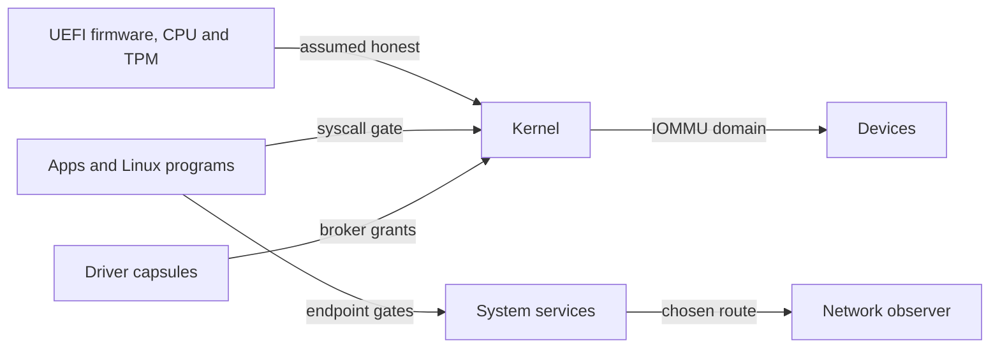

# Threat model

What NONOS 0.9.2 protects, from whom, what it relies on, and what it leaves out; [Protections and limits](../security/protections-and-limits.md) gives the same answer feature by feature.

## Assets

| Asset | Where it lives | What guards it |
|---|---|---|
| Qwen models on an installed disk | the [data volume](glossary.md#data-volume) | every sector sealed, under a TPM-derived key |
| Files a program keeps, setup's answers and kept settings | the [package store](glossary.md#store) on the NONOS disk | nothing: the store is not encrypted, and only a record its capsule sealed, such as the saved Wi-Fi list or the wallet's key, is protected |
| What a live boot holds | RAM | power off; the [ZeroState](glossary.md#zerostate) wipe runs in 0.9.2 only at the installer's restart, and leaves the in-memory data volume and its key |
| The wallet's key | the keyring capsule | the keyring's vault gate |
| Where this machine is on the network | its IP address and its cards' station addresses | the chosen anonymity network for the system's own connections, and a fresh station address at each bring-up |
| What runs | the kernel image and every capsule | signatures, attestation and the [capability word](glossary.md#capability-word) |
| The [device secret](glossary.md#device-secret) | derived from the [TPM](glossary.md#tpm) | the `DeviceSecret` bit, held by one capsule |

The sections below give the code behind each guard.

## Adversaries

### A hostile app or capsule

It runs with the bits its [manifest](glossary.md#manifest) grants and no others, unless a capsule holding Admin grants it more, and only bits that capsule holds itself (`sys_cap_grant` in `src/syscall/microkernel/capability/handlers.rs:33-52`). Every NONOS syscall it makes passes the capability check (`dispatch` in `src/syscall/contract/dispatch.rs:25-40`). Reaching any of the 11 services that carry traffic off the machine needs Network (`NETWORK_SERVICES` in `src/services/registry/policy.rs:19-45`). It cannot read the file store without FileSystem (`CAP_FILE_SYSTEM` in `userland/capsule_vfs/src/server/fs_gate.rs:35-40`), and with FileSystem it can open any file there, another capsule's included, since `open` checks the file's mode and not who made it (`userland/capsule_vfs/src/store/fdtable/open.rs:25-50`). It cannot read raw sectors from the NVMe, AHCI or virtio-blk driver without StoreWrite (`permits` in `userland/capsule_driver_nvme/src/server/medium.rs:25-30`). It cannot have the keyring open the wallet's sealed record unless the service registry names it as the wallet (`allowed` in `userland/capsule_keyring/src/server/vault_gate/mod.rs:23-30`). A capsule that holds both Crypto and FileSystem needs no keyring: it can ask the kernel for the vault root under the published label, as the keyring does with `machine_key` and `ROOT_LABEL` (`userland/capsule_keyring/src/vault/root.rs:29`), and read the sealed blob under `/data`. The Linux personality, Settings and the Terminal are among the capsules that hold both. A flood of messages from one sender fills at most half of any one [inbox](glossary.md#inbox) (`SHARE_BYTES_MAX` in `src/ipc/nonos_inbox/budget.rs:17-43`). The `DeviceSecret` bit, which receives the TPM-derived device secret, is held by one capsule, `app.prove` (`DeviceSecret` in `src/capabilities/types/defs.rs:80-82`, `CAPSULE_HANDLE` in `userland/capsule_prove/Capsule.mk:17-25`).

`userland/capsule_attack` tries escapes of this kind with raw syscalls, a socket without Network and an MMIO window without Mmio among them, and prints the kernel's answer to each. No Cargo feature, kernel mirror or make include names it yet, so no image carries it (`userland/capsule_attack/Capsule.mk`).

### A hostile Linux program

A Linux program holds no NONOS capabilities. The kernel parks each of its Linux syscalls for the [Linux personality](glossary.md#linux-personality) to answer (`redirect` in `src/process/foreign/trap.rs:26-54`), and refuses every NONOS syscall it tries except `MkTtyQuery`, which only describes its own streams (`MkTtyQuery` in `src/syscall/contract/cap_table/mk.rs:220`). The personality's run and terminal roles hold no Network, and every network service requires it (`RUN` and `TERMINAL` in `src/userspace/capsule_linux/roles.rs:46-67`). The personality is itself a capsule, so a program that subverts it gets the personality's bits and no more: CoreExec, IPC, Memory, Crypto, FileSystem, Debug, two display bits, StoreWrite, ForeignExec and LocalSign, and Network as well in the install role (`CAPSULE_REQUIRED_CAPS` and `CAPSULE_OPTIONAL_CAPS` in `userland/capsule_linux/Capsule.mk:45-48`).

### A hostile or faulty device

On Intel VT-d machines the [IOMMU](glossary.md#iommu) confines device DMA. Every image turns translation on at boot, and a device the boot PCI scan did not find, such as a card added later, is denied (`bring_up` in `src/arch/x86_64/iommu/unit/bringup/run.rs:26-36`). When a driver claims a device that a unit in service covers, the broker puts it in the [IOMMU domain](glossary.md#iommu-domain) of that driver capsule, so it reaches only what that capsule was granted, and refuses a claim the unit cannot confine (`attach` in `src/hardware/broker/confine/attach.rs:30-101`, `unconfined_allowed` in `src/hardware/broker/confine/posture.rs:17-50`). A released device has its bus mastering turned off before it leaves the domain (`release` in `src/hardware/broker/claim/release.rs:24-36`). At shutdown and restart every claimed device is stopped and its DMA buffers wiped before the rest of memory is (`quiesce_all_devices` in `src/security/hardening/memory_sanitization/api.rs:65-69`).

### An observer on the network

The browser, the Terminal and the wallet connect through the [Nym mixnet](glossary.md#nym-mixnet) by default, and Direct is used only when the person chose it (`pick` in `userland/nonos_route_link/src/pick.rs:125-139`). Downloads for an install go over the [Anyone network](glossary.md#anyone-network) whatever the default (`install_route` in `userland/nonos_route_link/src/pick.rs:49-63`), except a model the person asks to download direct, with `qwen get --direct` or `d` on its Marketplace card (`DIRECT_WORD` in `userland/capsule_model_fetch/src/get/run.rs:42`). The wallet's chain reads never go direct (`private_only` in `userland/nonos_route_link/src/pick.rs:86-100`). No image this release builds asks a time server: net.ntp, which would ask only under Direct, is not started on any release image (`spawn_ntp` in `src/userspace/init/spawn_plan/network/mod.rs:28-29`). The network drivers this release builds (e1000, rtl8139, rtl8169, virtio-net, iwlwifi and rtl8821ce) draw a random, locally administered station address at bring-up instead of using the factory one (`apply` in `userland/nonos_mac/src/local.rs:46-55`). [How the Nym and Anyone transports are built](../security/anonymity-transports.md) says what `net.nym` and `net.anon` implement of each protocol, and what they leave out.

### Someone who takes the machine while it is off

A live boot's data volume was only in RAM, and it fades with the power: the wipe before a restart does not reach it. On an installed disk the data volume holds only sealed sectors. The package store beside it is not encrypted, so the files kept there, setup's answers among them, can be read from the disk, apart from records their capsule sealed (`append` in `userland/capsule_vfs/src/blk/store_write.rs:39-84`). The TPM derives the volume key from a seed it never releases and the current boot [PCRs](glossary.md#pcr), and stores nothing, so the same disk in another machine, or the same machine in another boot state, gets a different key (`TPM2_HMAC` in `src/security/tpm/machine_key/mod.rs:17-31`).

### A tampered image or capsule

A capsule whose certificate, manifest, signatures or attestation do not verify is never spawned; [Design principles](design-principles.md#everything-that-runs-is-signed-and-measured) walks through the checks. Attestation passes under the vendor root compiled into the kernel or, when that refuses, under a root a person enrolled on this machine, where a capsule built on this machine carries a keyed tag the kernel minted instead of a STARK proof (`enrolled` in `src/security/capsule_attest/against_root.rs:34-45`). The `[ZK-ATTEST] ok` line names which authority admitted each capsule. The loader's boot menu names the checks it makes on the kernel image before the kernel runs, and [Boot chain and signatures](../security/boot-chain-and-signatures.md) and [Rollback protection](../security/rollback-protection.md) cover that path. On a machine whose TPM holds the [rollback floor](glossary.md#rollback-floor), the loader also refuses an older signed kernel (`enforce_floor` in `nonos-bootloader/src/boot/crypto/rollback/floor.rs:28-40`). Before init the kernel checks the loader against the signed [boot-root record](glossary.md#boot-root-record), and starts no program when that fails (`refuse_unchecked_loader` in `src/kernel_core/init/entry/loader_refusal.rs:27-48`). These checks hold each part of an image to the rest of that image: the loader checks the kernel against keys compiled into that loader, so with [Secure Boot](glossary.md#secure-boot) off an image sealed whole with other keys passes them. The TPM then gives that image another [machine key](glossary.md#machine-key), so this machine's data volume and the records sealed under its key stay closed to it (`BOUND_PCRS` in `src/security/tpm/machine_key/pcrs.rs:21-24`).

## Trust boundaries

Each arrow crosses a boundary. UEFI firmware, the CPU and the TPM sit below the kernel and are assumed honest. Apps and Linux programs cross the syscall gate into the Kernel, and the endpoint gates into System services. Driver capsules reach hardware only through broker grants, and Devices reach memory through their capsule's IOMMU domain where a VT-d unit in service covers them. Whatever leaves the machine takes the chosen route before a Network observer sees it.

## Assumptions

NONOS relies on these without proof. They are the hardware, firmware, compiler and hash rows of `verification/ASSUMPTIONS.md`. The file also lists every third-party crate linked into ring 0 and into the loader, the in-tree primitives that are tested but not proven, ChaCha20-Poly1305 and the STARK prover and verifier among them, and the axioms behind the Lean models.

- The CPU implements x86-64 paging, rings, SYSCALL and SYSRET, SWAPGS and the TSS as documented, and SMEP, SMAP and NX work.
- UEFI firmware is honest until ExitBootServices, and the Secure Boot keys belong to the person who controls the machine.
- The TPM keeps its counters monotonic and its keys inside.
- VT-d translates and faults device DMA as its tables say. With no IOMMU, every DMA-capable device and its driver capsule can reach all of physical memory.
- RDRAND and RDSEED return unpredictable values.
- BLAKE3, SHA-2, SHA-3 and the width-8 Poseidon hash are collision resistant.
- Nobody has bus, JTAG or cold-boot access to the machine.
- The compiler, a Rust nightly, generates what the source says.

## In scope

- A capsule, an app or a Linux program that tries to reach past its capability word.
- A device that tries DMA outside its capsule's grants, where a VT-d unit in service covers it.
- An observer on the network path, for connections made under Nym or Anyone.
- Someone who reads the disk of a machine that is off.
- A capsule changed after it was signed and enrolled.
- A kernel changed after it was signed and enrolled, a loader changed after it was enrolled that still hands the kernel the TPM's event log, and an older signed kernel put back on a machine whose TPM holds the rollback floor.

## Out of scope

- Firmware, a CPU or a TPM that lies. These are the assumptions above.
- An older signed kernel on a machine with no TPM, where every entry but Hardened and Air-Gapped boots with rollback protection off (`Floor::Unprotected` in `nonos-bootloader/src/boot/crypto/rollback/floor.rs:52-58`), or on one whose TPM was cleared, which starts the floor again at 0.
- A changed loader on a machine with no TPM, or one that hands the kernel no TCG log: the kernel's check of it then rests on the loader's own word (`decide` in `src/security/boot/loader_check/run.rs:34-55`).
- A whole image sealed with other keys, booted with Secure Boot off. Booting with Secure Boot on is not tested in this release.
- Physical access to a running machine, including bus, JTAG and cold-boot attacks.
- DMA from a device no VT-d unit in service covers: on a machine with AMD-Vi, which no build profile drives, with no remapping unit, or behind a unit that did not come up. The device is unconfined, and the serial log says so for each claim.
- DMA from a device found at boot that no driver has claimed, which stays in the [identity domain](glossary.md#identity-domain) and reaches all the memory the kernel manages, and from a device with no PCI requester id, which gets no domain (`pci_address` in `src/hardware/broker/confine/table.rs:35-43`).
- Interrupts a device raises by writing MSI messages. Interrupt remapping is off in every build profile (`nonos-iommu-intremap` in `Cargo.toml:879-884`).
- What sites learn from what the person sends them, everything under Direct, and each model download the person takes direct. Each of these shows this machine's address to the far end. A Linux package from a mirror on the local network is fetched directly too (`offline` in `userland/capsule_linux/src/linux/install/route_read.rs:84-94`).
- Seeing that NONOS runs Nym and Anyone. Both anonymity transports start on every boot that starts the network stack, whatever the choice (`spawn_nym` and `spawn_anon` in `src/userspace/init/spawn_plan/network/spawn.rs:17-29`). net.nym reaches for a gateway from its serve loop while idle (`_start` in `userland/capsule_net_nym/src/main.rs:48-63`), and net.anon fetches its directory, opens a link to a guard and builds a circuit while idle (`idle` in `userland/capsule_net_anon/src/server/idle.rs:43-51`).
- Serial output on an image built from any profile but `hardened` and `airgapped`. Capsules may write diagnostics to the [serial console](glossary.md#serial-console) there; only those two profiles take that out (`debugFeatures` in `tools/nix/config.nix:60-92`).
- A `dev` image, which promises nothing (`tools/nix/config.nix:102-109`).
- Timing and cache side channels between capsules, which can run at the same moment on cores that share a cache, since the kernel schedules on every core. At each syscall entry the kernel fills the return stack buffer and sets IBRS where the CPU has it (`kernel_entry` in `src/arch/x86_64/syscall/manager/entry.rs:34-36`). It also works out at boot what the CPU is exposed to and which mitigations are on, but writes that report through the structured log, which nothing initialises in this release, so it is never printed (`vulnerabilities` and `mitigations` in `src/security/hardening/spectre_mitigations/report.rs:22-44`). This model claims nothing beyond that.
- A kernel panic. It halts every CPU without the ZeroState wipe (`panic` in `src/boot/panic/handler.rs:41-64`).

## See also

- [Protections and limits](../security/protections-and-limits.md)
- [Capsule isolation](../security/capsule-isolation.md)
- [Device secrets and keys](../security/device-secrets-and-keys.md)
- [Privacy network](../using/privacy-network.md)
- [How the Nym and Anyone transports are built](../security/anonymity-transports.md)
- [Design principles](design-principles.md)
- [Reporting a vulnerability](../security/reporting-a-vulnerability.md)
