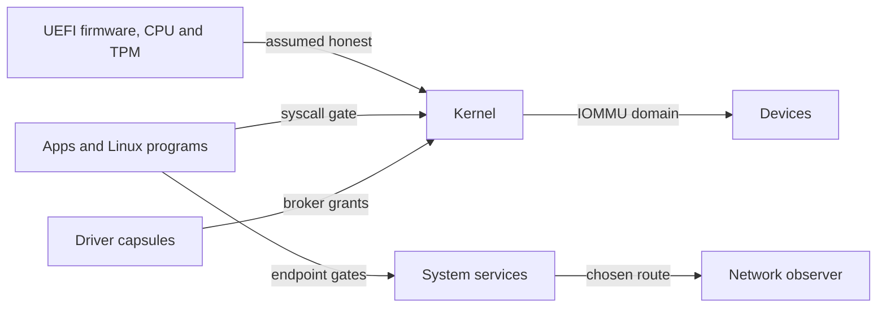

# Threat model

What NONOS 0.9.2 protects, from whom, what it relies on, and what it leaves out; [Protections and limits](../security/protections-and-limits.md) gives the same answer feature by feature.

## Assets

| Asset | Where it lives | What guards it |
|---|---|---|
| Files a person keeps | the [data volume](glossary.md#data-volume) on an installed disk | every sector sealed, under a TPM-derived key or a passphrase |
| What a live boot holds | RAM | the [ZeroState](glossary.md#zerostate) wipe at shutdown and restart |
| The wallet's key | the keyring capsule | the keyring's vault gate |
| Where this machine is on the network | its IP address and its cards' station addresses | the chosen anonymity network for the system's own connections, and a fresh station address at each bring-up |
| What runs | the kernel image and every capsule | signatures, attestation and the [capability word](glossary.md#capability-word) |
| The device secret | derived from the TPM | the `DeviceSecret` bit, held by one capsule |

The sections below give the code behind each guard.

## Adversaries

### A hostile app or capsule

It runs with the bits its manifest grants and no others, and every syscall it makes passes the capability check (`dispatch` in `src/syscall/contract/dispatch.rs:25-40`). Reaching any of the 11 services that carry traffic off the machine needs Network (`NETWORK_SERVICES` in `src/services/registry/policy.rs:19-45`). It cannot read the file store without FileSystem (`CAP_FILE_SYSTEM` in `userland/capsule_vfs/src/server/fs_gate.rs:35-40`), or raw sectors from the NVMe, AHCI or virtio-blk driver without StoreWrite (`permits` in `userland/capsule_driver_nvme/src/server/medium.rs:25-30`). It cannot open the wallet's sealed record unless the service registry names it as the wallet (`allowed` in `userland/capsule_keyring/src/server/vault_gate/mod.rs:23-30`). A flood of messages from one sender fills at most half of any one inbox (`SHARE_BYTES_MAX` in `src/ipc/nonos_inbox/budget.rs:17-43`). The `DeviceSecret` bit, which receives the TPM-derived device secret, is held by one capsule, `app.prove` (`DeviceSecret` in `src/capabilities/types/defs.rs:80-82`, `CAPSULE_HANDLE` in `userland/capsule_prove/Capsule.mk:17-25`).

`userland/capsule_attack` tries escapes of this kind with raw syscalls, a socket without Network and an MMIO window without Mmio among them, and prints the kernel's answer to each. No Cargo feature, kernel mirror or make include names it yet, so no image carries it and no boot has run it (`userland/capsule_attack/Capsule.mk`).

### A hostile Linux program

A Linux program holds no NONOS capabilities. The kernel parks each of its syscalls for the Linux personality to answer (`redirect` in `src/process/foreign/trap.rs:26-54`). The personality's run and terminal roles hold no Network, and every network service requires it (`RUN` and `TERMINAL` in `src/userspace/capsule_linux/roles.rs:46-67`). The personality is itself a capsule, so a program that subverts it gets the personality's bits and no more: CoreExec, IPC, Memory, Crypto, FileSystem, Debug, two display bits, StoreWrite, ForeignExec and LocalSign, and Network as well in the install role (`CAPSULE_REQUIRED_CAPS` and `CAPSULE_OPTIONAL_CAPS` in `userland/capsule_linux/Capsule.mk:45-48`).

### A hostile or faulty device

Where an Intel VT-d unit in service covers a device, the broker puts it in the domain of the driver capsule that claimed it, so it reaches only what that capsule was granted, and refuses a claim it cannot confine (`attach` in `src/hardware/broker/confine/attach.rs:30-101`, `unconfined_allowed` in `src/hardware/broker/confine/posture.rs:17-50`). A released device has its bus mastering turned off before it leaves the domain (`release` in `src/hardware/broker/claim/release.rs:24-36`). At shutdown and restart every claimed device is stopped and its DMA buffers wiped before the rest of memory is (`quiesce_all_devices` in `src/security/hardening/memory_sanitization/api.rs:65-69`).

### An observer on the network

The browser, the Terminal and the wallet connect through the [Nym mixnet](glossary.md#nym-mixnet) by default, and Direct is used only when the person chose it (`pick` in `userland/nonos_route_link/src/pick.rs:125-139`). Downloads for an install go over the Anyone network whatever the default (`install_route` in `userland/nonos_route_link/src/pick.rs:49-63`). The wallet's chain reads never go direct (`private_only` in `userland/nonos_route_link/src/pick.rs:86-100`), and net.ntp asks a time server only under Direct (`step` in `userland/capsule_net_ntp/src/decide.rs:17-45`). The network drivers this release builds (e1000, rtl8139, rtl8169, virtio-net, iwlwifi and rtl8821ce) draw a random, locally administered station address at bring-up instead of using the factory one (`apply` in `userland/nonos_mac/src/local.rs:46-55`).

### Someone who takes the machine while it is off

A live boot's data volume was only in RAM, and the wipe runs before a shutdown or restart from NONOS. An installed disk holds only sealed sectors. The TPM derives the volume key from a seed it never releases and the current boot PCRs, and stores nothing, so the same disk in another machine, or the same machine in another boot state, gets a different key (`TPM2_HMAC` in `src/security/tpm/machine_key/mod.rs:17-31`).

### A tampered image or capsule

A capsule whose certificate, manifest, signatures or attestation do not verify is never spawned; [Design principles](design-principles.md#everything-that-runs-is-signed-and-measured) walks through the checks. The loader's boot menu names the checks it makes on the kernel image before the kernel runs, and [Boot chain and signatures](../security/boot-chain-and-signatures.md) and [Rollback protection](../security/rollback-protection.md) cover that path.

## Trust boundaries

Each arrow crosses a boundary. UEFI firmware, the CPU and the TPM sit below the kernel and are assumed honest. Apps and Linux programs cross the syscall gate into the Kernel, and the endpoint gates into System services. Driver capsules reach hardware only through broker grants, and Devices reach memory through their capsule's IOMMU domain where a VT-d unit in service covers them. Whatever leaves the machine takes the chosen route before a Network observer sees it.

## Assumptions

NONOS relies on these without proof. They are the hardware, firmware, compiler and hash rows of `verification/ASSUMPTIONS.md`. The file also lists every third-party crate linked into ring 0 and into the loader, the in-tree primitives that are tested but not proven, ChaCha20-Poly1305 and the STARK prover and verifier among them, and the axioms behind the Lean models.

- The CPU implements x86-64 paging, rings, SYSCALL and SYSRET, SWAPGS and the TSS as documented, and SMEP, SMAP and NX work.
- UEFI firmware is honest until ExitBootServices, and the Secure Boot keys belong to the person who controls the machine.
- The TPM keeps its counters monotonic and its keys inside.
- VT-d translates and faults device DMA as its tables say. With no IOMMU, every DMA-capable device and its driver capsule can reach all of physical memory.
- RDRAND and RDSEED return unpredictable values.
- BLAKE3, SHA-2, SHA-3 and the width-8 Poseidon hash are collision resistant.
- Nobody has bus, JTAG or cold-boot access to the machine.
- The compiler, a Rust nightly, generates what the source says.
