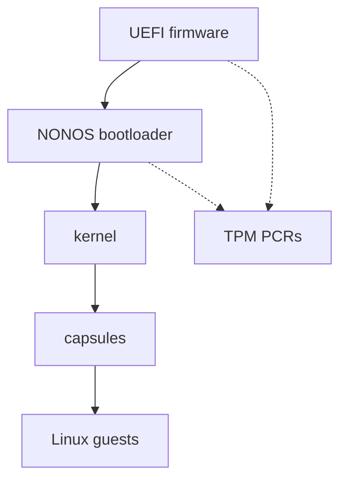

# Security

What NONOS trusts, where each security check lives in the code, and which page in this section answers which question.

## The trust model

NONOS trusts a short chain of code. Each link starts the next, and the kernel checks everything that runs above it.

The UEFI firmware starts the machine. NONOS cannot inspect or contain it. What NONOS can do is bind secrets to what was measured at boot: the [machine key](../overview/glossary.md#machine-key) is derived under a [TPM](../overview/glossary.md#tpm) policy over `BOUND_PCRS`, [PCR](../overview/glossary.md#pcr) 0, 4, 7 and 9, which the code describes as the firmware code, the boot manager the firmware measured, the [Secure Boot](../overview/glossary.md#secure-boot) policy and the kernel hash the bootloader extends (`src/security/tpm/machine_key/pcrs.rs:21-24`). A changed firmware, NONOS bootloader or kernel therefore gets a different key. [Measured boot and the TPM](measured-boot-and-tpm.md) has the details.

The NONOS bootloader loads the kernel. It stops the boot when the kernel's signature fails or its [rollback index](../overview/glossary.md#rollback-index) is below the TPM floor, in every mode but Development, and when its STARK trailer fails, in every mode (`verify_signature` in `nonos-bootloader/src/boot/crypto/signature/verify.rs:25-40`, `enforce_floor` in `nonos-bootloader/src/boot/crypto/rollback/floor.rs:28-40`, `attest_kernel` in `nonos-bootloader/src/boot/attestation/kernel_gate.rs:34-60`). The checks that reach those verdicts sit in the loader's verification module, which these pages do not describe; [Boot chain and signatures](boot-chain-and-signatures.md) and [Rollback protection](rollback-protection.md) say what the loader does with each one. Before any program starts, the kernel checks the bootloader in turn against the signed [boot-root record](../overview/glossary.md#boot-root-record), and stops when that check fails (`check_bootloader` in `src/kernel_core/init/entry/microkernel_main.rs:24-27`).

The kernel runs in ring 0 and is trusted. It admits a [capsule](../overview/glossary.md#capsule) only after `verify_id_cert` has checked its [NONOS ID certificate](../overview/glossary.md#nonos-id-certificate) and `verify_with_publisher` has checked its [manifest](../overview/glossary.md#manifest) and its image (`src/kernel_core/process_spawn/capsule_spawn/runner/preflight.rs:41-66`). The signature policy it passes, `NONOS_PRODUCTION_POLICY`, requires both an Ed25519 and an ML-DSA-65 signature (`src/security/nonos_id_cert/policy.rs:30-32`). The [capabilities](../overview/glossary.md#capability) a manifest asks for must fit under the [ceiling](../overview/glossary.md#capability-ceiling) in that certificate, or `check_ceiling` refuses the capsule (`src/security/capsule_manifest/verify/caps.rs:21-29`).

Capsules run in ring 3, each in its own address space, and hold only the capability bits their verified manifest granted. Every NONOS system call passes through one `dispatch` function, which refuses with `EPERM` when the caller's [capability token](../overview/glossary.md#capability-token) does not admit that call (`src/syscall/contract/dispatch.rs:31-40`). A capsule with no bits can compute, and every call it makes except `MkTtyQuery` is refused.

Linux programs run as guests of the [Linux personality](../overview/glossary.md#linux-personality). The kernel creates each guest with an empty capability set through `install_spawn` (`src/process/foreign/spawn.rs:65-68`), so a guest reaches nothing except through the capsule that answers its system calls.

Drivers are capsules too. A driver reaches its device only through the kernel's [broker](../overview/glossary.md#broker), and a claimed device is moved into the driver's own [IOMMU domain](../overview/glossary.md#iommu-domain) before it is powered (`attach` in `src/hardware/broker/claim/claim.rs:33-37`). Where no remapping unit is in service, that confinement does not exist, and the boot log says so. [Capsule isolation](capsule-isolation.md) covers this.

The keys that protect data across boots are derived, not stored. The [data volume](../overview/glossary.md#data-volume) key comes from the TPM through `derive_for_kernel` (`src/fs/blockfs_volume/open_machine.rs:75-78`). An orderly shutdown or reboot goes through `terminate`, which wipes process memory, kernel stacks, the key vault and the heap before handing the machine back to the firmware, but leaves the data volume key and other kernel statics (`src/security/zerostate/terminate.rs:35-39`). In 0.9.2 only the installer's restart goes that way, since the desktop cannot shut down. [Device secrets and keys](device-secrets-and-keys.md) lists what is kept, where, and for how long.

Solid arrows show which code starts which. Dotted arrows show measurements going into the TPM PCRs, which the kernel later uses to derive keys and to check the bootloader.

## What each layer enforces

| Layer | What enforces it |
|---|---|
| Capsule admission | `verify_with_publisher` checks the certificate binding, namespace, capability ceiling, signatures, payload hash, target triple and declared [endpoints](../overview/glossary.md#endpoint), in that order, then that the grant fits the manifest (`src/security/capsule_manifest/verify/mod.rs:37-63`) |
| System calls | `resolve` checks the token's MAC, the boot it was minted in, the address space, the revocation epoch, then the call itself (`src/syscall/contract/resolver/resolve.rs:31-43`) |
| IPC | `caller_satisfies_endpoint` refuses a send unless the sender holds every bit the endpoint requires (`src/syscall/microkernel/ipc/send_caps.rs:36-63`) |
| Devices | `claim` refuses a device that a remapping unit in service could not confine (`src/hardware/broker/claim/claim.rs:23-45`) |
| Data at rest | `seal` encrypts each 512-byte sector of the data volume with ChaCha20-Poly1305, bound to its LBA (`src/fs/cryptoblock/seal.rs:22-48`); the [package store](../overview/glossary.md#package-store) beside it is written unencrypted |
| Shutdown | `zerostate_shutdown_wipe` quiesces devices, then wipes DMA buffers, process memory, kernel stacks, file system caches, the key vault and the heap (`src/security/hardening/memory_sanitization/api.rs:59-110`) |

None of these defends against everything. [Protections and limits](protections-and-limits.md) lists what NONOS addresses and what it does not, each in one table.

## Pages in this section

Boot and admission:

- [Boot chain and signatures](boot-chain-and-signatures.md): how the kernel and capsules are signed with Ed25519 and ML-DSA, and who checks each signature.
- [Rollback protection](rollback-protection.md): how an older, signed image is refused.
- [STARK attestation](stark-attestation.md): the proofs a capsule, the kernel and the bootloader carry, and the anonymous device proof.
- [Measured boot and the TPM](measured-boot-and-tpm.md): which PCRs are extended, the kernel's check of the bootloader, the machine key and the attestation key.

The running system:

- [Capsule isolation](capsule-isolation.md): address spaces, the capability check on every NONOS system call, IPC rules, driver confinement and the Linux sandbox.
- [Device secrets and keys](device-secrets-and-keys.md): the keyring, sealed records, the encrypted data volume, what stays in RAM and what is wiped at shutdown.
- [Randomness and cryptography](randomness-and-cryptography.md): where random bytes come from, the two generators, the crypto system calls and which code runs which algorithm.

The network:

- [TLS and certificate trust](tls-and-certificates.md): the TLS 1.3 client capsules share, how a certificate chain is checked, where the roots come from and which clock dates are read against.
- [How the Nym and Anyone transports are built](anonymity-transports.md): the two anonymity transports, the cryptography on their wire, how each checks its directory, and what they lack.

Limits, checks and reports:

- [Protections and limits](protections-and-limits.md): the threats NONOS addresses and the ones it does not.
- [Checking the security claims yourself](checking-the-claims.md): the tools in the tree that test these claims, how to run them and what they printed at this commit.
- [Reporting a vulnerability](reporting-a-vulnerability.md): how to report a security bug privately.

`capabilities-and-tokens.md` in this directory is an older capability page. It stays because `scripts/check_docs_caps.py` reads its bit table (`PAGE`, `scripts/check_docs_caps.py:39`), and its prose is out of date: it says `MkCapGrant` needs `IPC`, where the kernel asks for `Admin` (`MkCapGrant`, `src/syscall/contract/cap_table/mk.rs:121`), and it links pages that do not exist. Use [Capsule isolation](capsule-isolation.md) and [ABI capabilities](../abi/capabilities.md).

## Where to start

A security reviewer: [Protections and limits](protections-and-limits.md), then [Capsule isolation](capsule-isolation.md), then the boot chain pages. [Checking the security claims yourself](checking-the-claims.md) says how to run the checks.

A person deciding whether to keep data on NONOS: [Device secrets and keys](device-secrets-and-keys.md), then the "does not address" table in [Protections and limits](protections-and-limits.md).

A person who wants to know what the network sees: [Privacy networks](../using/privacy-network.md), then [How the Nym and Anyone transports are built](anonymity-transports.md) and [TLS and certificate trust](tls-and-certificates.md).

A driver or capsule author: [Capsule isolation](capsule-isolation.md), then [Manifests and capabilities](../userland/manifests-and-capabilities.md).

Someone who found a security bug: [Reporting a vulnerability](reporting-a-vulnerability.md).

## See also

- [Threat model](../overview/threat-model.md)
- [Architecture](../overview/architecture.md)
- [Capabilities in the kernel](../kernel/capabilities.md)
- [The capability bits, as published](../../abi/caps.toml)
- [Security policy](../../SECURITY.md)
