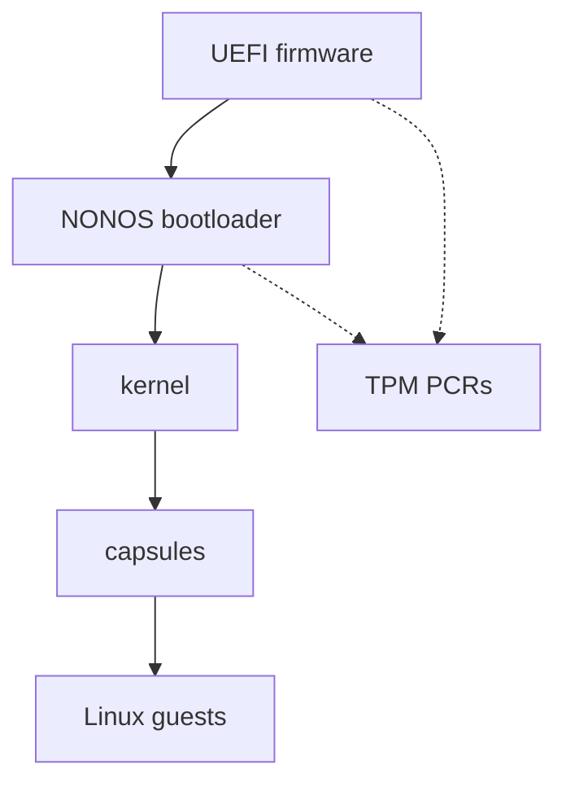

# Security

The security section of the NONOS documentation: what NONOS trusts, where each check lives in the code, and which page answers which question.

## The trust model

NONOS trusts a short chain of code. Each link starts the next, and the kernel checks everything that runs above it.

The UEFI firmware starts the machine. NONOS cannot inspect or contain it. What NONOS can do is bind secrets to what was measured at boot: the machine key is derived under a TPM policy over `BOUND_PCRS`, PCR 0, 4, 7 and 9, which the code describes as the firmware code, the boot manager the firmware measured, the Secure Boot policy and the kernel hash the bootloader extends (`src/security/tpm/machine_key/pcrs.rs:21-24`). A changed firmware, NONOS bootloader or kernel therefore gets a different key. [Measured boot and TPM](measured-boot-and-tpm.md) has the details.

The NONOS bootloader loads the kernel. How it checks the kernel's signatures and its rollback index is on [Boot chain and signatures](boot-chain-and-signatures.md) and [Rollback protection](rollback-protection.md).

The kernel runs in ring 0 and is trusted. It admits a [capsule](../overview/glossary.md#capsule) only after `verify_id_cert` has checked its publisher certificate and `verify_with_publisher` has checked its manifest and its image (`src/kernel_core/process_spawn/capsule_spawn/runner/preflight.rs:41-66`). The signature policy it passes, `NONOS_PRODUCTION_POLICY`, requires both an Ed25519 and an ML-DSA-65 signature (`src/security/nonos_id_cert/policy.rs:30-32`). The capabilities a manifest asks for must fit under the ceiling in the publisher's certificate, or `check_ceiling` refuses the capsule (`src/security/capsule_manifest/verify/caps.rs:21-29`).

Capsules run in ring 3, each in its own address space, and hold only the capability bits their verified manifest granted. Every NONOS system call passes through one `dispatch` function, which refuses with `EPERM` when the caller's [capability token](../overview/glossary.md#capability-token) does not admit that call (`src/syscall/contract/dispatch.rs:31-40`). A capsule with no bits can compute, and every call it makes except `MkTtyQuery` is refused.

Linux programs run as guests of the [Linux personality](../overview/glossary.md#linux-personality). The kernel creates each guest with an empty capability set through `install_spawn` (`src/process/foreign/spawn.rs:65-68`), so a guest reaches nothing except through the capsule that answers its system calls.

Drivers are capsules too. A driver reaches its device only through the kernel's [broker](../overview/glossary.md#broker), and a claimed device is moved into the driver's own [IOMMU domain](../overview/glossary.md#iommu-domain) before it is powered (`attach` in `src/hardware/broker/claim/claim.rs:33-37`). Where no remapping unit is in service, that confinement does not exist, and the boot log says so. [Capsule isolation](capsule-isolation.md) covers this.

The keys that protect data across boots are derived, not stored. The [data volume](../overview/glossary.md#data-volume) key comes from the TPM through `derive_for_kernel` (`src/fs/blockfs_volume/open_machine.rs:75-78`). An orderly shutdown or reboot goes through `terminate`, which wipes memory before handing the machine back to the firmware (`src/security/zerostate/terminate.rs:35-39`). [Device secrets and keys](device-secrets-and-keys.md) lists what is kept, where, and for how long.

Solid arrows show which code starts which. Dotted arrows show measurements going into the TPM PCRs, which the kernel later uses to derive keys.

## What each layer enforces

| Layer | What enforces it |
|---|---|
| Capsule admission | `verify_with_publisher` checks the certificate binding, namespace, capability ceiling, signatures, payload hash, target triple and declared endpoints, in that order, then that the grant fits the manifest (`src/security/capsule_manifest/verify/mod.rs:37-63`) |
| System calls | `resolve` checks the token's MAC, the boot it was minted in, the address space, the revocation epoch, then the call itself (`src/syscall/contract/resolver/resolve.rs:31-43`) |
| IPC | `caller_satisfies_endpoint` refuses a send unless the sender holds every bit the endpoint requires (`src/syscall/microkernel/ipc/send_caps.rs:36-63`) |
| Devices | `claim` refuses a device that a remapping unit in service could not confine (`src/hardware/broker/claim/claim.rs:23-45`) |
| Data at rest | `seal` encrypts each 512-byte sector of the data volume with ChaCha20-Poly1305, bound to its LBA (`src/fs/cryptoblock/seal.rs:22-48`) |
| Shutdown | `zerostate_shutdown_wipe` quiesces devices, then wipes DMA buffers, process memory, kernel stacks and the heap (`src/security/hardening/memory_sanitization/api.rs:59-110`) |

None of these defends against everything. [Protections and limits](protections-and-limits.md) lists what NONOS addresses and what it does not, each in one table.

## Pages in this section

- [Boot chain and signatures](boot-chain-and-signatures.md): how the kernel and capsules are signed with Ed25519 and ML-DSA, and who checks each signature.
- [Rollback protection](rollback-protection.md): how an older, signed image is refused.
- [STARK attestation](stark-attestation.md): the proofs a capsule carries and the anonymous device proof.
- [Measured boot and TPM](measured-boot-and-tpm.md): which PCRs are extended, the machine key and the attestation key.
- [Capsule isolation](capsule-isolation.md): address spaces, the capability check on every system call, IPC rules, driver confinement and the Linux sandbox.
- [Device secrets and keys](device-secrets-and-keys.md): the keyring, sealed records, the encrypted data volume, what stays in RAM and what is wiped at shutdown.
- [Protections and limits](protections-and-limits.md): the threats NONOS addresses and the ones it does not.
- [Reporting a vulnerability](reporting-a-vulnerability.md): how to report a security bug privately.
