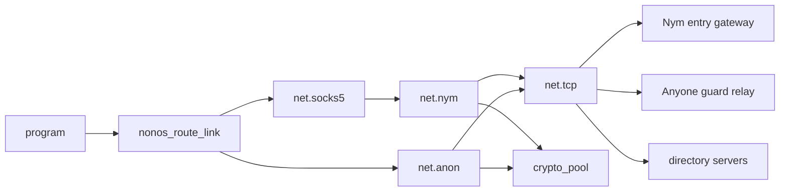
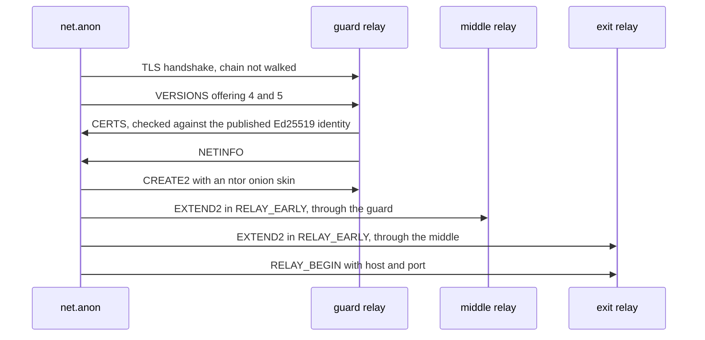

# How the Nym and Anyone transports are built

A security reviewer's account of the two anonymity transports in NONOS, `net.nym` and `net.anon`: which parts of each protocol they implement, the cryptography on the wire, how each checks its directory, what was compared with upstream, and what is missing.

## Two reimplementations, not the upstream clients

NONOS links neither the Nym client nor a Tor or Anyone client. Both transports are `no_std` [capsules](../overview/glossary.md#capsule) written for NONOS, and both are new code:

- `net.nym` (`userland/capsule_net_nym`) is the client for the [Nym mixnet](../overview/glossary.md#nym-mixnet). Its `README.md` gives the reason: Sphinx "is reimplemented here in `no_std` against the published format, because the reference stack cannot be linked into a kernel userland" (`userland/capsule_net_nym/README.md:9-11`).
- `net.anon` (`userland/capsule_net_anon`) is the client for the [Anyone network](../overview/glossary.md#anyone-network), a fork of Tor. It speaks the Tor-derived link, circuit and directory protocols as the fork has them, and records what it took from the fork in `userland/capsule_net_anon/PROTOCOL.md`.

In an image built with them, the kernel starts both at boot from its network spawn plan, `spawn_nym` then `spawn_anon`, and only then `spawn_socks5`, because the SOCKS front resolves the transport by name at startup (`src/userspace/init/spawn_plan/network/spawn.rs:20-28`).

Both [manifests](../overview/glossary.md#manifest) set `CAPSULE_REQUIRED_CAPS` to `0x0003c`, the Network, IPC, Memory and Crypto [capabilities](../overview/glossary.md#capability), with Debug (`0x100`) optional (`userland/capsule_net_nym/Capsule.mk:13-16`, `userland/capsule_net_anon/Capsule.mk:26-29`). Neither asks for FileSystem and neither calls the [file store](../overview/glossary.md#file-store), so what each learns lives in its own memory and ends with the boot. Their service [endpoints](../overview/glossary.md#endpoint) are `service:4470:net.nym` and `service:4484:net.anon`. Both reach the network only through `net.tcp`.

A program asks `nonos_route_link` which network to use. A Nym stream goes to `net.socks5` and on to `net.nym`. An Anyone stream goes straight to `net.anon`, which serves SOCKS5 frames on its own service port beside its API; `is_socks` tells the two apart by the first byte (`userland/capsule_net_anon/src/server/socks/frame.rs:61-74`). Both transports send through `net.tcp`: `net.nym` to a Nym entry gateway, `net.anon` to one Anyone guard relay, and each to its own directory servers, the Nym API for `net.nym` and the seven Anyone directory authorities for `net.anon`. Both also call the `crypto_pool` capsule, directly over IPC and through the kernel's crypto system calls.

### Where each primitive runs

| Primitive | `net.nym` | `net.anon` |
|---|---|---|
| X25519, HMAC-SHA256, HKDF-SHA256 | `crypto_pool`, through the kernel's crypto system calls, which require Crypto | Same |
| Hashing through those calls | BLAKE3 | SHA-256 of short inputs |
| Random bytes | The kernel's random system call, not `crypto_pool` | Same |
| Ed25519 | `nonos_ed25519`, linked into the capsule | Same |
| RSA and ECDSA signature checks | `crypto_pool` over IPC, from `nonos_tls`, for the directory's certificate chain | `crypto_pool` over IPC, for authority certificates, consensus signatures and the relay's TLS signatures |
| AES | Its own AES-128 and AES-256 (`userland/capsule_net_nym/src/crypto/aes`) | `nonos_aes`, AES-128 and AES-256 |
| Other hashes and ciphers | Its own ChaCha20, BLAKE2b, LIONESS, AES-256-GCM-SIV and HKDF over BLAKE3 | Its own SHA-1, SHA3-256, SHA-384, and a SHA-256 for the consensus |
| TLS | `nonos_tls`, TLS 1.3, for the directory | `nonos_tls`, TLS 1.3, for relay links, and its own TLS 1.2 client |

`handle_x25519_shared` checks Crypto and passes the caller's scalar to the crypto capsule client (`src/syscall/dispatch/crypto/primitives/ecdh.rs:38-54`). The hash call maps algorithm 0 to `hash_blake3` and 1 to `hash_sha256` (`src/syscall/dispatch/crypto/hash/algorithm.rs:23-31`). `handle_crypto_random` serves random bytes from the generator the entropy capsule seeds, and falls back to the kernel's hardware generator (`src/syscall/dispatch/crypto/random.rs:33-46`). `crypto_port` finds `crypto_pool` for every certificate signature `nonos_tls` checks (`userland/nonos_tls/src/crypto_port.rs:28-35`).

## The kernel checks Network, not the route

`required_caps` adds Network to what a sender must hold for every name in `NETWORK_SERVICES`, and that list includes `net.nym`, `net.anon` and `net.socks5` (`src/services/registry/policy.rs:26-44`). A capsule without Network cannot open a stream through either transport. The kernel does not check which network a program uses, and it does not stop a program that holds Network from calling `net.tcp` or `net.sockets` directly. The choice of network is kept in each program by `nonos_route_link`; [Privacy networks](../using/privacy-network.md) describes it from the user's side.

The kernel parses no Sphinx packet or cell and chooses no route. It does see key material in passing: the X25519 scalars of both transports, their TLS key shares among them, and the HMAC and HKDF inputs of Sphinx and ntor go through its crypto system calls on the way to `crypto_pool`, as `handle_x25519_shared` shows (`src/syscall/dispatch/crypto/primitives/ecdh.rs:38-54`).

## net.nym

### Sphinx

The packet format is fixed at compile time: `HEADER_SIZE` is 348 bytes (a 32-byte ephemeral key, a 16-byte MAC and 300 bytes of routing information) and `REGULAR_PACKET_SIZE` is 2413, leaving a 2065-byte payload (`userland/capsule_net_nym/src/sphinx/constants/sizes.rs:65-71`). A header can describe at most `MAX_PATH_LENGTH`, five hops (`userland/capsule_net_nym/src/sphinx/constants/fields.rs:21`). Packets carry `PACKET_VERSION`, version `SEEDS_VERSION` 259, in which each hop stretches a 16-byte seed into its payload key; the code names this as the version of sphinx-packet 0.6 (`userland/capsule_net_nym/src/sphinx/constants/version.rs:29-41`).

For each hop, `derive_hop_keys` runs X25519 between the packet's ephemeral scalar and the node's key, blinded by every earlier hop's blinding factor (`userland/capsule_net_nym/src/sphinx/header/derive_keys.rs:29-51`). `expand_shared_secret` stretches the result with HKDF-SHA256 into a stream key, a MAC key, a payload key region whose first 16 bytes are the seed this version uses, a blinding factor and a replay tag (`userland/capsule_net_nym/src/sphinx/keys/expand.rs:26-35`).

- Routing information is encrypted by `encrypt_routing_info` with AES-128 in counter mode from a zero counter (`userland/capsule_net_nym/src/sphinx/routing/encrypt.rs:24-39`).
- The header MAC from `compute_mac` is HMAC-SHA256 cut to its first 16 bytes, as the format specifies (`userland/capsule_net_nym/src/sphinx/mac/compute.rs:21-32`).
- The payload is one LIONESS block: `PAYLOAD_KEY_SIZE` is 192 bytes, two ChaCha20 keys and two BLAKE2b MAC keys (`userland/capsule_net_nym/src/sphinx/constants/fields.rs:38-40`), which `derive_payload_key` stretches from each hop's seed with HKDF-SHA256 (`userland/capsule_net_nym/src/sphinx/keys/derive_payload_key.rs:24-30`).
- Mix nodes are addressed by IPv4 address and port only, in the form `routing_address` writes (`userland/capsule_net_nym/src/mixnet/address.rs:28-34`).

`route` draws one node from each of the three mix layers and one exit gateway, and leaves the entry gateway out of the header: the client hands the packet to it over the WebSocket it already holds (`userland/capsule_net_nym/src/topology/select.rs:23-38`). `route_to` then swaps the drawn exit for the gateway the recipient's address names, because only that gateway can deliver to it (`userland/capsule_net_nym/src/mixnet/route_to.rs:23-52`). `seal_one` draws a fresh route seed and Sphinx secret for every packet, not once per message (`userland/capsule_net_nym/src/mixnet/seal.rs:27-51`). `draw` gives every candidate in a layer the same chance; nothing weights a node by stake or performance (`userland/capsule_net_nym/src/topology/draw.rs:41-48`). Each hop's delay is exponential with a mean of `MEAN_DELAY_NS`, 15 ms (`userland/capsule_net_nym/src/mixnet/delays.rs:22-24`), cut off at `DELAY_CAP_MEANS`, 20 means (`userland/capsule_net_nym/src/mixnet/exp_delay.rs:19-22`).

Inside the Sphinx payload, each fragment is sealed for the recipient alone. `packet_shared_key` makes a fresh X25519 key pair per packet against the recipient's encryption key and derives a 16-byte key with HKDF over BLAKE3 (`userland/capsule_net_nym/src/payload/shared.rs:25-47`), and `build_payload` encrypts the fragment under it with AES-128 in counter mode (`userland/capsule_net_nym/src/payload/build.rs:34-51`).

### Gateway registration over WebSocket

`establish` waits for the TCP connection, upgrades it to a WebSocket, registers, then claims bandwidth (`userland/capsule_net_nym/src/gateway_client/establish.rs:27-47`). The upgrade request from `build` is plain HTTP; the WebSocket to the gateway is not TLS (`userland/capsule_net_nym/src/gateway_client/ws/request.rs:22-29`). The five gateways compiled into the image, `BOOTSTRAP_GATEWAYS`, are dialled on port 9000, each with its Ed25519 identity (`userland/capsule_net_nym/src/state/bootstrap.rs:29-50`).

`run_handshake` runs the registration (`userland/capsule_net_nym/src/gateway_client/handshake/run.rs:26-61`):

1. The client sends its Ed25519 identity, an ephemeral X25519 key and a 16-byte salt it chose.
2. The gateway answers with its own ephemeral key and a sealed signature. `derive_shared_key` runs X25519 and HKDF over BLAKE3 with the client's salt, so the gateway cannot steer the key (`userland/capsule_net_nym/src/gateway_client/handshake/derive.rs:22-37`). `verify_material` opens the signature with AES-256-GCM-SIV and checks it with Ed25519 over both ephemeral keys, against the identity the directory or the compiled list names (`userland/capsule_net_nym/src/gateway_client/handshake/verify_material.rs:22-49`).
3. The client sends its own signature, sealed the same way, and the gateway answers `1` to accept.

The client speaks gateway `PROTOCOL_VERSION` 3 (`userland/capsule_net_nym/src/gateway_client/register.rs:21-22`). After registration, every Sphinx packet goes to the gateway in a binary frame that `make_encrypted_blob` seals with AES-256-GCM-SIV under the shared key and a random 12-byte nonce; the kind and flag bytes stay outside the sealed region (`userland/capsule_net_nym/src/gateway_client/binary/blob.rs:23-39`). Control frames, such as the bandwidth claim below, travel as plain WebSocket text. An incoming frame whose nonce is already in the window is refused by `fresh` (`userland/capsule_net_nym/src/server/handlers/replay_gate.rs:27-36`), and `ReplayWindow` holds the last `DEPTH`, 64, nonces (`userland/capsule_net_nym/src/state/replay.rs:19-25`).

Gateways meter traffic. `claim_free_bandwidth` sends the control frame `claimFreeTestnetBandwidth` and does not wait for the answer (`userland/capsule_net_nym/src/gateway_client/bandwidth.rs:20-33`). Whether a gateway grants it is not tested in this release. A bought credential would come through `OP_SET_CREDENTIAL`, an admin operation, and `admin` accepts only the pid registered as `net.admin`, which no capsule registers, so every admin operation is refused (`userland/capsule_net_nym/src/server/authz.rs:34-40`).

Gateways from the fetched directory are preferred to the compiled ones by `pick` (`userland/capsule_net_nym/src/gateway_client/pick.rs:28-36`). `start_offset` starts the walk at a random place, drawn once per boot (`userland/capsule_net_nym/src/gateway_client/candidate.rs:43-61`), and a failed attempt waits twice as many idle turns as the last, up to `MAX_BACKOFF`, 64 (`userland/capsule_net_nym/src/server/connect_tick.rs:29-31`).

### Replies through SURBs

The exit never learns where the client is. `build_surb` builds a header for a route that ends at this client, with a fresh 16-byte key, and hands it out with a request; the far end puts its reply behind it (`userland/capsule_net_nym/src/surb/build.rs:24-59`). A reply names its key by a 32-byte BLAKE3 digest, and `open_reply` takes that key out of the store as it decrypts with AES-128 in counter mode, so a reply block opens once (`userland/capsule_net_nym/src/reply/open.rs:35-54`). Up to `KEYS_MAX`, 4096, unanswered keys are kept (`userland/capsule_net_nym/src/surb/store.rs:26-36`). A request carries `PER_REQUEST`, 24, blocks while the far end is believed to hold fewer than `HIGH_WATER`, 300 (`userland/capsule_net_nym/src/surb/budget.rs:29-38`).

### The directory and the topology gate

At start the capsule installs the nine mix nodes compiled into it, `PER_LAYER` three for each layer (`userland/capsule_net_nym/src/state/bootstrap_mix/table.rs:27-30`), marked as coming from the image (`userland/capsule_net_nym/src/topology/builtin.rs:32-60`). That list has no gateways, so no route is built until the live directory arrives. The capsule fetches it:

- `wait_for_lease` waits up to `DEADLINE_MS`, 30 seconds, for a DHCP lease (`userland/capsule_net_nym/src/directory_sync/lease.rs:29-44`).
- The fetch goes to port 443 at `API_ADDRESSES`, the address compiled in for `API_HOST`, `validator.nymtech.net`, so no DNS query is sent (`userland/capsule_net_nym/src/directory_sync/live.rs:22-30`). `fetch_at` speaks TLS 1.3 through `exchange` (`userland/capsule_net_nym/src/directory_sync/fetch_at.rs:44-57`), which seals the request only after the certificate chain, the CertificateVerify and the Finished check out for that host name (`userland/nonos_tls/src/session/exchange.rs:37-58`).
- `verify_chain` walks at most `MAX_CHAIN`, ten, certificates to the roots built into `nonos_tls` (`userland/nonos_tls/src/chain_walk.rs:20-31`); [TLS and certificate trust](tls-and-certificates.md) covers the roots and the clock.
- Three lists are fetched, `MIXNODES_PATH`, `GATEWAYS_PATH` and `EXITS_PATH` (`userland/capsule_net_nym/src/directory_sync/live.rs:31-37`), each cut to its budget with a log line if it is longer: `MIX_BUDGET` 128, `ENTRY_BUDGET` and `EXIT_BUDGET` 192 (`userland/capsule_net_nym/src/directory_sync/budget_roles.rs:32-41`).
- Exit network requesters are read from `DESCRIBED_PATH` over the same TLS, and kept only when they sit on an exit gateway in the fetched list (`userland/capsule_net_nym/src/directory_sync/requesters.rs:38-58`).

`install_fetched` keeps a fetched list for `VALID_MS`, one hour (`userland/capsule_net_nym/src/topology/fetched.rs:24-47`), and `fetch_due` fetches again within `REFRESH_BEFORE_MS`, ten minutes, of expiry (`userland/capsule_net_nym/src/topology/refresh.rs:29-45`). No operator signs the fetched list. `admissible` admits a list from the image or a fetched one, and a signed one only from a trusted issuer (`userland/capsule_net_nym/src/topology/admissible.rs:41-47`); installing an issuer is an admin operation, so no signed list is used in this release. The code's reasoning is that each hop's layer is sealed to the packet key the list gives for it, so a machine at a listed address without that key cannot open the layer. A list that names an attacker's own nodes with their own keys is not caught that way: TLS to the validator is the only check on what the list says.

The topology gate is `check`: no session opens unless the topology status is `Ready` (`userland/capsule_net_nym/src/state/table/topology_gate.rs:20-26`). `current` reports the other states, `Missing`, `Clock`, `Expired` and `UntrustedAuthority` (`userland/capsule_net_nym/src/topology/status.rs:21-40`). `replace` refuses a list whose epoch is not newer than the one held (`userland/capsule_net_nym/src/topology/store.rs:32-45`).

The directory fetch is not anonymous. It leaves before any mixnet exists, and the local network and the validator see that this machine uses Nym.

### Keys live for one boot

- `client_identity` draws the Ed25519 identity the gateway sees on first use and never writes it, so a gateway cannot link two boots by it (`userland/capsule_net_nym/src/state/identity.rs:19-47`). Installing a fixed identity takes `OP_SET_IDENTITY`, an admin operation.
- `ack_key`, the key the client's own acknowledgements are recognised by, is drawn once per boot (`userland/capsule_net_nym/src/state/ack_key.rs:29-43`).
- The gateway's shared key stays in `SHARED_KEY` until the next registration replaces it. `clear_gateway_shared_key` exists, but nothing calls it, so the key of a lost gateway stays in memory (`userland/capsule_net_nym/src/state/shared_key.rs:19-34`).
- The route seed and the Sphinx secret are new for every packet in `seal_one` (`userland/capsule_net_nym/src/mixnet/seal.rs:34-44`), and so is the recipient key pair.

### Cover traffic only on request

`handle` for `OP_COVER_TICK` sends `cover_burst` packets of random bytes when `cover_due` says one is due, and nothing otherwise (`userland/capsule_net_nym/src/server/handlers/cover.rs:26-42`). By default `COVER_BURST` is one packet and `cover_due` sets the next one due 10 to 259 ms later, from `DELAY_JITTER_MS` 250 (`userland/capsule_net_nym/src/state/timing.rs:21-74`); `OP_SET_TIMING`, which could change them, is an admin operation. The capsule has no timer of its own for cover. The only caller is the `OPT_COVER_TICK` socket option of `net.sockets` (`userland/capsule_net_sockets/src/server/handlers/setsockopt.rs:25-26`), and no program in this tree sets that option.

### How net.socks5 reaches it

`run` in `net.socks5` resolves `net.nym` and never `net.tcp`, so the SOCKS front has no direct route to fall back to (`userland/capsule_socks5/src/setup.rs:27-38`). It uses seven operations of `net.nym`, from `OP_OPEN_SESSION` to `OP_GET_EXIT`, and `OP_COVER_TICK` is not among them (`userland/capsule_socks5/src/ipc/ops.rs:17-33`). `OP_GET_EXIT` hands back an exit's identity, encryption key and gateway from the directory (`userland/capsule_net_nym/src/server/handlers/get_exit.rs:22-49`). The connect request it sends through the mixnet is Nym's `Socks5Request`, protocol version 3, with the host name unresolved and no return address (`userland/capsule_socks5/src/tunnel/mod.rs:17-34`).

## net.anon

### The fork point and PROTOCOL.md

`PROTOCOL.md` records how the protocol was read. The fork's `ChangeLog` head is 0.4.8.11, so the fork point is Tor 0.4.8.11; the fork was diffed file by file against tag `tor-0.4.8.11`; and a live consensus and three microdescriptors were fetched from an authority (`userland/capsule_net_anon/PROTOCOL.md:8-16`). It lists what came back identical or different only in comments, from consensus parsing and the link handshake to the cell numbers and the 509-byte payload, and six differences: TAP is gone, the RSA onion key is optional, the Ed25519 identity is required, there are no fallback directory mirrors, the authorities and ports are the fork's own, and there is a `.anyone` naming layer. The live measurements in it, dated 2026-09-18 and 2026-09-19, are notes, not a committed log.

### The directory and the RSA quorum

`AUTHORITIES` holds the seven authorities from the fork's `auth_dirs.inc`, each with its address, DirPort 9230 and the SHA-1 of its v3 identity key (`userland/capsule_net_anon/src/directory/authority/list.rs:22-35`). There is no other way in.

- Documents are fetched over plain HTTP/1.0 from the DirPort: `CONSENSUS_PATH` for the microdescriptor consensus, `keys_path` for authority certificates and `micro_path` for microdescriptors (`userland/capsule_net_anon/src/directory/fetch/request.rs:23-59`). They are trusted for their signatures, not their transport.
- `check` accepts an authority certificate only when the SHA-1 of its identity key equals the compiled fingerprint, its RSA self-signature verifies over a SHA-1 digest, and its `dir-key-expires` time has not passed (`userland/capsule_net_anon/src/directory/verify/anchor.rs:43-69`).
- `quorum` hashes the signed part of the consensus with SHA-256 inside the capsule (`userland/capsule_net_anon/src/directory/verify/consensus.rs:44-72`). `accepts` counts a signature only if it is a SHA-256 line, names a known authority, names the same signing key as the certificate the client has for that authority, and verifies (`userland/capsule_net_anon/src/directory/verify/counted.rs:27-46`).
- RSA verification is `OP_RSA_VERIFY`, 21, sent to `crypto_pool` (`userland/capsule_net_anon/src/directory/verify/frame.rs:24-36`).
- `REQUIRED_SIGNATURES` is a majority of the seven, four (`userland/capsule_net_anon/src/directory/authority/types.rs:27-29`).
- `gather_one` keeps a microdescriptor only when its SHA-256 equals a digest the consensus listed for that batch (`userland/capsule_net_anon/src/manager/dir_micro.rs:38-72`), and `parse` drops one without an ntor key or an Ed25519 identity (`userland/capsule_net_anon/src/directory/microdesc/parse.rs:32-64`).
- `usable` stops circuit building and stream traffic once the consensus is past `valid_until` (`userland/capsule_net_anon/src/manager/refresh_rule.rs:52-57`).

### Path selection

`draw_path` draws the exit relay, then the guard relay, then the middle relay (`userland/capsule_net_anon/src/path/build.rs:29-39`). Once a link is open, `through` keeps that guard and draws the exit and the middle around it (`userland/capsule_net_anon/src/path/through.rs:27-47`).

- `eligible` takes a guard only with the Guard, Stable and Fast flags, a middle with Fast, and an exit with Exit, Fast and an exit policy that lets out both port 80 and port 443 (`userland/capsule_net_anon/src/path/select/eligible.rs:22-37`). Authorities are never used. A stream to another port can be refused at the exit.
- `excluded` keeps any two hops apart by RSA identity and by IPv4 /16 (`userland/capsule_net_anon/src/path/select/eligible.rs:48-62`). Declared relay families are not read.
- `weight_for` picks the consensus position weight, `Wgg`, `Wgd`, `Wee`, `Wed`, `Wmd`, `Wmg`, `Wme` or `Wmm`, by position and flags (`userland/capsule_net_anon/src/path/weights/apply.rs:29-42`), `scale` multiplies it by the relay's consensus bandwidth, and `pick` walks the cumulative weight from a 64-bit random roll (`userland/capsule_net_anon/src/path/draw.rs:19-44`).
- `HOPS` is fixed at 3 (`userland/capsule_net_anon/src/protocol/limits.rs:59-61`).

### The guard link and its CERTS check

`open` dials the guard relay's ORPort through `net.tcp` and runs TLS with `connect_unauthenticated` from `nonos_tls`, giving the relay's own IPv4 address as the server name (`userland/capsule_net_anon/src/link/open.rs:45-52`). `connect_unauthenticated` completes a TLS 1.3 handshake without walking the certificate chain to any root (`userland/nonos_tls/src/stream/connect.rs:33-37`); `settle` still checks the CertificateVerify signature and the Finished MAC (`userland/nonos_tls/src/stream/settle.rs:28-44`). Its suites are `SUITE_CHACHA20_SHA256` and `SUITE_AES128_GCM_SHA256` over X25519 or P-256 (`userland/nonos_tls/src/constants.rs:22-25`). A relay that answers with alert 40 or 70 gets one TLS 1.2 handshake, as `refuses_tls13` decides (`userland/capsule_net_anon/src/link/fallback.rs:20-30`), from the capsule's own client in `userland/capsule_net_anon/src/link/tls12/mod.rs`: ECDHE over P-256, an RSA-signed key exchange, ChaCha20-Poly1305 or AES-256-GCM, no renegotiation or resumption, and a refusal of the RFC 8446 downgrade mark.

The relay is authenticated by the link protocol instead. The client offers `LINK_VERSIONS` 4 and 5 (`userland/capsule_net_anon/src/link/constants.rs:37-39`), then `bind` checks the CERTS cell (`userland/capsule_net_anon/src/link/bind/verify.rs:37-57`):

- The type 4 certificate, `CERT_ED_ID_SIGN`, must be signed by the Ed25519 identity the relay's microdescriptor published, and that signature must verify.
- The type 5 certificate, `CERT_ED_SIGN_LINK`, must be signed by the type 4 certificate's key, and its certified key must equal the SHA-256 of the TLS leaf certificate this connection received.
- Neither may have expired.

`find` reads only those two types; the RSA certificates in the cell are skipped (`userland/capsule_net_anon/src/link/bind/find.rs:24-38`). `classify` refuses a NETINFO that arrives before CERTS has verified and ignores AUTH_CHALLENGE, since the client does not authenticate itself (`userland/capsule_net_anon/src/link/step.rs:37-49`). The relay has `HANDSHAKE_MS`, ten seconds, for each stage of the link handshake (`userland/capsule_net_anon/src/link/timing.rs:17-19`).

All circuits share one link to one guard. The guard is replaced after `GUARD_ATTEMPTS`, three, failures (`userland/capsule_net_anon/src/manager/guard.rs:26-29`). A link that breaks within `LINK_YOUNG_SECONDS`, 30, of opening counts as a failure, and up to `GIVEN_UP_MAX`, eight, abandoned guards and their /16 are avoided by the next draw (`userland/capsule_net_anon/src/path/guard_pick.rs:36-70`). The guard lives in memory and ends with the boot.

### ntor, CREATE2 and EXTEND2

- Every relay hop uses ntor, `PROTOID` `ntor-curve25519-sha256-1`. The onion skin is the 20-byte RSA identity digest, the relay's ntor key and the client's ephemeral key, `ONIONSKIN_BYTES` (`userland/capsule_net_anon/src/ntor/constants.rs:23-34`).
- `finish` checks the relay's auth value with HMAC-SHA256 and derives 72 bytes of key material with HKDF-SHA256, wiping the shared secrets on every path (`userland/capsule_net_anon/src/ntor/finish.rs:29-69`).
- `create2` sends the first hop's onion skin with handshake type `HANDSHAKE_NTOR`, 2 (`userland/capsule_net_anon/src/circuit/create.rs:21-32`), and `client_circuit_id` sets the high bit of every circuit id the client makes (`userland/capsule_net_anon/src/circuit/create.rs:43-51`).
- `extend2_body` names the next hop by three link specifiers: IPv4 address and port, RSA identity and Ed25519 identity (`userland/capsule_net_anon/src/circuit/extend/build.rs:27-55`). EXTEND2 travels in a RELAY_EARLY cell, using `CELL_RELAY_EARLY` (`userland/capsule_net_anon/src/circuit/build/ask.rs:55-56`).
- The module comment says `ntor` is the only circuit handshake the capsule speaks: the fork removed TAP, and ntor v3 is not negotiated (`userland/capsule_net_anon/src/ntor/mod.rs:17-21`). The onion service client adds hs-ntor for the service's own hop.

### Relay crypto and flow control

`Hop::new` splits the key material into a forward and a backward SHA-1 running digest, seeded with 20 bytes each, and a forward and a backward AES-128 counter-mode keystream, keyed with 16 bytes each (`userland/capsule_net_anon/src/circuit/hop.rs:43-69`). Each relay cell carries the first four bytes of the running digest, computed with the field zeroed, as `take_digest` and `put_digest` handle it (`userland/capsule_net_anon/src/cell/relay/integrity.rs:21-39`). Cells have a `PAYLOAD_BYTES` 509-byte payload and an 11-byte relay header (`userland/capsule_net_anon/src/cell/geometry.rs:19-28`).

The windows are `CIRCUIT_START` 1000 with increments of 100, and `STREAM_START` 500 with increments of 50 (`userland/capsule_net_anon/src/circuit/window.rs:24-27`). `circuit_tick` pays each circuit-level SENDME as version 1, carrying the 20-byte digest of the cell at that boundary (`userland/capsule_net_anon/src/manager/out/sendme_tick.rs:40-63`). Stream-level SENDMEs from `stream_tick` carry no digest, as the protocol defines them (`userland/capsule_net_anon/src/manager/out/stream_sendme.rs:29-49`). A SENDME is withheld while a reader is behind by more than `STREAM_HIGH_WATER` or `CIRCUIT_HIGH_WATER` (`userland/capsule_net_anon/src/protocol/limits.rs:45-49`). In the other direction, `granted` credits a circuit-level SENDME from a relay without checking its digest, and puts no ceiling on the window it grows (`userland/capsule_net_anon/src/manager/inbound/status.rs:65-69`).

### Streams with remote resolution

`body` writes a RELAY_BEGIN as `host:port`, a NUL and the flags, with `FLAG_IPV6_OK` set so the exit relay may connect over either address family (`userland/capsule_net_anon/src/stream/begin.rs:23-48`). The host name is resolved by the exit; `net.anon` makes no DNS query. The capsule holds at most `CIRCUIT_MAX`, 3, circuits and `STREAM_MAX`, 32, streams; a circuit takes new streams for `CIRCUIT_DIRTY_SECONDS`, 600, and is retired after `CIRCUIT_FAILURES_MAX`, 2, failed streams (`userland/capsule_net_anon/src/protocol/limits.rs:30-57`).

### Onion services and short names

`net.anon` also has a client for the fork's `.anyone` onion services (`userland/capsule_net_anon/src/onion/mod.rs`). The service's own hop runs SHA3-256 digests and AES-256, built by `Hop::onion` (`userland/capsule_net_anon/src/circuit/hop.rs:71-98`). A caller can hand it a client authorization key in the fork's `.auth_private` line format through `client_auth`, and the reply carries nothing of the key back (`userland/capsule_net_anon/src/server/handlers/client_auth.rs:23-27`); `ClientKey` keeps the secret in memory and wipes it when dropped (`userland/capsule_net_anon/src/onion/client_auth.rs:45-62`). For a service under load, the client solves the proposal 327 proof of work up to `CLIENT_MAX_EFFORT`, 10000 (`userland/capsule_net_anon/src/onion/pow/mod.rs:35-39`).

A short `.anyone` name is looked up in a list that one of the six DNS services compiled into `MAPPING` must sign (`userland/capsule_net_anon/src/onion/names/defaults.rs:28-36`). A list never replaces a newer one, and a name that later points at another service in the same boot is refused. `NAME_NOTICE` is the sentence a caller shows beside a short name: it is weaker than the full address (`userland/capsule_net_anon/src/onion/names/mod.rs:30-50`). `PROTOCOL.md` says this part was held to the fork's own known answers, among them `hs_ntor` and key blinding, and has not been seen against the live network (`userland/capsule_net_anon/PROTOCOL.md:159-170`).

## What each transport reports

Each transport posts a `RouteReport` to the attest service every `EVERY_MS`, five seconds, and on every change of stage (`userland/capsule_net_anon/src/server/report/post.rs:27-29`, `userland/capsule_net_nym/src/server/report/post.rs:26-28`). `RouteReport` is `REPORT_LEN`, 40 bytes, on the wire: the network, the stage, the directory signatures verified and required, the node count, how long the directory stays valid, open routes, authenticated hops, reply blocks in stock and whether cover is being sent (`userland/route_proof/src/report.rs:19-74`). It names no guard, gateway, relay, address or key. `may_report` takes a report about Nym only from `net.nym` and about Anyone only from `net.anon`, each holding Network (`userland/route_proof/src/authorize.rs:31-39`).

## What neither transport does

- Neither keeps anything across a reboot: no guard, no gateway, no identity, no directory. Each boot starts from the compiled lists.
- Neither pads traffic on its own. `net.anon` sends no padding cells and negotiates no link padding, and `net.nym` sends cover only when a program asks, which no program in this tree does.
- No vanguards, no declared relay families, no conflux, no congestion control and no ntor v3 in `net.anon`; `PROTOCOL.md` lists the last three as not implemented (`userland/capsule_net_anon/PROTOCOL.md:188-189`).
- Relays, gateways and mix nodes are reached by IPv4 address only. There are no bridges and no pluggable transports.
- Neither directory fetch is anonymous, and both reach fixed addresses compiled into the image.
- `net.nym` draws routes without weights, admits an unsigned fetched directory on the strength of TLS, asks gateways for free bandwidth, and keeps a lost gateway's shared key in memory.
- `net.anon` does not check the digest in a relay's SENDME and does not read the relay's RSA link certificates.
- No booted NONOS image has been recorded carrying traffic through a live Nym gateway or a live Anyone circuit. That is not tested in this release.

## What is tested

These [proof crates](../overview/glossary.md#proof-crate) build the code the transports run, mostly by `#[path]`, and pass under `nix flake check` on this commit:

| Proof crate | Tests | What it holds |
|---|---|---|
| `anon_ntor_proofs` | 226 | ntor against values from the fork's `ntor_ref.py`, relay cell crypto, SHA-1 and SHA-256, authority certificates, a recorded live consensus, microdescriptors, the path draw and /16 exclusion, the guard pick, the refresh rule, circuit build answers, SENDME windows, RELAY_BEGIN, the onion service parts, the SOCKS front of `net.anon` |
| `anon_link_proofs` | 14 | VERSIONS, the Ed25519 certificates and `bind`, on a CERTS cell and TLS leaf recorded from a live relay |
| `anon_tls12_proofs` | 34 | The TLS 1.2 fallback client against recorded handshakes |
| `anon_onion_proofs` | 67 | The onion service client against a simulated network |
| `net_anon_proofs` | 2 | Malformed requests are answered |
| `equix_proofs` | 28 | `nonos_equix`, the Equi-X solver behind the onion proof of work |
| `nym_topology_proofs` | 25 | The route draw, the refresh rule and the exit address readers, on answers recorded from the Nym API |
| `nym_reply_proofs` | 64 | WebSocket frames, fragments and reply reassembly, the SURB budget, each client's share of the table of open mixnet sessions |
| `aes_proofs` | 19 | `net.nym`'s AES and `nonos_aes` against FIPS 197 and SP 800-38A |
| `tls_proofs` | 129 | `nonos_tls` |
| `capsule_socks5_proofs` | 136 | `net.socks5` |
| `route_proof_proofs` | 36 | `RouteReport`, `may_report` and the attest board |

The counts come from the `nix flake check` results on this commit. The Sphinx header and payload construction, LIONESS, ChaCha20, BLAKE2b, AES-256-GCM-SIV and the gateway handshake of `net.nym` are in none of these crates. Known-answer tests for them, a runner that registers with a live gateway, and an oracle in which Nym's own sphinx-packet code unwraps packets built by the capsule's source are in `userland/capsule_net_nym/tests/live_gateway` and `userland/capsule_net_nym/tests/nym_interop`. Both need the network or crates.io, are not part of `nix flake check`, and were not run for this release.

## See also

- [Privacy networks](../using/privacy-network.md): the user's view of the three choices
- [TLS and certificate trust](tls-and-certificates.md)
- [Capsule isolation](capsule-isolation.md)
- [Randomness and cryptography](randomness-and-cryptography.md)
- [Protections and limits](protections-and-limits.md)
- [Threat model](../overview/threat-model.md)
- [IPC services](../userland/ipc-services.md)
- [Tests and proofs](../contributing/tests-and-proofs.md)
- [Anyone protocol notes](../../userland/capsule_net_anon/PROTOCOL.md)
- [Tor specifications](https://spec.torproject.org/)
- [Nym Sphinx packet library](https://github.com/nymtech/sphinx)
