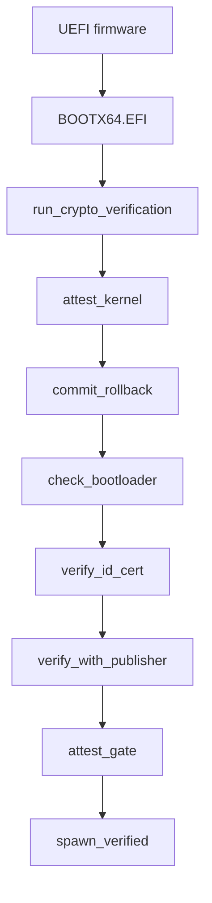

# Boot chain and signatures

Each stage of a NONOS boot is checked: with Secure Boot on, the firmware checks the loader; the loader checks the kernel before it jumps; the kernel checks the loader that started it before any program runs; and the kernel checks every [capsule](../overview/glossary.md#capsule) before it spawns one.

## The chain

The UEFI firmware starts the loader, `BOOTX64.EFI`. With Secure Boot on, the firmware first checks the loader's signature against the keys enrolled in it. The loader's `run_verified_boot` reads the kernel, runs `run_crypto_verification` for the signature and the [rollback index](../overview/glossary.md#rollback-index), then `attest_kernel` for the kernel's STARK trailer, parses the ELF, runs `commit_rollback` to raise the TPM floor, and only then prepares the [handoff](../overview/glossary.md#handoff) (`nonos-bootloader/src/entry/pipeline.rs:30-50`).

Early in `microkernel_main`, right after the installer check and before any userspace, the kernel runs `check_bootloader`, its own check of the loader that started it; no userspace starts when that check fails (`src/kernel_core/init/entry/microkernel_main.rs:22-27`). Every capsule then passes `preflight::run`, which calls `verify_id_cert`, `verify_with_publisher` and `attest_gate` in that order (`src/kernel_core/process_spawn/capsule_spawn/runner/preflight.rs:36-80`). `spawn_verified` asks `profile_gate::check` whether the boot mode lets the capsule start at all, and creates the process only after all three checks pass (`src/kernel_core/process_spawn/capsule_spawn/runner/verified.rs:27-63`).
