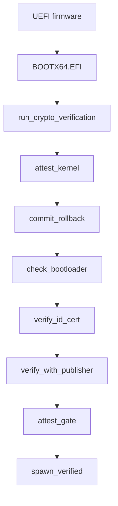

# Boot chain and signatures

Each stage of a NONOS boot is checked: with Secure Boot on, the firmware checks the loader; the loader checks the kernel before it jumps; the kernel checks the loader that started it before any program runs; and the kernel checks every [capsule](../overview/glossary.md#capsule) before it spawns one.

## The chain

The UEFI firmware starts the loader, `BOOTX64.EFI`. With Secure Boot on, the firmware first checks the loader's signature against the keys enrolled in it. The loader's `run_verified_boot` reads the kernel, runs `run_crypto_verification` for the signature and the [rollback index](../overview/glossary.md#rollback-index), then `attest_kernel` for the kernel's STARK trailer, parses the ELF, runs `commit_rollback` to raise the TPM floor, and only then prepares the [handoff](../overview/glossary.md#handoff) (`nonos-bootloader/src/entry/pipeline.rs:30-50`).

Early in `microkernel_main`, right after the installer check and before any userspace, the kernel runs `check_bootloader`, its own check of the loader that started it; no userspace starts when that check fails (`src/kernel_core/init/entry/microkernel_main.rs:22-27`). Every capsule then passes `preflight::run`, which calls `verify_id_cert`, `verify_with_publisher` and `attest_gate` in that order (`src/kernel_core/process_spawn/capsule_spawn/runner/preflight.rs:36-80`). `spawn_verified` asks `profile_gate::check` whether the boot mode lets the capsule start at all, and creates the process only after all three checks pass (`src/kernel_core/process_spawn/capsule_spawn/runner/verified.rs:27-63`).

## Algorithms

Key files, certificates, manifests and the trust-anchor policy name the algorithm of each key and signature in one byte, `AlgId`: `0x01` Ed25519, `0x02` ML-DSA-44, `0x03` ML-DSA-65, `0x04` ML-DSA-87 (`nonos-sign/src/algs/alg_id.rs:19-26`). The kernel decodes the same four values, but its `verify` checks only Ed25519 and ML-DSA-65 and returns `Unsupported` for the other two (`src/crypto/asymmetric/alg_id/verify.rs:23-42`). The signer refuses them earlier: `parse_alg` knows only `ed25519` and `mldsa65` (`nonos-sign/src/algs/alg_id.rs:80-86`). A signed kernel image carries no such byte: its signature blob has the fixed layout shown below.

| Algorithm | Public key | Signature |
|---|---|---|
| Ed25519 | 32 bytes | 64 bytes |
| ML-DSA-65 | 1952 bytes | 3309 bytes |

The sizes are `ED25519_PUBKEY_BYTES` and its neighbours (`src/crypto/asymmetric/alg_id/lengths.rs:19-26`). ML-DSA-65 is one of the three parameter sets of [FIPS 204](https://csrc.nist.gov/pubs/fips/204/final). The kernel builds it from PQClean's portable `clean` code under `third_party/pqclean`, and `compile_pqclean_mldsa` picks ML-DSA-65 unless the `mldsa5` or `mldsa2` feature asks for another set (`build.rs:246-260`). For ML-DSA-65 the signer's secret-key file holds the whole 4032-byte secret key, because that code has no seeded key generation, as `seed_len` notes (`nonos-sign/src/algs/alg_id.rs:56-67`).

`capsule-sign keygen` writes key files that start with a magic: `NONOSSK1` for a secret key, `NONOSPK1` for a public key (`nonos-sign/src/keys/format.rs:17-18`). Certificates and manifests need one valid signature of each algorithm: `NONOS_PRODUCTION_POLICY` lists both as required (`src/security/nonos_id_cert/policy.rs:30-32`).

## The kernel image

`sign-kernel` signs a 36-byte message: the BLAKE3 hash of the kernel ELF, then the rollback index as a little-endian `u32`, built by `signed_message` (`nonos-bootloader/tools/sign-kernel/src/message.rs:17-22`). `sign_ed25519` and `sign_mldsa65` both sign that one message (`nonos-bootloader/tools/sign-kernel/src/main.rs:39-44`). `release_signature_blob` packs the two signatures with a key id for each (`nonos-bootloader/tools/sign-kernel/src/release_signature_blob.rs:21-34`):

| Offset | Size | Field |
|---|---|---|
| 0 | 8 | magic `NKRSIG2\0` |
| 8 | 32 | Ed25519 key id |
| 40 | 64 | Ed25519 signature |
| 104 | 32 | ML-DSA-65 key id |
| 136 | 3309 | ML-DSA-65 signature |

A key id is BLAKE3 in derive-key mode over the public key, under the context `NONOS:KEYID:ED25519:v1` in `ed25519_key_id` (`nonos-bootloader/tools/sign-kernel/src/key_id_ed25519.rs:17-21`) and `NONOS:KEYID:MLDSA65:v1` in `mldsa65_key_id` (`nonos-bootloader/tools/sign-kernel/src/key_id_mldsa65.rs:17-21`).

`write_signed_kernel` writes the ELF, the signature blob, then a 64-byte footer (`nonos-bootloader/tools/sign-kernel/src/write_signed_kernel.rs:25-46`). `embed-trailer` then puts the kernel's [attestation trailer](../overview/glossary.md#attestation-trailer) between the blob and the footer and writes the footer again, in `assemble_attested_image` (`nonos-bootloader/tools/embed-trailer/src/embed/assemble.rs:27-50`). It refuses a trailer that does not start with `MAGIC_V4`, unless it was asked for a path-only development image (`nonos-bootloader/tools/embed-trailer/src/run.rs:28-36`). The footer, little-endian:

| Offset | Size | Field |
|---|---|---|
| 0 | 8 | magic `NONOSIMG` |
| 8 | 2 | footer version, 1 |
| 10 | 2 | flags, 1 when a trailer is present |
| 12 | 1 | hash algorithm, 1 for BLAKE3 |
| 13 | 1 | signature algorithm, 2 for Ed25519 with ML-DSA-65 |
| 16 | 8 | total image size |
| 24 | 4 and 4 | kernel offset 0, kernel size |
| 32 | 4 and 4 | signature offset, signature size |
| 40 | 4 and 4 | trailer offset, trailer size |
| 48 | 4 | image version, always 1 |
| 56 | 4 | rollback index |

`create_image_footer` writes these fields, with `FLAG_HAS_ZK_PROOF` as the flag (`nonos-bootloader/tools/embed-trailer/src/footer/create.rs:19-46`). The make rules build `kernel_signed.bin` with `sign-kernel` at `NONOS_ROLLBACK_INDEX`, then `kernel_attested.bin` with `embed-trailer` (`mk/20-build.mk:1248-1266`). The [seal](../overview/glossary.md#seal) runs the same two tools in `sign_kernel` with the release keys (`tools/nonos_seal/chain.py:65-74`). The image goes onto the ESP as `EFI/nonos/kernel.bin`, beside `EFI/Boot/BOOTX64.EFI`, `EFI/nonos/bootloader.trailer` and `EFI/nonos/boot_root.approval` (`ESP_DIR`, `mk/20-build.mk:1297-1303`).
