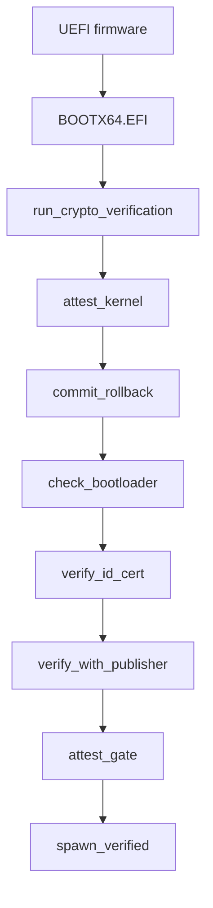

# Boot chain and signatures

Each stage of a NONOS boot is checked: with Secure Boot on, the firmware checks the loader; the loader checks the kernel before it jumps; the kernel checks the loader that started it before any program runs; and the kernel checks every [capsule](../overview/glossary.md#capsule) before it spawns one.

## The chain

The UEFI firmware starts the loader, `BOOTX64.EFI`. With Secure Boot on, the firmware first checks the loader's signature against the keys enrolled in it. The loader's `run_verified_boot` reads the kernel, runs `run_crypto_verification` for the signature and the [rollback index](../overview/glossary.md#rollback-index), then `attest_kernel` for the kernel's STARK trailer, parses the ELF, runs `commit_rollback` to raise the TPM floor, and only then prepares the [handoff](../overview/glossary.md#handoff) (`nonos-bootloader/src/entry/pipeline.rs:30-50`).

Early in `microkernel_main`, right after the installer check and before any userspace, the kernel runs `check_bootloader`, its own check of the loader that started it; no userspace starts when that check fails (`src/kernel_core/init/entry/microkernel_main.rs:22-27`). Every capsule then passes `preflight::run`, which calls `verify_id_cert`, `verify_with_publisher` and `attest_gate` in that order (`src/kernel_core/process_spawn/capsule_spawn/runner/preflight.rs:36-80`). `spawn_verified` asks `profile_gate::check` whether the boot mode lets the capsule start at all, and creates the process only after all three checks pass (`src/kernel_core/process_spawn/capsule_spawn/runner/verified.rs:27-63`).

## Algorithms

Key files, certificates, manifests and the trust-anchor policy name the algorithm of each key and signature in one byte, `AlgId`: `0x01` Ed25519, `0x02` ML-DSA-44, `0x03` ML-DSA-65, `0x04` ML-DSA-87 (`nonos-sign/src/algs/alg_id.rs:19-26`). The kernel decodes the same four values, but its `verify` checks only Ed25519 and ML-DSA-65 and returns `Unsupported` for the other two (`src/crypto/asymmetric/alg_id/verify.rs:23-42`). The signer refuses them earlier: `parse_alg` knows only `ed25519` and `mldsa65` (`nonos-sign/src/algs/alg_id.rs:80-86`). A signed kernel image carries no such byte: its signature blob has the fixed layout shown below.

| Algorithm | Public key | Signature |
|---|---|---|
| Ed25519 | 32 bytes | 64 bytes |
| ML-DSA-65 | 1952 bytes | 3309 bytes |

The sizes are `ED25519_PUBKEY_BYTES` and its neighbours (`src/crypto/asymmetric/alg_id/lengths.rs:19-26`). ML-DSA-65 is one of the three parameter sets of [FIPS 204](https://csrc.nist.gov/pubs/fips/204/final). The kernel builds it from PQClean's portable `clean` code under `third_party/pqclean`, and `compile_pqclean_mldsa` picks ML-DSA-65 unless the `mldsa5` or `mldsa2` feature asks for another set (`build.rs:246-260`). For ML-DSA-65 the signer's secret-key file holds the whole 4032-byte secret key, because that code has no seeded key generation, as `seed_len` notes (`nonos-sign/src/algs/alg_id.rs:56-67`).

`capsule-sign keygen` writes key files that start with a magic: `NONOSSK1` for a secret key, `NONOSPK1` for a public key (`nonos-sign/src/keys/format.rs:17-18`). Certificates and manifests need one valid signature of each algorithm: `NONOS_PRODUCTION_POLICY` lists both as required (`src/security/nonos_id_cert/policy.rs:30-32`).

## The kernel image

`sign-kernel` signs a 36-byte message: the BLAKE3 hash of the kernel ELF, then the rollback index as a little-endian `u32`, built by `signed_message` (`nonos-bootloader/tools/sign-kernel/src/message.rs:17-22`). `sign_ed25519` and `sign_mldsa65` both sign that one message (`nonos-bootloader/tools/sign-kernel/src/main.rs:39-44`). `release_signature_blob` packs the two signatures with a key id for each (`nonos-bootloader/tools/sign-kernel/src/release_signature_blob.rs:21-34`):

| Offset | Size | Field |
|---|---|---|
| 0 | 8 | magic `NKRSIG2\0` |
| 8 | 32 | Ed25519 key id |
| 40 | 64 | Ed25519 signature |
| 104 | 32 | ML-DSA-65 key id |
| 136 | 3309 | ML-DSA-65 signature |

A key id is BLAKE3 in derive-key mode over the public key, under the context `NONOS:KEYID:ED25519:v1` in `ed25519_key_id` (`nonos-bootloader/tools/sign-kernel/src/key_id_ed25519.rs:17-21`) and `NONOS:KEYID:MLDSA65:v1` in `mldsa65_key_id` (`nonos-bootloader/tools/sign-kernel/src/key_id_mldsa65.rs:17-21`).

`write_signed_kernel` writes the ELF, the signature blob, then a 64-byte footer (`nonos-bootloader/tools/sign-kernel/src/write_signed_kernel.rs:25-46`). `embed-trailer` then puts the kernel's [attestation trailer](../overview/glossary.md#attestation-trailer) between the blob and the footer and writes the footer again, in `assemble_attested_image` (`nonos-bootloader/tools/embed-trailer/src/embed/assemble.rs:27-50`). It refuses a trailer that does not start with `MAGIC_V4`, unless it was asked for a path-only development image (`nonos-bootloader/tools/embed-trailer/src/run.rs:28-36`). The footer, little-endian:

| Offset | Size | Field |
|---|---|---|
| 0 | 8 | magic `NONOSIMG` |
| 8 | 2 | footer version, 1 |
| 10 | 2 | flags, 1 when a trailer is present |
| 12 | 1 | hash algorithm, 1 for BLAKE3 |
| 13 | 1 | signature algorithm, 2 for Ed25519 with ML-DSA-65 |
| 16 | 8 | total image size |
| 24 | 4 and 4 | kernel offset 0, kernel size |
| 32 | 4 and 4 | signature offset, signature size |
| 40 | 4 and 4 | trailer offset, trailer size |
| 48 | 4 | image version, always 1 |
| 56 | 4 | rollback index |

`create_image_footer` writes these fields, with `FLAG_HAS_ZK_PROOF` as the flag (`nonos-bootloader/tools/embed-trailer/src/footer/create.rs:19-46`). The make rules build `kernel_signed.bin` with `sign-kernel` at `NONOS_ROLLBACK_INDEX`, then `kernel_attested.bin` with `embed-trailer` (`mk/20-build.mk:1248-1266`). The [seal](../overview/glossary.md#seal) runs the same two tools in `sign_kernel` with the release keys (`tools/nonos_seal/chain.py:65-74`). The image goes onto the ESP as `EFI/nonos/kernel.bin`, beside `EFI/Boot/BOOTX64.EFI`, `EFI/nonos/bootloader.trailer` and `EFI/nonos/boot_root.approval` (`ESP_DIR`, `mk/20-build.mk:1297-1303`).

## Keys and where their public halves live

| Key | Algorithms | Signs | Public half | Checked by |
|---|---|---|---|---|
| Kernel signing | Ed25519 and ML-DSA-65 | the kernel image | compiled into the loader | the loader |
| [Trust anchor](../overview/glossary.md#trust-anchor) | Ed25519 and ML-DSA-65 | every [NONOS ID certificate](../overview/glossary.md#nonos-id-certificate) | sealed into the trust-anchor policy, compiled into the kernel | the kernel, at spawn |
| Publisher, one per capsule | Ed25519 and ML-DSA-65 | that capsule's manifest | inside the capsule's certificate | the kernel, at spawn |
| Device policy | ECDSA P-256 | the [boot-root record](../overview/glossary.md#boot-root-record) and the kernel approval | compiled into the kernel | the kernel and the TPM |
| Secure Boot db | as enrolled in the firmware | `BOOTX64.EFI` | enrolled in the firmware | the firmware |

The loader takes the two kernel signing keys at build time. `resolve_public_key` reads the Ed25519 key from the 32-byte file `NONOS_TRUST_ANCHOR_PUBKEY` names, or derives it from the seed at `NONOS_SIGNING_KEY` (`nonos-bootloader/build.rs:135-158`). `resolve_mldsa65_public_key` reads `NONOS_MLDSA65_PUBKEY`, a 1963-byte `NONOSPK1` file whose algorithm byte must be `0x03` and whose key is 1952 bytes (`nonos-bootloader/build.rs:160-184`). The loader keeps them as `NONOS_PUBLIC_KEY` and `NONOS_MLDSA65_PUBLIC_KEY`, with the Ed25519 key id in `NONOS_KEY_ID` (`nonos-bootloader/build.rs:84-125`). `compute_key_id` uses the same `NONOS:KEYID:ED25519:v1` context as the signer (`nonos-bootloader/build.rs:284-288`).

A loader built with the `production`, `hardened-production` or `hardened` feature counts as production in `production_mode` (`nonos-bootloader/build.rs:49-51`). Such a build stops without `NONOS_MLDSA65_PUBKEY` and never generates a signing key. Any other build that is given neither `NONOS_TRUST_ANCHOR_PUBKEY` nor `NONOS_SIGNING_KEY` and finds no `keys/signing_key_v1.bin` writes a fresh seed there, as `resolve_signing_key_path` shows (`nonos-bootloader/build.rs:186-216`).

The flake builds the loader from public files only: `kernel_signing_ed25519.pub` and `kernel_mldsa65.pub` under `nonos-data/trust/keys/`, and the kernel root, and it stops if one is missing (`kernelKeys`, `tools/nix/image.nix:130-159`). The seal writes those two files in `kernel_public_halves`, deriving the Ed25519 half from the kernel signing seed (`tools/nonos_seal/keys.py:72-86`).

The trust anchor's public keys are `nonos_trust_anchor_ed25519.pub` and `nonos_trust_anchor_mldsa65.pub` in the same directory (`NONOS_TA_ED25519_PUB`, `mk/20-build.mk:209-213`). `capsule-sign mk-trust-policy` seals them into the trust-anchor policy at `NONOS_TRUST_ANCHOR_EPOCH` 1, valid from 2026-01-01 to 2030-01-01 (`mk/20-build.mk:215-220`, `mk/20-build.mk:444-452`). The kernel compiles that policy in as `BAKED_TRUST_ANCHOR_POLICY`, and a missing file breaks the build (`src/security/nonos_trust_anchor/baked.rs:17-23`). Each capsule's publisher keys are `<capsule>_publisher_ed25519.pub` and `<capsule>_publisher_mldsa65.pub` in the same directory (`_NONOS_CAPSULE_KEY_PUB_PREFIX`, `nonos-mk/capsule.mk:85`, `nonos-mk/capsule.mk:108-110`).

The kernel's build script stages the device policy key's 64-byte public half, x then y, from `device_policy_p256.pub` under `nonos-data/trust/policy/`. With no file it writes 64 zero bytes, and the kernel then treats the key as absent; a file of any other length stops the build, in `stage_device_policy_key` (`build.rs:66-80`). Its uses are on [Measured boot and the TPM](measured-boot-and-tpm.md) and [Device secrets and keys](device-secrets-and-keys.md).

## What the loader does with its verdict

The loader's verdict on a kernel arrives as three flags: a signature is present, the signature is valid, the kernel is attested. The code that computes them is the loader's verification module, which these pages do not describe. `verify_signature` acts on the flags in that order (`nonos-bootloader/src/boot/crypto/signature/verify.rs:25-40`):

- No signature: `handle_no_signature` stops the boot in every mode that `requires_signature`, and only warns in Development (`nonos-bootloader/src/boot/crypto/signature/error.rs:27-42`).
- An invalid signature: `handle_invalid_signature` follows the same rule (`nonos-bootloader/src/boot/crypto/signature/error.rs:44-59`).
- A signed kernel whose trailer does not verify: `handle_failed_attestation` stops the boot in every mode, Development included (`nonos-bootloader/src/boot/crypto/signature/error.rs:61-74`).

`attest_kernel` reads the attested flag again and calls `fatal_reset` for any kernel that is not enrolled, again in every mode, so Development still needs an enrolled kernel, signed or not, as the mode's own description says: `Unsigned kernel allowed; the kernel's STARK is still required` (`nonos-bootloader/src/boot/attestation/kernel_gate.rs:34-60`, `description`, `nonos-bootloader/src/menu/types/mode.rs:41-43`). `fatal_reset` prints `[FATAL]` and the reason, then `System will restart...`, then asks the firmware for a warm reset with `LOAD_ERROR` (`nonos-bootloader/src/boot/util/reset.rs:21-33`).

`requires_signature` is false only for Development (`nonos-bootloader/src/menu/types/mode.rs:53-55`). Development is not in the boot menu, whose `ENTRIES` start at Standard (`nonos-bootloader/src/bootmenu/entries.rs:28-38`). It is reached only by holding F12 on a loader built with the `dev-mode` feature, and `dev_override` refuses it while Secure Boot is on (`nonos-bootloader/src/entry/dev.rs:22-42`). The `dev-qemu` feature turns on `dev-mode` together with `dev-attest`; `standard`, `hardened`, `production` and `hardened-production` do not include it (`nonos-bootloader/Cargo.toml:66-75`). Standard, Safe Mode, Air-Gapped, Recovery and the install entry list what is checked before the kernel runs as `STD`, `ED25519 · ML-DSA-65 · STARK · ROLLBACK · RNG`, and Hardened lists `STANDARD + SECURE BOOT · PK · DB · TPM 2.0` (`nonos-bootloader/src/bootmenu/entries.rs:33-59`). The [boot modes](../install/boot-modes.md) page covers the menu itself.

## Secure Boot

The make rules leave the loader unsigned for Secure Boot. The seal's `secure_boot` signs `BOOTX64.EFI` with the db key through `sbsign` and checks it with `sbverify`, or uses `osslsigncode` on macOS (`tools/nonos_seal/chain.py:97-118`). Without the db key the loader stays unsigned, and a `--release` seal of a `production` loader stops, as `secure_boot` is called with that requirement (`tools/nonos_seal/__main__.py:150`).

The signature lands in the PE certificate table, which the Authenticode digest leaves out, so signing does not change the loader's enrolled measurement. At enrollment, `authenticode_of` refuses a loader whose digest would change when a signer pads it to eight bytes (`nonos-stark-enroll/src/measure.rs:25-46`).

With Secure Boot on, the loader also checks its own Secure Boot chain, and `verify_chain` stops the boot on a failure unless the loader was built with the development policy (`nonos-bootloader/src/boot/security/policy.rs:48-56`). The Hardened entry says it refuses to boot without Secure Boot and a TPM, next to `Hardened` in the menu (`nonos-bootloader/src/bootmenu/entries.rs:40-45`). The TPM half is the rollback floor on [Rollback protection](rollback-protection.md). The code that enforces the Secure Boot half is in the loader's verification module and is not covered here.

## The kernel checks its loader

The firmware measures every UEFI application it starts into [PCR](../overview/glossary.md#pcr) 4 and logs it, as the header of `nonos-boot-measure/src/lib.rs` describes. The kernel replays that log, takes the loader's measurement from it, and holds it to the boot-root record, which the release signs with the device policy key. `signed` checks that ECDSA P-256 signature against the key compiled into the kernel, and an all-zero key verifies nothing (`src/security/boot/loader_check/key.rs:24-38`). The steps and verdicts are on [Measured boot and the TPM](measured-boot-and-tpm.md), and the loader's STARK slot is on [STARK attestation](stark-attestation.md).

## Capsules

A capsule ships three files beside its ELF: a NONOS ID certificate signed by the trust anchor, a [capsule manifest](../overview/glossary.md#capsule-manifest) signed by its publisher, and its attestation trailer, each named after `CAPSULE_BIN_NAME` (`nonos-mk/capsule.mk:101-103`).

The certificate's `verify` refuses a certificate whose trust-anchor epoch is below the policy's (`EpochStale`), whose serial or NONOS id is revoked, or which is outside its validity window when the caller passes a time (`src/security/nonos_id_cert/verify/checks.rs:22-45`). For each required algorithm the certificate must then carry a trust-anchor signature, or the result is `TrustAnchorPolicy`, and that signature must verify under a policy key of the same algorithm, or the result is `TrustAnchorBadSig`; a policy key outside its own validity window is skipped when the caller passes a time (`src/security/nonos_id_cert/verify/dispatch.rs:23-45`).

`verify_with_publisher` checks the manifest in this order (`src/security/capsule_manifest/verify/mod.rs:37-63`):

| Check | Refusal |
|---|---|
| BLAKE3 of the certificate file equals the manifest's certificate id | `NonosIdCertIdMismatch` |
| the namespace matches one of the certificate's globs | `NamespaceOutsideCert` |
| required and optional capabilities sit inside the certificate's ceiling | `CapsExceedCeiling` |
| one valid publisher signature per required algorithm, from a key in the certificate, not revoked | `PublisherBadSig`, `PublisherKeyRevoked`, `PublisherPolicy` |
| BLAKE3 of the ELF equals the manifest's payload hash | `PayloadHashMismatch` |
| the target triple matches the spawn site's | `TargetTripleMismatch` |
| every endpoint the spawn site registers is declared | `EndpointDeclDrift` |
| the grant sits inside required and optional | `GrantOutsideManifest` |

The STARK check that follows is on [STARK attestation](stark-attestation.md). The wire formats of the certificate and the manifest are on [Signing and publisher keys](../userland/signing-and-publisher-keys.md).

At build time `capsule-sign sign-id-cert` signs each certificate with the two trust-anchor seeds (`NONOS_TA_ED25519_SEED`, `nonos-mk/capsule.mk:252-271`). `capsule-sign sign-manifest` then signs the manifest with the publisher's two seeds, and `verify-manifest` checks it at once (`CAPSULE_SIGN_BIN`, `nonos-mk/capsule.mk:275-297`). With `NONOS_TRUST_REUSE` set to 1 nothing is signed: the committed certificate and manifest must exist, and `verify-manifest` checks them and the freshly built ELF against the enrolled payload hash, unless `NONOS_ENROLL_BUILD` is also 1, which only requires that they exist (`nonos-mk/capsule.mk:220-248`).

## What a refusal looks like

| Where | What failed | What you see |
|---|---|---|
| Loader | no signature, in any mode but Development | `Kernel not signed` on screen, then `[FATAL] kernel not signed` and a warm reset |
| Loader | invalid signature | `Signature invalid`, then `[FATAL] kernel signature invalid` |
| Loader | a signed kernel whose trailer does not verify, in any mode | `Kernel self-attestation invalid`, then `[FATAL] kernel self-attestation invalid` |
| Loader | rollback index below the TPM floor | `Rollback: tpm floor N above image index M`, then `[FATAL] rollback index below TPM floor` |
| Loader | Hardened or Air-Gapped, and no floor could be read | `Hardened needs a TPM: its rollback floor keeps an older signed kernel from booting` (or `Air-Gapped`), then `[FATAL] profile requires a TPM rollback floor` |
| Kernel | the loader failed the kernel's check | the notice `The bootloader failed the kernel's check`; no program starts |
| Kernel | no boot-root record or no loader trailer | the notice `The bootloader could not be checked`; no program starts |
| Loader | in Development, a kernel that is not enrolled | `kernel attestation required`, then `[FATAL] kernel self-attestation missing` |
| Kernel | a capsule's trailer is refused | `[ZK-ATTEST] FAIL` with the capsule's name and reason on the serial line; that spawn fails |

The loader's messages come from `handle_no_signature` and its neighbours (`nonos-bootloader/src/boot/crypto/signature/error.rs:27-74`) and from `enforce_floor` (`nonos-bootloader/src/boot/crypto/rollback/floor.rs:28-60`). The on-screen lines appear only when the loader has a graphics console; the `[FATAL]` line and the warm reset happen either way. `attest_kernel` gives the Development line (`nonos-bootloader/src/boot/attestation/kernel_gate.rs:34-59`). The kernel's come from `refuse_unchecked_loader` (`src/kernel_core/init/entry/loader_refusal.rs:27-48`) and `attest_gate` (`src/kernel_core/process_spawn/capsule_spawn/runner/attest_gate.rs:23-63`).

## Limits

- The loader's verification module (the signature checks, the key-id comparison, the footer validation, the Secure Boot chain check, and the TPM extend and NV code) is not described in these pages. The order of its checks and its internal refusal reasons are not stated here.
- In the make flow, a loader built with `NONOS_TRUST_ANCHOR_PUBKEY` compiles in the Ed25519 key that file holds, while `sign-kernel` signs with `SIGNING_KEY`; a kernel signature can only verify under the compiled-in key when the two are one key pair (`mk/20-build.mk:129-144`). The flake sets that variable to the kernel signing key's own public half (`NONOS_TRUST_ANCHOR_PUBKEY`, `tools/nix/image.nix:155-157`).
- `mk-trust-policy` always writes empty revocation lists and zero flags, though the kernel reads all three lists, as `TrustAnchorPolicyInput` shows (`nonos-sign/src/cli/trust_policy/run.rs:47-54`).
- Capsules spawned from the kernel image at boot pass no time, so certificate validity windows are not checked for them, as in `spawn_verified` for the VFS capsule (`src/fs/vfs_capsule/spawn.rs:57`). A capsule loaded from the store passes the wall clock once it is set, through `validity_now_ms` (`src/kernel_core/process_spawn/capsule_spawn/from_vfs/load/spawn.rs:70-78`).
- `verify_kernel_self_attestation` in the kernel has no caller; it is kept as a copy of the loader's check (`src/security/kernel_attest.rs:23-38`).

## See also

- [Rollback protection](rollback-protection.md)
- [STARK attestation](stark-attestation.md)
- [Measured boot and the TPM](measured-boot-and-tpm.md)
- [Device secrets and keys](device-secrets-and-keys.md)
- [Capsule isolation](capsule-isolation.md)
- [Signing and publisher keys](../userland/signing-and-publisher-keys.md)
- [Processes and capsule spawn](../kernel/processes-and-spawn.md)
- [Boot modes](../install/boot-modes.md)
- [The seal](../build/seal.md)
