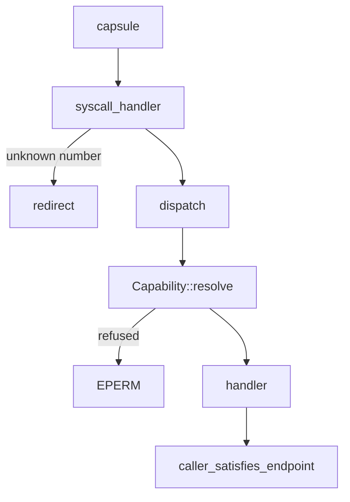

# Capsule isolation

How the NONOS kernel keeps one capsule from reaching another: separate address spaces, a capability check on every system call, rules on who may send to whom, confined drivers and a sandbox for Linux programs.

## Address spaces

Every process gets its own page tables. `create_address_space` allocates a fresh top-level table under a new address space ID and copies in only the kernel half; the user half starts empty (`src/memory/paging/manager/address_space/create.rs:37-48`). A [capsule](../overview/glossary.md#capsule) therefore has no mapping of another capsule's memory. Pages are shared where the kernel maps them on purpose, for example a display surface (`MkSurfaceShare`) or a DMA buffer (`MkDmaMap`).

When a capsule hands the kernel a pointer, the kernel checks it before copying. `check_range` refuses a null pointer, a length over `MAX_COPY_SIZE` (64 MiB) and any range that ends above `USER_SPACE_END`, `0x0000_7FFF_FFFF_FFFF` (`src/usercopy/policy.rs:35-50`). Each page in the range is then walked: `translate_read` requires a mapped page with the user bit set, and `translate_write` also requires it to be writable (`src/usercopy/walk/access.rs:29-46`).

On x86_64 the kernel turns on SMEP, SMAP and UMIP when CPUID reports them, and records what CR4 reads back rather than what it asked for, since a hypervisor may drop the write (`enable` in `src/memory/mmu/mmu/protect/cr4.rs:32-51`). SMEP stops ring 0 from executing user pages, and SMAP stops it from touching user memory by accident.

## The capability check on every system call

A capsule's authority is a [capability word](../overview/glossary.md#capability-word): a 64-bit mask in which 36 bits are defined, one per entry of the `capability_table!` list that defines `Capability` (`src/capabilities/types/defs.rs:19-83`). A compile-time check over `Capability::all` refuses a build in which two capabilities share a bit or one takes more than one (`src/capabilities/types/guard.rs:22-33`). The published list is [abi/caps.toml](../../abi/caps.toml), and [ABI capabilities](../abi/capabilities.md) explains each bit.

The kernel keeps the word inside a [capability token](../overview/glossary.md#capability-token), and the token is what the check reads. `new_token` binds the bits to the pid, the address space ID, this boot's session nonce and the process's revocation epoch, then signs the result (`src/process/caps.rs:38-59`). The signature, `mac64`, is two keyed BLAKE3 hashes over a 128-byte encoding of those fields (`src/capabilities/token/material.rs:41-52`). Its key is 32 random bytes drawn at boot by `init_token_signing_key`, which halts the machine if the random source is not ready (`src/kernel_core/init/platform/token_signing_key.rs:19-31`). The key lives only in RAM and changes every boot.

Every system call enters through one function. On x86_64, `syscall_handler` turns a known number into a `SyscallNumber` and calls `dispatch` (`src/arch/x86_64/syscall/manager/entry.rs:38-60`). The aarch64 and riscv64 entries call the same `dispatch` (`src/syscall/contract/mod.rs:17-24`).

`dispatch` asks `Capability::resolve` for a witness and returns `EPERM` without running the handler when it gets none (`src/syscall/contract/dispatch.rs:31-40`). The witness wraps a private token, and `Capability::resolve` is its only constructor (`src/syscall/contract/capability.rs:26-35`). `resolve` runs five checks in order (`src/syscall/contract/resolver/resolve.rs:31-43`):

1. `check_token`: the MAC verifies in constant time, the token has not expired, and its pid and nonce are not on the revocation list.
2. `check_session_binding`: the token was minted in this boot.
3. `check_asid_binding`: the token belongs to the address space that is running.
4. `check_revocation_epoch`: the token is not older than the process's last revocation.
5. `check_syscall_allowed`: the cap table admits this call for these bits.

The cap table, `is_allowed`, answers false for any number no table names (`src/syscall/contract/cap_table/mod.rs:28-34`). Most calls need a specific bit. A few need only a token that `caps.is_valid` accepts, such as `MkExit`, `MkYield` and the clock reads (`src/syscall/contract/cap_table/mk.rs:22-35`). `is_valid` is false for a token with no bits at all (`src/capabilities/token/types/query.rs:44-47`).

A refusal is logged by `log_deny` as `[CAP-DENY] pid=<pid> syscall=<name>(<number>)` (`src/syscall/contract/dispatch.rs:43-46`). That line goes through the kernel's log manager, whose `log` writes to the text-mode console and a RAM buffer, not to the serial console (`src/log/manager/state.rs:58-82`). The Terminal's `log` command reads only the serial console's kept copy, so it does not show refusals.

Revoking a bit through `revoke` mints a new token and raises the epoch, so the older token fails at the next call (`src/process/caps.rs:99-108`). A process receives its manifest's bits once: `install_spawn` refuses a second install (`src/process/caps.rs:110-122`). After that it gains bits only from an `Admin` holder: `sys_cap_grant` refuses a caller without `Admin` and any bit the caller does not hold itself, while `sys_cap_revoke` needs `Admin` alone (`src/syscall/microkernel/capability/handlers.rs:33-66`).

Two limits apply to the check itself:

- The token is bound to a pid, an address space and a boot, not to a code measurement. `new_token` writes 32 zero bytes into `subject_measurement` (`src/process/caps.rs:52`).
- `Admin` stands in for every broker bit: `can_driver`, `can_mmio`, `can_irq`, `can_dma` and `can_pio` each accept it (`src/capabilities/token/types/authority_broker.rs:24-54`). A capsule holding `Admin` has the whole device surface. `Admin` does not imply the right to enrol a signing root (`can_enrol_dev_root` in `src/capabilities/token/types/authority_admin.rs:43-52`).

## IPC: who may send to whom

The kernel copies every message; capsules share no queue memory. A message is at most `MAX_MESSAGE_SIZE`, 1 MiB (`src/ipc/nonos_channel/limits.rs:26`), and the size is checked against `MAX_MESSAGE_SIZE` before anything is allocated (`src/syscall/microkernel/ipc/send.rs:45-47`).

The `IPC` bit admits the IPC calls through `can_ipc` (`src/syscall/contract/cap_table/mk.rs:109-116`). It does not admit any particular destination. Each [endpoint](../overview/glossary.md#endpoint) states the bits a sender must hold, and `caller_satisfies_endpoint` refuses a send unless the sender holds all of them (`src/syscall/microkernel/ipc/send_caps.rs:36-63`). It also refuses a name that is not registered yet, so a capsule cannot win a race for a service that has not started, and an endpoint whose requirement is zero, which was never finished being set up. A refusal logs `[CAP-DENY] pid=<pid> ipc to <name> needs caps <mask>, holds <mask>`.

Some endpoints are held to named callers whatever bits a sender holds. `HELD` lists the driver endpoints and the services that may reach each one (`src/services/registry/held_table.rs:20-36`). A caller counts as one of the named when the kernel registered that endpoint to it at spawn.

| Endpoint | Who may send |
|---|---|
| `driver.virtio_net0`, `driver.e1000_0`, `driver.rtl8169_0`, `driver.rtl8139_0` | `net.core`, `net.l2` |
| `driver.iwlwifi0`, `driver.rtl8821ce0` | `net.core`, Settings in any of its three windows, the setup wizard |
| `driver.xhci0` | `driver.usb_hid0`, `driver.usb_msc0` |
| `driver.i2c_pci0` | `driver.i2c_hid0` |
| `driver.virtio_gpu0` | `compositor` |
| `driver.hda0` | `audio.server` |
| `driver.ps2_kbd0`, `driver.usb_hid0`, `driver.i2c_hid0`, `driver.usb_msc0`, `driver.virtio_rng` | no capsule; only the kernel's own sends reach them |

A peer list goes further. A capsule named in `PEERS` may send only to the endpoints listed for it, whatever its bits; the list has one entry, `shield_prover`, which may reach only `shield.core` (`src/services/registry/peers.rs:27-31`).

A send straight to a process's inbox by pid (`MkIpcSendToPid`) must pass the gate of every endpoint that process serves, because they are all read from that one inbox (`inbox_admits` in `src/services/registry/held.rs:62-70`).

The kernel names the sender. `IpcMessage::new` is given `proc.<pid>` of the calling process (`src/syscall/microkernel/ipc/send_to_pid.rs:68-70`), so a service can trust the sender's pid rather than a pid written in the payload. The keyring relies on this; see [Device secrets and keys](device-secrets-and-keys.md).

Keystrokes have their own rule. Driver capsules hold `Irq`, and `can_input_source` accepts `Irq` so drivers can post events, but draining the input ring, or blocking until it has events, needs `can_input_consumer`, which accepts only `InputSource` or `Admin` (`src/syscall/contract/cap_table/mk.rs:190-200`). A driver capsule cannot read what is typed into another program.
