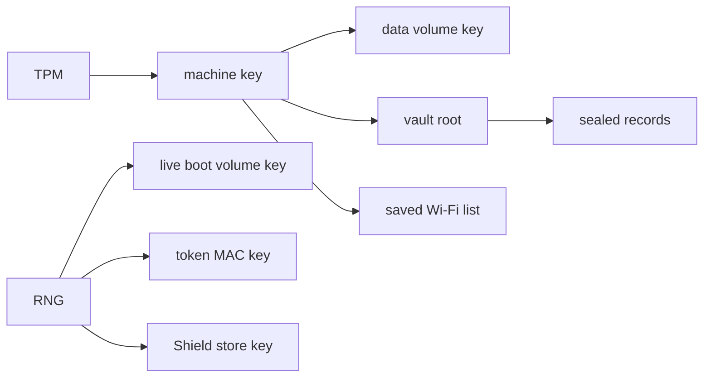

# Device secrets and keys

Where NONOS keeps secrets, what protects each one, what is lost at power off, and what an orderly shutdown wipes.

## The short version

- The keys that protect data across boots are derived from the TPM on demand and never stored. The same machine in the same boot state gets the same key; any other machine or boot state gets a different one.
- Key records in the keyring live in RAM and are gone at reboot. The wallet's sealed records are the exception, and they open only on this machine.
- On an installed disk, the [data volume](../overview/glossary.md#data-volume) is encrypted per sector. On a live boot it lives in RAM under a key made for that boot.
- The capsule store on the NONOS disk is not encrypted. A file persisted there is readable by anyone who holds the disk, unless the capsule that wrote it sealed it first.
- An orderly shutdown or reboot wipes memory. A panic, a forced power-off or a power cut does not.

The TPM produces the [machine key](../overview/glossary.md#machine-key), from which the data volume key, the vault root and the key for the saved Wi-Fi list come. The vault root in turn keys the keyring's sealed records. The RNG produces the keys that live for one boot only: the live boot volume key, the token MAC key and the Shield store key.
