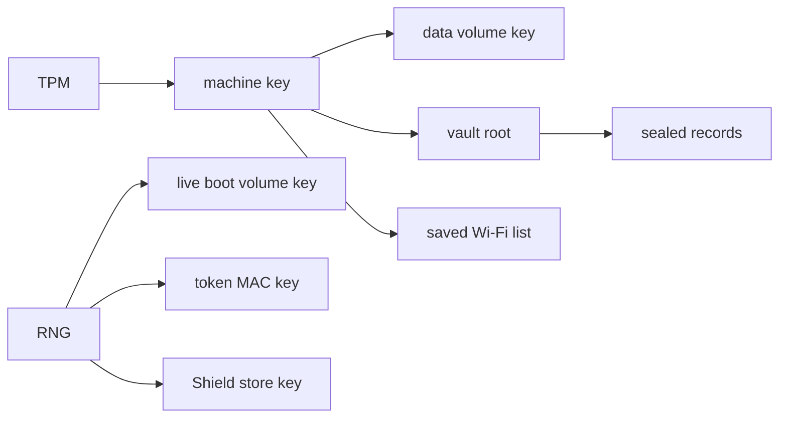

# Device secrets and keys

Where NONOS keeps secrets, what protects each one, what is lost at power off, and what an orderly shutdown wipes.

## The short version

- The keys that protect data across boots are derived from the TPM on demand and never stored. The same machine in the same boot state gets the same key; any other machine or boot state gets a different one.
- Key records in the keyring live in RAM and are gone at reboot. The wallet's sealed records are the exception, and they open only on this machine.
- On an installed disk, the [data volume](../overview/glossary.md#data-volume) is encrypted per sector. On a live boot it lives in RAM under a key made for that boot.
- The capsule store on the NONOS disk is not encrypted. A file persisted there is readable by anyone who holds the disk, unless the capsule that wrote it sealed it first.
- An orderly shutdown or reboot wipes memory. A panic, a forced power-off or a power cut does not.

The TPM produces the [machine key](../overview/glossary.md#machine-key), from which the data volume key, the vault root and the key for the saved Wi-Fi list come. The vault root in turn keys the keyring's sealed records. The RNG produces the keys that live for one boot only: the live boot volume key, the token MAC key and the Shield store key.

## The machine key

`derive` asks the TPM for a key in this order: start a policy session, fold the current PCRs into it, read the policy digest, create a primary key whose template carries that digest, run an HMAC over the caller's label, then flush the key and the session (`src/security/tpm/machine_key/derive.rs:43-63`). The result is 32 bytes. Nothing is written to disk to make it repeatable.

- The policy covers `BOUND_PCRS`, PCR 0, 4, 7 and 9: firmware code, the boot manager the firmware measured, the Secure Boot policy and the kernel hash the bootloader extends (`src/security/tpm/machine_key/pcrs.rs:21-24`). PCR 1 and 3 are left out on purpose, so a changed boot order does not lose the key.
- The primary key lives under the storage hierarchy, `TPM_RH_OWNER`, whose seed changes when the TPM is cleared (`src/security/tpm/machine_key/consts.rs:30-35`). Clearing the TPM therefore destroys every machine key and everything sealed under one.
- `OBJECT_ATTRIBUTES` leaves out `userWithAuth`, so only the PCR policy authorises the key, not an empty password (`src/security/tpm/machine_key/consts.rs:44-47`).
- A label is 1 to `LABEL_MAX` bytes, 64 (`src/security/tpm/machine_key/consts.rs:54-55`).

A capsule asks for a machine key with the `CryptoMachineKey` call, which `handle_machine_key` serves to any holder of the `Crypto` bit (`src/syscall/dispatch/crypto/machine_key.rs:39-49`). Labels that start with a zero byte belong to the kernel: `derive_for_kernel` adds that byte, and `is_user_label` refuses it from a capsule (`src/security/tpm/machine_key/kernel_label.rs:32-45`). Errors come back as `errno_for` maps them: 19 with no TPM, 13 when the TPM answers with a policy failure, 110 on a timeout, 22 for an empty or oversized label, and 5 for any other TPM error (`src/syscall/dispatch/crypto/machine_key.rs:68-79`). A kernel label is refused with 22 as well.

The kernel does not tie a label to a capsule. Any capsule holding `Crypto` that names a label gets the same key, as the Wi-Fi client's own comment on its `LABEL` says (`userland/nonos_wifi_client/src/saved/key.rs:15-18`). Many capsules hold `Crypto`, so a machine key protects data from someone holding the disk, not from another capsule on the same machine that holds `Crypto`.

| Label | Asked by | Used for |
|---|---|---|
| `blockfs.data.v1`, kernel only | the kernel, as `KEY_LABEL` (`src/fs/blockfs_volume/open_machine.rs:37-38`) | the data volume key |
| `nonos.vault.root.v1` | the keyring, as `ROOT_LABEL` (`userland/nonos_vault/src/subkey.rs:32-36`) | the vault root for sealed records |
| `wifi/saved-networks` | the Wi-Fi client, as `LABEL` (`userland/nonos_wifi_client/src/saved/key.rs:15-18`) | the saved network list at `/nonos/wifi/saved` |
| `install.tpm-probe` | the installer, as `PROBE_LABEL` (`userland/capsule_install/src/install/source/tpm.rs:25`) | checking that a TPM answers; the key is wiped unread |
| `settings/security-probe` | Settings, as `LABEL` (`userland/capsule_settings/src/settings/state/machine_key_probe.rs:28-29`) | the status row on the Security page; the key is wiped unread |

Settings shows what the TPM answered on its Security page, for example `From the TPM, bound to this boot` or `The TPM refused: the boot state changed` (`said` in `userland/capsule_settings/src/settings/state/machine_key.rs:62-71`).

## The device secret

The anonymous device proof uses a second TPM-derived value, the device secret. `sys_device_secret` asks the TPM for it on every call and keeps no copy (`src/syscall/microkernel/device_proof/device_secret.rs:35-67`). `device_secret_caller` hands it only to a capsule that holds `DeviceSecret` and whose authority is the vendor root; a developer root, a third-party publisher or software built on the machine is refused even with the bit (`src/syscall/microkernel/device_proof/gate.rs:28-36`). [STARK attestation](stark-attestation.md) describes the proof.

## The keyring

The keyring capsule, `capsule_keyring`, stores key records for the capsules that use it and signs with the wallet's keys. Its manifest asks for `IPC`, `Memory` and `Crypto` only, `CAPSULE_REQUIRED_CAPS := 0x38` (`userland/capsule_keyring/Capsule.mk:17`), so it has no file system, network or device access.

- Records live in a `Store` in the capsule's memory and are gone at reboot (`userland/capsule_keyring/src/store/types/store.rs:20-23`).
- The store holds `MAX_KEYS`, 128 records, and at most `MAX_KEYS_PER_OWNER`, 16, for one capsule (`userland/capsule_keyring/src/store/types/constants.rs:17-21`).
- A request names its caller's pid, and `resolve_caller` accepts it only when it equals the pid the kernel stamped on the message; sender 0 is refused (`userland/capsule_keyring/src/server/caller.rs:22-30`).
- `retrieve` returns a record only to the pid that stored it, and never returns a wallet signing key (`userland/capsule_keyring/src/store/retrieve.rs:22-35`).
- `drop_ended` wipes and drops the records of a process that has exited (`userland/capsule_keyring/src/store/ended.rs:32-42`).
- The receive buffer is wiped with `wipe` after each request (`userland/capsule_keyring/src/server/runner.rs:52`).
- The kernel-side keyring client refuses any caller without the `Keyring` bit, through `gate_caller` (`src/security/keyring_capsule/capability.rs:26-35`).

## Sealed records

`nonos_vault` seals a small record so it can be stored anywhere and opened only on the machine that sealed it.

- The caller fetches the vault root, the machine key under `ROOT_LABEL`, `nonos.vault.root.v1`. `subkey` derives one key per record with HKDF-SHA256, using the label as salt and the record name as info (`userland/nonos_vault/src/derive.rs:23-50`). Recovering one record's key does not open another.
- `seal` encrypts with ChaCha20-Poly1305 and refuses an all-zero nonce, which is what a dead entropy source returns (`userland/nonos_vault/src/seal.rs:34-56`).
- The blob starts with `MAGIC`, `NONOSVLT`, and `VERSION` 2 in a 12-byte header that is also the associated data (`userland/nonos_vault/src/blob.rs:23-39`).
- `open_with_key` writes nothing usable when the tag fails: it wipes the output (`userland/nonos_vault/src/open.rs:51-66`).

Three records use it in this release:

| Record | Sealed by | Under |
|---|---|---|
| `keyring.wallet.account` | the keyring, for the wallet's account key, as `RECORD` (`userland/capsule_keyring/src/vault/record.rs:25-27`) | the vault root |
| `keyring.wallet.shield` | the keyring, for the wallet's recovery words, as `RECORD` (`userland/capsule_keyring/src/vault/shield.rs:16-28`) | the vault root |
| `shield.store.file-key` | the Shield capsule, for its store's file key, as `RECORD` (`userland/capsule_shield/src/guard.rs:31-32`) | a key drawn for this boot |

The wallet keeps the two keyring blobs under `/data`, as `VAULT_PATH` and `WORDS_PATH`, so they are persisted to the capsule store (`userland/capsule_wallet_nonos/src/wallet/vault/path.rs:19-29`). Only the wallet, in any of its three windows, may ask the keyring to seal or open either record: `dispatch` puts `OP_VAULT_SEAL`, `OP_VAULT_OPEN`, `OP_SHIELD_SEAL` and `OP_SHIELD_OPEN` behind the vault gate (`userland/capsule_keyring/src/server/dispatch.rs:55-60`), and `may_use_vault` checks the sender against `VAULT_HOLDERS` (`userland/capsule_keyring/src/server/vault_gate/rule.rs:28-37`). That rule is compiled into the `wallet_proofs` host tests as `vault_gate` (`userland/wallet_proofs/src/lib.rs:42-43`); at this commit the crate runs 184 tests and all pass.

The Shield capsule never uses the vault root in this release. `open_with` sets `live` to true on every boot (`userland/capsule_shield/src/ops.rs:131-140`), so its store is kept in memory under `ROOT_LIVE`, `/run/shield` (`userland/capsule_shield/src/ops.rs:43`). `root` then wraps the file key under a key `session` draws once for the boot (`userland/capsule_shield/src/guard.rs:39-55`). The store is gone at reboot, and the recovery words open the account again.

What a sealed record does not do, by design (`userland/nonos_vault/src/lib.rs`): it does not survive a firmware, bootloader or kernel change, because a moved PCR changes the root; and it does not stop rollback, because an older blob opens as well as a newer one. Keep the wallet's recovery phrase written down.
