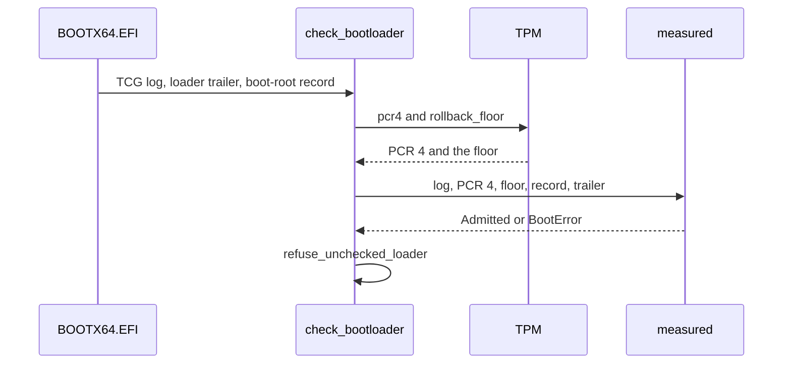

# Measured boot and the TPM

NONOS uses a TPM 2.0 to record which kernel the loader admitted, to check the loader that started the kernel, to derive keys that exist only in one boot state, and to sign quotes; without a TPM every mode but Hardened and Air-Gapped still boots, and the last table on this page says what is lost.

## PCRs

| PCR | Extended by | Used by NONOS for |
|---|---|---|
| 0 | the firmware | the machine key, the device secret, quotes |
| 1, 2 | the firmware | quotes |
| 4 | the firmware, once for each UEFI application it starts | the kernel's check of its loader, the machine key, the device secret |
| 7 | the firmware, for the Secure Boot state | the machine key, the device secret, quotes |
| 9 | the loader, once, for the kernel it admitted | the machine key, the device secret's approval |

The firmware hashes every UEFI application it starts with the PE Authenticode SHA-256, extends [PCR](../overview/glossary.md#pcr) 4 with it and logs an event, as the header of the boot-measure crate says, whose `authenticode` module rebuilds that digest (`nonos-boot-measure/src/lib.rs:17-31`). The kernel reads PCR 4 from the SHA-256 bank with `pcr4` (`src/security/tpm/boot_reads/pcr4.rs:25-52`). The machine key binds `BOUND_PCRS`, PCRs 0, 4, 7 and 9 (`src/security/tpm/machine_key/pcrs.rs:21-24`). The device secret binds `APPROVED_PCRS`, PCR 9, and `MACHINE_PCRS`, PCRs 0, 4 and 7 (`src/security/tpm/device_secret/consts.rs:38-42`). A quote covers `QUOTED_PCRS`, PCRs 0, 1, 2 and 7 (`src/security/attest_doc/produce.rs:29-33`). Nothing in the kernel's TPM code extends a PCR.

## PCR 9: the admitted kernel

`attest_kernel` extends PCR 9 once, in `measure_admitted_kernel`, after the kernel's STARK trailer has passed, and only when the loader found measured boot active (`nonos-bootloader/src/boot/attestation/kernel_gate.rs:43-47`). The data is 64 bytes, the kernel's BLAKE3 hash then the kernel root the loader was built with. The loader hashes it with SHA-256 and the firmware's TCG2 extend hashes it again, so on a PCR 9 that starts at zero, as `measure_admitted_kernel` documents (`nonos-bootloader/src/boot/attestation/kernel_gate.rs:62-85`):

```text
PCR9 = SHA-256(0^32 || SHA-256(SHA-256(kernel_blake3 || kernel_attest_root)))
```

That value is the same on every machine for one release, which is what lets a release sign it. `kernel_pcr9` in the release tool computes the same value (`tools/nonos-policy-approve:73-77`). A failed extend is not fatal: the loader logs `the admitted kernel was not measured into PCR 9`, and as `measure_admitted_kernel` notes, nothing bound to PCR 9 then unseals, which fails closed. How the loader decides that measured boot is active, and the TCG2 calls it makes, are in its verification module and are not described here. Its panel shows `TPM2 MeasuredBoot active` or `TPM2 not available` (`display_subsystem_status`, `nonos-bootloader/src/boot/security/platform.rs:50-60`).

## The kernel's TPM driver

The loader's TPM stack ends with boot services. The kernel has its own, reached through `transact`, because a quote must be taken while the machine runs, against a nonce that did not exist at boot (`src/security/tpm/mod.rs:17-37`). It lives in `src/security/tpm`; the device-level view is on [Platform drivers](../drivers/platform.md).

- The register window is `TPM_MMIO_BASE`, `0xFED40000`, one 4 KiB page for each of localities 0 to 4, mapped once, uncached (`src/security/tpm/mmio/map.rs:25-49`).
- `start_method` reads the ACPI `TPM2` table, where start method 6 is FIFO and 7 and 8 are CRB, and ignores a table whose length is outside 52 to 4096 bytes or whose checksum fails (`src/security/tpm/transport/acpi.rs:22-74`).
- Start method 2 is refused, because its doorbell is an ACPI `_DSM` call and the kernel has no AML interpreter to make it; the code names it as the start method of AMD's firmware TPM (`START_ACPI`, `src/security/tpm/transport/acpi.rs:26-28`). `detect` refuses any start method other than 2, 6, 7 and 8 too (`src/security/tpm/transport/detect.rs:29-47`).
- `identify` reads the interface identity register, `INTERFACE_ID`, at offset `0x30`: type 0 is FIFO, type 1 is CRB, and a TIS 1.3 part that reads all ones counts as FIFO when its access register shows a valid part (`src/security/tpm/transport/ident.rs:28-60`).
- `detect` refuses when ACPI and the part disagree, because the two register files overlap and driving one through the other's offsets would write command bytes into control registers. With no usable ACPI table, `detect` lets the identity register decide alone, and it takes a CRB control area outside the window from the table alone (`src/security/tpm/transport/detect.rs:17-79`).
- `transact` runs detection on first use, keeps the answer for the rest of the boot, and holds a lock so one command is in flight at a time (`src/security/tpm/transport/dispatch.rs:26-49`).
- `transact_resending` sends a command again while the TPM answers `TPM_RC_RETRY`, at most three tries; on a TPM built from the reference code, the first authorization of the attestation key after each startup costs one retry (`src/security/tpm/resend.rs:17-56`).
- A missing part, a timeout and an unreadable answer are the three `TpmError` values (`src/security/tpm/error.rs:17-37`).

The serial console gets one line when the part is found, from `announce`, for example `[TPM] interface CRB at 0xFED40000, locality 0 (id ..., ACPI agrees)` (`src/security/tpm/transport/detect.rs:81-92`). The command builders and parsers are tested against byte vectors from the TPM 2.0 specification, the machine-key sequence against swtpm, and the FIFO protocol against a modelled register file, by `tpm_key_proofs` (`userland/tpm_key_proofs/Cargo.toml:4-9`). That crate passed 42 tests in this release's flake checks. The CRB and FIFO transports on a hardware TPM were not tested for this release.

## The kernel checks its loader



Before boot services end, `BOOTX64.EFI` gathers the firmware's TCG event log, its own v4 trailer from `\EFI\nonos\bootloader.trailer` and the [boot-root record](../overview/glossary.md#boot-root-record) from `\EFI\nonos\boot_root.approval`, and hands each to the kernel as a module, a zero region when absent (`boot_evidence`, `nonos-bootloader/src/entry/boot_evidence.rs:17-45`). The kernel reads them, and the loader's own image, with a 4 MiB bound for the first three and 64 MiB for the image (`MAX_MODULE`, `src/security/boot/loader_check/evidence.rs:25-46`). The replay itself refuses a log over 1 MiB or over 4096 events (`MAX_LOG_BYTES`, `nonos-boot-measure/src/tcg/consts.rs:29-34`).

`check_bootloader` decides once and keeps the verdict for the rest of the boot (`src/security/boot/loader_check/run.rs:27-55`):

- No record or no trailer: `NoEvidence`.
- A log, and a TPM that answers both `pcr4` and `rollback_floor`: the measured path, whatever it finds.
- Otherwise, with the loader's image: the self-reported path. Without it: `NoEvidence`.

`measured` replays the log, requires the replayed PCR 4 to equal the live one, takes the last application the log names as the loader's measurement, checks the record against the TPM's [rollback floor](../overview/glossary.md#rollback-floor), and checks the loader's slot under the record's root; it returns `Admitted`, with the measurement, root and epoch, or a `BootError` (`nonos-boot-measure/src/gate/verdict.rs:22-58`). The last application is the loader, or anything started after it, which then fails the loader's enrollment. `replay` extends a zero PCR 4 with the SHA-256 digest of each PCR 4 event in log order, skips `EV_NO_ACTION`, and refuses a log that does not parse to its last byte (`nonos-boot-measure/src/tcg/replay.rs:35-64`).

The boot-root record is 104 bytes, `RECORD_LEN` (`nonos-boot-measure/src/record/mod.rs:17-41`):

| Offset | Size | Field |
|---|---|---|
| 0 | 32 | the bootloader tree's root, four canonical little-endian words |
| 32 | 8 | the epoch, the release's rollback index, little-endian |
| 40 | 32 | ECDSA r, big-endian |
| 72 | 32 | ECDSA s, big-endian |

The signature is ECDSA P-256 over the SHA-256 of `NONOS-BOOT-ROOT-v1`, the root and the epoch, built by `message` (`nonos-boot-measure/src/record/check.rs:23-31`). The kernel checks it with the device policy key it was built with, and an all-zero key verifies nothing (`signed`, `src/security/boot/loader_check/key.rs:24-38`).

`self_reported` hashes the loader file the loader itself handed over, and checks the record against a floor of 0; nothing measured those bytes, so the verdict says it is the loader's word only (`nonos-boot-measure/src/gate/verdict.rs:60-75`).

| `BootError` code | Meaning |
|---|---|
| 1 | the log does not replay to the live PCR 4 |
| 2 | the log names no application in PCR 4 |
| 3 | the trailer is not a v4 bootloader trailer |
| 4 | the measurement's path does not fold to the signed root |
| 5 | the signed root is not four canonical words |
| 100 + n | the log: 1 truncated, 2 not crypto-agile, 3 no SHA-256 bank, 4 too many banks, 5 unknown bank, 6 a PCR 4 event with no SHA-256 digest, 7 an event over 64 KiB, 8 over 4096 events, 9 over 1 MiB |
| 200 + n | the record: 1 length, 2 root word, 3 bad signature, 4 stale epoch |
| 300 + n | the loader image |
| 400 + n | the STARK proof, with the `nox_verify` code |

The codes come from `code` in `BootError`, `LogError` and `RecordError` (`nonos-boot-measure/src/gate/error.rs:21-55`, `nonos-boot-measure/src/tcg/error.rs:17-54`, `nonos-boot-measure/src/record/error.rs:17-38`). `say` writes the verdict to the serial line: `[BOOT-ATTEST] bootloader measured and enrolled, epoch N`, `[BOOT-ATTEST] bootloader self-reported, not measured: enrolled, epoch N`, `[BOOT-ATTEST] bootloader refused, code N`, or `[BOOT-ATTEST] bootloader not checked: no boot-root record or trailer` (`src/security/boot/loader_check/log.rs:25-42`).

`refuse_unchecked_loader` stops the boot before init on a refusal or on no evidence, with the notice `The bootloader failed the kernel's check` or `The bootloader could not be checked`; a measured or self-reported pass goes on (`src/kernel_core/init/entry/loader_refusal.rs:20-48`). Any capsule with a valid token can read the verdict as the 80-byte `MkBootAttest` record: version, state, refusal code, epoch, the loader's measurement and its root (`sys_boot_attest`, `src/syscall/microkernel/boot_attest.rs:17-38`, `src/security/boot/loader_check/record.rs:17-35`, `MkBootAttest`, `src/syscall/contract/cap_table/mk.rs:32-35`).
