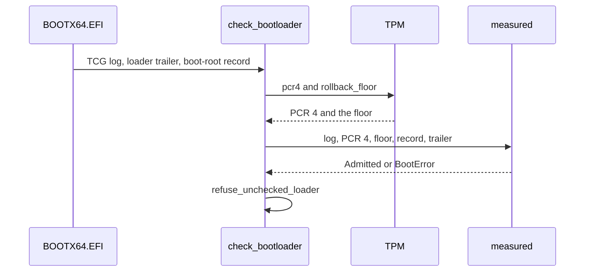

# Measured boot and the TPM

NONOS uses a [TPM](../overview/glossary.md#tpm) 2.0 to record which kernel the loader admitted, to check the loader that started the kernel, to derive keys that exist only in one boot state, and to sign quotes; without a TPM every mode but Hardened and Air-Gapped still boots, and the last table on this page says what is lost.

## PCRs

| PCR | Extended by | Used by NONOS for |
|---|---|---|
| 0 | the firmware | the [machine key](../overview/glossary.md#machine-key), the [device secret](../overview/glossary.md#device-secret), quotes |
| 1, 2 | the firmware | quotes |
| 4 | the firmware, once for each UEFI application it starts | the kernel's check of its loader, the machine key, the device secret |
| 7 | the firmware, for the [Secure Boot](../overview/glossary.md#secure-boot) state | the machine key, the device secret, quotes |
| 9 | the loader, once, for the kernel it admitted | the machine key, the device secret's approval |

The firmware hashes every UEFI application it starts with the PE Authenticode SHA-256, extends [PCR](../overview/glossary.md#pcr) 4 with it and logs an event, as the header of the boot-measure crate says, whose `authenticode` module rebuilds that digest (`nonos-boot-measure/src/lib.rs:17-31`). The kernel reads PCR 4 from the SHA-256 bank with `pcr4` (`src/security/tpm/boot_reads/pcr4.rs:25-52`). The machine key binds `BOUND_PCRS`, PCRs 0, 4, 7 and 9 (`src/security/tpm/machine_key/pcrs.rs:21-24`). The device secret binds `APPROVED_PCRS`, PCR 9, and `MACHINE_PCRS`, PCRs 0, 4 and 7 (`src/security/tpm/device_secret/consts.rs:38-42`). A quote covers `QUOTED_PCRS`, PCRs 0, 1, 2 and 7 (`src/security/attest_doc/produce.rs:29-33`). Nothing in the kernel's TPM code extends a PCR.

## PCR 9: the admitted kernel

`attest_kernel` extends PCR 9 once, in `measure_admitted_kernel`, after the kernel's STARK trailer has passed, and only when the loader found measured boot active (`nonos-bootloader/src/boot/attestation/kernel_gate.rs:43-47`). The data is 64 bytes, the kernel's BLAKE3 hash then the kernel root the loader was built with. The loader hashes it with SHA-256 and the firmware's TCG2 extend hashes it again, so on a PCR 9 that starts at zero, as `measure_admitted_kernel` documents (`nonos-bootloader/src/boot/attestation/kernel_gate.rs:62-85`):

```text
PCR9 = SHA-256(0^32 || SHA-256(SHA-256(kernel_blake3 || kernel_attest_root)))
```

That value is the same on every machine for one release, which is what lets a release sign it. `kernel_pcr9` in the release tool computes the same value (`tools/nonos-policy-approve:73-77`). A failed extend is not fatal: the loader logs `the admitted kernel was not measured into PCR 9`, and as `measure_admitted_kernel` notes, nothing bound to PCR 9 then unseals, which fails closed. How the loader decides that measured boot is active, and the TCG2 calls it makes, are in its verification module and are not described here. Its panel shows `TPM2 MeasuredBoot active` or `TPM2 not available` (`display_subsystem_status`, `nonos-bootloader/src/boot/security/platform.rs:50-60`).

## The kernel's TPM driver

The loader's TPM stack ends with boot services. The kernel has its own, reached through `transact`, because a quote must be taken while the machine runs, against a nonce that did not exist at boot (`src/security/tpm/mod.rs:17-37`). It lives in `src/security/tpm`; the device-level view is on [Platform drivers](../drivers/platform.md).

- The register window is `TPM_MMIO_BASE`, `0xFED40000`, one 4 KiB page for each of localities 0 to 4, mapped once, uncached (`src/security/tpm/mmio/map.rs:25-49`).
- `start_method` reads the ACPI `TPM2` table, where start method 6 is FIFO and 7 and 8 are CRB, and ignores a table whose length is outside 52 to 4096 bytes or whose checksum fails (`src/security/tpm/transport/acpi.rs:22-74`).
- Start method 2 is refused, because its doorbell is an ACPI `_DSM` call and the kernel has no AML interpreter to make it; the code names it as the start method of AMD's firmware TPM (`START_ACPI`, `src/security/tpm/transport/acpi.rs:26-28`). `detect` refuses any start method other than 2, 6, 7 and 8 too (`src/security/tpm/transport/detect.rs:29-47`).
- `identify` reads the interface identity register, `INTERFACE_ID`, at offset `0x30`: type 0 is FIFO, type 1 is CRB, and a TIS 1.3 part that reads all ones counts as FIFO when its access register shows a valid part (`src/security/tpm/transport/ident.rs:28-60`).
- `detect` refuses when ACPI and the part disagree, because the two register files overlap and driving one through the other's offsets would write command bytes into control registers. With no usable ACPI table, `detect` lets the identity register decide alone, and it takes a CRB control area outside the window from the table alone (`src/security/tpm/transport/detect.rs:17-79`).
- `transact` runs detection on first use, keeps the answer for the rest of the boot, and holds a lock so one command is in flight at a time (`src/security/tpm/transport/dispatch.rs:26-49`).
- `transact_resending` sends a command again while the TPM answers `TPM_RC_RETRY`, at most three tries; on a TPM built from the reference code, the first authorization of the attestation key after each startup costs one retry (`src/security/tpm/resend.rs:17-56`).
- A missing part, a timeout and an unreadable answer are the three `TpmError` values (`src/security/tpm/error.rs:17-37`).

The [serial console](../overview/glossary.md#serial-console) gets one line when the part is found, from `announce`, for example `[TPM] interface CRB at 0xFED40000, locality 0 (id ..., ACPI agrees)` (`src/security/tpm/transport/detect.rs:81-92`). The command builders and parsers are tested against byte vectors from the TPM 2.0 specification, the machine-key sequence against swtpm, and the FIFO protocol against a modelled register file, by `tpm_key_proofs` (`userland/tpm_key_proofs/Cargo.toml:4-9`). That crate passed 42 tests in this release's flake checks. The CRB and FIFO transports on a hardware TPM were not tested for this release.

## The kernel checks its loader



Before boot services end, `BOOTX64.EFI` gathers the firmware's TCG event log, its own v4 trailer from `\EFI\nonos\bootloader.trailer` and the [boot-root record](../overview/glossary.md#boot-root-record) from `\EFI\nonos\boot_root.approval`, and hands each to the kernel as a module, a zero region when absent (`boot_evidence`, `nonos-bootloader/src/entry/boot_evidence.rs:17-45`). The kernel reads them, and the loader's own image, with a 4 MiB bound for the first three and 64 MiB for the image (`MAX_MODULE`, `src/security/boot/loader_check/evidence.rs:25-46`). The replay itself refuses a log over 1 MiB or over 4096 events (`MAX_LOG_BYTES`, `nonos-boot-measure/src/tcg/consts.rs:29-34`).

`check_bootloader` decides once and keeps the verdict for the rest of the boot (`src/security/boot/loader_check/run.rs:27-55`):

- No record or no trailer: `NoEvidence`.
- A log, and a TPM that answers both `pcr4` and `rollback_floor`: the measured path, whatever it finds.
- Otherwise, with the loader's image: the self-reported path. Without it: `NoEvidence`.

`measured` replays the log, requires the replayed PCR 4 to equal the live one, takes the last application the log names as the loader's measurement, checks the record against the TPM's [rollback floor](../overview/glossary.md#rollback-floor), and checks the loader's slot under the record's root; it returns `Admitted`, with the measurement, root and epoch, or a `BootError` (`nonos-boot-measure/src/gate/verdict.rs:22-58`). The last application is the loader, or anything started after it, which then fails the loader's enrollment. `replay` extends a zero PCR 4 with the SHA-256 digest of each PCR 4 event in log order, skips `EV_NO_ACTION`, and refuses a log that does not parse to its last byte (`nonos-boot-measure/src/tcg/replay.rs:35-64`).

The boot-root record is 104 bytes, `RECORD_LEN` (`nonos-boot-measure/src/record/mod.rs:17-41`):

| Offset | Size | Field |
|---|---|---|
| 0 | 32 | the bootloader tree's root, four canonical little-endian words |
| 32 | 8 | the epoch, the release's [rollback index](../overview/glossary.md#rollback-index), little-endian |
| 40 | 32 | ECDSA r, big-endian |
| 72 | 32 | ECDSA s, big-endian |

The signature is ECDSA P-256 over the SHA-256 of `NONOS-BOOT-ROOT-v1`, the root and the epoch, built by `message` (`nonos-boot-measure/src/record/check.rs:23-31`). The kernel checks it with the device policy key it was built with, and an all-zero key verifies nothing (`signed`, `src/security/boot/loader_check/key.rs:24-38`).

`self_reported` hashes the loader file the loader itself handed over, and checks the record against a floor of 0; nothing measured those bytes, so the verdict says it is the loader's word only (`nonos-boot-measure/src/gate/verdict.rs:60-75`).

| `BootError` code | Meaning |
|---|---|
| 1 | the log does not replay to the live PCR 4 |
| 2 | the log names no application in PCR 4 |
| 3 | the trailer is not a v4 bootloader trailer |
| 4 | the measurement's path does not fold to the signed root |
| 5 | the signed root is not four canonical words |
| 100 + n | the log: 1 truncated, 2 not crypto-agile, 3 no SHA-256 bank, 4 too many banks, 5 unknown bank, 6 a PCR 4 event with no SHA-256 digest, 7 an event over 64 KiB, 8 over 4096 events, 9 over 1 MiB |
| 200 + n | the record: 1 length, 2 root word, 3 bad signature, 4 stale epoch |
| 300 + n | the loader image |
| 400 + n | the STARK proof, with the `nox_verify` code |

The codes come from `code` in `BootError`, `LogError` and `RecordError` (`nonos-boot-measure/src/gate/error.rs:21-55`, `nonos-boot-measure/src/tcg/error.rs:17-54`, `nonos-boot-measure/src/record/error.rs:17-38`). `say` writes the verdict to the serial line: `[BOOT-ATTEST] bootloader measured and enrolled, epoch N`, `[BOOT-ATTEST] bootloader self-reported, not measured: enrolled, epoch N`, `[BOOT-ATTEST] bootloader refused, code N`, or `[BOOT-ATTEST] bootloader not checked: no boot-root record or trailer` (`src/security/boot/loader_check/log.rs:25-42`).

`refuse_unchecked_loader` stops the boot before init on a refusal or on no evidence, with the notice `The bootloader failed the kernel's check` or `The bootloader could not be checked`; a measured or self-reported pass goes on (`src/kernel_core/init/entry/loader_refusal.rs:20-48`). Any [capsule](../overview/glossary.md#capsule) with a valid token can read the verdict as the 80-byte `MkBootAttest` record: version, state, refusal code, epoch, the loader's measurement and its root (`sys_boot_attest`, `src/syscall/microkernel/boot_attest.rs:17-38`, `src/security/boot/loader_check/record.rs:17-35`, `MkBootAttest`, `src/syscall/contract/cap_table/mk.rs:32-35`).

## Keys the TPM derives instead of storing

The kernel creates no sealed TPM object to keep on disk. It asks the TPM to derive a key under a PCR policy each time it needs one, so the key exists only on this TPM in this boot state. The [machine key](../overview/glossary.md#machine-key) is `TPM2_HMAC` over a label under a primary key that the TPM derives from its storage seed and a template whose policy is the current value of PCRs 0, 4, 7 and 9 (`TPM2_HMAC`, `src/security/tpm/machine_key/mod.rs:17-31`; `derive`, `src/security/tpm/machine_key/derive.rs:43-63`). The kernel uses it for the [data volume](../overview/glossary.md#data-volume) under the label `blockfs.data.v1`, as `KEY_LABEL` (`src/fs/blockfs_volume/open_machine.rs:37-38`), and for its local-build identity (`derive_for_kernel`, `src/security/local_build/identity.rs:35-50`). A capsule holding `Crypto` asks for one through `CryptoMachineKey`. Labels, error numbers and what each key protects are on [Device secrets and keys](device-secrets-and-keys.md).

The [device secret](../overview/glossary.md#device-secret) is the witness of the anonymous device proof. It is derived like the machine key, under a `PolicyAuthorize` policy that the release must approve (`src/security/tpm/device_secret/mod.rs:17-37`):

1. `PolicyPCR` over PCR 9 alone, and `PolicyGetDigest` reads the approved policy back.
2. `TPM2_LoadExternal` loads the release's P-256 policy key, and `TPM2_VerifySignature` checks the release's signature over SHA-256 of the approved policy and `NONOS-DEVICE-SECRET-v1`, returning a ticket; the kernel checks that the TPM's name for the key is the one the policy binds.
3. `PolicyAuthorize` takes the ticket, then `PolicyPCR` binds PCRs 0, 4 and 7 as they are on this machine.
4. A primary key is created under that policy, and HMAC blocks computed under the same policy give the secret.

The sequence is `device_secret` (`src/security/tpm/device_secret/derive.rs:37-61`), the signature check is `verified` (`src/security/tpm/device_secret/verify.rs:62-75`), and `a_hash` builds the signed digest (`src/security/tpm/device_secret/digest.rs:29-35`). `draw` cuts each 32-byte HMAC block into four 8-byte words and keeps a word only below the Goldilocks modulus, trying at most four blocks (`src/security/tpm/device_secret/draw.rs:30-75`). PCR 9 is the same on every machine for a release, so the release can sign it once. The policy names the release key, not one PCR 9 value, so a kernel update the release approves keeps the secret. PCRs 0, 4 and 7 differ per machine, so a firmware, Secure Boot or loader change gives a new secret.

The release's signature arrives as `\EFI\nonos\kernel.approval`, 128 bytes, key x and y then r and s, which the loader reads and hands on untouched in `with_approval` (`nonos-bootloader/src/entry/approval.rs:17-41`). `from_boot` refuses when the compiled-in policy key is all zero, when no approval arrived, or when the approval names another key (`src/security/tpm/device_secret/approval.rs:37-62`). The [seal](../overview/glossary.md#seal) writes that file only when it holds the device policy key, and says otherwise that the TPM keeps the device secret sealed (`records`, `tools/nonos_seal/chain.py:77-94`). The make rule that packs the [ESP](../overview/glossary.md#esp) does not place it (`ESP_DIR`, `mk/20-build.mk:1297-1305`).

`MkDeviceSecret` returns the four words as 32 bytes and keeps no copy. It returns `EPERM` unless the caller holds `DeviceSecret` and was proved by the vendor root, `EINVAL` for a buffer that is not 32 bytes, `EFAULT` for a buffer it cannot write, `ENOENT` with no approval, `EACCES` when the TPM refuses the policy, and `ENODEV` for any other TPM failure (`sys_device_secret`, `src/syscall/microkernel/device_proof/device_secret.rs:17-67`, `src/syscall/microkernel/device_proof/gate.rs:17-36`).

Against swtpm, `tpm_enroll_proofs` shows that an approved kernel gets one secret and a signed update keeps it, that an old approval does not cover a new kernel, that a forged signature is refused, and that another key or a changed PCR 7 gives another secret (`an_approved_kernel_gets_one_secret_and_a_signed_update_keeps_it`, `userland/tpm_enroll_proofs/src/security/tpm/live/device_secret_tests.rs:40-72`). That crate passed 37 tests in this release's flake checks. No run on a hardware TPM is recorded for this release.

## Quotes and the attestation key

The attestation key is a primary key under the endorsement hierarchy with a fixed template, so the same TPM gives the same key on every boot with nothing stored (`build_create_primary`, `src/security/tpm/ak/create.rs:25-35`). It is `restricted`, so it signs only digests the TPM produced itself (`OBJECT_ATTRIBUTES`, `src/security/tpm/ak/attributes.rs:17-27`). `load_ak` derives it once per boot and keeps the handle (`src/security/tpm/ak/load.rs:27-57`).

`MkAttestDoc` answers a 32-byte challenge with a quote over PCRs 0, 1, 2 and 7. The quote's qualifying data is BLAKE3 over `nonos.attest.bind.v2`, the challenge, the attestation registry's root and the DMA posture, so the TPM's signature covers what is running (`qualifying_data`, `src/security/attest_doc/binding.rs:17-62`). `produce` refuses while the registry is incomplete (`src/security/attest_doc/produce.rs:38-49`). `check_attest` confirms the signed structure was made by the TPM, is a quote, and carries the expected nonce before the document leaves (`src/security/tpm/quote/attest.rs:20-58`).

The attestation key is the same on every boot and across a reinstall, so a quote names the machine, as the comment beside `MkAttestDoc` says (`src/syscall/contract/cap_table/mk.rs:37-46`). The document therefore goes only to a capsule that holds `AttestRead` and does not hold `Network`, as `can_attest_doc` requires (`src/syscall/caps/checks/system.rs:45-52`). A refusal returns `EPERM`, and the reason goes to the serial console only, after `[ATTEST] refused:` (`sys_attest_doc`, `src/syscall/microkernel/attest_doc.rs:35-50`). `MkEnroll` gives the prover the endorsement key's public area and certificate, the attestation key's public area, `ActivateCredential`, and attestation-key signatures (`ak_sign`, `src/security/tpm/enroll/mod.rs:17-30`), under the same gate as `MkDeviceSecret` (`device_secret_caller`, `src/syscall/microkernel/device_proof/enroll/call.rs:39`).

The quote does not cover PCR 4 or PCR 9, so a quote alone does not say which loader or kernel ran; the kernel's check of its loader and the device proof carry that.

## Without a TPM

| Part | What happens without a TPM |
|---|---|
| Loader | PCR 9 is not extended; with no rollback floor, Hardened and Air-Gapped refuse to boot and every other mode boots with rollback protection off |
| The kernel's check of its loader | the self-reported path; the boot-root record is held to a floor of 0 and the log says `self-reported, not measured` |
| Machine key | `CryptoMachineKey` returns `ENODEV`; a data volume keyed by the TPM stays closed, and the local-build identity lasts one boot |
| Device secret | `MkDeviceSecret` returns `ENODEV`, or `ENOENT` when there is no approval |
| Quotes | `MkAttestDoc` returns `EPERM` |

`errno_for` maps a missing TPM to `ENODEV`, error 19 (`src/syscall/dispatch/crypto/machine_key.rs:68-78`). For the data volume, `open_machine_volume` asks `derive_for_kernel` for the key, and when that fails it leaves the volume closed (`src/fs/blockfs_volume/open_machine.rs:75-78`). Its `no machine key` line goes to the structured log, which nothing installs in this release, so the line does not print. The local-build fallback is `mint`, a random key for this boot only (`src/security/local_build/identity.rs:35-47`). The rollback rule is on [Rollback protection](rollback-protection.md).

## Limits

- The loader's TPM code (detection, the TCG2 extend, the event log copy and the NV counter) is in its verification module and is not described in these pages.
- A boot without a TPM or without a log checks the loader file that the loader itself handed over: the loader's own word, which the verdict says. Whether a log arrives is up to the loader, and `decide` takes the self-reported path whenever none did, with a TPM present and on a Hardened boot too, and `refuse_unchecked_loader` lets that verdict through (`src/security/boot/loader_check/run.rs:34-55`). A changed loader that withholds the log is therefore checked on its own word; its changed PCR 4 still gives it another machine key.
- The attestation key has no `noDA`, so on a TPM built from the reference code its first authorization after each startup costs a retry.
- The machine key and the device secret both come from a primary key that `build_create` makes in the storage hierarchy (`src/security/tpm/machine_key/create.rs:35-38`). Clearing the TPM changes that hierarchy's seed and every key with it, so a data volume keyed by the TPM cannot be opened again; the module comment above `derive` calls this the way to make the data unrecoverable on purpose (`src/security/tpm/machine_key/mod.rs:29-47`).
- The quote covers PCRs 0, 1, 2 and 7 only.
- The device secret stays sealed until a `kernel.approval` signed with the device policy key sits on the ESP; no make rule puts it there.
- In this release the command sequences, the rollback floor reads and the device secret were tested against swtpm over a socket, and the FIFO protocol against a modelled register file. The CRB and FIFO transports did not run against a hardware TPM.
- `nonos-boot-measure`, which holds the log replay, the record check and the verdicts above, has its own host tests under `nonos-boot-measure/src/tests` and five fuzz targets, but `proofDirs` does not name it, so no flake check runs them (`tools/nix/checks.nix:20-30`), and the nightly fuzz workflow does not list its targets. They did not run for this release.

## See also

- [Boot chain and signatures](boot-chain-and-signatures.md)
- [Rollback protection](rollback-protection.md)
- [STARK attestation](stark-attestation.md)
- [Device secrets and keys](device-secrets-and-keys.md)
- [Platform drivers](../drivers/platform.md)
- [Protections and limits](protections-and-limits.md)
- [TCG PC Client Platform Firmware Profile](https://trustedcomputinggroup.org/resource/pc-client-specific-platform-firmware-profile-specification/)
- [TPM 2.0 Library specification](https://trustedcomputinggroup.org/resource/tpm-library-specification/)
