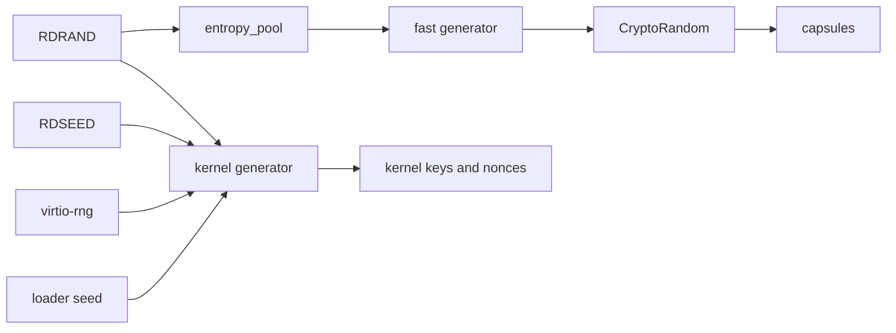

# Randomness and cryptography

Use this page to trace where NONOS gets its random bytes, how the kernel stretches and reseeds them, and which code does which cryptography.

## Sources

On x86_64, the loader, the kernel and two capsules read four sources of randomness.

| Source | Read by |
|---|---|
| RDRAND | the `entropy_pool` capsule, the keyring capsule, the kernel generator, the loader, the `CryptoRandom` fallback |
| RDSEED | the keyring capsule, the kernel generator, the loader, the `CryptoRandom` fallback |
| virtio-rng | the kernel generator, the `CryptoRandom` fallback |
| the loader's 32-byte seed | the kernel generator, once per boot |

The [TPM](../overview/glossary.md#tpm) is not on the list. The kernel asks it for the [machine key](../overview/glossary.md#machine-key), a key derived under a policy over [PCRs](../overview/glossary.md#pcr) 0, 4, 7 and 9, and never for random bytes (`BOUND_PCRS`, `src/security/tpm/machine_key/pcrs.rs:21-24`).

`random_u64` reads RDRAND and `entropy_u64` reads RDSEED, and each answers `None` when the CPU lacks the instruction or stays busy through its attempts (`src/arch/cpu_random/read.rs:29-57`). On x86_64 that is 10 attempts for RDRAND and 100 for RDSEED (`RDRAND_ATTEMPTS`, `src/arch/x86_64/cpu_random/read.rs:24-25`). On aarch64 the same two calls read RNDR and RNDRRS, and on riscv64 `random_u64` always answers `None` (`src/arch/cpu_random/read.rs:29-41`).

The kernel keeps a small virtio-rng driver of its own, for PCI vendor 0x1AF4 with device 0x1005 or 0x1044 (`VIRTIO_VENDOR_ID`, `src/drivers/virtio_rng/mod.rs:29-31`). `init_entropy` starts it while the platform comes up and logs `VirtIO-RNG ready`, or `Software RNG` when no device answers (`src/kernel_core/init/platform/entropy.rs:19-25`). The `capsule_driver_virtio_rng` [driver capsule](../overview/glossary.md#driver-capsule) claims the same device later, but no kernel code calls its client, `fill_random` (`src/hardware/virtio_rng_capsule/client/fill_random.rs:27`).

The loader collects the kernel's first seed. `collect_hw_rng_bytes` folds up to `HW_RNG_ITERATIONS`, 32, words into 64 bytes with cycle-counter jitter, each word from RDSEED or, where RDSEED fails, from RDRAND (`nonos-bootloader/src/entropy/sources.rs:45-88`, `nonos-bootloader/src/entropy/types.rs:23-25`). `collect_boot_entropy` hashes those bytes with BLAKE3, together with `TSC_JITTER_ROUNDS`, 256, rounds of timer jitter and one more cycle-counter reading, and `collect_boot_entropy_64_with_st` hashes that result again with the real-time clock (`nonos-bootloader/src/entropy/collector.rs:29-105`). `collect_entropy` keeps the first 32 of the 64 output bytes for the [boot handoff](../overview/glossary.md#boot-handoff) (`nonos-bootloader/src/boot/prepare/entropy.rs:25-39`). The boot screen names the CPU source it found, as `Entropy source RDSEED, TSC jitter, RTC`, `Entropy source RDRAND, TSC jitter, RTC` or `Entropy source TSC jitter, RTC` (`entropy_source`, `nonos-bootloader/src/boot/prepare/display.rs:33-41`). The UEFI RNG protocol is read only by a loader built with the `efi-rng` feature (`collect_efi_rng`, `nonos-bootloader/src/entropy/collector.rs:107-118`), and no build in the tree turns that feature on.

## Two generators

The kernel runs two ChaCha20 generators. The fast generator serves `CryptoRandom` to [capsules](../overview/glossary.md#capsule) and takes its seeds only from the `entropy_pool` capsule. The kernel generator, `GLOBAL_RNG`, serves the kernel's own keys and nonces and is seeded from every source the kernel can read (`src/syscall/dispatch/crypto/random.rs:24-26`).



On x86_64, once it is seeded, every byte `CryptoRandom` serves is stretched from RDRAND output alone. RDSEED, virtio-rng and the loader seed reach only the kernel generator.

### The fast generator

`fill` keeps a 32-byte ChaCha20 key and a block counter, and answers each request with keystream under an all-zero nonce (`src/security/entropy_capsule/fast.rs:41-85`). After every request it runs `chacha20_block` once more and takes the next key from that block, which the caller never sees, so a key read out of memory later does not reveal earlier output (`src/security/entropy_capsule/fast.rs:87-93`).

It takes its first seed on the first request, and a new one once `RESEED_AFTER`, 1 MiB, has been served since the last (`src/security/entropy_capsule/fast.rs:37-39`). Each seed is 32 bytes that `get_random` asks the `entropy_pool` capsule for over IPC, and it replaces the key and resets the counter outright (`src/security/entropy_capsule/fast.rs:56-66`).

`handle_crypto_random` requires the `Crypto` [capability](../overview/glossary.md#capability), refuses a null buffer or a request of 0 bytes or more than 4096 with `EINVAL`, and fills a kernel buffer from `fill` before copying it out (`src/syscall/dispatch/crypto/random.rs:33-43`). Linux programs reach it only through the [Linux personality](../overview/glossary.md#linux-personality): its `getrandom` hands out at most 256 bytes a call, and its random devices read through `crypto_random` too (`userland/capsule_linux/src/linux/call/thread.rs:47-55`, `userland/capsule_linux/src/linux/file/dev_io.rs:48`).

On x86_64 the capsule's source is RDRAND. Its `fill` checks CPUID leaf 1, ECX bit 30, and gives up a request after 32 failed attempts on one 64-bit word instead of using a weaker source (`userland/capsule_entropy/src/pool/source/x86_64.rs:23-44`). The capsule serves at most `MAX_RANDOM_BYTES`, 4096 bytes, a request, and answers `EMSGSIZE` above that and `EIO` when the source fails (`userland/capsule_entropy/src/server/handlers/getrandom.rs:27-42`). It keeps four counters and no samples (`Pool`, `userland/capsule_entropy/src/pool/types.rs:26-31`). Its reseed operation checks the length, at most 256 bytes, counts the call with `record_reseed` and mixes nothing in (`userland/capsule_entropy/src/server/handlers/reseed.rs:26-39`).

On aarch64, a [preview port](../architectures/aarch64.md), the capsule draws its bytes with `crypto_random`, which is `CryptoRandom` itself (`userland/capsule_entropy/src/pool/source/aarch64.rs:26-27`). `fill` holds the generator's lock while it waits for the capsule's seed (`src/security/entropy_capsule/fast.rs:54-62`), so on aarch64 the capsule's answer to a first seed request calls back into `fill` while the requester still holds that lock. This path was not run on aarch64 in this release.

### The kernel generator

`ChaChaRng` is a ChaCha20 generator with a 64-byte block (`src/crypto/util/rng/csprng.rs:26-37`), due for a reseed after `RESEED_INTERVAL`, 1,048,576 blocks or 64 MiB (`src/crypto/util/rng/csprng.rs:39-40`). `init_rng` seeds it from `collect_seed_entropy_secure` (`src/crypto/util/rng/global/init.rs:38-65`). That function hashes 32 bytes of virtio-rng output, four words each from RDSEED and RDRAND, 16 cycle-counter jitter samples, the stack pointer and a counter into one SHA-256, and fails unless at least 32 of those bytes came from hardware (`collect_seed_entropy_secure`, `src/crypto/util/rng/entropy/collect/pool.rs:37-73`).

Byte draws go through `draw`. Once the interval has passed it reseeds with a fresh `collect_seed_entropy_secure` seed hashed together with 32 bytes of its own output, and when the sources cannot answer it keeps its state and asks again on the next draw (`src/crypto/util/rng/global/reseed.rs:26-42`). `random_u64` takes words straight from the generator and never reseeds it (`src/crypto/util/rng/global/generate.rs:70-75`).

On x86_64 the boot seeds it in three steps:

1. `init_core_systems` ends in `init_platform_baseline` (`src/boot/main/core_init/init_core_systems.rs:68`). That starts virtio-rng, draws the 16-byte boot session nonce with `init_boot_session_nonce`, then the 32-byte [capability token](../overview/glossary.md#capability-token) key with `init_token_signing_key` (`src/kernel_core/init/platform/baseline.rs:56-60`). The first of these draws finds the generator unseeded and seeds it with `init_rng`.
2. `log_security_status` hands the handoff to `log_entropy`, which applies the loader's seed, when it is not all zeros, with `seed_from_bootloader`, then wipes it from the handoff with `wipe_boot_seed` (`src/entry/security.rs:17-51`). `seed_from_bootloader` XORs the seed with a fresh local seed and the clock, and seeds or reseeds the generator with the result (`src/crypto/util/rng/global/seed.rs:75-113`).
3. `init_core_services` calls `init_rng` again and [stops the boot](../overview/glossary.md#boot-stop) if it fails (`src/kernel_core/init/entry/init_core_services.rs:34-36`).

On aarch64 the order differs: `microkernel_init` runs `init_core_services`, and with it `init_rng`, before `init_platform_baseline` draws the nonce and the key (`src/kernel_core/init/entry/microkernel_init.rs:45-64`).

`get_bytes_secure`, which draws the token key and the session nonce (`src/security/boot_session.rs:37-38`), XORs the generator's output with 64 bytes of virtio-rng output and with one RDSEED or RDRAND word for every 8 bytes (`src/crypto/random_api/basic.rs:38-42`, `mix_hardware_entropy` in `src/crypto/random_api/hardware_mix.rs:21-59`). The data volume draws a fresh 12-byte nonce for each sector with `fill_random_bytes` (`src/fs/cryptoblock/seal.rs:37-38`), and the PQClean code gets its randomness from the same generator through `nonos_randombytes` (`src/crypto/pqclean_support/mod.rs:37-45`).

The keyring, which makes wallet keys, XORs 32 bytes from `CryptoRandom` with 32 bytes it reads from RDSEED or RDRAND itself, and fails only when both sources fail (`gather_secret`, `userland/capsule_keyring/src/entropy/gather.rs:32-63`). A TLS client draws its X25519 key share, its client random and its session id with `crypto_random` (`client_flight`, `userland/nonos_tls/src/client_flight.rs:19-32`), and its P-256 key share the same way (`generate`, `userland/nonos_tls/src/p256_share.rs:27-30`).

## When a source is missing

- The `entropy_pool` capsule never answered. `fill` returns false only when no seed was ever obtained, and `handle_crypto_random` then reads the hardware directly with `try_fill_random` (`src/syscall/dispatch/crypto/random.rs:41-47`). That tries RDRAND, then RDSEED, then virtio-rng, for each 8 bytes, and the call fails with `EIO` when none answers (`try_secure_random_u64`, `src/security/crypto/random.rs:58-69`).
- The capsule ended after the first seed. The generator keeps serving from its last key without asking until 1 MiB has been served. After that every request asks the capsule again in `fill`, and is still served from the last key, until a reseed succeeds (`src/security/entropy_capsule/fast.rs:56-71`). Init restarts `entropy` and `crypto` like the other core services listed in `WATCHED` (`src/userspace/init/supervisor/watch_rule.rs:28-33`), once one has been seen ended for `SETTLE_MS`, 1000 ms (`src/userspace/init/supervisor/watch_rule.rs:69`), and at most `DEFAULT_MAX_RESTARTS`, 8, times (`src/services/lifecycle/state/constants.rs:17`).
- No hardware source answers the kernel. `init_rng` fails, but `fill_random_bytes` does not: it falls back to `get_entropy64_secure` for each 8 bytes, and when that fails too, to the cycle counter XORed with a counter (`fill_with_fallback_secure`, `src/crypto/util/rng/global/generate.rs:141-153`). `get_bytes_secure` always returns success (`src/crypto/random_api/basic.rs:38-42`), so the halt in `init_token_signing_key` cannot trigger, and on such a machine the token key and the session nonce come from the cycle counter (`src/kernel_core/init/platform/token_signing_key.rs:18-23`). With a non-zero loader seed, `seed_from_bootloader` then seeds the generator from that seed, cycle-counter jitter and the clock, and step 3 passes (`src/crypto/util/rng/global/seed.rs:78-93`). Nothing in the kernel stops such a boot. The loader's hardware RNG check, below, refuses a boot when no hardware random source answers it; which sources it asks is not described here.
- No TPM. Randomness is unaffected. `CryptoMachineKey` fails with `ENODEV`, error 19 (`errno_for`, `src/syscall/dispatch/crypto/machine_key.rs:70-79`).

Under QEMU, the QEMU command lines written in the Makefile add `-device virtio-rng-pci` (`QEMU_RNG`, `mk/10-qemu.mk:103`). Targets that use `QEMU_ACCEL_ARGS`, such as `nonos-mk-run`, ask for `-cpu host,+rdrand,+rdseed` under KVM or HVF. Under TCG, and in the targets that pass `QEMU_CPU` directly, the CPU is `max`, which a Makefile comment says carries RDRAND (`mk/10-qemu.mk:14-31`).

## The HARDWARE RNG line in the boot menu

Under the list of entries, the boot menu shows what this machine lacks for the selected entry. `missing` adds `hardware RNG` when the loader's `hardware_rng_available` flag is false and the entry's policy is not Development, and `draw_about` prints the list in capitals after `REFUSED HERE: NO` (`nonos-bootloader/src/bootmenu/ready.rs:51-58`, `nonos-bootloader/src/bootmenu/about.rs:40-48`). For every entry that boots, `policy_of` asks for Standard or Hardened, and the menu can raise the build's policy but never lower it (`nonos-bootloader/src/bootmenu/ready.rs:40-49`), so `REFUSED HERE: NO HARDWARE RNG` can appear for any of them. The `RNG` at the end of the checks line, `ED25519 · ML-DSA-65 · STARK · ROLLBACK · RNG`, names the same requirement (`STD`, `nonos-bootloader/src/bootmenu/entries.rs:59`).

The loader's refusal for this reason reads "Every boot needs a hardware random source for its keys; none answered", and its advice is to turn on RDRAND or the TPM in the firmware, and to give a virtual machine virtio-rng (`POLICY`, `nonos-bootloader/src/display/boot/refusal/policy.rs:28-33`). The menu decides nothing itself: it only names what the loader's security policy will check (`Missing`, `nonos-bootloader/src/bootmenu/ready.rs:17-26`). That policy and the flag live in the loader's security module, which this page does not describe, so which sources the flag counts is not stated here. [Boot modes](../install/boot-modes.md) covers the menu and [Troubleshooting](../install/troubleshooting.md) the refusal screens.

`collect_boot_entropy` checks its own output with `is_weak_entropy`, which refuses only an all-zero output or one whose two halves match, and the loader then resets the machine (`nonos-bootloader/src/entropy/collector.rs:100-102`, `nonos-bootloader/src/entropy/util.rs:30-38`, `collect_entropy` in `nonos-bootloader/src/boot/prepare/entropy.rs:25-35`). It tests the BLAKE3 output, so it cannot tell a seed made from timer jitter alone from one with hardware randomness in it. The loader also passes the same 32 bytes to `generate_attestation_quote` as its nonce and drops the quote it gets back (`generate_boot_attestation`, `nonos-bootloader/src/boot/prepare/attestation.rs:21-25`, `nonos-bootloader/src/boot/prepare/run.rs:48-50`). That function is in the loader's security module too.

## The two services

| | `entropy_pool` | `crypto_pool` |
|---|---|---|
| Ports | service 4100, reply 4101 | service 4102, reply 4103 |
| The capsule's own bits | `IPC`, `Memory`, `Crypto`: 0x38 | `IPC`, `Memory`: 0x18 |
| Wire header | magic `NOEN`, version 1 | magic `NOCX`, version 1 |
| Started | by `spawn_after_ramfs`, after the keyring | right after `entropy_pool` |

The ports and bits are in each `Capsule.mk` (`CAPSULE_SERVICE_ENDPOINT` and `CAPSULE_REQUIRED_CAPS`, `userland/capsule_entropy/Capsule.mk:14-17`, `userland/capsule_crypto/Capsule.mk:13-16`), and the kernel's spawn sites ask for the same bits (`requested_caps`, `src/security/entropy_capsule/spawn.rs:54`, `src/security/crypto_capsule/spawn.rs:54`). `spawn_after_ramfs` starts the keyring, `entropy_pool`, `crypto_pool` and the policy capsule in that order (`src/userspace/init/spawn_plan/core.rs:22-27`). Both names are reserved, so no capsule can register them at run time (`RESERVED_NAMES`, `src/services/registry/reserved.rs:19-20`).

`crypto_pool` answers 18 operations: BLAKE3, SHA-256, SHA-384, SHA-512 and SHA3-256 hashes; Ed25519, P-256 ECDSA, P-384 ECDSA and RSA verification; ChaCha20-Poly1305 and AES-256-GCM seal and open; the X25519 public key and shared secret; HMAC-SHA256 and HKDF-SHA256; and a health check (`dispatch`, `userland/capsule_crypto/src/server/dispatch.rs:28-50`). It computes them in its own process with the `blake3`, `sha1`, `sha2`, `sha3`, `chacha20poly1305`, `aes-gcm`, `ed25519-dalek`, `x25519-dalek`, `p256`, `p384` and `rsa` crates (`userland/capsule_crypto/Cargo.toml:24-36`), and holds no `Crypto` because it makes no crypto system call (`CAPSULE_REQUIRED_CAPS`, `userland/capsule_crypto/Capsule.mk:1-16`). Sealing refuses an all-zero nonce with `EINVAL` (`nonce_is_degenerate`, `userland/capsule_crypto/src/server/handlers/aead_frame/parse.rs:29-35`), and the request buffer is wiped after each reply (`wipe`, `userland/capsule_crypto/src/server/runner.rs:42`).

RSA is verify only. Scheme 0 is PKCS#1 v1.5 with SHA-256, SHA-384, SHA-512 or SHA-1, scheme 1 is PSS with the three SHA-2 widths, and scheme 2 is PKCS#1 v1.5 over a bare digest with no DigestInfo, which the Anyone directory signatures use (`verify`, `userland/capsule_crypto/src/server/handlers/rsa_scheme.rs:54-70`). SHA-1 is offered only under schemes 0 and 2, and only to check signatures someone else already made (`digest_len`, `userland/capsule_crypto/src/server/handlers/rsa_scheme.rs:33-41`).

### Who may call them

Through the system calls below, a caller needs `Crypto`, and the kernel's client checks `CAP_CRYPTO` again before each round trip (`gate_hash`, `src/security/crypto_capsule/capability.rs:22-31`). The kernel's client for `entropy_pool` asks `Entropy` for its statistics and health check and `Admin` for reseed (`gate_read`, `src/security/entropy_capsule/capability.rs:23-44`), but no kernel code calls those three functions in this release.

Capsules can also call both services directly. Each service [endpoint](../overview/glossary.md#endpoint) is registered with `IPC` as the only bit a sender needs, plus `Network` for the network services (`required_caps`, `src/kernel_core/process_spawn/capsule_spawn/runner/install/install.rs:104-105`), and neither name is a [held endpoint](../overview/glossary.md#held-endpoint) in `HELD` (`src/services/registry/held_table.rs:20-36`). A capsule holding `IPC` can therefore send either one a request with `MkIpcCall`, and the kernel routes the reply back to it (`redirect_reply`, `src/syscall/microkernel/ipc/send.rs:141-146`). The one exception is a capsule held to a [peer list](../overview/glossary.md#peer-list), and in this release only `shield_prover` is, which may reach `shield.core` alone (`PEERS`, `src/services/registry/peers.rs:27-31`). The services check no capability themselves, so the `Crypto`, `Entropy` and `Admin` checks above do not apply to such a call. The TLS library uses this path for P-256, P-384 and RSA certificate checks (`crypto_status`, `userland/nonos_tls/src/verify_p256.rs:22`, `userland/nonos_tls/src/verify_p384.rs:22`, `OP_RSA_VERIFY` in `userland/nonos_tls/src/verify_rsa.rs:21`), and the Anyone service for its directory signatures (`OP_RSA_VERIFY`, `userland/capsule_net_anon/src/directory/verify/frame.rs:25`).

## The crypto system calls

Twelve calls make up the crypto family, each named by its [syscall tag](../overview/glossary.md#syscall-tag) (`ENTRIES`, `src/syscall/abi/registry/crypto.rs:22-35`). Every one requires `Crypto` (`can_crypto`, `src/syscall/contract/cap_table/crypto.rs:20-33`).

| Tag | Call | Served by | Limits |
|---|---|---|---|
| `CRND` | `CryptoRandom` | kernel, the fast generator | 1 to 4096 bytes |
| `CKEC` | `CryptoKeccak256` | kernel, its own SHA-3 code | 1 byte to 1 MiB in, 32 bytes out |
| `CMKY` | `CryptoMachineKey` | kernel, the TPM | a label of 1 to 64 bytes whose first byte is not 0 |
| `CHSH` | `CryptoHash` | `crypto_pool` | algorithm 0 BLAKE3, 1 SHA-256, 2 SHA-512, 3 SHA3-256; 1 byte to 64 KiB |
| `CENC`, `CDEC` | `CryptoEncrypt`, `CryptoDecrypt` | `crypto_pool` | algorithm 0 ChaCha20-Poly1305, 1 AES-256-GCM; 32-byte key, 12-byte nonce, up to 1 MiB at the call, 16-byte tag |
| `CEAD`, `CDAD` | `CryptoEncryptAad`, `CryptoDecryptAad` | `crypto_pool` | as above, with up to 256 bytes of associated data |
| `CXPK`, `CXSH` | `CryptoX25519Public`, `CryptoX25519Shared` | `crypto_pool` | 32-byte keys |
| `CHMC` | `CryptoHmacSha256` | `crypto_pool` | a key of up to 256 bytes, up to 64 KiB of data |
| `CHKF` | `CryptoHkdfSha256` | `crypto_pool` | a frame of up to 784 bytes, 1 to 512 bytes out |

The kernel keeps three: `handle_crypto_keccak256` hashes with the kernel's own `keccak256` (`src/syscall/dispatch/crypto/keccak/handler.rs:32-42`), and `handle_machine_key` refuses a label that starts with a zero byte, which the kernel keeps for its own keys (`is_user_label`, `src/syscall/dispatch/crypto/machine_key.rs:43-50`). The other nine go to `crypto_pool` (`dispatch_crypto`, `src/syscall/dispatch/router/crypto.rs:27-50`). `CryptoHash` accepts 1 MiB at the call (`handle_crypto_hash`, `src/syscall/dispatch/crypto/hash/handler.rs:26-32`), but the client refuses more than `MAX_INPUT_BYTES`, 65536, with `EMSGSIZE` (`src/security/crypto_capsule/client/hash_op.rs:33-36`). The AEAD sizes are `ALGO_CHACHA20_POLY1305` through `TAG_LEN` (`src/syscall/dispatch/crypto/aead/constants.rs:17-20`) and `MAX_AAD` (`src/syscall/dispatch/crypto/aead/frame.rs:20-30`); the HMAC and HKDF sizes are `MAX_KEY` and `MAX_DATA` (`src/syscall/dispatch/crypto/primitives/hmac.rs:25-26`) and `MAX_FRAME` and `MAX_OUT` (`src/syscall/dispatch/crypto/primitives/hkdf.rs:24-25`).

The 1 MiB AEAD limit is not quite reachable. The kernel carries each request to `crypto_pool` as one IPC message, and `IpcMessage::new` refuses a payload over `MAX_MESSAGE_SIZE`, 1 MiB (`src/ipc/nonos_channel/message.rs:35-38`, `src/ipc/nonos_channel/limits.rs:26`). The request adds a 20-byte header and 48 bytes of key, nonce and length to the text and the associated data, so a call whose text and associated data pass 1 MiB less 68 bytes fails in transport with `EIO`, 5 (`TransportFailure`, `src/syscall/dispatch/crypto/error.rs:41`).

`map_capsule_error` turns the capsule's failures into errnos: a tag that does not authenticate is `EBADMSG`, 74, an oversized request `EMSGSIZE`, 90, a capsule that is not running `ENODEV`, 19, and one restarted during the call `ESTALE`, 116 (`src/syscall/dispatch/crypto/error.rs:26-43`). [Syscalls](../abi/syscalls.md) has the numbers and [Errors](../abi/errors.md) the errno table.

## Which algorithm is used where

| Algorithm | Used for | Code |
|---|---|---|
| Ed25519 and ML-DSA-65 | every [NONOS ID certificate](../overview/glossary.md#nonos-id-certificate) and capsule [manifest](../overview/glossary.md#manifest) at spawn, both required | `NONOS_PRODUCTION_POLICY`, `src/security/nonos_id_cert/policy.rs:30-32` |
| Ed25519 | the kernel's in-tree verifier | `verify`, `src/crypto/asymmetric/alg_id/verify.rs:32-39` |
| ML-DSA-65 | PQClean C code called through FFI; ML-DSA-44 and ML-DSA-87 ids are refused | `MlDsa44`, `src/crypto/asymmetric/alg_id/verify.rs:40-41` |
| BLAKE3 | the capability token MAC, two keyed hashes | `mac64`, `src/capabilities/token/material.rs:41-52` |
| SHA-256 | the kernel generator's seed hash | `sha256`, `src/crypto/util/rng/entropy/collect/pool.rs:64` |
| ChaCha20 | both generators | `chacha20_block`, `src/security/entropy_capsule/fast.rs:80`; `ChaChaRng`, `src/crypto/util/rng/csprng.rs:26` |
| ChaCha20-Poly1305 | each sector of the [data volume](../overview/glossary.md#data-volume) | `aead_encrypt`, `src/fs/cryptoblock/seal.rs:41-42` |
| Keccak-256 | `CryptoKeccak256` | `keccak256`, `src/syscall/dispatch/crypto/keccak/handler.rs:42` |
| hashes, AEAD, X25519, HMAC, HKDF for capsules | `crypto_pool` | `dispatch`, `userland/capsule_crypto/src/server/dispatch.rs:28-50` |
| P-256, P-384, RSA | certificate checks in TLS, through `crypto_pool` | `crypto_status`, `userland/nonos_tls/src/verify_p256.rs:22` |

The loader's own Ed25519 and ML-DSA-65 checks of the kernel are on [Boot chain and signatures](boot-chain-and-signatures.md). ML-DSA-65 verification runs on a dedicated 256 KiB stack on x86_64 (`VERIFY_STACK_SIZE`, `src/crypto/pqc/ml_dsa_65/verify_stack.rs:24`). The kernel also carries in-tree P-256, P-384, RSA, AES-GCM and Curve25519 code under `src/crypto/asymmetric` and `src/crypto/symmetric`; the capsule's checks above use the crates instead.

## Post-quantum code in the kernel

`src/crypto/pqc` holds five algorithm modules and `quantum`, a dispatch layer over them, and only `kyber` is behind a feature (`src/crypto/pqc/mod.rs:17-28`).

| Module | In a release kernel | Origin | Row in `verification/ASSUMPTIONS.md` |
|---|---|---|---|
| `ml_dsa_65` | built, and called for every signature check | PQClean `crypto_sign/ml-dsa-65/clean` | `prim:crypto/pqc/ml_dsa_65` |
| `kyber`, ML-KEM | not built; its C is compiled | PQClean `crypto_kem/ml-kem-768/clean` | `prim:crypto/pqc/kyber` |
| `sphincs`, SPHINCS+-128s-simple | built, reached by no system call or capsule | in-tree Rust | `prim:crypto/pqc/sphincs` |
| `ntru`, NTRU-HPS-4096-821 | built, reached by no system call or capsule | in-tree Rust | `prim:crypto/pqc/ntru` |
| `mceliece`, McEliece348864 | built, reached by no system call or capsule | in-tree Rust | `prim:crypto/pqc/mceliece` |

`kyber` needs `mlkem512`, `mlkem768` or `mlkem1024`, and no [build profile](../overview/glossary.md#build-profile) turns one on (`src/crypto/pqc/mod.rs:17-18`, `Cargo.toml:898-906` with `mlkem768`). `build.rs` still compiles PQClean's ML-KEM-768 C files into every kernel build, with no Rust code calling them unless a feature is on (`compile_pqclean_mlkem`, `build.rs:165-177`). It compiles ML-DSA-65 the same way unless `mldsa2` or `mldsa5` picks ML-DSA-44 or ML-DSA-87 (`compile_pqclean_mldsa`, `build.rs:246-258`). The three in-tree modules are called only by the dispatch layer `quantum`, by `src/security/quantum`, whose key operations nothing outside it calls, and, for SPHINCS+ and NTRU, by the round trips `kat_sphincs` and `kat_ntru` (`src/crypto/application/certification/kat.rs:42-76`). Nothing calls those two, and the boot self-test leaves them out of `CHECKS` on purpose (`src/crypto/application/certification/selftest.rs:32-35`). None of the three is reached by a system call or a capsule in this release.

PQClean is vendored in `third_party/pqclean`, and [PROVENANCE.md](../../third_party/pqclean/PROVENANCE.md) records why. Two of its statements do not match the tree: it lists all three ML-KEM sizes as compiled, while `build.rs` compiles one per build, and it says CI checks the pin on every push. `nonos-ci/check-pqclean-pin.sh` checks that `PROVENANCE.md` declares the pin, then hashes the committed listing of that directory, each file with its object id and `PROVENANCE.md` left out, and compares the hash with `EXPECTED` (`nonos-ci/check-pqclean-pin.sh:20-48`). No CI workflow, CI script or Make target runs it. Run on this commit, it reports drift and exits with status 1:

```sh
bash nonos-ci/check-pqclean-pin.sh
```

```text
pqclean tree drift:
  expected 2306482bedca390e1c9e83508a86a81f7f6a83a2
  actual   0fd27931b0d2587e95c0715c2d9065a07dcc7304
if intentional, update PQCLEAN_TREE_SHA in third_party/pqclean/PROVENANCE.md and this script
```

## What rests on trust

[verification/ASSUMPTIONS.md](../../verification/ASSUMPTIONS.md) lists what the security claims rest on without proof. The rows for this page are `hw:rdrand`, that RDRAND and RDSEED return unpredictable values, `stated:hash-collision` for BLAKE3, SHA-2 and SHA-3, `crate:blake3` and `crate:sha2` for the hashing crates linked into ring 0, `hw:tpm`, and one `prim:` row for each in-tree primitive, every one marked unproven. No row names PQClean, though `prim:crypto/pqc/ml_dsa_65` covers the module that calls its C code. There is no row for the two generators, and none for the crates `crypto_pool` links, since the crate rows cover only what is linked into ring 0 and into the loader. `python3 tools/nonos-assumptions` checks the register against the tree and reported `120 found, 10 stated, 0 unlisted, 0 stale` on this commit.

## Host tests

Each [proof crate](../overview/glossary.md#proof-crate) below passed in `nix flake check` on this commit.

| Check | What it covers | Tests |
|---|---|---|
| `proofs-crypto_proofs` | the kernel's own SHA-256, SHA-512, SHA-3, BLAKE3, HMAC, HKDF, ChaCha20-Poly1305, AES-128-GCM, Ed25519, P-256, P-384 and RSA PKCS#1 v1.5 code, mounted by `#[path]` and run against RFC, NIST and BLAKE3 team vectors, RSA against a signature made with OpenSSL | 64 |
| `proofs-capsule_crypto_proofs` | `crypto_pool`'s RSA scheme choice, including SHA-1 and a real Anyone authority certificate | 13 |
| `proofs-nonos-sign` | the host signer, built from the same PQClean ML-DSA-65 sources, with a hybrid sign and verify round trip | 21 |
| `proofs-service_header_proofs` | the request header decode of `entropy_pool` and seven other services | 16 |
| `proofs-virtio_rng_proofs` | the virtio-rng driver capsule's queue and registers | 12 |

The `kernel-features-*` checks type-check the kernel with `mldsa3,mlkem768`, `mldsa2,mlkem512` and `mldsa5,mlkem1024` (`kernelFeatureSets`, `tools/nix/checks.nix:15`), and they passed too. No host test covers the two generators, the entropy capsule's sources, the kernel's ML-DSA-65 wrapper or the in-tree SPHINCS+, NTRU and McEliece code.

At boot, `run_selftest` checks SHA3-256, BLAKE3, ChaCha20-Poly1305 and Ed25519 against published answers on the machine itself (`CHECKS`, `src/crypto/application/certification/selftest.rs:34-39`). A failure is printed as `[CRYPTO-POST] FAIL` with the name, and the boot continues (`run_selftest`, `src/kernel_core/init/entry/microkernel_init.rs:58`). [Tests and proofs](../contributing/tests-and-proofs.md) explains how to run the proof crates.

## See also

- [Security](README.md)
- [Device secrets and keys](device-secrets-and-keys.md)
- [Boot chain and signatures](boot-chain-and-signatures.md)
- [Measured boot and the TPM](measured-boot-and-tpm.md)
- [Capsule isolation](capsule-isolation.md)
- [TLS and certificate trust](tls-and-certificates.md)
- [Protections and limits](protections-and-limits.md)
- [Syscalls ABI](../abi/syscalls.md)
- [Capabilities ABI](../abi/capabilities.md)
- [IPC](../kernel/ipc.md)
- [IPC services](../userland/ipc-services.md)
- [Boot modes](../install/boot-modes.md)
