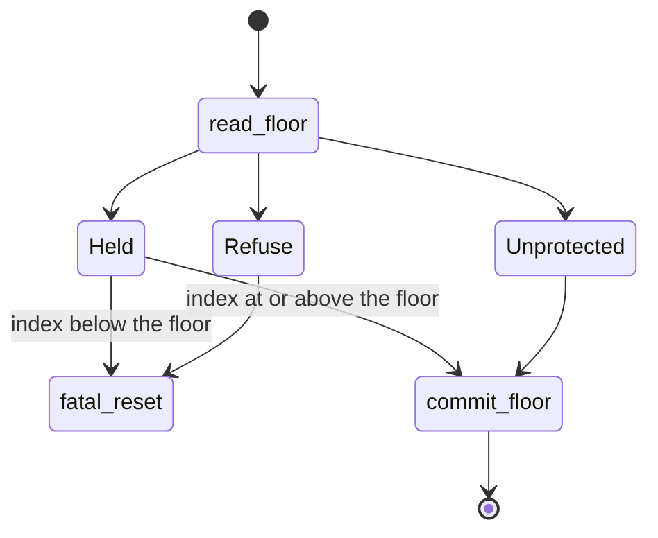

# Rollback protection

NONOS keeps an older signed kernel, an older bootloader tree and a certificate from an older trust anchor from coming back, each by holding a signed number to a floor that NONOS itself never lowers.

## What holds each floor

| What could come back | The number | Where the floor is kept | Who compares |
|---|---|---|---|
| an older signed kernel | the kernel's rollback index, signed into the image | a TPM NV counter | the loader, before the jump |
| an older bootloader tree | the epoch in the boot-root record | the same TPM NV counter | the kernel, at boot |
| a certificate from an older trust anchor | the certificate's trust-anchor epoch | the trust-anchor policy compiled into the kernel | the kernel, at every capsule spawn |

## The kernel's rollback index

The [rollback index](../overview/glossary.md#rollback-index) is signed: `signed_message` puts it after the kernel's BLAKE3 hash, so it cannot change without breaking both signatures (`nonos-bootloader/tools/sign-kernel/src/message.rs:17-22`). A copy sits in the image footer at offset 56 as `rollback_index` (`nonos-bootloader/tools/embed-trailer/src/footer/create.rs:42-43`). `check_rollback` gates on that field and not on the footer's `image_version`, because the image version is not signed and a replayed kernel could carry any value there (`nonos-bootloader/src/boot/crypto/rollback/check.rs:23-38`).

The number comes from `rollback_index` in `nonos.toml`, 1 by default; the comment there says to raise it only for a security release (`nonos.toml:27-29`). The flake refuses a `rollback_index` below 1 (`tools/nix/config.nix:162`). The make rules use `NONOS_ROLLBACK_INDEX`, also 1 by default (`mk/00-config.mk:111-115`), and sign the kernel again when it changes, through `NONOS_ROLLBACK_STAMP` (`mk/00-config.mk:117-119`). `sign-kernel` run by hand defaults its `rollback_index` to 0 (`nonos-bootloader/tools/sign-kernel/src/args.rs:45-46`).

## Where the floor lives

The [rollback floor](../overview/glossary.md#rollback-floor) is kept in TPM NV, and it is not the counter itself. It is how far the counter at `0x01000020` has risen above a base at `0x01000021`, the counter's value when this machine's floor began, as `ROLLBACK_INDEX` and `BASE_INDEX` say (`src/security/tpm/boot_reads/floor.rs:17-32`). A TPM starts every new counter above the highest value any counter on it has held, even after `TPM2_Clear`, so a counter alone would start high on a used TPM; the base makes the floor start at 0, as `a_tpm_whose_counters_counted_starts_the_floor_at_zero_through_a_clear` shows against swtpm (`userland/tpm_enroll_proofs/src/security/tpm/live/floor_tests.rs:44-67`).

The loader defines both indices, writes the base once and raises the counter. The kernel only reads them, each with `TPM2_NV_Read` under an empty password, eight bytes from offset 0, in `read` (`src/security/tpm/boot_reads/floor.rs:37-56`). `rollback_floor` returns 0 for a counter never incremented, and an error for a counter without its base or a base above its counter (`src/security/tpm/boot_reads/floor.rs:58-66`).

The loader's own NV code sits in its verification module, which these pages do not describe. Its behaviour is pinned by host tests in `nonos-bootloader/boot_proofs` that run it against a scripted TPM:

- On a new TPM the loader defines the counter, increments it once, defines the base, writes the counter's value into it and write-locks it; the floor is 0 (`a_new_tpm_starts_the_floor_at_zero_and_locks_its_base`, `nonos-bootloader/boot_proofs/src/floor_seq_tests.rs:35-44`).
- A TPM whose counters already stood high still starts at 0, after a `TPM2_Clear` too (`a_tpm_whose_counters_counted_still_starts_at_zero`, `nonos-bootloader/boot_proofs/src/floor_seq_tests.rs:46-58`).
- A counter that is deleted and defined again reads one above its old floor after `undefine`, never 0 (`nonos-bootloader/boot_proofs/src/floor_seq_tests.rs:77-86`).
- A base that is deleted is set again from the counter, and the floor starts again at 0 (`undefine_base`, `nonos-bootloader/boot_proofs/src/floor_seq_tests.rs:88-94`).
- A locked base takes no write, as `base_write` against it shows (`nonos-bootloader/boot_proofs/src/floor_seq_tests.rs:96-103`).
- A base above its counter, or one that could not be written, gives no floor (`fail_base_write`, `nonos-bootloader/boot_proofs/src/floor_seq_tests.rs:105-111`).
- Any other TPM answer to the read gives no floor and increments nothing (`floor_with`, `nonos-bootloader/boot_proofs/src/floor_seq_tests.rs:122-131`).
- Raising increments the counter until the floor reaches the target and never lowers it; a failed increment reports the floor as not raised (`raise_with`, `nonos-bootloader/boot_proofs/src/floor_raise_tests.rs:20-49`).

`tpm_enroll_proofs` runs the same sequence against a software TPM, including a raise to 5 and a deleted counter that comes back at 6 (`floor_with`, `userland/tpm_enroll_proofs/src/security/tpm/live/floor_tests.rs:31-42`). In this release's flake checks, `proofs-boot_proofs` passed 39 tests and `proofs-tpm_enroll_proofs` passed 37, the second against swtpm; that check fails when a live TPM test is skipped (`needsTpm`, `tools/nix/checks.nix:32-34`).

## How the loader uses it

`check_rollback` runs inside `run_crypto_verification`, right after `verify_signature` (`nonos-bootloader/src/boot/crypto/run.rs:30-46`). `enforce_floor` asks `read_floor` for the floor and `floor_rule` for what to do with the answer (`nonos-bootloader/src/boot/crypto/rollback/floor.rs:28-29`):

- `Held` means the floor was read, and a kernel whose index is below it stops the boot through `fatal_reset` in every mode that requires signatures, with `Rollback: tpm floor N above image index M` on screen and `[FATAL] rollback index below TPM floor` (`nonos-bootloader/src/boot/crypto/rollback/floor.rs:30-40`). Development, which requires no signature, boots it anyway.
- `Refuse` means no floor could be read on a mode that requires a TPM, and the boot stops through `fatal_reset` with `<mode> needs a TPM: its rollback floor keeps an older signed kernel from booting` on screen and `[FATAL] profile requires a TPM rollback floor` (`nonos-bootloader/src/boot/crypto/rollback/floor.rs:41-51`).
- `Unprotected` means no floor on any other mode: the boot goes on, the log says an older signed kernel would boot, and the panel shows `No TPM: rollback protection is off` (`nonos-bootloader/src/boot/crypto/rollback/floor.rs:52-58`).

`requires_tpm` is true for Hardened and for `NetworkIsolated`, the mode the menu calls Air-Gapped (`nonos-bootloader/src/menu/types/mode.rs:56-59`, `nonos-bootloader/src/menu/types/mode.rs:31-39`). The boot proofs hold that mapping for all six modes (`without_a_counter_hardened_and_air_gapped_refuse`, `nonos-bootloader/boot_proofs/src/floor_rule_tests.rs:36-45`).

After the kernel is admitted, `run_verified_boot` calls `commit_rollback` (`nonos-bootloader/src/entry/pipeline.rs:38-42`). `commit_rollback` asks `commit_floor` to raise the floor to the kernel's index (`nonos-bootloader/src/boot/crypto/rollback/commit.rs:40-47`). When the raise fails, `raise_failed` stops the boot on Hardened and Air-Gapped with `Rollback floor could not be raised to index N` on screen and `[FATAL] tpm rollback floor not raised`, and elsewhere, when a TPM is present, warns `Rollback floor not raised: an older kernel may still boot` (`nonos-bootloader/src/boot/crypto/rollback/raise.rs:28-48`).

So once a kernel at index N has booted on a machine with a TPM and the raise succeeded, its floor is at least N, and any kernel signed with a lower index stops at `check_rollback` there, in every mode but Development. Raising the index for a release retires every older kernel on each machine where the new one boots and raises the floor.

## The boot-root record's epoch

The kernel holds the bootloader to the same floor. The [boot-root record](../overview/glossary.md#boot-root-record), `boot_root.approval`, carries an epoch, the release's rollback index, signed together with the bootloader tree's root (`nonos-boot-measure/src/record/mod.rs:17-28`). `check` verifies the signature first and then refuses an epoch below the floor as `Stale` (`nonos-boot-measure/src/record/check.rs:39-52`). A refused record is `BootError::Record`, logged as 200 plus the record's own code, so a `Stale` record logs code 204 (`nonos-boot-measure/src/gate/error.rs:42-55`, `nonos-boot-measure/src/record/error.rs:30-38`).

The make target `nonos-mk-boot-root-record` uses the committed record when it names this build's loader root and stops when it names another; with no committed record it signs a scratch one at `NONOS_ROLLBACK_INDEX` with a scratch policy key, and stops when there is no such key (`mk/20-build.mk:1320-1339`). The seal signs a new record at the profile's rollback index in `records` only when the committed one does not already name the new loader root (`tools/nonos_seal/chain.py:77-87`). Only the measured path has a floor: when the loader brought no log, or the kernel cannot read PCR 4 or the floor, it falls back to `self_reported`, which checks the record against a floor of 0 (`nonos-boot-measure/src/gate/verdict.rs:60-75`). The full check is on [Measured boot and the TPM](measured-boot-and-tpm.md).

## Certificate epochs

Every NONOS ID certificate names the trust-anchor epoch it was issued under, and the certificate check refuses one below the policy's epoch as `EpochStale` (`src/security/nonos_id_cert/verify/checks.rs:27-29`). Raising the policy's epoch and rebuilding the kernel retires every certificate issued under the old one. The build uses `NONOS_TRUST_ANCHOR_EPOCH` 1 (`mk/20-build.mk:218`).

## Attestation epochs

The STARK contexts carry an epoch too. `POLICY_EPOCH`, for capsules, is 1 in the kernel and the enroll tool (`src/security/capsule_attest/layout.rs:17-18`, `nonos-stark-enroll/src/context.rs:19-20`). `BOOT_EPOCH`, for the kernel and the loader, is 1 in the boot-measure crate and the enroll tool (`nonos-boot-measure/src/gate/membership.rs:23-24`). Today the epoch in a context separates nothing. What retires old trailers is the root: `emit` draws a fresh pad seed for every enrollment, so each enrollment gives a new root even for the same slots, and a trailer from an earlier one does not fold to it (`nonos-stark-enroll/src/commands.rs:24-34`). See [STARK attestation](stark-attestation.md).
