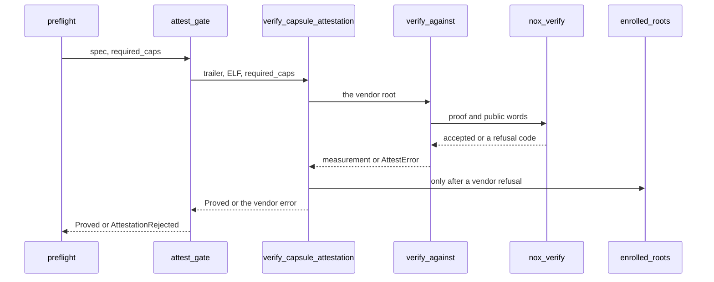

# STARK attestation

NONOS admits a kernel, a loader or a [capsule](../overview/glossary.md#capsule) only when its [attestation trailer](../overview/glossary.md#attestation-trailer) shows that its measurement, and for a capsule the capabilities it is about to get, fill a slot of a tree whose root the checker already holds.

## The statement

Every gate checks one statement: under root R, the leaf built from context C with kind K is a slot of a 256-slot tree. It checks it twice, by folding a Merkle path with Poseidon and by verifying a STARK proof of the same slot, and admits only when both pass. The capsule gate's module comment names both halves, and says that the trusted root is always the kernel's own, never the trailer's (`verify_against`, `src/security/capsule_attest/path.rs:17-35`).

The gate builds the context itself from what it is about to run and grant, and never takes it from a trailer (`capsule_context`, `nonos-attest-path/src/context.rs:17-23`):

| Context | Bytes | Layout |
|---|---|---|
| `capsule_context` | 48 | BLAKE3 of the capsule ELF (32), the capability word (8, big-endian), the policy epoch (8, big-endian) |
| `boot_context` | 40 | the measurement (32), the boot epoch (8, big-endian) |

A kernel's measurement is BLAKE3 of its image; a loader's is the PE Authenticode SHA-256 the firmware records in the TCG log, so the kernel can rebuild it, as `boot_context` notes (`nonos-attest-path/src/context.rs:31-40`). The [capability word](../overview/glossary.md#capability-word) in a capsule's context is the manifest's `required_caps`, so a capsule enrolled with one set of rights does not open with another (`src/kernel_core/process_spawn/capsule_spawn/runner/preflight.rs:70-73`).

The kind is `Kernel` 0, `Capsule` 1, `Pad` 2 or `Bootloader` 3 (`Kind`, `nonos-attest-path/src/leaf.rs:29-39`). `context_digest` is BLAKE3 over the domain `NONOS-ATTEST-PATH-LEAF-v3`, the context's length as a little-endian `u32`, and the context (`nonos-attest-path/src/leaf.rs:41-49`). `leaf_of` puts the domain word `NONOSLV3` in word 0 of a width-8 Poseidon state, the digest's four little-endian words in words 1 to 4 and the kind in word 5, permutes once and keeps the first four words; the kind has a word of its own so that a proof can pin it, and a capsule slot cannot open as a kernel (`nonos-attest-path/src/leaf.rs:51-71`).

The hash is Poseidon over the Goldilocks field, whose modulus `2^64 - 2^32 + 1` the code keeps as a `u64` constant (`nonos-attest-path/src/field.rs:17-18`). It has `WIDTH` 8, 32 full rounds, `x^7` on every word, a Cauchy MDS matrix and round constants from BLAKE3 of `NONOS-POSEIDON-GOLDILOCKS-RC` (`nonos-attest-path/src/params.rs:19-26`, `nonos-attest-path/src/poseidon.rs:20-56`). `verify` rebuilds the leaf, folds it up the path with `compress`, and compares the top with the root; a zero root and the padding kind admit nothing (`nonos-attest-path/src/verify.rs:22-50`).

## The trailer

A v4 trailer carries the path and the proof side by side, little-endian, with nothing allowed after the proof (`MAGIC_V4`, `nonos-attest-path/src/v4/layout.rs:17-36`):

| Offset | Size | Field |
|---|---|---|
| 0 | 8 | `NATTV4` and two zero bytes |
| 8 | 1 | kind: 0 kernel, 1 capsule, 3 bootloader |
| 9 | 4 | n, the length of the path |
| 13 | n | the v3 path, starting with its own magic `NZKPATH1` |
| 13 + n | 4 | m, the length of the proof |
| 17 + n | m | the STARK proof, whose header names its parameter id |

The v3 path is `NZKPATH1`, one depth byte, one 32-byte sibling per level as four canonical little-endian words, then the direction bits from the leaf up, so a depth-8 path is 266 bytes (`parse`, `nonos-attest-path/src/trailer.rs:24-51`). The reader refuses a depth of 0 or above `MAX_DEPTH`, 32 (`nonos-attest-path/src/params.rs:31-34`), a depth byte other than the depth the gate expects, any length but the exact one, and set bits past the depth in the last direction byte (`parse`, `nonos-attest-path/src/trailer.rs:36-51`). `bytes_to_digest` refuses any word at or above the modulus, so each path has one encoding (`nonos-attest-path/src/trailer.rs:64-75`).

`parse_v4` refuses any other magic, a kind other than the one the caller expects, an inner path without its own magic, an empty proof or one over the caller's bound, and any byte past the proof (`nonos-attest-path/src/v4/parse.rs:29-55`). `MAX_PROOF_V4` caps any proof at 256 KiB (`nonos-attest-path/src/v4/layout.rs:28-32`), and `parse_v4` refuses outright when a caller passes a bound of 0 or one above that (`nonos-attest-path/src/v4/parse.rs:32-35`). The gates pass `ATTEST.max_proof_bytes`, the bound of the statement they check (`src/security/capsule_attest/path.rs:45`).

## Three trees

| Tree | Root file | Made by | Checked by |
|---|---|---|---|
| capsule policy | `zk_capsule_policy_root.bin` | `nonos-stark-enroll capsules` | the kernel, at every spawn |
| kernel | `kernel_attest_root.bin` | `nonos-stark-enroll kernel` | the loader, before the jump |
| bootloader | `bootloader_attest_root.bin` | `nonos-stark-enroll bootloader` | the kernel, at boot, under the boot-root record |

All three root files sit under `nonos-data/trust/policy/` (`ZK_CAPSULE_ROOT`, `mk/00-config.mk:82-106`). Each tree has depth 8, so 256 leaves (`DEPTH`, `nonos-stark-enroll/src/context.rs:19-22`).

The kernel compiles the capsule [policy root](../overview/glossary.md#policy-root) in as a static read through `black_box`, so it stays 32 contiguous bytes, and a file of another length fails the build (`ROOT`, `src/security/capsule_attest/policy_root.rs:17-28`). The loader compiles the kernel root in as `KERNEL_ATTEST_ROOT`. A loader built without `dev-mode` or `dev-qemu` fails to build when that root is not given or is all zero, and any loader build fails on a root file that is not 32 bytes (`generate_kernel_attest_root`, `nonos-bootloader/build.rs:245-276`). The comment above that function says a development build boots on signature trust alone; that is out of date, since `attest_kernel` refuses an unattested kernel in every mode. The kernel is enrolled from a frozen copy, `kernel.enrolled.elf`, so a relink in the middle of a build cannot change the bytes under the proof (`KERNEL_ATTEST_STAMP`, `mk/20-build.mk:637-648`).

The loader's tree cannot live in the loader, whose measurement would then depend on a root that depends on it. Its root is embedded in nothing; the release signs it into the [boot-root record](../overview/glossary.md#boot-root-record), as `bootloader` in the enroll tool explains (`nonos-stark-enroll/src/commands.rs:40-48`).

## Who makes the trailers

`nonos-stark-enroll` is the host tool that builds the trees and writes the trailers. It links `nonos-attest-path` with its `alloc` feature, `nonos-boot-measure`, and from the STARKs repository the prover `stark_proofs` with `fri8` and `parallel` and the verifier `nox_verify` (`nonos-stark-enroll/Cargo.toml:12-17`).

| Verb | What it does |
|---|---|
| `capsules <root.bin> <CAPS:image:trailer> ...` | one tree over every capsule given, each with its capability word in hex |
| `kernel <image> <root.bin> <trailer.bin>` | a tree with one slot, for the kernel's BLAKE3 |
| `bootloader <image.efi> <root.bin> <trailer.bin>` | a tree with one slot, for the loader's Authenticode digest |
| `verify`, `verify-kernel`, `verify-bootloader` | check trailers again with the gate's own check |
| `recompute <root.bin.transcript>` | rebuild a root from its transcript |
| `refusal-variants` | broken trailers for the booted refusal test |
| `authenticode <image.efi>` | print a loader's Authenticode digest |
| `selftest` | the enroll, trailer and gate loop, end to end |

The verbs are in `usage` and `main` (`nonos-stark-enroll/src/main.rs:37-68`).

`enroll` takes 1 to 256 slots and starts every leaf as a padding leaf from `pad_leaf`, drawn from a 32-byte pad seed, so no padding digest is known before the tree exists (`nonos-stark-enroll/src/policy.rs:36-41`, `nonos-attest-path/src/leaf.rs:84-96`). The slots take the first leaves in order, the tree is committed, and each slot's path is folded with the gate's own `verify` before anything else (`nonos-stark-enroll/src/policy.rs:42-56`). `emit` draws the pad seed with `os_random`, which reads `/dev/urandom` (`nonos-stark-enroll/src/io.rs:55-61`), and writes the root, each trailer, and a transcript beside the root (`nonos-stark-enroll/src/commands.rs:24-34`).

`prove_v4` builds the prover's statement, then `agree` compares the prover's public words with those of `nox_verify` and refuses on any difference, so a drift between the two is an enrollment error rather than a kernel that refuses its own boot (`nonos-stark-enroll/src/stark/prove.rs:28-67`). It proves with 64 bytes of fresh entropy, makes at most three such attempts when the zero-knowledge rank certificate is not reached, and passes the result through `check_v4`, the gate's full check, before it returns (`nonos-stark-enroll/src/stark/prove.rs:36-52`, `nonos-stark-enroll/src/stark/check.rs:23-43`). A trailer the boot would refuse never leaves the tool.

`prove_all` proves slots in parallel and hands the trailers back in slot order; one proof peaks near 3 GB, so the number of workers is bounded (`nonos-stark-enroll/src/stark/batch.rs:17-41`). It runs `NONOS_ENROLL_JOBS` at a time when that is set, and otherwise half the cores, at most 8, and no more than memory allows at 3.5 GB each (`nonos-stark-enroll/src/stark/batch.rs:82-99`).

The transcript, headed `nonos-policy-transcript v2`, records the depth, both epochs, the pad seed, every slot and the root, since nothing in a tree is secret (`render`, `nonos-stark-enroll/src/transcript.rs:17-40`). `recompute` rebuilds the root through the same `enroll`, so it proves every slot again unless `NONOS_ENROLL_PATHS` is 1, which builds the paths alone (`nonos-stark-enroll/src/transcript.rs:42-82`, `nonos-stark-enroll/src/policy.rs:57-73`). The make rules build the tool at `NONOS_STARK_ENROLL`, under `nonos-stark-enroll/target/` (`mk/00-config.mk:85`). To check a published capsule root from its transcript without proving:

```sh
NONOS_ENROLL_PATHS=1 nonos-stark-enroll recompute zk_capsule_policy_root.bin.transcript
```

Not tested in this release.

The make rule for `ZK_CAPSULE_ROOT` calls `capsules` once with every capsule in `NONOS_ENROLLED_CAPSULES`, so the whole set shares one root; with `NONOS_TRUST_REUSE` set to 1 it only checks that the committed root exists (`mk/20-build.mk:592-605`). The [seal](../overview/glossary.md#seal) runs `kernel` and then `verify-kernel`, `bootloader` and then `verify-bootloader` (`tools/nonos_seal/chain.py:46-62`).

## Who checks them

### At every capsule spawn



`preflight` sorts the manifest's namespace: `systems.nonos` and names under it are `Tier::Enrolled`, everything else `Tier::Publisher` (`src/kernel_core/process_spawn/capsule_spawn/runner/tier.rs:17-28`). Both tiers end in the same `attest_gate`, with the manifest's `required_caps` as the capability word of the context (`src/kernel_core/process_spawn/capsule_spawn/runner/preflight.rs:67-77`, `src/kernel_core/process_spawn/capsule_spawn/runner/publisher_gate.rs:28-33`).

`attest_gate` refuses an empty trailer outright, and any refusal reaches `preflight` as `AttestationRejected`. It prints `[ZK-ATTEST] ok`, `none` or `FAIL` on the serial line with the capsule's name and then the authority or the reason, and for a refused proof the `nox_verify` code (`src/kernel_core/process_spawn/capsule_spawn/runner/attest_gate.rs:23-63`). The reasons are the strings of `AttestError`: missing, malformed, root unavailable, rejected, or `ProofRefused` with a code from 1 to 7 (`src/security/capsule_attest/error.rs:17-37`).

`verify_capsule_attestation` hashes the ELF once with BLAKE3, in serve units so that a long hash still answers TLB shootdowns (`measure`, `src/security/capsule_attest/measure.rs:17-32`). It tries the vendor root first and always; only when that refuses does it try `enrolled_roots`, the roots a person enrolled on this machine, and when none admits the capsule it returns the vendor root's refusal (`src/security/capsule_attest/verify.rs:21-63`). Against the vendor root only a v4 trailer counts. Under an enrolled root, `enrolled` checks a trailer that starts with the local-build magic as a keyed tag of a build made on this machine, not as a STARK (`src/security/capsule_attest/against_root.rs:31-45`).

`verify_against` parses the trailer as a capsule trailer, builds `capsule_context` from the measurement, the capability word and `POLICY_EPOCH`, folds the path to the root, and then has `nox_verify` check the proof over the words of that same context and root (`src/security/capsule_attest/path.rs:34-54`). A success is a `Proved`: the measurement and the `Authority` that vouched, kept as one value (`src/security/capsule_attest/proved.rs:19-28`). The spawn writes both into the attestation registry with `record_attested` once the process exists (`src/kernel_core/process_spawn/capsule_spawn/runner/verified.rs:64-80`).

### Before the kernel runs

The loader's check of the kernel trailer is in its verification module, which these pages do not describe. `attest_kernel` turns its result into a boot or a stop, in every mode (`nonos-bootloader/src/boot/attestation/kernel_gate.rs:34-60`). The handoff's `AttestPolicy` carries the kernel root only when that gate ran and passed, and zero otherwise (`nonos-bootloader/src/handoff/types/security.rs:46-63`). The kernel keeps a copy of the same check, `verify_kernel_self_attestation`: a v4 kernel trailer, `boot_context` over BLAKE3 of the image at `BOOT_EPOCH`, the path and then the proof, and nothing calls it (`src/security/kernel_attest.rs:17-51`).

### The loader, checked by the kernel

`membership` checks the loader's slot the way the spawn gate checks a capsule's: `boot_context` over the Authenticode digest at `BOOT_EPOCH`, the path under the signed root, then the STARK with the bootloader kind (`nonos-boot-measure/src/gate/membership.rs:28-61`). A refused proof is logged as 400 plus the `nox_verify` code (`BootError`, `nonos-boot-measure/src/gate/error.rs:42-55`). Where the measurement and the root come from is on [Measured boot and the TPM](measured-boot-and-tpm.md).

### From userspace

`MkAttestPolicy` returns the kernel tree's root, epoch and depth when the handoff marks them as checked, and the capsule tree's (`sys_attest_policy`, `src/syscall/microkernel/attest_policy.rs:27-46`). Any caller with a valid token may ask (`MkAttestPolicy`, `src/syscall/contract/cap_table/mk.rs:32-35`).

## The anonymous device proof

`nonos-device-attest` proves, to a verifier that learns nothing else, that an approved bootloader started the machine (a `Bootloader` slot in the loader tree), that an approved kernel runs on it (a `Kernel` slot in the kernel tree), that it is an enrolled device (a commitment to its secret is a leaf of a device registry), and that a tag is its tag for the verifier's scope; which loader, which kernel and which device stay private, and one device has one tag per scope (`nonos-device-attest/src/lib.rs:17-32`). The public side is `Statement`: the three roots, the registry depth, the verifier's scope and context, and the tag, all absorbed before the first commitment, so a proof is bound to the verifier's nonce (`nonos-device-attest/src/statement.rs:23-55`). It is proven at `N_QUERIES` 19 with a 28-bit grind and 5 extra blowup bits over a trace of `2^14` rows, and the registry ships at depth 20 (`nonos-device-attest/src/params.rs:25-57`).

The proof shows that an approved chain exists and that the prover holds an enrolled secret. That this machine booted that chain is the TPM's part: the TPM derives the [device secret](../overview/glossary.md#device-secret) only under the release's `PolicyAuthorize` over PCR 9 and this machine's PCRs 0, 4 and 7 (`nonos-device-attest/src/lib.rs:29-32`). The derivation is on [Measured boot and the TPM](measured-boot-and-tpm.md).

The capsule that proves on the booted system is `nonos.prove`, namespace `systems.nonos.app.prove`. Its `CAPSULE_REQUIRED_CAPS` has no network bit, so the person brings the request in and the proof stays on the data volume (`userland/capsule_prove/Capsule.mk:16-35`). It is the one capsule allowed to hold `DeviceSecret`: `DEVICE_SECRET_BIT` 35 is refused in any other capsule's caps at signing time (`scripts/check_device_secret_cap.py:17-34`), and the kernel answers the call only for a caller the vendor root proved (`device_secret_caller`, `src/syscall/microkernel/device_proof/gate.rs:28-36`). Its proof crate, `proofs-prove_proofs`, passed 30 tests in this release's flake checks; the tests of `nonos-device-attest` itself are not among those checks.
