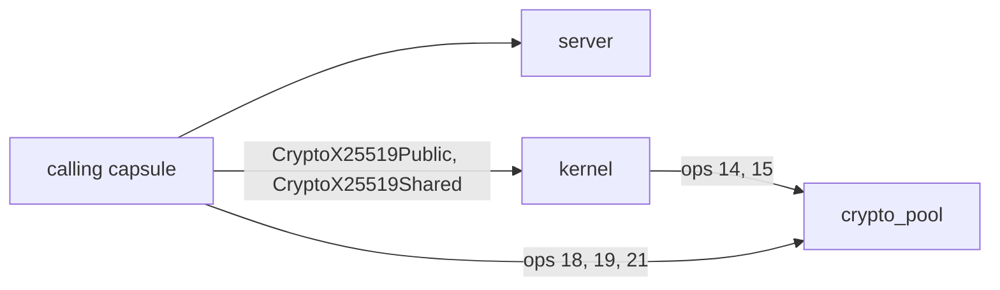
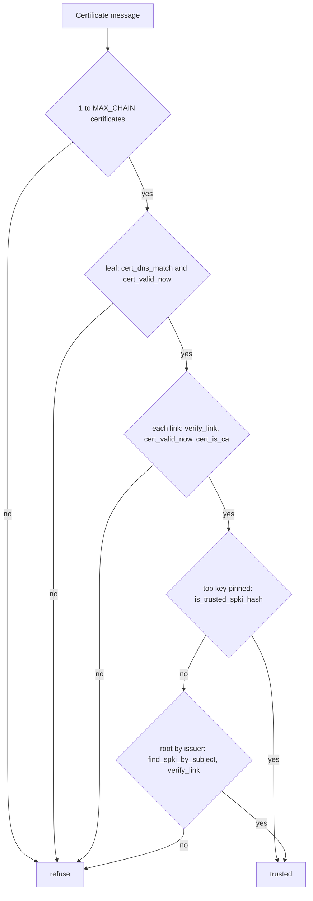

# TLS and certificate trust

How NONOS [capsules](../overview/glossary.md#capsule) talk to HTTPS servers through `nonos_tls`: the protocol it speaks, how a certificate chain is checked, where the trusted roots come from, which clock the dates are read against, and what is not checked.

## Who uses it

`nonos_tls` is a `no_std` TLS 1.3 client written for NONOS. It was lifted out of the browser so that every capsule speaking TLS through it runs the same certificate check (`userland/nonos_tls/src/lib.rs:17-28`, `no_std`). It is a library, not a service, with three ways in: `exchange` runs one request and returns the reply, `stream::connect` returns a `Stream` that stays open, and `HandshakeState` lets a caller with its own event loop drive the steps (`userland/nonos_tls/src/lib.rs:59-63`, `HandshakeState`). It runs inside the capsule that links it, and that capsule needs the `Crypto` [capability](../overview/glossary.md#capability) for the random numbers and the X25519 calls the handshake makes (`src/syscall/contract/cap_table/crypto.rs:22-33`, `can_crypto`).

Nine capsules link it:

| Capsule | What it reaches | Entry point |
|---|---|---|
| `app.browser` | web pages | `HandshakeState::answer`, `userland/capsule_browser/src/browser/fetch/tls/verify_and_send.rs:36` |
| `app.nonos_wallet` | the chain's RPC host | `answer`, `userland/capsule_wallet_nonos/src/wallet/net/step/exchange.rs:303` |
| `app.terminal` | `http` with an `https://` URL, and `git clone` | `answer`, `userland/capsule_terminal/src/mixnet/exchange/tls.rs:70` |
| `app.terminal` | `git push` | `exchange`, `userland/capsule_terminal/src/git/transport/round_trip.rs:60` |
| `tool.model-fetch` | model files at a mirror | `connect`, `userland/capsule_model_fetch/src/http/open.rs:45` |
| `app.audio_player` | an MP3 or WAV file at an `https://` address | `connect`, `userland/capsule_audio_player/src/fetch/job.rs:141` |
| `net.nym` | the [Nym mixnet](../overview/glossary.md#nym-mixnet) directory at `validator.nymtech.net` | `exchange`, `userland/capsule_net_nym/src/directory_sync/fetch_at.rs:53` |
| `net.anon` | relay links, chain not checked | `connect_unauthenticated`, `userland/capsule_net_anon/src/link/open.rs:52` |
| `nonos.shield` | the shield wallet's RPC requests, through `shield_core` | `exchange`, `userland/shield_core/src/net/tor/tls.rs:51` |
| `app.linux` | no TLS through this crate | `verify_rsa`, `userland/capsule_linux/src/linux/install/auth/rsa.rs:21` |

The Terminal's `http` command, also spelled `curl`, `get` or `fetch`, sends a plain `http://` URL without TLS, on port 80 unless one is given. A URL with no scheme is taken as `https://` (`split_scheme` in `userland/capsule_terminal/src/command/builtin/nox/http/url.rs:52-60`). The audio player takes only `https://` addresses. A plain `http://` address, or a redirect to one, is refused, not followed (`parse` in `userland/nonos_download/src/url.rs:37-44`, `resolve` in `userland/nonos_download/src/url.rs:78-82`).

Three paths that look similar do not use it:

- Python in the [Linux personality](../overview/glossary.md#linux-personality) speaks TLS with its own OpenSSL and checks peers against `/etc/ssl/cert.pem`, a copy of the same `nonos-data/cacert.pem` bundle (`userland/linux_userland/Userland.mk:186-193`, `LINUX_USERLAND_STORE_ENTRIES`). The `openssl` program is built with the same `/etc/ssl` directory (`--openssldir` in `tools/linux-userland/openssl.sh:20`).
- Linux package installs fetch over plain HTTP, port 80 by default (`DEFAULT` in `userland/capsule_linux/src/linux/install/mirror.rs:25`). A package is trusted because a signed index names its checksum, not because of the connection; for Alpine that is `verified` (`userland/capsule_linux/src/linux/install/auth/package.rs:28-49`). The personality links `nonos_tls` only to send RSA signature checks to the crypto service through `verify_rsa`.
- `net.anon` carries a TLS 1.2 client of its own for relays that refuse TLS 1.3. It is described under [The unauthenticated path](#the-unauthenticated-path).

## The handshake

The client speaks TLS 1.3 and nothing older. `supported_versions` names only `TLS13`, 0x0304 (`userland/nonos_tls/src/ext_versions.rs:21-25`, `ext_versions`), and a ServerHello that does not name it in that extension is refused (`parse_exts` in `userland/nonos_tls/src/server_hello.rs:46-65`).

The ClientHello carries:

- Two cipher suites, in this order: `TLS_CHACHA20_POLY1305_SHA256` (0x1303), then `TLS_AES_128_GCM_SHA256` (0x1301) (`userland/nonos_tls/src/client_hello.rs:35-37`, `SUITE_CHACHA20_SHA256`).
- Two groups, X25519 then secp256r1, with a key share for each, so a server that takes either answers at once (`ext_keyshare` in `userland/nonos_tls/src/ext_keyshare.rs:21-35`). The source gives the reason for P-256: relays of the Tor lineage, those of the [Anyone network](../overview/glossary.md#anyone-network) among them, answer ECDHE over P-256 alone (`ext_groups` in `userland/nonos_tls/src/ext_groups.rs:21-30`).
- Five signature schemes, the ones the verifier handles: `rsa_pss_rsae_sha256` (0x0804), `rsa_pss_rsae_sha384` (0x0805), `ecdsa_secp256r1_sha256` (0x0403), `ecdsa_secp384r1_sha384` (0x0503) and `rsa_pkcs1_sha256` (0x0401) (`ext_sigalgs` in `userland/nonos_tls/src/ext_sigalgs.rs:21-33`).
- SNI with the host name, in the clear (`ext_sni` in `userland/nonos_tls/src/ext_sni.rs:21-28`).

Those four extensions and `supported_versions`, added by `ext_versions`, are the whole list (`userland/nonos_tls/src/client_hello.rs:40-45`). There is no ALPN, no pre-shared key, no OCSP status request and no Encrypted Client Hello, so anyone on the path between the client and the server can read the host name.

The ServerHello must pick one of the two suites with null compression (`key_share` in `userland/nonos_tls/src/server_hello.rs:24-44`). Its key share must be in an offered group at that group's length, and a P-256 point must be the 65-byte uncompressed form (`parse` in `userland/nonos_tls/src/server_share.rs:29-50`).

A HelloRetryRequest is recognised by its fixed random, `HELLO_RETRY_RANDOM` (`userland/nonos_tls/src/hello_retry.rs:19-27`), and ends the handshake. No second ClientHello is sent. `exchange` and `connect` return `SessionError::RetryUnsupported` (`userland/nonos_tls/src/session/start.rs:33-37`), and the browser, the wallet and the Terminal end the request. The hello already carries a share for both groups it offers, so a retry for a group would name one this client lacks. A retry sent for any other reason ends the handshake the same way.

The server's encrypted flight is read in order (`scan` in `userland/nonos_tls/src/scan_server_finished.rs:44-81`):

1. A CertificateRequest may come once, before the server's Certificate. The client answers it with an empty Certificate, so it never presents one (`certificate_request` in `userland/nonos_tls/src/scan_messages.rs:33-59`, `empty_certificate` in `userland/nonos_tls/src/handshake_state/verify.rs:74-85`).
2. One Certificate. A second one, or one after the signature, is refused (`certificate` in `userland/nonos_tls/src/scan_messages.rs:61-72`). With a host named, the chain walk below runs here.
3. CertificateVerify must verify with the leaf's key over the transcript so far (`certificate_verify` in `userland/nonos_tls/src/scan_messages.rs:78-91`).
4. Finished counts only after a CertificateVerify has verified, and its MAC is compared in constant time (`verify` in `userland/nonos_tls/src/finished_verify.rs:17-28`).

The request is sealed only after the chain, CertificateVerify and Finished have all passed, so a refused server never receives it (`answer` in `userland/nonos_tls/src/handshake_state/answer.rs:48-62`). `exchange` sends one request per connection and returns the decrypted reply; `stream::connect` returns a `Stream` that stays open.

| Limit | Value | Code |
|---|---|---|
| Handshake flight, `exchange` | 128 KiB | `MAX_FLIGHT`, `userland/nonos_tls/src/session/exchange.rs:30` |
| Handshake flight, `stream::connect` | 128 KiB | `FLIGHT_MAX`, `userland/nonos_tls/src/stream/limits.rs:26` |
| Silence allowed during the handshake, `exchange` | 4 s | `QUIET_MS`, `userland/nonos_tls/src/session/flight.rs:30` |
| Silence allowed during the handshake, `stream::connect` | 8 s | `QUIET_MS`, `userland/nonos_tls/src/stream/gather.rs:26` |
| Protected record body | 2^14 + 256 bytes | `CIPHERTEXT_MAX`, `userland/nonos_tls/src/record_open.rs:22` |
| Decrypted record | 2^14 + 1 bytes | `PLAINTEXT_MAX`, `userland/nonos_tls/src/record_open.rs:24` |
| Received bytes a `Stream` buffers before decrypting | 256 KiB | `PARTIAL_MAX`, `userland/nonos_tls/src/stream/limits.rs:24` |
| Certificates in one chain | 10 | `MAX_CHAIN`, `userland/nonos_tls/src/chain_walk.rs:20` |

A record over a size limit, or one that does not decrypt, ends the reading, and nothing after it is believed. `exchange` returns the reply up to that record (`feed` in `userland/nonos_tls/src/app_reader.rs:45-65`); a `Stream` marks itself done (`absorb` in `userland/nonos_tls/src/stream/absorb.rs:25-57`). A `Stream` whose unread bytes would pass `PARTIAL_MAX` returns `SessionError::TooLarge` (`read` in `userland/nonos_tls/src/stream/io.rs:40-56`).

## What runs where



In the calling capsule: the SHA-256 transcript hash (`Transcript` in `userland/nonos_tls/src/transcript.rs:28-31`), HKDF and HMAC for the key schedule (`extract` in `userland/nonos_tls/src/hkdf.rs:21-28`), the P-256 key pair and agreement (`generate` and `shared` in `userland/nonos_tls/src/p256_share.rs:27-55`) and both record ciphers (`seal` in `userland/nonos_tls/src/record_seal.rs:21-47`). These touch secrets that already live in the caller's memory.

Through the kernel: the X25519 key pair and agreement are the `CryptoX25519Public` and `CryptoX25519Shared` system calls (`agree` in `userland/nonos_tls/src/server_keys.rs:39-50`). The kernel checks the `Crypto` bit and forwards them to the crypto capsule as operations 14 and 15 (`handle_x25519_shared` in `src/syscall/dispatch/crypto/primitives/ecdh.rs:38-53`, `OP_X25519_SHARED` in `src/security/crypto_capsule/client/x25519_shared.rs:22`). The X25519 private key is drawn in the caller and passed in on both calls, so the kernel and the crypto capsule see it. Random bytes come from the `CryptoRandom` system call (`crypto_random` in `userland/nonos_tls/src/client_flight.rs:24-32`).

In `crypto_pool`: every signature check. The caller looks the service up by name and keeps the port (`crypto_port` in `userland/nonos_tls/src/crypto_port.rs:28-43`) and calls it over IPC: operation 18 for ECDSA P-256, 19 for ECDSA P-384 and 21 for RSA (`OP_RSA_VERIFY` in `userland/capsule_crypto/src/protocol/primitives.rs:17-24`). `crypto_pool` is the service [endpoint](../overview/glossary.md#endpoint) of `capsule_crypto` on port 4102 (`CAPSULE_SERVICE_ENDPOINT` in `userland/capsule_crypto/Capsule.mk:13`).

ChaCha20-Poly1305 comes from the `chacha20poly1305` crate (`userland/nonos_tls/src/chacha_record.rs:17-22`, `ChaCha20Poly1305`). AES-128-GCM is written in the crate. Its block cipher indexes a 256-byte S-box with state bytes (`SBOX` in `userland/nonos_tls/src/aes_gcm/aes128.rs:20`), and its GHASH branches on each bit of its input (`gf_mul` in `userland/nonos_tls/src/aes_gcm/ghash.rs:20-26`). Lookups and branches that follow secret data can leak through cache timing; the crate makes no constant-time claim for this path. The server chooses the suite, and the client lists ChaCha20-Poly1305 first.

## The chain check

`verify_chain` runs on the server's Certificate message, for the host the caller asked for, at the clock reading the caller passes (`userland/nonos_tls/src/chain_walk.rs:22-29`, `verify_chain`). Anything it cannot parse refuses the chain.



1. The message must hold 1 to `MAX_CHAIN`, ten, certificates. A longer list is refused before any signature is checked (`userland/nonos_tls/src/chain_walk.rs:17-33`, `MAX_CHAIN`).
2. The leaf must name the host (`cert_dns_match`) and be inside its validity window (`cert_valid_now`) (`userland/nonos_tls/src/chain_walk.rs:34-41`).
3. Each certificate must be signed by the next one up (`verify_link`), and that issuer must be inside its own window and be a CA (`cert_is_ca`) (`userland/nonos_tls/src/chain_walk.rs:42-62`).
4. The top certificate is trusted if the SHA-256 of its key is pinned (`is_trusted_spki_hash`). Otherwise the store is searched for a root whose subject equals the top certificate's issuer (`find_spki_by_subject`), and the top certificate's signature must verify under that root's key (`anchor` in `userland/nonos_tls/src/chain_walk.rs:69-87`). If neither holds, the chain is refused.

Names. `matches` finds subjectAltName by walking the certificate's extension list, not by searching its bytes, so a name planted in a public key is never read (`userland/nonos_tls/src/cert_dns_match.rs:22-50`, `matches`). Only dNSName entries count, compared without regard to ASCII case. A `*.` wildcard covers exactly one leftmost label (`wildcard` in `userland/nonos_tls/src/cert_dns_match.rs:52-65`). There is no fallback to the subject's common name, and iPAddress entries are not read, so a host given as an address fails unless a dNSName spells it out.

Dates. A certificate is valid when notBefore is at or before the clock and notAfter at or after it, both read as `YYYYMMDDhhmmss` numbers (`cert_valid_now` in `userland/nonos_tls/src/cert_valid_now.rs:17-34`). Only times ending in `Z` are read, and a UTCTime year below 50 is 20xx (`cert_time_value` in `userland/nonos_tls/src/cert_time_value.rs:17-36`).

Authority. An issuer needs basicConstraints with cA true. When it carries keyUsage, keyCertSign must be set. Absent or unreadable constraints deny (`cert_is_ca` in `userland/nonos_tls/src/cert_is_ca.rs:25-39`).

Signatures on certificates. ECDSA P-256 with SHA-256, ECDSA P-384 with SHA-384, RSA PKCS#1 v1.5 with SHA-256 or SHA-384, and RSASSA-PSS are accepted (`verify_link` in `userland/nonos_tls/src/verify_link/link.rs:20-35`). RSASSA-PSS is checked as SHA-256 without reading its parameters (`RsaPssSha256` in `userland/nonos_tls/src/cert_sig_alg.rs:38-46`). RSA with SHA-512 and every other algorithm are refused.

Not checked. The walk reads three extensions, basicConstraints, keyUsage and subjectAltName (`OID_BASIC_CONSTRAINTS` in `userland/nonos_tls/src/cert_is_ca.rs:17-20`). Name constraints, path length limits, extended key usage and unknown critical extensions are not read. A root found by subject lends its key and nothing else: the store holds no dates, so a root's own expiry is not checked (`STORE` in `userland/nonos_tls/src/roots/store.rs:17-24`). There is no revocation check of any kind.

When a chain is refused, `cert_problem` names the first finding for the error message: `NameMismatch`, `Expired`, `NotYetValid`, `UnknownIssuer` or `Unreadable`. It runs after the refusal and decides nothing (`CertProblem` in `userland/nonos_tls/src/cert_problem.rs:19-33`). The browser words an expired certificate as `certificate expired: the site's certificate has expired, or this machine's clock is wrong` and adds the clock reading (`sentence` in `userland/capsule_browser/src/browser/fetch/tls_reason.rs:49-68`).

## Where the roots come from

Two tables are compiled into the crate, under `userland/nonos_tls/src/roots`:

- `store.bin` holds 145 records, each a root's subject and its SubjectPublicKeyInfo, generated from `nonos-data/cacert.pem` (`find_spki_by_subject` in `userland/nonos_tls/src/roots/store.rs:17-33`). Every record matches a certificate in that bundle byte for byte, and the bundle holds 145 certificates. This is the issuer lookup in step 4.
- 129 pinned SHA-256 hashes of SubjectPublicKeyInfo: four generated chunks of 32 and one extra, ISRG Root X2, added by hand (`EXTRA_ROOTS` in `userland/nonos_tls/src/roots/extra.rs:17-31`). This is the pinned test in step 4 (`is_trusted_spki_hash` in `userland/nonos_tls/src/roots/lookup.rs:19-25`).

The bundle is Mozilla's root list in the PEM form [curl publishes](https://curl.se/docs/caextract.html). Run from the repository root:

```sh
grep -c 'BEGIN CERTIFICATE' nonos-data/cacert.pem
sed -n 4p nonos-data/cacert.pem
```

```text
145
## Certificate data from Mozilla last updated on: Wed Feb 11 18:26:30 2026 GMT
```

The two tables are not the same list. When the key of every certificate in the bundle is hashed, 98 of the 129 pinned hashes match one and 31 match none. `extract_root_cas.py` names two of those 31: `GlobalSign Root CA R1` and `Baltimore CyberTrust Root` (`STORE_GROUPS` in `nonos-utils/extract_root_cas.py:37-95`), and `generate_ca_store.py` lists the second as excluded (`EXCLUDED` in `nonos-utils/generate_ca_store.py:22-29`). The bundle holds neither. A server whose top certificate carries one of the 31 keys is still anchored by the hash. The 47 roots in the bundle without a pinned hash anchor through the issuer lookup.

No tool in this tree writes `store.bin` or the chunk tables. The list of committed binaries classes `store.bin` as `generated`, an output of a tool in this repository (`scripts/baselines/prebuilt.txt:4-10`, `generated`), yet nothing here produces it. `generate_ca_store.py` writes one Rust file per root around a `TrustedRootCa` type that `nonos_tls` does not have (`generate_ca_file` in `nonos-utils/generate_ca_store.py:196-216`). `extract_root_cas.py` writes `TrustedRootCa` tables too, one file per group, into a `generated_store` directory beside itself (`out_dir` in `nonos-utils/extract_root_cas.py:566`). Files of that shape sit in `nonos-data/generated_store`, and nothing builds them. Anyone can check the tables against the bundle, as above, but no script at this commit regenerates them.

The bundle itself is pinned. `check_prebuilt.py` refuses an `upstream` file whose SHA-256 differs from its line in `scripts/baselines/upstream.sha256` (`scripts/check_prebuilt.py:58-59`, `upstream`), and `nonos-data/cacert.pem` is classed `upstream` (`scripts/baselines/prebuilt.txt:14`). At this commit the SHA-256 of `nonos-data/cacert.pem` matches its line in `scripts/baselines/upstream.sha256`.

## The clock

Callers read the clock with `rtc_now`. It asks the kernel for the hardware clock with `mk_time_rtc` and packs it as `YYYYMMDDhhmmss`. When the clock cannot be read it returns zero (`userland/nonos_tls/src/rtc_now.rs:20-37`, `rtc_now`). The wallet reads the clock the same way through its own copy, `rtc_stamp`, which answers `None` instead (`userland/capsule_wallet_nonos/src/wallet/net/rtc_stamp.rs:19-32`, `rtc_stamp`).

A zero clock refuses every chain, since no notBefore is at or before zero. When the leaf names the host, the reason `cert_problem` gives is `NotYetValid`, not `Expired` (`window_problem` in `userland/nonos_tls/src/cert_problem.rs:79-90`). The comment on `rtc_now` says expired; `cert_problem` says not yet valid.

`MkTimeRtc` reads the battery-backed clock on every call (`sys_time_rtc` in `src/syscall/microkernel/time.rs:33-36`). On x86_64 that is the CMOS clock, and `unix_timestamp` always returns a value there (`src/arch/wall_clock.rs:29-31`, `unix_timestamp`). On aarch64 it is a PL031 at the address the device tree names, and a board without one gives no reading (`BASE` in `src/arch/aarch64/rtc/state.rs:19-20`). On riscv64 the answer is always `None` (`src/arch/wall_clock.rs:34-35`). Where there is no clock, every chain is refused. The CMOS reading is converted to Unix seconds with no zone offset (`read_unix_timestamp` in `src/arch/x86_64/time/rtc/read.rs:107-112`), so it is read as UTC. A machine that keeps local time in its clock is off by its zone offset.

The desktop image has no network time. The time client, `net.ntp.client`, is compiled in by the feature its `CAPSULE_FEATURE` names, `nonos-capsule-net-ntp` (`userland/capsule_net_ntp/Capsule.mk:9`), and of the kernel feature sets only `microkernel-net-ntp` lists it. `make` builds `microkernel-full-gui`, which does not include it (`Cargo.toml:627-647`, `make`). Where the time client does run, `MkTimeAdjust` moves only the millisecond clock (`sys_time_adjust` in `src/syscall/microkernel/time.rs:88-94`), so certificates are still read against the hardware clock.

Nothing in NONOS sets the hardware clock. `write_rtc` exists, and nothing outside its own module calls it (`write_rtc` in `src/arch/x86_64/time/rtc/write.rs:25`). A clock that is wrong has to be set outside NONOS, in UTC. To see what NONOS reads, run this in the Terminal. It prints the same clock, marked UTC, or `date: clock unavailable` (`run` in `userland/capsule_terminal/src/command/builtin/nox/date.rs:22-45`):

```text
date
```

Not tested in this release.

What callers do when the clock cannot be read:

- The shield refuses before the handshake, with `no clock to check the certificate against` (`run` in `userland/shield_core/src/net/tor/tls.rs:45-50`).
- The wallet refuses with a message that starts `this machine's clock could not be read` (`NO_CLOCK` in `userland/capsule_wallet_nonos/src/wallet/net/step/exchange.rs:58-59`).
- The browser runs the walk with zero and shows the refusal with `the clock could not be read` in place of the clock reading (`clock` in `userland/capsule_browser/src/browser/fetch/tls_reason.rs:79-82`).
- The Terminal, the model download, the audio player and `net.nym` pass zero to the walk, which refuses every chain.

Python's dates come from the clock the personality answers for Linux programs, `mk_time_millis` (`now_ms` in `userland/capsule_linux/src/linux/call/clock.rs:37-46`). The kernel anchors that clock at boot to the time in the [boot handoff](../overview/glossary.md#boot-handoff), or to the hardware clock when the handoff carries none (`resolve_epoch_ms` in `src/sys/clock/core/init.rs:39-47`). The loader fills the handoff from the firmware's `GetTime`, read as UTC (`get_uefi_time_epoch` in `nonos-bootloader/src/handoff/timing.rs:25-49`). On the desktop image, with no network time, a wrong firmware clock breaks Python's certificate checks too.

## The unauthenticated path

`stream::connect_unauthenticated` and `server_complete_unauthenticated` finish a handshake without `verify_chain` (`server_complete_unauthenticated` in `userland/nonos_tls/src/server_complete/entry.rs:35-42`). CertificateVerify and Finished are still checked, so the peer proves it holds the key of the leaf it sent. Nothing ties that key to a name: the caller must do that itself (`settle` in `userland/nonos_tls/src/stream/settle.rs:29-49`).

`net.anon` is the only caller, for links to relays of the Anyone network, whose certificates are not expected to chain to a public root (`connect_unauthenticated` in `userland/nonos_tls/src/stream/connect.rs:33-37`). The SNI it sends is the relay's own address, so no fixed name marks a NONOS client (`userland/capsule_net_anon/src/link/open.rs:45-52`, `connect_unauthenticated`). After the handshake, `bind` reads the relay's CERTS cell. It checks that the identity key the consensus published signed a signing key, that the signing key certifies the SHA-256 of exactly the TLS leaf this handshake received, and that neither certificate has expired (`bind` in `userland/capsule_net_anon/src/link/bind/verify.rs:26-57`).

`net.anon` also carries the only TLS 1.2 client among the NONOS capsules, `tls12`; Linux programs built on OpenSSL bring their own. It is tried once, on a fresh connection, only when a relay answers the TLS 1.3 hello with `handshake_failure` (40) or `protocol_version` (70) (`refuses_tls13` in `userland/capsule_net_anon/src/link/fallback.rs:18-30`). It offers ECDHE over P-256 with ChaCha20-Poly1305 or AES-256-GCM, refuses a server whose random carries the TLS 1.3 downgrade mark, and binds the relay's certificate through the same CERTS cell (`userland/capsule_net_anon/src/link/tls12/mod.rs:18-60`, `Tls12Error`). `nonos_tls` itself has no downgrade path.

## What it does not do

- No TLS 1.2 or older. The browser says `This site only speaks TLS 1.2, which this browser does not support yet.` (`Tls12Only` in `userland/capsule_browser/src/browser/fetch/tls_reason.rs:51-53`).
- No HelloRetryRequest: the handshake ends instead.
- No session resumption, pre-shared keys or 0-RTT. A NewSessionTicket is read past and dropped (`take` in `userland/nonos_tls/src/app_reader.rs:67-72`).
- No client certificates. A CertificateRequest gets an empty Certificate.
- No revocation: no OCSP, no CRL and no stapled status.
- No KeyUpdate. A `Stream` ends at one (`KEY_UPDATE` in `userland/nonos_tls/src/stream/dispatch.rs:30-37`).
- No ALPN and no Encrypted Client Hello.
- No `rsa_pss_rsae_sha512` and no RSA with SHA-512 on certificates.
- No name constraints, path length limits or extended key usage.
- CertificateVerify accepts `rsa_pkcs1_sha256` (0x0401), which RFC 8446 section 4.4.3 does not allow in that message (`verify_cert_verify` in `userland/nonos_tls/src/cert_verify_msg/verify_cert_verify.rs:21-44`).

## Tests

`userland/tls_proofs` is the [proof crate](../overview/glossary.md#proof-crate) for this client. It compiles the crate's own source files by `#[path]` (`userland/tls_proofs/src/modules_cert.rs:19-23`, `cert_at`), and its stand-in libc answers crypto calls with the crypto capsule's own handlers (`userland/tls_proofs/shim/src/server.rs:19-23`, `dispatch`). Its inputs are the RFC 8448 handshake trace, a chain served by a re-signing gateway, a server played in `userland/tls_proofs/src/tests/fake_server.rs`, and a certificate and hello shape taken from a live Anyone relay.

Among its tests:

- `a_chain_longer_than_ten_is_refused_before_any_signature` (`userland/tls_proofs/src/tests/chain_length.rs:38`).
- `a_zero_clock_refuses_everything` (`userland/tls_proofs/src/tests/chain_validity.rs:47`).
- `a_name_hidden_in_the_public_key_is_not_claimed` (`userland/tls_proofs/src/tests/chain_names_forged.rs:43`).
- `a_certificate_after_the_signature_is_refused` (`userland/tls_proofs/src/tests/flight_order.rs:77`).
- `the_hello_offers_tls13_alone` (`userland/tls_proofs/src/tests/tls13_only.rs:111`).
- `a_key_update_ends_the_session_and_a_ticket_does_not` (`userland/tls_proofs/src/tests/stream_records.rs:79`).

The crate has 131 tests. Two are ignored by default because they need the network or a TLS 1.2 server, `live_relays_complete_the_handshake` (`userland/tls_proofs/src/tests/live_relay.rs:46-48`) and `record_openssl_tls12` (`userland/tls_proofs/src/tests/tls13_only.rs:149-151`). On this commit the flake check `proofs-tls_proofs` passed with 129 tests. The fuzz workflow runs two targets on it, `tls_cert` and `tls_record` (`.github/workflows/fuzz.yml:45-49`). `net.anon`'s TLS 1.2 client has its own crate, `userland/anon_tls12_proofs`, which replays handshakes recorded from an OpenSSL server; `proofs-anon_tls12_proofs` passed with 34 tests.

To run the TLS tests on a build machine:

```sh
cd userland/tls_proofs && cargo test --release
```

Not tested in this release.

## See also

- [Security](README.md)
- [Protections and limits](protections-and-limits.md)
- [Capsule isolation](capsule-isolation.md)
- [Randomness and cryptography](randomness-and-cryptography.md)
- [How the Nym and Anyone transports are built](anonymity-transports.md)
- [Privacy networks](../using/privacy-network.md)
- [The Browser](../using/browser.md)
- [Wallet](../using/wallet.md)
- [Audio](../using/audio.md)
- [Terminal](../using/terminal.md)
- [Local AI](../using/local-ai.md)
- [The Linux personality](../userland/linux-personality.md)
- [IPC services](../userland/ipc-services.md)
- [Timers](../kernel/timers.md)
- [Tests and proofs](../contributing/tests-and-proofs.md)
- [nonos_tls source](../../userland/nonos_tls/src/lib.rs)
