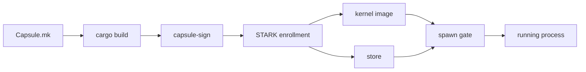

# Userland

Every program NONOS runs outside the kernel runs in ring 3, as a [capsule](../overview/glossary.md#capsule) or as a Linux [guest](../overview/glossary.md#guest) of one; this section covers what a capsule is, how it goes from source to a running process, and what lives under `userland/`.

## What a capsule is

A capsule is an ELF and three files that vouch for it, and the kernel reads the four together. The build writes the three into `nonos-data/trust/capsules/` as `<bin>.nonos_id_cert.bin`, `<bin>.manifest.bin` and `<bin>.zk_trailer.bin` (`nonos-mk/capsule.mk:101-103`, `CAPSULE_BIN_NAME`).

- The ELF is a static, position independent executable for the `x86_64-nonos-user` target, whose `vendor` is `nonos` and whose linker runs with `-nostdlib -pie` (`userland/x86_64-nonos-user.json:4-27`).
- The [NONOS ID certificate](../overview/glossary.md#nonos-id-certificate) names the [publisher](../overview/glossary.md#publisher)'s two public keys, the namespaces the publisher may sign for and a ceiling on capabilities.
- The [manifest](../overview/glossary.md#manifest) binds the BLAKE3 hash of the ELF, its namespace, its IPC endpoints and the capabilities it asks for, signed by the publisher.
- The [attestation trailer](../overview/glossary.md#attestation-trailer) comes from one STARK enrollment of the whole capsule set.

The kernel does not take a capsule's word for anything. It computes a [capability word](../overview/glossary.md#capability-word) from the verified manifest. Every system call passes a gate, most of them a bit in that word, and every IPC send is checked against it. [Manifests and capabilities](manifests-and-capabilities.md) has the rules.

## From source to a running process

1. Declare. A capsule is declared once, in its `Capsule.mk`: slug, binary name, crate directory, handle, domain, namespace, service and reply endpoints and required capabilities, followed by an include of the shared template. The template stops the build when any of those is missing (`nonos-mk/capsule.mk:28-54`, `CAPSULE_REQUIRED_CAPS`).
2. Build. The template runs `cargo build --release` for the target with `-Zbuild-std`, core and alloc by default (`nonos-mk/capsule.mk:186-198`, `USERLAND_LIBC`). A capsule made from an unmodified crates.io program is built by its own rule in `mk/20-build.mk` and copied in (`nonos-mk/capsule.mk:92`, `CAPSULE_PREBUILT_BIN`).
3. Sign. The host tool `capsule-sign` issues the certificate under the [trust anchor](../overview/glossary.md#trust-anchor) and signs the manifest with the publisher's Ed25519 and ML-DSA-65 keys (`nonos-mk/capsule.mk:252-297`, `CAPSULE_SIGN_BIN`). [Signing and publisher keys](signing-and-publisher-keys.md) walks through it.
4. Enroll. One run of `nonos-stark-enroll` measures every capsule and writes the [policy root](../overview/glossary.md#policy-root) and one trailer per capsule (`mk/20-build.mk:600-605`, `NONOS_STARK_ENROLL`).
5. Ship. A capsule the kernel starts by itself is compiled into the kernel image by its [kernel mirror](../overview/glossary.md#kernel-mirror), for example `PROOF_IO_ELF` in `src/userspace/capsule_proof_io/embed.rs:17-35`. A capsule installed later lives in the [store](../overview/glossary.md#store) and reaches the kernel through `sys_capsule_load` (`src/syscall/microkernel/capsule_load/handle.rs:29-34`).
6. Admit. The [spawn gate](../overview/glossary.md#spawn-gate), `spawn_verified_as`, checks the [boot profile](../overview/glossary.md#boot-profile), then verifies the certificate, the manifest and its signatures, the ELF hash, the target, the endpoints, the capability grant and the trailer (`src/kernel_core/process_spawn/capsule_spawn/runner/verified.rs:38-63`).
7. Spawn. `finish` claims the reply inbox, loads the ELF, installs the capability word, allocates the stacks, registers the service [endpoint](../overview/glossary.md#endpoint) and puts the process on the run queue (`src/kernel_core/process_spawn/capsule_spawn/runner/install/install.rs:88-117`).

A failure at any step stops that capsule and nothing else. A process that fails half way through step 7 is torn down with exit status -1 (`src/kernel_core/process_spawn/capsule_spawn/runner/install/install.rs:79-80`, `SPAWN_FAILED`).
