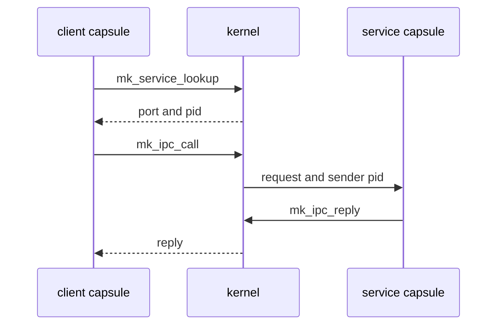

# IPC services

A [capsule](../overview/glossary.md#capsule) finds a system service by name, the kernel decides whether it may send there, and each service frames its messages in a fixed binary layout; all three are set out below.

## Finding a service and calling it

A service is a capsule that registered a name on a port, its service [endpoint](../overview/glossary.md#endpoint). A client never needs the port number in advance:

1. `mk_service_lookup` sends the name to the kernel and gets back the port and the pid that owns it (`userland/libc/src/ipc/lookup.rs:24-35`, `mk_service_lookup`).
2. `mk_ipc_call` sends the request and waits for the reply (`userland/libc/src/ipc/call.rs:19-43`, `mk_ipc_call_timeout`).
3. The service reads requests with `mk_ipc_recv`, or `mk_ipc_recv_from` when it wants the kernel-recorded sender pid, and answers with `mk_ipc_reply` or `mk_ipc_send_to_pid`.

What the kernel does on a call (`src/syscall/microkernel/ipc/call/sys_ipc_call.rs:48-139`, `sys_ipc_call`):

- The reply buffer must hold 1 byte to 1 MiB, the kernel's `MAX_MESSAGE_SIZE` (`src/ipc/nonos_channel/limits.rs:26`, `MAX_MESSAGE_SIZE`).
- Each call carries a fresh correlation token, never zero. Only a reply with that token completes the call, so a message forged with a plain send cannot pose as the answer (`src/syscall/microkernel/ipc/call/sys_ipc_call.rs:34-46`, `next_call_token`).
- A timeout of 0 means 5000 ms (`src/syscall/microkernel/ipc/call/sys_ipc_call.rs:90`, `timeout_ms`).

A service should not trust a pid written inside a message. The kernel records who sent each message, and a receiver compares that with the pid `mk_service_lookup` reports for the service it expects (`userland/nonos_service/src/lookup.rs:25-30`, `raw`).

## Who may send

Every send is checked against the caller's [capability word](../overview/glossary.md#capability-word). The caller must hold every bit the endpoint requires. A name nobody registered and an endpoint with no stated requirement are refused outright, and a caller short of a bit is refused with a `[CAP-DENY]` line on the kernel log that names the bits it needed and the bits it holds (`src/syscall/microkernel/ipc/send_caps.rs:36-63`, `caller_satisfies_endpoint`). A service endpoint requires IPC. The eleven network services, `net.core`, `net.l2`, `net.ip`, `net.udp`, `net.tcp`, `net.dns`, `net.dhcp.client`, `net.sockets`, `net.nym`, `net.anon` and `net.socks5`, require Network as well (`src/services/registry/policy.rs:26-45`, `NETWORK_SERVICES`).

A service may add its own rules on top, and several do; the sections below say which.

## The common header

Most services frame each message with the same 20-byte header, all fields little-endian, followed by the payload. This is the `vfs_pool` decoder (`userland/capsule_vfs/src/protocol/decode.rs:27-50`, `decode_request`):

| Bytes | Field |
|---|---|
| 0 to 3 | magic, one per service |
| 4 to 5 | version, 1 |
| 6 to 7 | operation |
| 8 to 9 | flags |
| 10 to 11 | reserved, zero |
| 12 to 15 | request id, echoed in the reply |
| 16 to 19 | payload length |

A reply carries the same header, and its payload starts with a signed 32-bit status, 0 or a negative errno (`userland/capsule_vfs/src/protocol/encode.rs:21-33`, `encode_response`). The keyring and the policy store use shorter headers of their own, described below. The kernel side of the wire, the calls, the envelope and the limits, is in [ABI: IPC](../abi/ipc.md).
