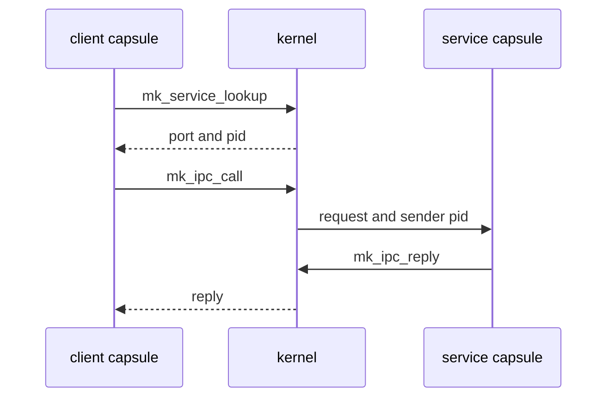

# IPC services

A [capsule](../overview/glossary.md#capsule) finds a system service by name, the kernel decides whether it may send there, and each service frames its messages in a fixed binary layout; all three are set out below.

## Finding a service and calling it

A service is a capsule that registered a name on a port, its service [endpoint](../overview/glossary.md#endpoint). A client never needs the port number in advance:

1. `mk_service_lookup` sends the name to the kernel and gets back the port and the pid that owns it (`userland/libc/src/ipc/lookup.rs:24-35`, `mk_service_lookup`).
2. `mk_ipc_call` sends the request and waits for the reply (`userland/libc/src/ipc/call.rs:19-43`, `mk_ipc_call_timeout`).
3. The service reads requests with `mk_ipc_recv`, or `mk_ipc_recv_from` when it wants the kernel-recorded sender pid, and answers with `mk_ipc_reply` or `mk_ipc_send_to_pid`.

What the kernel does on a call (`src/syscall/microkernel/ipc/call/sys_ipc_call.rs:48-139`, `sys_ipc_call`):

- The reply buffer must hold 1 byte to 1 MiB, the kernel's `MAX_MESSAGE_SIZE` (`src/ipc/nonos_channel/limits.rs:26`, `MAX_MESSAGE_SIZE`).
- Each call carries a fresh correlation token, never zero. Only a reply with that token completes the call, so a message forged with a plain send cannot pose as the answer (`src/syscall/microkernel/ipc/call/sys_ipc_call.rs:34-46`, `next_call_token`).
- A timeout of 0 means 5000 ms (`src/syscall/microkernel/ipc/call/sys_ipc_call.rs:90`, `timeout_ms`).

A service should not trust a pid written inside a message. The kernel records who sent each message, and a receiver compares that with the pid `mk_service_lookup` reports for the service it expects (`userland/nonos_service/src/lookup.rs:25-30`, `raw`).
