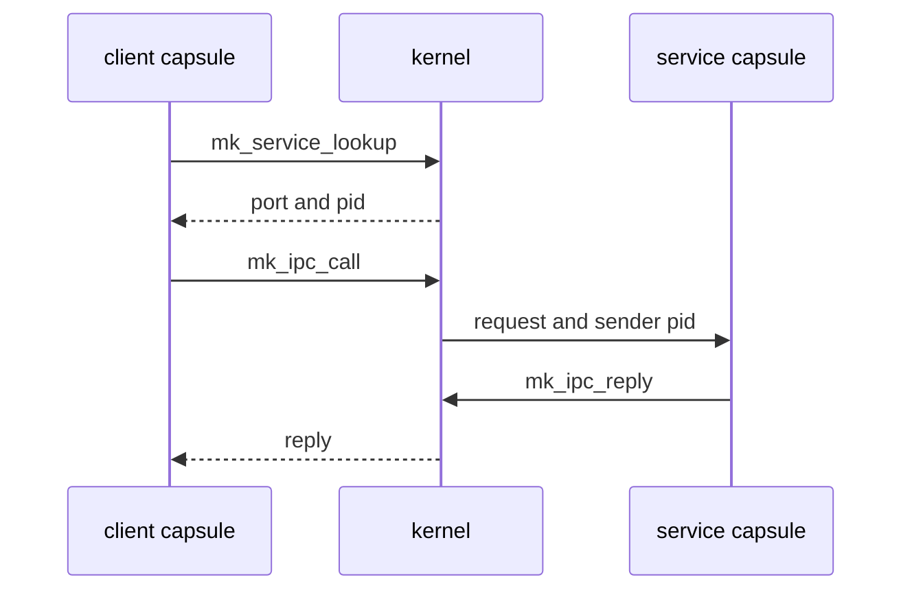

# IPC services

A [capsule](../overview/glossary.md#capsule) finds a system service by name, the kernel decides whether it may send there, and each service frames its messages in a fixed binary layout; all three are set out below.

## Finding a service and calling it

A service is a capsule that registered a name on a port, its service [endpoint](../overview/glossary.md#endpoint). A client never needs the port number in advance:

1. `mk_service_lookup` sends the name to the kernel and gets back the port and the pid that owns it (`userland/libc/src/ipc/lookup.rs:24-35`, `mk_service_lookup`).
2. `mk_ipc_call` sends the request and waits for the reply (`userland/libc/src/ipc/call.rs:19-43`, `mk_ipc_call_timeout`).
3. The service reads requests with `mk_ipc_recv`, or `mk_ipc_recv_from` when it wants the kernel-recorded sender pid, and answers with `mk_ipc_reply` or `mk_ipc_send_to_pid`.

What the kernel does on a call (`src/syscall/microkernel/ipc/call/sys_ipc_call.rs:48-139`, `sys_ipc_call`):

- The reply buffer must hold 1 byte to 1 MiB, the kernel's `MAX_MESSAGE_SIZE` (`src/ipc/nonos_channel/limits.rs:26`, `MAX_MESSAGE_SIZE`).
- Each call carries a fresh correlation token, never zero. Only a reply with that token completes the call, so a message forged with a plain send cannot pose as the answer (`src/syscall/microkernel/ipc/call/sys_ipc_call.rs:34-46`, `next_call_token`).
- A timeout of 0 means 5000 ms (`src/syscall/microkernel/ipc/call/sys_ipc_call.rs:90`, `timeout_ms`).

A service should not trust a pid written inside a message. The kernel records who sent each message, and a receiver compares that with the pid `mk_service_lookup` reports for the service it expects (`userland/nonos_service/src/lookup.rs:25-30`, `raw`).

## Who may send

Every send is checked against the caller's [capability word](../overview/glossary.md#capability-word). The caller must hold every bit the endpoint requires. A name nobody registered and an endpoint with no stated requirement are refused outright, and a caller short of a bit is refused with a `[CAP-DENY]` line on the kernel log that names the bits it needed and the bits it holds (`src/syscall/microkernel/ipc/send_caps.rs:36-63`, `caller_satisfies_endpoint`). A service endpoint requires IPC. The eleven network services, `net.core`, `net.l2`, `net.ip`, `net.udp`, `net.tcp`, `net.dns`, `net.dhcp.client`, `net.sockets`, `net.nym`, `net.anon` and `net.socks5`, require Network as well (`src/services/registry/policy.rs:26-45`, `NETWORK_SERVICES`).

A service may add its own rules on top, and several do; the sections below say which.

## The common header

Most services frame each message with the same 20-byte header, all fields little-endian, followed by the payload. This is the `vfs_pool` decoder (`userland/capsule_vfs/src/protocol/decode.rs:27-50`, `decode_request`):

| Bytes | Field |
|---|---|
| 0 to 3 | magic, one per service |
| 4 to 5 | version, 1 |
| 6 to 7 | operation |
| 8 to 9 | flags |
| 10 to 11 | reserved, zero |
| 12 to 15 | request id, echoed in the reply |
| 16 to 19 | payload length |

A reply carries the same header, and its payload starts with a signed 32-bit status, 0 or a negative errno (`userland/capsule_vfs/src/protocol/encode.rs:21-33`, `encode_response`). The keyring and the policy store use shorter headers of their own, described below. The kernel side of the wire, the calls, the envelope and the limits, is in [ABI: IPC](../abi/ipc.md).

## The services

| Service name | Port | Capsule | Magic |
|---|---|---|---|
| `vfs_pool` | 4104 | `capsule_vfs` | `0x4E4F5646` |
| `keyring` | 4098 | `capsule_keyring` | none, 8-byte header |
| `policy` | 4108 | `capsule_policy` | none, 12-byte header |
| `audio.server` | 4872 | `capsule_audio` | `0x4E415544` |
| `clipboard` | 4414 | `capsule_clipboard` | `0x43424930` |
| `compositor` | 4310 | `compositor` | `0x4E434D50` |
| `wm` | 4330 | `capsule_wm` | `0x4E574D50` |
| `input_router` | 4320 | `capsule_input_router` | `0x4E495253` |
| `net.core` | 4480 | `capsule_net_core` | one per protocol family |
| `net.sockets` | 4460 | `capsule_net_sockets` | `0x4E534B54` |

The ports are the service endpoints in each capsule's `Capsule.mk`, as collected in `tools/nix/capsules.json`. Each capsule also owns a reply inbox on the next port.

### vfs_pool

The file service over the [store](../overview/glossary.md#store). Operations 1 to 26: open, close, read, write, stat, list, health check, mkdir, unlink, rename, rmdir, copy, truncate, usage, chmod, seek, the store's persist, remove, status, install and uninstall, directory stat, the journal's touch and list, search, and a generation counter that moves when the store may have changed (`userland/capsule_vfs/src/protocol/types.rs:20-47`, `OP_GENERATION`). A path is at most 256 bytes and a payload at most 64 KiB (`userland/capsule_vfs/src/protocol/types.rs:62-70`, `MAX_PAYLOAD_BYTES`).

It answers only a sender the kernel says holds FileSystem, asking the kernel on every request, plus the kernel's own client, which arrives as sender 0; anything else gets `EACCES` (`userland/capsule_vfs/src/server/fs_gate.rs:35-44`, `refusal`; `userland/capsule_vfs/src/server/fs_gate/rule.rs:19-29`, `allows`).

### keyring

Keys and wallets. The request header is 8 bytes: a 32-bit sequence number, a 16-bit operation and two bytes the decoder does not read (`userland/capsule_keyring/src/protocol/decode.rs:19-26`, `decode_request`). The reply is the sequence number, a 32-bit status and the payload (`userland/capsule_keyring/src/protocol/encode.rs:21-27`, `encode_response`). There are 29 operations, from store, retrieve and delete through wallet generation and transaction signing, and the build fails if two share a code (`userland/capsule_keyring/src/protocol/ops.rs:31-80`, `all_distinct`).

A key operation names the pid of the key's holder in the payload, and the keyring accepts it only when it equals the pid the kernel attributes to the message; a kernel-internal message with sender 0 is refused (`userland/capsule_keyring/src/server/caller.rs:22-30`, `resolve_caller`). Inside the kernel, its own keyring client also requires the Keyring capability of the calling process (`src/security/keyring_capsule/capability.rs:26-35`, `CAP_KEYRING`).

### policy

The system settings store. The header is 12 bytes: a 16-bit operation, a 32-bit field number, a kind byte, a zero byte, a 16-bit status and a 16-bit payload length (`userland/policy_proto/src/hdr.rs:17-49`, `HDR_LEN`). The service answers get 1 and set 2. The protocol also numbers status 3, a request for the kernel's hardening record (`userland/policy_proto/src/ops.rs:17-25`, `OP_STATUS`), but the policy capsule answers it as it answers any operation it does not serve, with `E_INVAL` (`userland/capsule_policy/src/server/serve.rs:43-47`, `handle_get`). A field's kind is bool, u8, i8, string, bytes or a 64-bit set (`userland/policy_proto/src/kind.rs:17-26`, `KIND_U64`).

Any sender with IPC may read. Only the Settings app, its window instances `app.settings.1` and `app.settings.2`, and the first-boot setup wizard may write; any other sender gets `E_ACCES` (`userland/capsule_policy/src/server/handle_set.rs:29-51`, `SETTERS`). One field is the default network: Nym 0, Anyone 1, Direct 2 (`userland/policy_proto/src/route.rs:27-35`, `ROUTE_LABELS`). The browser, the model fetcher, the Terminal and the wallet read it; package installs by the Linux personality do not (`userland/policy_proto/src/route.rs:17-27`, `NYM`).

### audio.server

The mixer in front of the HD Audio driver. It uses the common header with magic `NAUD` (`userland/audio_proto/src/header.rs:21-24`, `MAGIC`). Operations: play tone 1, play PCM 2, stop 3, stream open 4, feed PCM 5, pause 6, close 7, resume 8 (`userland/audio_proto/src/ops.rs:19-26`, `OP_RESUME`), output status 9 (`userland/audio_proto/src/output.rs:28`, `OP_OUTPUT_STATUS`) and set volume 10 (`userland/audio_proto/src/volume.rs:36`, `OP_SET_VOLUME`).

### clipboard

Operations: health check 1, copy 2, paste 3, history list 4, history get 5, clear 6 and set idle timeout 7 (`userland/capsule_clipboard/src/protocol/ops.rs:17-23`, `OP_SET_IDLE_TIMEOUT`). It keeps at most 16 entries and 256 KiB in all, 64 KiB per entry, and clears itself after 10 minutes idle by default (`userland/capsule_clipboard/src/protocol/limits.rs:17-24`, `DEFAULT_IDLE_TIMEOUT_MS`). The capsule holds no Debug capability, so it cannot write to the kernel log (`userland/capsule_clipboard/Capsule.mk:10-13`, `CAPSULE_REQUIRED_CAPS`).

### compositor, wm and input_router

The three desktop services share the common header.

- `compositor` (magic `NCMP`): health check, scene submit, damage commit, focus set, input subscribe, cursor update, scene remove and display info, 1 to 8 (`userland/compositor/src/protocol/ops.rs:17-24`, `OP_DISPLAY_INFO`). Its receive buffer holds a payload of at most 256 bytes (`userland/compositor/src/protocol/limits.rs:17`, `IPC_PAYLOAD_MAX`), and the frame length must match the header exactly (`userland/compositor/src/protocol/decode.rs:48-55`, `payload_len`).
- `wm` (magic `NWMP`): window open, close, move, resize, focus, raise, minimize, restore and maximize, lifecycle subscribe, the topmost and focus queries, and focus routing, 1 to 14 (`userland/capsule_wm/src/protocol/ops.rs:17-30`, `OP_WINDOW_MAXIMIZE`). Lifecycle notices go out under a second magic, `NWMV` (`userland/capsule_wm/src/protocol/notify.rs:21`, `NOTIFY_MAGIC`).
- `input_router` (magic `NIRS`): health check, subscribe, grab request and grab release (`userland/capsule_input_router/src/protocol/ops.rs:17-20`, `OP_GRAB_RELEASE`). Input it delivers carries the magic `NINP` (`userland/capsule_input_router/src/protocol/delivery.rs:23`, `DELIVERY_MAGIC`).

### net.core

The network stack of the desktop image, whose `microkernel-desktop-base` feature set in `Cargo.toml` turns on `nonos-capsule-net-core`. With that feature the separate `net.l2`, `net.ip`, `net.udp`, `net.tcp`, `net.dns`, `net.dhcp.client` and `net.ntp.client` capsules are not started (`src/userspace/init/spawn_plan/network/mod.rs:19-37`, `spawn_tcp`). It routes each request by its magic, and operation 1 is a health check under any magic (`userland/capsule_net_core/src/server/runner/dispatch.rs:27-41`, `dispatch`):

| Family | Magic | Operations |
|---|---|---|
| TCP | `0x4E544350` | connect 3, send 5, recv 6, close 7, state 9, poll 10 |
| UDP | `0x4E554450` | bind 2, unbind 3, send 4, recv 5 |
| DNS | `0x4E444E53` | resolve A 2 |
| DHCP | `0x4E444843` | lease status 3 |
| IP | `0x4E495034` | send packet 4, poll packet 5 |

At start it also registers `net.tcp` on 4476, `net.udp` on 4472, `net.dhcp.client` on 4474, `net.dns` on 4478 and `net.ip` on 4479, so a client that looks up those names reaches it (`userland/capsule_net_core/src/register.rs:19-29`, `PORT_TCP`). Every one of these names needs Network as well as IPC.

`net.sockets` offers a socket interface: health check 1, socket 2 through set option 11, connect by host name 12, readiness poll 13 and non-blocking connect 14 (`userland/capsule_net_sockets/src/protocol/ops.rs:17-38`, `OP_CONNECT_NB`). A socket is a plain stream (kind 1), a datagram socket (kind 2) or a mixnet socket (kind 3), chosen by the client when it opens it (`userland/capsule_net_sockets/src/server/handlers/socket.rs:23-34`, `Mixnet`). The `std` platform layer sends `TcpStream` and `UdpSocket` there. How traffic is routed to Nym, Anyone or directly is on [Privacy networks](../using/privacy-network.md).

## Host tests

Proof crates mount these protocol modules on the host. On this commit the flake checks passed `fs_proofs` (367 tests), `compositor_proofs` (68), `wm_proofs` (58), `input_proofs` (96), `audio_proto_proofs` (38), `clipboard_proofs` (3), `policy_proofs` (2), `net_core_proofs` (31) and `service_header_proofs` (16).
