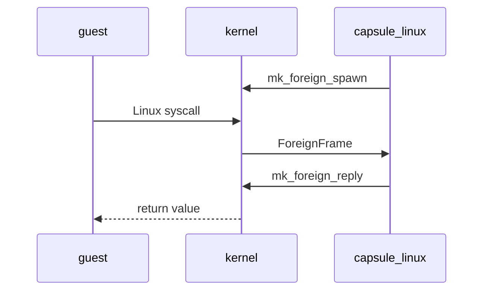

# The Linux personality

NONOS runs unmodified x86_64 Linux programs through the [Linux personality](../overview/glossary.md#linux-personality), a [capsule](../overview/glossary.md#capsule) that answers each Linux system call the kernel hands it, while the program itself holds no capability at all.

How a person runs these programs from the Terminal is on [Linux programs](../using/linux-programs.md). This page is the developer's view.

## How a Linux program runs

The kernel serves no Linux system call itself. The personality, `capsule_linux`, is the only capsule that holds ForeignExec, the right to create a process the kernel has not verified, build its address space and answer its calls (`userland/capsule_linux/Capsule.mk:4-9`, `ForeignExec`). No other entry in `tools/nix/capsules.json` declares that bit.



1. The personality calls `mk_foreign_spawn`, which makes an empty process with a kernel stack and a [capability word](../overview/glossary.md#capability-word) of 0 (`src/process/foreign/spawn.rs:31-79`, `install_spawn`). This [guest](../overview/glossary.md#guest) is supervised by the capsule that made it. One supervisor holds at most 1024 guests and threads; past that the call is `EAGAIN` (`src/process/foreign/room.rs:33-38`, `MAX_GUESTS`).
2. The personality loads the ELF into the guest and starts it. Before that, a program read from the [store](../overview/glossary.md#store) must prove itself; see [What it runs](#what-it-runs).
3. When the guest executes `syscall`, the kernel does not recognise the number, parks the guest and wakes its supervisor (`src/process/foreign/trap.rs:26-57`, `redirect`).
4. The personality waits for such a trap with `mk_foreign_wait`, at most 250 ms at a time, answers it, and between traps settles sleepers, futexes and waits and reaps what has exited (`userland/capsule_linux/src/linux/serve/loop_impl.rs:25-48`, `WAIT_MS`).
5. The answer goes back with `mk_foreign_reply` and the guest resumes with that value in `rax`. A call that has to block, such as a read on an empty pipe or `futex` wait, is parked inside the personality and answered later.

Guest memory is read and written through the kernel, by pid, with `mk_peer_read` and `mk_peer_write` (`userland/capsule_linux/src/linux/guest/mem_copy.rs:23`, `mk_peer_read`). Each of these calls is gated on ForeignExec; `MkForeignSpawn`, for example, is `MFSP` (`abi/syscalls.toml:636-639`, `MFSP`).

## Which calls are served

The personality answers 220 of the 373 x86_64 Linux system calls, 59.0%. The count comes from this tool, which only reads the source:

```sh
python3 tools/nonos-linux-coverage --list
```

It prints `[syscalls] 220 of 373 served (59.0%)` on this tree, then names the 153 unserved calls. The denominator is `userland/capsule_linux/abi/x86_64-syscalls.txt`. The flake check `static-abi` runs the same tool with `--baseline` and fails when fewer than 107 calls are served, the number in `scripts/baselines/linux-syscalls.txt` (`tools/nix/checks.nix:230`, `baseline`).

The calls are routed in two stages. Process, futex, sleep and blocking calls go first, because they can leave the caller parked (`userland/capsule_linux/src/linux/serve/dispatch.rs:40-75`, `route`). The rest go through the file, link, network, memory, process and signal tables and a short list of single calls (`userland/capsule_linux/src/linux/serve/table.rs:30-71`, `plain`). Served, by family:

- Files and paths: `open`, `openat`, `openat2`, `read`, `write`, the vector and positional forms, `stat` and `statx`, `getdents64`, `rename` and `renameat2`, `link` and `symlink`, the `*xattr` calls, `copy_file_range`, `sendfile`, `fsync`, `flock`.
- Memory: `mmap`, `munmap`, `mprotect`, `mremap`, `brk`, `madvise`, `memfd_create`, the `mlock` family.
- Processes and threads: `clone`, `fork`, `vfork`, `execve`, `wait4`, `waitid`, `exit`, `exit_group`, `futex`, `set_tid_address`, `arch_prctl`, `prctl`, the uid, gid and session calls except `setreuid`, `setregid`, `setfsuid` and `setfsgid`, `prlimit64`.
- Signals and time: `rt_sigaction`, `rt_sigprocmask`, `rt_sigreturn`, `rt_sigsuspend`, `rt_sigtimedwait`, `sigaltstack`, `kill`, `tgkill`, `signalfd4`, POSIX timers, interval timers, `clock_gettime`, `nanosleep`, `clock_nanosleep`.
- Events: `poll`, `ppoll`, `select`, `pselect6`, the `epoll` calls, `eventfd2`, `timerfd_*`, pipes.
- Sockets: `socket`, `socketpair`, `connect`, `bind`, `listen`, `accept4`, the send and receive calls, socket options.

Two answers are deliberate non-answers. `clone3` returns `ENOSYS` so that glibc falls back to `clone`, which is served (`userland/capsule_linux/src/linux/call/glibc_sched.rs:64-68`, `clone3`). `rseq` and `set_robust_list` succeed and do nothing (`userland/capsule_linux/src/linux/serve/table.rs:60`, `SET_ROBUST_LIST`).

A number that nothing serves returns `ENOSYS`, 38, and puts `[LINUX] unserved` on the log with the call's number, as `nr=29` for `shmget`, so a program that dies on a missing call leaves the number it needed (`userland/capsule_linux/src/linux/serve/unserved.rs:23-41`, `unserved`). The personality's name table holds only calls it serves, so an unserved one is named by number (`userland/capsule_linux/src/linux/serve/unserved.rs:27-32`, `decimal`); `tools/nonos-linux-coverage --list` gives the names.

## What is refused, and why

Seventeen calls are refused on purpose. Each one logs `[LINUX] refused` with its reason (`userland/capsule_linux/src/linux/serve/refused.rs:25-51`, `REFUSED`).

| Calls | Errno | Reason |
|---|---|---|
| `ptrace` | `EPERM` | a guest does not inspect or steer another |
| `process_vm_readv`, `process_vm_writev` | `EPERM` | no guest reads or writes another's memory |
| `capget`, `capset` | `EPERM` | capabilities are the kernel's, not Linux's |
| `mount`, `umount2` | `EPERM` | the tree is laid out by the personality |
| `chroot` | `EPERM` | the family is already rooted |
| `unshare`, `setns` | `EPERM` | namespaces are the personality's |
| `io_uring_setup`, `io_uring_enter`, `io_uring_register` | `ENOSYS` | a second call path around the gate |
| `inotify_init`, `inotify_init1`, `inotify_add_watch`, `inotify_rm_watch` | `ENOSYS` | the store sends no change events to watch |

That is ten `EPERM` refusals and seven `ENOSYS` ones. Among the 153 unserved calls, these seventeen are the only ones answered with a reason; the rest get the plain `ENOSYS` above. System V shared memory and semaphores, for example, are unserved.

## What it runs

When the store has no file at a path and the name is `busybox` or one of its programs, bare or in `/bin`, `/sbin`, `/usr/bin` or `/usr/sbin`, the personality runs its built-in BusyBox 1.36.1, compiled static against musl and embedded in the capsule; a file the store does hold always runs instead (`userland/capsule_linux/src/linux/built_in.rs:24-43`, `BUILT_IN`). The binary is built by `tools/nonos-busybox-build` from the upstream release at a pinned SHA-256 and the committed `userland/capsule_linux/guests/busybox.config` (`tools/nonos-busybox-build:39-41`, `SHA256`). The flake check `busybox-source` compares the committed binary with one built from source (`tools/nix/checks.nix:287-292`, `busybox`); it did not pass on this commit, so this release does not claim that the two match.

Nineteen more programs are built from pinned upstream sources and signed and enrolled like capsules, each with target `x86_64-unknown-linux-musl` and a required capability word of 0 (`userland/linux_userland/Userland.mk:107-124`, `LINUX_USERLAND_CAPSULE`):

| Program | Path in the Linux tree |
|---|---|
| CPython | `/usr/bin/python3`, with its standard library as `/usr/lib/python312.zip` |
| Lua, Perl, Tcl, mruby, QuickJS | `/usr/bin/lua`, `/usr/bin/perl`, `/usr/bin/tclsh`, `/usr/bin/mruby`, `/usr/bin/qjs` |
| SQLite shell | `/usr/bin/sqlite3` |
| jq, gojq | `/usr/bin/jq`, `/usr/bin/gojq` |
| ripgrep, fd | `/usr/bin/rg`, `/usr/bin/fd` |
| zstd, nano, make, OpenSSL | `/usr/bin/zstd`, `/usr/bin/nano`, `/usr/bin/make`, `/usr/bin/openssl` |
| John the Ripper | `/usr/bin/john`, with its config and word list in `/usr/share/john/` |
| the Qwen chat program | `/bin/qwenchat`, plus builds for x86-64-v2 and baseline x86-64 |

The list is `userland/linux_userland/Userland.mk:153-181` (`LINUX_USERLAND_GUEST`). Every one of them is carried in the image's store; the separate package list in `tools/nix/store.json` is empty in this release. Python finds a CA bundle at `/etc/ssl/cert.pem`, so its `ssl` module can verify a TLS peer (`userland/linux_userland/Userland.mk:183-193`, `LINUX_USERLAND_STORE_ENTRIES`). Every guest runs as uid 0 (`userland/linux_userland/Userland.mk:211-216`, `LINUX_USERLAND_STORE_DEPS`). How the Qwen model tiers are chosen and installed is on [Local AI](../using/local-ai.md).

A program from the store runs only after it proves itself; the built-in BusyBox is already covered by the personality's own [manifest](../overview/glossary.md#manifest) (`userland/capsule_linux/src/linux/start_guest.rs:56-62`, `prove`). The proof sits beside the program as `.zk_trailer.bin`. With a certificate and a manifest there too, it is checked by `mk_capsule_verify`, the exact chain the [spawn gate](../overview/glossary.md#spawn-gate) runs (`userland/capsule_linux/src/linux/attest_publisher.rs:21-44`, `mk_capsule_verify`). With a trailer alone, it must be one this machine made for a program holding no capabilities (`userland/capsule_linux/src/linux/attest_local.rs:21-30`, `GUEST_CAPS`). A refused program does not run, and the Terminal says so.

The install role also installs Alpine, Debian and pacman packages. A name with `deb:` or `pacman:` in front picks the family, and each family keeps its own tree, so a Debian `jq` never lands on Alpine's (`userland/capsule_linux/src/linux/file/family.rs:31-47`, `PLACES`).

## The filesystem a guest sees

- The guest's `/` is the family's tree in the store: `/linux` for Alpine and the shipped programs, `/linux-deb` and `/linux-pacman` for the others. No path a guest is given back names that root (`userland/capsule_linux/src/linux/file/root.rs:21-53`, `under_root`).
- The shared tree is written by installs only. A guest that writes there gets a read-only file system error (`userland/capsule_linux/src/linux/file/root.rs:59-65`, `writable`).
- `/tmp`, `/dev/shm`, `/home`, `/root`, `/run` and `/var/tmp` are private to the family: they live under `/linux-private/` and a random id, outside every family's tree, and are cleared at the end (`userland/capsule_linux/src/linux/file/private/names.rs:17-56`, `PRIVATE`).
- Those private directories hold at most 16 MiB and 128 names together, `ENOSPC` past either, because they live in the store every capsule shares (`userland/capsule_linux/src/linux/file/system/declared/sizes.rs:55-69`, `PRIVATE_NAMES`).
- A guest is told it has one CPU, a pid maximum of 32768, 100 clock ticks a second and 64 KiB pipes (`userland/capsule_linux/src/linux/file/system/declared/sizes.rs:23-41`, `PIPE_MAX`).

## Networking

In this release a guest cannot reach the network. A guest is started only by the personality's base instance and its run and terminal roles, and none of them holds Network (`src/userspace/capsule_linux/spawn.rs:39-53`, `LINUX_CAPS`; `src/userspace/capsule_linux/roles.rs:46-67`, `extra_caps`). The install role does hold it, but it is only ever spawned to install or remove a package, which the personality does itself without starting a guest (`src/userspace/capsule_linux/install.rs:32-45`, `spawn_install`; `userland/capsule_linux/src/linux/start.rs:31-52`, `install_request`). The kernel therefore refuses every call the personality makes to `net.sockets` or `net.anon` on a guest's behalf.

The rules the personality applies before that point:

- A guest binds and listens only on 127.0.0.0/8, which reaches nothing outside its family; anything else is `EACCES`. A datagram to outside the family is `ENETUNREACH`. A raw internet socket is `EPERM`, and any family but `AF_INET` and `AF_UNIX` is `EAFNOSUPPORT` (`userland/capsule_linux/src/linux/net/policy.rs:17-62`, `not_loopback`; `userland/capsule_linux/src/linux/net/socket.rs:45-48`, `EAFNOSUPPORT`).
- A stream to outside the family is sent by the system's default network. Anyone goes to `net.anon`; Nym, or a default that cannot be read, goes to the mixnet socket of `net.sockets`; Direct also goes to the mixnet, because a guest is never given a direct socket (`userland/capsule_linux/src/linux/net/guest_route.rs:51-61`, `path`). A chosen network that is not running is `ENETUNREACH`, and nothing else is tried.
- A family that holds a model gets no internet socket at all, `EACCES`, and a model is not opened while an internet socket is (`userland/capsule_linux/src/linux/net/offline.rs:36-44`, `refuse_inet`).

The network choices themselves are explained on [Privacy networks](../using/privacy-network.md).
