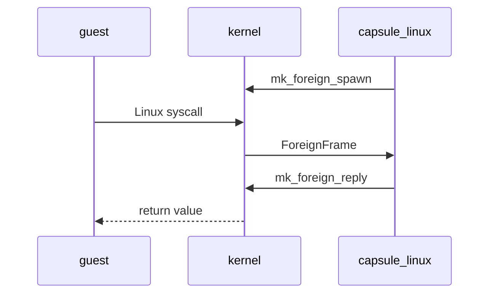

# The Linux personality

NONOS runs unmodified x86_64 Linux programs through the [Linux personality](../overview/glossary.md#linux-personality), a [capsule](../overview/glossary.md#capsule) that answers each Linux system call the kernel hands it, while the program itself holds no capability at all.

How a person runs these programs from the Terminal is on [Linux programs](../using/linux-programs.md). This page is the developer's view.

## How a Linux program runs

The kernel serves no Linux system call itself. The personality, `capsule_linux`, is the only capsule that holds ForeignExec, the right to create a process the kernel has not verified, build its address space and answer its calls (`userland/capsule_linux/Capsule.mk:4-9`, `ForeignExec`). No other entry in `tools/nix/capsules.json` declares that bit.



1. The personality calls `mk_foreign_spawn`, which makes an empty process with a kernel stack and a [capability word](../overview/glossary.md#capability-word) of 0 (`src/process/foreign/spawn.rs:31-79`, `install_spawn`). This [guest](../overview/glossary.md#guest) is supervised by the capsule that made it. One supervisor holds at most 1024 guests and threads; past that the call is `EAGAIN` (`src/process/foreign/room.rs:33-38`, `MAX_GUESTS`).
2. The personality loads the ELF into the guest and starts it. Before that, a program read from the [store](../overview/glossary.md#store) must prove itself; see [What it runs](#what-it-runs).
3. When the guest executes `syscall`, the kernel does not recognise the number, parks the guest and wakes its supervisor (`src/process/foreign/trap.rs:26-57`, `redirect`).
4. The personality waits for such a trap with `mk_foreign_wait`, at most 250 ms at a time, answers it, and between traps settles sleepers, futexes and waits and reaps what has exited (`userland/capsule_linux/src/linux/serve/loop_impl.rs:25-48`, `WAIT_MS`).
5. The answer goes back with `mk_foreign_reply` and the guest resumes with that value in `rax`. A call that has to block, such as a read on an empty pipe or `futex` wait, is parked inside the personality and answered later.

Guest memory is read and written through the kernel, by pid, with `mk_peer_read` and `mk_peer_write` (`userland/capsule_linux/src/linux/guest/mem_copy.rs:23`, `mk_peer_read`). Each of these calls is gated on ForeignExec; `MkForeignSpawn`, for example, is `MFSP` (`abi/syscalls.toml:636-639`, `MFSP`).

## Which calls are served

The personality answers 220 of the 373 x86_64 Linux system calls, 59.0%. The count comes from this tool, which only reads the source:

```sh
python3 tools/nonos-linux-coverage --list
```

It prints `[syscalls] 220 of 373 served (59.0%)` on this tree, then names the 153 unserved calls. The denominator is `userland/capsule_linux/abi/x86_64-syscalls.txt`. The flake check `static-abi` runs the same tool with `--baseline` and fails when fewer than 107 calls are served, the number in `scripts/baselines/linux-syscalls.txt` (`tools/nix/checks.nix:230`, `baseline`).

The calls are routed in two stages. Process, futex, sleep and blocking calls go first, because they can leave the caller parked (`userland/capsule_linux/src/linux/serve/dispatch.rs:40-75`, `route`). The rest go through the file, link, network, memory, process and signal tables and a short list of single calls (`userland/capsule_linux/src/linux/serve/table.rs:30-71`, `plain`). Served, by family:

- Files and paths: `open`, `openat`, `openat2`, `read`, `write`, the vector and positional forms, `stat` and `statx`, `getdents64`, `rename` and `renameat2`, `link` and `symlink`, the `*xattr` calls, `copy_file_range`, `sendfile`, `fsync`, `flock`.
- Memory: `mmap`, `munmap`, `mprotect`, `mremap`, `brk`, `madvise`, `memfd_create`, the `mlock` family.
- Processes and threads: `clone`, `fork`, `vfork`, `execve`, `wait4`, `waitid`, `exit`, `exit_group`, `futex`, `set_tid_address`, `arch_prctl`, `prctl`, the uid, gid and session calls except `setreuid`, `setregid`, `setfsuid` and `setfsgid`, `prlimit64`.
- Signals and time: `rt_sigaction`, `rt_sigprocmask`, `rt_sigreturn`, `rt_sigsuspend`, `rt_sigtimedwait`, `sigaltstack`, `kill`, `tgkill`, `signalfd4`, POSIX timers, interval timers, `clock_gettime`, `nanosleep`, `clock_nanosleep`.
- Events: `poll`, `ppoll`, `select`, `pselect6`, the `epoll` calls, `eventfd2`, `timerfd_*`, pipes.
- Sockets: `socket`, `socketpair`, `connect`, `bind`, `listen`, `accept4`, the send and receive calls, socket options.

Two answers are deliberate non-answers. `clone3` returns `ENOSYS` so that glibc falls back to `clone`, which is served (`userland/capsule_linux/src/linux/call/glibc_sched.rs:64-68`, `clone3`). `rseq` and `set_robust_list` succeed and do nothing (`userland/capsule_linux/src/linux/serve/table.rs:60`, `SET_ROBUST_LIST`).

A number that nothing serves returns `ENOSYS`, 38, and puts `[LINUX] unserved` on the log with the call's number, as `nr=29` for `shmget`, so a program that dies on a missing call leaves the number it needed (`userland/capsule_linux/src/linux/serve/unserved.rs:23-41`, `unserved`). The personality's name table holds only calls it serves, so an unserved one is named by number (`userland/capsule_linux/src/linux/serve/unserved.rs:27-32`, `decimal`); `tools/nonos-linux-coverage --list` gives the names.

## What is refused, and why

Seventeen calls are refused on purpose. Each one logs `[LINUX] refused` with its reason (`userland/capsule_linux/src/linux/serve/refused.rs:25-51`, `REFUSED`).

| Calls | Errno | Reason |
|---|---|---|
| `ptrace` | `EPERM` | a guest does not inspect or steer another |
| `process_vm_readv`, `process_vm_writev` | `EPERM` | no guest reads or writes another's memory |
| `capget`, `capset` | `EPERM` | capabilities are the kernel's, not Linux's |
| `mount`, `umount2` | `EPERM` | the tree is laid out by the personality |
| `chroot` | `EPERM` | the family is already rooted |
| `unshare`, `setns` | `EPERM` | namespaces are the personality's |
| `io_uring_setup`, `io_uring_enter`, `io_uring_register` | `ENOSYS` | a second call path around the gate |
| `inotify_init`, `inotify_init1`, `inotify_add_watch`, `inotify_rm_watch` | `ENOSYS` | the store sends no change events to watch |

That is ten `EPERM` refusals and seven `ENOSYS` ones. Among the 153 unserved calls, these seventeen are the only ones answered with a reason; the rest get the plain `ENOSYS` above. System V shared memory and semaphores, for example, are unserved.
