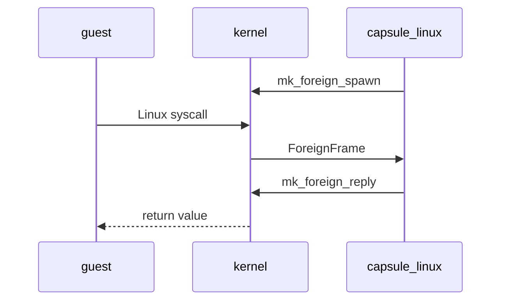

# The Linux personality

NONOS runs unmodified x86_64 Linux programs through the [Linux personality](../overview/glossary.md#linux-personality), a [capsule](../overview/glossary.md#capsule) that answers each Linux system call the kernel hands it, while the program itself holds no capability at all.

How a person runs these programs from the Terminal is on [Linux programs](../using/linux-programs.md). This page is the developer's view.

## How a Linux program runs

The kernel serves no Linux system call itself. The personality, `capsule_linux`, is the only capsule that holds ForeignExec, the right to create a process the kernel has not verified, build its address space and answer its calls (`userland/capsule_linux/Capsule.mk:4-9`, `ForeignExec`). No other entry in `tools/nix/capsules.json` declares that bit.

1. The personality calls `mk_foreign_spawn`, which makes an empty process with a kernel stack and a [capability word](../overview/glossary.md#capability-word) of 0 (`src/process/foreign/spawn.rs:31-79`, `install_spawn`). This [guest](../overview/glossary.md#guest) is supervised by the capsule that made it. One supervisor holds at most 1024 guests and threads; past that the call is `EAGAIN` (`src/process/foreign/room.rs:33-38`, `MAX_GUESTS`).
2. The personality loads the ELF into the guest and starts it. Before that, a program read from the [store](../overview/glossary.md#store) must prove itself; see [What it runs](#what-it-runs).
3. When the guest executes `syscall`, the kernel does not recognise the number, parks the guest and wakes its supervisor (`src/process/foreign/trap.rs:26-57`, `redirect`).
4. The personality waits for such a trap with `mk_foreign_wait`, at most 250 ms at a time, answers it, and between traps settles sleepers, futexes and waits and reaps what has exited (`userland/capsule_linux/src/linux/serve/loop_impl.rs:25-48`, `WAIT_MS`).
5. The answer goes back with `mk_foreign_reply` and the guest resumes with that value in `rax`. A call that has to block, such as a read on an empty pipe or `futex` wait, is parked inside the personality and answered later.

Guest memory is read and written through the kernel, by pid, with `mk_peer_read` and `mk_peer_write` (`userland/capsule_linux/src/linux/guest/mem_copy.rs:23`, `mk_peer_read`). Each of these calls is gated on ForeignExec; `MkForeignSpawn`, for example, is `MFSP` (`abi/syscalls.toml:636-639`, `MFSP`).
