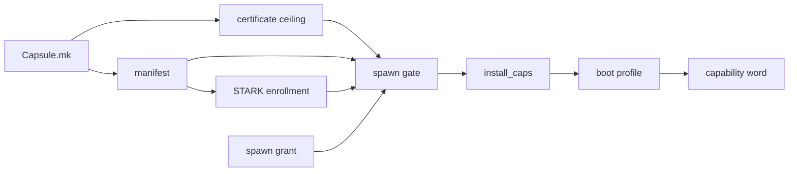

# Manifests and capabilities

A [capsule](../overview/glossary.md#capsule) states what it is and what it may do in its `Capsule.mk`; the build turns that into a signed binary [manifest](../overview/glossary.md#manifest), and the kernel fixes the capsule's [capability word](../overview/glossary.md#capability-word) from it at spawn.

## Where a manifest comes from

Nobody writes a manifest by hand. Each capsule directory holds a `Capsule.mk` that sets `CAPSULE_*` variables and includes `nonos-mk/capsule.mk`, and the signing step encodes those values. The template refuses to load when a required variable is missing (`nonos-mk/capsule.mk:28-54`, `CAPSULE_NAMESPACE`).

| Variable | Required | Meaning | Default |
|---|---|---|---|
| `CAPSULE_SLUG` | yes | the name make targets use | |
| `CAPSULE_BIN_NAME` | yes | the ELF name, and the prefix of every artifact and key file | |
| `CAPSULE_DIR` | yes | the crate directory | |
| `CAPSULE_HANDLE`, `CAPSULE_DOMAIN` | yes | hashed into the [publisher](../overview/glossary.md#publisher)'s NONOS ID | |
| `CAPSULE_RECOVERY` | no | a recovery string hashed into the NONOS ID with them | empty |
| `CAPSULE_NAMESPACE` | yes | reverse-domain name; the certificate is issued for it | |
| `CAPSULE_SERVICE_ENDPOINT` | yes | `service:<port>:<name>` | |
| `CAPSULE_REPLY_ENDPOINT` | yes | `reply:<port>:<inbox name>` | |
| `CAPSULE_REQUIRED_CAPS` | yes | capabilities the capsule cannot run without | |
| `CAPSULE_OPTIONAL_CAPS` | no | capabilities a spawn site may add | `0x0` |
| `CAPSULE_CAPS_CEILING` | no | the certificate's ceiling | required and optional bits together |
| `CAPSULE_INSTANCE_ENDPOINTS` | no | extra [endpoint](../overview/glossary.md#endpoint) pairs for on-demand instances, such as a second Terminal window | none |
| `CAPSULE_TARGET` | no | target triple | `x86_64-nonos-user` |
| `CAPSULE_VERSION` | no | `major.minor.patch` | `0.1.0` |
| `CAPSULE_BUILD_STD` | no | the `-Zbuild-std` crates | `core,alloc` |
| `CAPSULE_PREBUILT_BIN` | no | copy this ELF instead of running cargo | none |
| `CAPSULE_DEV_ONLY` | no | sign and enroll only in a development image | unset |
| `CAPSULE_KERNEL_MIRROR` | no | the kernel directory that embeds and spawns it | none |
| `CAPSULE_FEATURE` | no | the kernel feature that embeds it; an image ships the capsules whose feature its profile turns on | `nonos-capsule-<slug>` |

The defaults are set in one place: the optional capabilities at `nonos-mk/capsule.mk:69` (`CAPSULE_OPTIONAL_CAPS`), the ceiling at `nonos-mk/capsule.mk:74` (`CAPSULE_CAPS_CEILING`), the target, version and serial at `nonos-mk/capsule.mk:75-77` (`CAPSULE_TARGET`), and the feature at `nonos-mk/capsule.mk:88` (`CAPSULE_FEATURE`). The image build picks capsules by that feature (`tools/nix/image.nix:54-57`, `shipped`). A few rarer inputs, such as `CAPSULE_CARGO_FEATURES`, `CAPSULE_ID_CERT_SERIAL` and `CAPSULE_KEY_PUB_PREFIX`, are listed in the reset block at the end of the template (`nonos-mk/capsule.mk:325-352`, `CAPSULE_SLUG`).

## A real example

This is `userland/capsule_hello/Capsule.mk`, in full:

```make
CAPSULE_SLUG             := hello
CAPSULE_HANDLE           := app.hello
CAPSULE_DOMAIN           := systems.nonos
CAPSULE_DIR              := userland/capsule_hello
CAPSULE_BIN_NAME         := hello
CAPSULE_FEATURE          := nonos-capsule-hello
CAPSULE_NAMESPACE        := systems.nonos.app.hello
CAPSULE_SERVICE_ENDPOINT := service:4810:app.hello
CAPSULE_REPLY_ENDPOINT   := reply:4811:endpoint.app.hello.reply
# CoreExec|IPC|Memory|GraphicsDisplayQuery|GraphicsSurfaceCreate
CAPSULE_REQUIRED_CAPS    := 0x1819
# Debug, granted only by a build that compiles `capsule-serial-debug`: the
# kernel mirror folds it in through serial_debug_cap(), for its [APP] log lines.
CAPSULE_OPTIONAL_CAPS    := 0x100
CAPSULE_KERNEL_MIRROR    := src/userspace/capsule_hello

include nonos-mk/capsule.mk
```

Read it this way:

- The capsule registers the service `app.hello` on port 4810 and owns the reply inbox `endpoint.app.hello.reply` on port 4811.
- It needs CoreExec, IPC, Memory, GraphicsDisplayQuery and GraphicsSurfaceCreate: `0x1 | 0x8 | 0x10 | 0x800 | 0x1000 = 0x1819`.
- Debug (`0x100`) is optional, and no ceiling is set, so the certificate's ceiling is `0x1919`.
- The namespace sits under `systems.nonos`, so the [spawn gate](../overview/glossary.md#spawn-gate) treats it as an enrolled system capsule (`src/kernel_core/process_spawn/capsule_spawn/runner/tier.rs:22-28`, `classify`).
- Its [kernel mirror](../overview/glossary.md#kernel-mirror) asks for exactly the five required bits plus `serial_debug_cap()` (`src/userspace/capsule_hello/spawn.rs:47-52`, `requested_caps`), and `serial_debug_cap` returns Debug only in a build with the `capsule-serial-debug` feature (`src/capabilities/serial_debug.rs:40-50`).

## The binary format

The manifest is schema version 3 (`src/security/capsule_manifest/schema/constants.rs:17`, `MANIFEST_SCHEMA_VERSION`). Multi-byte integers are big-endian. The fields, in wire order, as `decode` reads them (`src/security/capsule_manifest/decode/mod.rs:25-47`, `decode`):

| Field | Size | Rule |
|---|---|---|
| schema version | 2 bytes | must be 3 |
| certificate id | 32 bytes | BLAKE3 of the [NONOS ID certificate](../overview/glossary.md#nonos-id-certificate) |
| namespace | 1 length byte, then 1 to 96 bytes | UTF-8 |
| version | 3 × 4 bytes | major, minor, patch |
| target triple | 1 length byte, then 1 to 64 bytes | UTF-8 |
| payload hash | 32 bytes | BLAKE3 of the whole ELF |
| required caps | 8 bytes | |
| optional caps | 8 bytes | no bit may also be required |
| endpoint count | 1 byte | at most 16 |
| each endpoint | kind byte, 4-byte port, name length byte, name | kind 1 is a service, 2 a reply; name 1 to 48 bytes; no two with the same kind and name |
| signature count | 1 byte | 1 to 4 |
| each signature | algorithm byte, 16-byte key id, 2-byte length, signature | algorithm 1 is Ed25519 (64 bytes), 3 is ML-DSA-65 (3309 bytes); the length must match the algorithm |

The decoder refuses a required and optional set that overlap (`src/security/capsule_manifest/decode/header.rs:45-49`, `OverlappingCaps`), a duplicate endpoint (`src/security/capsule_manifest/decode/endpoints.rs:44-48`, `DuplicateEndpoint`), and any byte after the last signature (`src/security/capsule_manifest/decode/mod.rs:30-32`, `TrailingBytes`). The publisher signs every byte before the signature count (`src/security/capsule_manifest/verify/signed_region.rs:20-41`, `compute`). Signature sizes come from `src/crypto/asymmetric/alg_id/lengths.rs:19-29` (`MLDSA65_SIG_BYTES`), and the algorithm byte from `src/crypto/asymmetric/alg_id/types.rs:39-47` (`from_u8`). The decoder also knows ML-DSA-44 (2) and ML-DSA-87 (4), but the policy below asks only for Ed25519 and ML-DSA-65.

The schema in `abi/capsule_manifest.schema.json` names the same fields as a JSON object. Some of its descriptions are older than the decoder; where they differ, the decoder is right.

## What the kernel checks

`verify_with_publisher` runs these checks in this order, and the first failure refuses the capsule (`src/security/capsule_manifest/verify/mod.rs:37-63`, `verify_with_publisher`):

1. The manifest decodes.
2. Its certificate id equals the BLAKE3 of the certificate presented with it.
3. Its namespace matches one of the certificate's namespace globs.
4. Its required and optional capabilities stay under the certificate's ceiling.
5. For each algorithm the production policy requires, one signature verifies under a publisher key the certificate carries and the [trust anchor](../overview/glossary.md#trust-anchor) policy has not revoked. The policy requires both Ed25519 and ML-DSA-65 (`src/security/nonos_id_cert/policy.rs:30-32`, `NONOS_PRODUCTION_POLICY`).
6. The payload hash equals the BLAKE3 of the ELF being loaded.
7. The target triple equals the one the spawn site names. A capsule in the kernel image is held to the kernel's user target; a capsule loaded from the store names its own, so for it this check adds nothing (`src/kernel_core/process_spawn/capsule_spawn/from_vfs/load/spawn.rs:65`, `target_triple`).
8. Every endpoint the spawn site is about to register is declared in the manifest.
9. The grant stays inside the manifest's required and optional sets.

Each failure has its own variant of `ManifestVerifyError`, from `NonosIdCertIdMismatch` to `GrantOutsideManifest` (`src/security/capsule_manifest/error.rs:45-58`). The certificate itself is checked before any of this; [Signing and publisher keys](signing-and-publisher-keys.md) lists those refusals.

## Capability bits

The bits are defined once in the kernel (`src/capabilities/types/defs.rs`) and published in `abi/caps.toml`, which `scripts/gen_caps_abi.py` regenerates from that file. There are 36, from CoreExec at bit 0 to DeviceSecret at bit 35 (`src/capabilities/types/defs.rs:22-82`, `DeviceSecret`). Two of them, IO at bit 1 and Hardware at bit 7, enforce nothing (`src/capabilities/types/defs.rs:23-31`, `Hardware`). These are the ones a capsule meets most:

| Bit | Value | Name | What it opens |
|---|---|---|---|
| 0 | `0x1` | CoreExec | process basics such as `MkGetPid` and arguments |
| 2 | `0x4` | Network | the eleven network services |
| 3 | `0x8` | IPC | sending to a service at all |
| 4 | `0x10` | Memory | `MkMmap` and `MkMunmap` |
| 5 | `0x20` | Crypto | the kernel's hash, cipher and random calls |
| 6 | `0x40` | FileSystem | being served by `vfs_pool` |
| 8 | `0x100` | Debug | lines on the kernel log |
| 15 | `0x8000` | DeviceEnum | listing devices |
| 16 to 20 | `0x1_0000` to `0x10_0000` | Driver, Mmio, Irq, Dma, Pio | the hardware broker |
| 32 | `0x1_0000_0000` | ForeignExec | creating Linux [guests](../overview/glossary.md#guest); only the [Linux personality](../overview/glossary.md#linux-personality) holds it |
| 35 | `0x8_0000_0000` | DeviceSecret | the device secret; the signing step refuses it to every capsule but `prove` |

The full table is in [ABI: capabilities](../abi/capabilities.md).

## How the word is fixed

The word a capsule runs with is decided in three places, and none of them is the capsule.



At signing. The certificate's ceiling is the required and optional sets together unless `Capsule.mk` sets one (`nonos-mk/capsule.mk:70-74`, `CAPSULE_CAPS_CEILING`). Before any certificate or manifest is signed, `scripts/check_device_secret_cap.py` refuses DeviceSecret in every capsule but `prove` (`scripts/check_device_secret_cap.py:31-40`, `DEVICE_SECRET_BIT`). The kernel ties the bit to no name, so this build check is what keeps it to one capsule (`scripts/check_device_secret_cap.py:17-23`, `DeviceSecret`). Run with no arguments it reads every `Capsule.mk`, the ten the build leaves out included:

```sh
python3 scripts/check_device_secret_cap.py
```

On this tree it prints `device-secret-cap: 107 capsules, 0 problems`.

At enrollment. The STARK enrollment takes each capsule as its required capabilities, its ELF and the path of its [attestation trailer](../overview/glossary.md#attestation-trailer) (`mk/20-build.mk:604-605`, `NONOS_STARK_ENROLL`). At spawn the gate checks the trailer against the ELF and the manifest's required set (`src/kernel_core/process_spawn/capsule_spawn/runner/preflight.rs:67-77`, `required_caps`), so a capsule whose required set changes needs a new enrollment. The [STARK attestation](../security/stark-attestation.md) page covers the proof.

At spawn. The spawn site offers a grant: a kernel mirror's `requested_caps`, or for a capsule loaded from the [store](../overview/glossary.md#store), the caller's request masked to the manifest (`src/kernel_core/process_spawn/capsule_spawn/from_vfs/load/spawn.rs:66`, `requested_caps`). A grant with a bit outside the manifest refuses the spawn. Otherwise the capsule gets every required bit and the optional bits the grant names, nothing else (`src/security/capsule_manifest/verify/caps_bits.rs:33-47`, `install_caps`).

After that, the [boot profile](../overview/glossary.md#boot-profile) can only take away. On a boot without network, Network is removed from every capsule (`src/kernel_core/process_spawn/capsule_spawn/runner/profile_gate.rs:48-55`, `caps`), and the result is what `install_spawn` stores (`src/kernel_core/process_spawn/capsule_spawn/runner/install/install_caps.rs:20-24`, `install_spawn`). The boot modes themselves are described in [Boot modes](../install/boot-modes.md).

One more ceiling exists, and the spawn gate does not enforce it. An image the flake builds carries the union of the ceilings of the capsules its profile ships (`tools/nix/image.nix:58-63`, `ceilingOf`). A word outside it is written to the serial log as `[CEILING] not enforced, would refuse` with the extra bits named, and the capsule still starts with that word (`src/security/image_ceiling/admits.rs:53-61`, `would_refuse`).

The arithmetic of the three bit tests is mounted by `mechanism_proofs` (`userland/mechanism_proofs/src/spawn/mod.rs:20-21`, `caps_bits`), whose 56 host tests passed in the flake checks on this commit.
