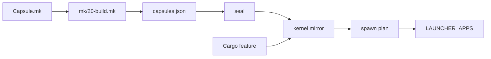

# Shipping an app

Take an app crate into a signed image and onto the dock and the Launchpad, step by step on the files of `capsule_hello`.

[Writing an app](writing-an-app.md) covers the program itself and its tests. Every path here is hello's copy; a new app adds the same pieces under its own name.



The `Capsule.mk` declares the app. An include line in `mk/20-build.mk` makes the build see it, and `tools/nix/capsules.json` lists it for the flake and the [seal](../overview/glossary.md#seal). The seal signs and enrolls it, and the [kernel mirror](../overview/glossary.md#kernel-mirror) embeds what the seal wrote when the Cargo feature is on. The spawn plan starts it at boot, and a `LAUNCHER_APPS` row gives it a tile that opens its window.

## 1. The Capsule.mk

A [capsule](../overview/glossary.md#capsule) is declared once, in its `Capsule.mk`: its identity, its service and reply [endpoints](../overview/glossary.md#endpoint) and its [capability word](../overview/glossary.md#capability-word). This is hello's, whole:

```make
CAPSULE_SLUG             := hello
CAPSULE_HANDLE           := app.hello
CAPSULE_DOMAIN           := systems.nonos
CAPSULE_DIR              := userland/capsule_hello
CAPSULE_BIN_NAME         := hello
CAPSULE_FEATURE          := nonos-capsule-hello
CAPSULE_NAMESPACE        := systems.nonos.app.hello
CAPSULE_SERVICE_ENDPOINT := service:4810:app.hello
CAPSULE_REPLY_ENDPOINT   := reply:4811:endpoint.app.hello.reply
# CoreExec|IPC|Memory|GraphicsDisplayQuery|GraphicsSurfaceCreate
CAPSULE_REQUIRED_CAPS    := 0x1819
# Debug, granted only by a build that compiles `capsule-serial-debug`: the
# kernel mirror folds it in through serial_debug_cap(), for its [APP] log lines.
CAPSULE_OPTIONAL_CAPS    := 0x100
CAPSULE_KERNEL_MIRROR    := src/userspace/capsule_hello

include nonos-mk/capsule.mk
```

- The template stops the build when the slug, binary, directory, handle, domain, namespace, either endpoint or the required capabilities are missing (`nonos-mk/capsule.mk:28-54`, `CAPSULE_SLUG`).
- Left out, the optional bits default to 0x0, the target to `x86_64-nonos-user`, the version to 0.1.0 and the feature to `nonos-capsule-<slug>`; the certificate's [capability ceiling](../overview/glossary.md#capability-ceiling) defaults to required plus optional (`nonos-mk/capsule.mk:69-88`, `CAPSULE_FEATURE`).
- A namespace of `systems.nonos` or below it puts the capsule in the enrolled tier, any other in the [publisher](../overview/glossary.md#publisher) tier (`src/kernel_core/process_spawn/capsule_spawn/runner/tier.rs:22-28`, `classify`). [Signing and publisher keys](signing-and-publisher-keys.md) says what each tier means.
- Pick a service port and a reply port that no other `Capsule.mk` declares. `clashes` collects every port of every declaration and fails on a shared one (`scripts/check_capsule_ports.py:32-39`, `clashes`):

```sh
python3 scripts/check_capsule_ports.py
```

On this tree it prints `capsule ports: 498 ports declared, 0 shared`.

### Choosing the capability word

Start from hello's five bits and add one only for a call your app makes. 0x1819 is `CORE_EXEC`, `IPC`, `MEMORY`, `GRAPHICS_DISPLAY_QUERY` and `GRAPHICS_SURFACE_CREATE` (`abi/caps.toml:6-18`, `GRAPHICS_SURFACE_CREATE`). Snake adds FileSystem for the files it keeps through vfs, 0x1859 (`userland/capsule_snake/Capsule.mk:12`, `CAPSULE_REQUIRED_CAPS`), because vfs answers only a sender the kernel says holds FileSystem (`userland/capsule_vfs/src/server/fs_gate.rs:38-44`, `CAP_FILE_SYSTEM`). Clock adds TimeSet to set the time, 0x401819 (`userland/capsule_clock/Capsule.mk:12`, `CAPSULE_REQUIRED_CAPS`). [Capabilities](../abi/capabilities.md) lists every bit.

- Keep Debug, 0x100, optional, as hello does. `serial_debug_cap` adds it to what the spawn site offers only in a kernel built with `capsule-serial-debug` (`src/capabilities/serial_debug.rs:41-50`, `serial_debug_cap`), which the hardened and airgapped [build profiles](../overview/glossary.md#build-profile) leave out.
- The kernel installs the required bits plus the optional bits the spawn site grants (`src/security/capsule_manifest/verify/caps_bits.rs:45-47`, `install_caps`), and refuses an offer wider than the [manifest](../overview/glossary.md#manifest) with `GrantOutsideManifest` (`src/security/capsule_manifest/verify/caps.rs:31-38`, `check_grant`).
- Signing refuses DeviceSecret in any capsule but `prove`, in make (`nonos-mk/capsule.mk:255-256`, `check_device_secret_cap`) and in the seal (`tools/nonos_seal/capsules.py:80`, `check_device_secret_cap`).

The capability audit holds each bit to a call the code makes (`scripts/cap_audit.py:17-23`, `CAPSULE_REQUIRED_CAPS`), and the static checks run it with `--strict` (`nonos-ci/run-static-checks.sh:4825-4830`, `cap_audit_out`). Run it on your capsule alone:

```sh
python3 scripts/cap_audit.py --capsule hello --markdown
```

For hello it finds a use of each of the five required bits, marks Debug as diagnostic, and lists GraphicsSurfaceMap to review, because a toolkit file hello links calls `mk_surface_attach`. [Manifests and capabilities](manifests-and-capabilities.md) has the rules behind the word.

## 2. The include line and the catalogues

hello is built because `mk/20-build.mk` includes its declaration, between `capsule_linux` and `capsule_gui_demo` (`mk/20-build.mk:503`, `capsule_hello`). Without the line nothing builds, signs or enrolls the capsule. With it the template gives the capsule its make targets, among them `nonos-mk-<slug>`, which builds the ELF, and `nonos-mk-<slug>-sign` (`nonos-mk/capsule.mk:175-177`, `NONOS_CAPSULE_RULES`).

Then regenerate two committed files:

```sh
python3 tools/nix/catalogues.py
python3 tools/nix/inputs.py
```

Not tested in this release.

- `catalogues.py` asks make what the declarations say and rewrites `tools/nix/capsules.json` and `tools/nix/store.json` from it, and the flake's `catalogues` check fails while either is stale (`tools/nix/checks.nix:254-262`, `catalogues`). The flake builds and the seal signs only what `capsules.json` lists (`tools/nonos_seal/capsules.py:45-47`, `catalogue`).
- `inputs.py` rewrites `tools/nix/inputs.json`, which changes with every new crate root, path dependency, `#[path]` or `include_bytes!`; the new crate and the four `include_bytes!` of the kernel mirror below are such changes (`tools/nix/README.md:203-206`, `inputs`). At this commit the `inputs` check already fails for `userland/capsule_market`, `userland/capsule_model_fetch` and `userland/model_fetch_proofs`.

## 3. The Cargo feature and the profile

The kernel embeds the capsule only when its feature is on. hello's is `nonos-capsule-hello = []` (`Cargo.toml:131`). Its name must equal `CAPSULE_FEATURE` in the declaration.

The feature then goes into a feature set. hello's is in `microkernel-full-gui` (`Cargo.toml:632-647`). Only the standard, hardened and airgapped build profiles build that set; the qemu and dev profiles build `microkernel-desktop-gui` instead, so they carry no hello (`tools/nix/config.nix:69-106`, `profiles`). An offline app every desktop image should carry goes into `microkernel-desktop-offline`, beside `nonos-capsule-calculator` and `nonos-capsule-snake` (`Cargo.toml:538-587`). An app that goes online belongs in `microkernel-desktop-base`, beside `nonos-capsule-browser` (`Cargo.toml:591-606`). It also goes into `networkFeatures`, so the airgapped image leaves it out (`tools/nix/config.nix:48-57`, `networkFeatures`). [Profiles](../build/profiles.md) explains the sets.

## 4. The kernel mirror

The mirror is a directory with four files, named in the declaration as `CAPSULE_KERNEL_MIRROR` (`userland/capsule_hello/Capsule.mk:15`, `CAPSULE_KERNEL_MIRROR`), and declared as a module in `src/userspace/apps.rs` (`src/userspace/apps.rs:33-34`, `capsule_hello`).

- `embed.rs` includes the ELF from the crate's `target/` directory and the certificate, manifest and [trailer](../overview/glossary.md#attestation-trailer) from the [trust set](../overview/glossary.md#trust-set), behind the feature, as `HELLO_ELF` and its neighbours, and empty slices without it (`src/userspace/capsule_hello/embed.rs:17-47`, `HELLO_ELF`).
- `spawn.rs` names the service and reply endpoints again, `SERVICE_PORT` 4810 and `REPLY_PORT` 4811, which must match the declaration (`src/userspace/capsule_hello/spawn.rs:28-32`, `SERVICE_PORT`). Its `requested_caps` are the five required bits and `serial_debug_cap()` (`src/userspace/capsule_hello/spawn.rs:47-52`, `requested_caps`), and it hands the spec to the [spawn gate](../overview/glossary.md#spawn-gate) through `spawn_verified` (`src/userspace/capsule_hello/spawn.rs:55`, `spawn_verified`).
- `state.rs` holds the capsule's lifecycle state, and `mod.rs` exports `spawn_hello_capsule` and `shared_state` (`src/userspace/capsule_hello/mod.rs:17-22`, `shared_state`).

`check_mirror_caps.py` evaluates every mirror's `requested_caps` against its declaration (`scripts/check_mirror_caps.py:17-30`, `requested_caps`):

```sh
python3 scripts/check_mirror_caps.py
```

On this tree it prints `mirror caps: 91 grants checked, 0 wider than their manifest, 0 READMEs quoting another mask`. It also fails on a capsule `README.md` that quotes a mask other than the declaration's.

A plain `make` on a tree where a capsule the profile ships has no certificate, manifest or trailer yet builds no kernel, and writes a note naming the capsule in its place (`tools/nix/artifacts.nix:24-26`, `kernelNote`). The seal writes those three files; step 7 covers it.

## 5. The spawn-plan entry

`spawn_hello` starts hello at boot when its feature is on, and does nothing without it (`src/userspace/init/spawn_plan/apps.rs:79-85`, `spawn_hello`). It is one call in the spawn plan's `spawn` (`src/userspace/init/spawn_plan/apps.rs:17-33`, `spawn`).

- `capsule` skips an app turned off at first-boot setup (`src/userspace/init/spawn_plan/boot.rs:20-31`, `capsule_off`). Only the names `capsule_off` lists can be turned off, so a new app always starts unless it is given a switch (`src/userspace/init/app_choice/names.rs:24-36`, `capsule_off`).
- The serial log then shows `[APP-HELLO] capsule spawned`, or the reason the gate refused it (`src/userspace/init/capsule_boot/run.rs:21-33`, `boot_log`).
- Safe Mode refuses the names in `NOT_SAFE`, which include `app.hello` (`src/kernel_core/process_spawn/capsule_spawn/runner/profile_refuse.rs:30`, `NOT_SAFE`). A new app runs under every [boot profile](../overview/glossary.md#boot-profile) unless it is added there. [Boot modes](../install/boot-modes.md) describes the five.
- Init restarts the system services in `WATCHED` when they end, and no app is among them (`src/userspace/init/supervisor/watch_rule.rs:17-28`, `WATCHED`). An app started at boot does not exit when its window closes; if it ends anyway, an app with no extra-window slots stays gone until the next boot.

## 6. The Launchpad row

The dock and the Launchpad list `LAUNCHER_APPS`, a fixed array of 16 rows (`userland/capsule_desktop_shell/src/state/apps.rs:47`, `LAUNCHER_APPS`). A row is an icon, a label, the service name and whether the app has a dock tile (`userland/capsule_desktop_shell/src/state/apps.rs:37-45`, `LauncherApp`). To add one:

- Grow the array length by one and add the row with your service name, `app.hello` for hello.
- Choose a `LauncherIcon`. A new one needs a variant and an arm in `icon_bytes` that maps it to a toolkit `IconId` (`userland/capsule_desktop_shell/src/render/icons.rs:30-49`, `icon_bytes`); a new glyph also needs an `IconId` (`userland/toolkit/src/icons/id.rs:18`, `IconId`) and its mask, in the same place in the toolkit's `MASKS` table (`userland/toolkit/src/icons/table.rs:17-20`, `MASKS`).
- Put a dock row before the image viewer's. The dock tiles lead the table (`userland/capsule_desktop_shell/src/state/apps.rs:134-142`, `DOCK_APPS`), and the host test `the_image_viewer_is_launchable_but_off_the_dock` fails unless every row but the image viewer is on the dock (`userland/desktop_proofs/src/instance_tests.rs:204-212`, `the_image_viewer_is_launchable_but_off_the_dock`). A Launchpad-only row means changing that test.
- Keep the label short. A notice holds `TOAST_TEXT_MAX`, 48 bytes (`userland/capsule_desktop_shell/src/state/toast.rs:27`, `TOAST_TEXT_MAX`), and `a_launch_that_opened_nothing_says_why` checks that every label survives whole beside each reason a launch can fail (`userland/desktop_proofs/src/says_tests.rs:121-140`, `a_launch_that_opened_nothing_says_why`). The longest reason takes 34 bytes (`userland/capsule_desktop_shell/src/state/says.rs:46-58`, `not_opened`), so a label longer than 14 bytes fails the test.

A click on the tile, on the dock or in the Launchpad, ends in `request_service` when the app has no window to raise, and that asks the kernel for a new window with `mk_spawn_instance` (`userland/capsule_desktop_shell/src/server/handlers/launcher_request.rs:59-71`, `request_service`). The kernel answers `ERRNO_NOENT` for a name `PendingApp::named` does not know (`src/syscall/microkernel/spawn_instance.rs:60-64`, `queue_by_name`), and the shell falls back to `focus_service`, which sends the focus frame to the running app (`userland/capsule_desktop_shell/src/server/handlers/launcher_request.rs:93-99`, `focus_service`). So one row is all a one-window app needs.

### More than one window

An app that opens a new window per click, as Snake does, also needs:

- `CAPSULE_INSTANCE_ENDPOINTS` with a service and reply pair per extra window (`userland/capsule_snake/Capsule.mk:10`, `CAPSULE_INSTANCE_ENDPOINTS`).
- No more than `INSTANCE_SLOTS`, four, extra windows: the shell looks for no more by name (`userland/capsule_desktop_shell/src/state/instance.rs:28-31`, `INSTANCE_SLOTS`).
- An `InstanceEndpoint` table and a `spawn_<name>_instance` that calls `spawn_next_instance` in the mirror (`src/userspace/capsule_snake/spawn.rs:40-72`, `SNAKE_INSTANCES`). When every slot is live, `spawn_next` hands back a running window to focus (`src/kernel_core/process_spawn/capsule_spawn/instance/mod.rs:67`, `spawn_next`).
- A `PendingApp` variant (`src/userspace/init/instance_spawn/queue.rs:25-41`, `PendingApp`), its name in `named` (`src/userspace/init/instance_spawn/named.rs:23-42`, `named`) and an arm in `service` (`src/userspace/init/instance_spawn/service.rs:25-43`, `service`).

## 7. Publisher keys, signing and enrollment

By default each capsule has its own pair of publisher keys, one Ed25519 and one ML-DSA-65, named after its binary: `<bin>_publisher_ed25519` and `<bin>_publisher_mldsa65` (`nonos-mk/capsule.mk:85-86`, `CAPSULE_KEY_PUB_PREFIX`). The public halves are committed with the trust set, and the seeds stay in `.keys/`, out of git (`nonos-mk/capsule.mk:56-64`, `NONOS_BAKED_TRUST_DIR`). The seal issues the [NONOS ID certificate](../overview/glossary.md#nonos-id-certificate), signs the manifest and runs one [enrollment](../overview/glossary.md#enrollment) of the whole capsule set, which writes every capsule's [attestation trailer](../overview/glossary.md#attestation-trailer). [Signing and publisher keys](signing-and-publisher-keys.md) walks through each step and what the kernel refuses.

To see the key names a build needs:

```sh
python3 tools/nonos-capsule-key-prefixes
```

On this tree it prints 97 names on one line, `hello` the 38th. For a release, the key ceremony, `tools/nonos-key-ceremony`, makes one pair per name (`tools/nonos-capsule-key-prefixes:17-19`, `CAPSULE_BIN_NAME`).

A [development image](../overview/glossary.md#development-image) needs no real key. On every run, `tools/nonos-dev-image` runs the CI bootstrap in its keys-only mode, inside its copy of the tree (`tools/nonos-dev-image:117-126`, `keys`). That makes throwaway keys there, among them a pair for every capsule an include line names and a pair for each other entry of `tools/nix/capsules.json` that has none (`nonos-ci/scratch-trust-bootstrap.sh:86-109`, `NONOS_SCRATCH_KEYS_ONLY`). The seal stops at a catalogue entry without keys (`tools/nonos_seal/capsules.py:77-78`, `require`), and signs nothing the catalogue does not list.

## 8. Build a development image and see it run

`make dev-image` builds the qemu profile's development twin unless `PROFILE` names another, and `make dev-boot` boots it (`Makefile:73-78`, `DEV_ATTR`). The twin keeps the profile's features and adds the `features` list of `nonos.toml` (`nonos.toml:31-32`, `features`). An app in `microkernel-desktop-offline` is in the qemu image already. hello is not, so to try hello there, set this in `nonos.toml` for a local test:

```toml
features = ["nonos-capsule-hello"]
```

Then build and boot:

```sh
make dev-image
make dev-boot
```

Not tested in this release.

With the row from step 6 in place, open the Launchpad in the running image, type part of the app's label and press `Enter`. The search keeps every tile whose label holds what you typed, in any case (`userland/capsule_desktop_shell/src/render/launchpad/view.rs:12-22`, `matches`), and `Enter` starts the first one left (`userland/capsule_desktop_shell/src/server/handlers/launchpad.rs:68-73`, `launch_first`). In the Terminal, `log APP-HELLO` prints the kernel's console lines that name the word, for a machine with no serial port (`userland/capsule_terminal/src/command/builtin/log.rs:17-20`, `mk_log_tail`).

To check the spawn without a window, run the same image headless and wait for the boot line:

```sh
nix run .#qemu -- --image target/dev/tree/target/release/qemu-dev/nonos.img --tpm \
    --headless --timeout 900 --expect 'APP-HELLO\] capsule spawned'
```

Not tested in this release.

The serial log lands in `target/qemu/serial.log` (`tools/nonos_qemu/__main__.py:68-70`, `TARGET`). [Make targets](../build/make-targets.md) lists the runner's other options, and [The seal](../build/seal.md) says what a development image is not.

## 9. Check it

The port, mirror and capability checks above run on any machine with Python and read only the tree. The build, the proofs and the static checks:

```sh
make nonos-mk-hello
cd userland/apps_proofs && cargo test --release
nix flake check
bash nonos-ci/run-static-checks.sh
```

Not tested in this release.

[Review](../contributing/review.md) says what to put in the pull request: what you ran, with its results, and what you did not, such as a boot on real hardware.

## See also

- [Writing an app](writing-an-app.md)
- [Manifests and capabilities](manifests-and-capabilities.md)
- [Signing and publisher keys](signing-and-publisher-keys.md)
- [Writing a driver](../drivers/writing-a-driver.md)
- [Processes and capsule spawn](../kernel/processes-and-spawn.md)
- [The desktop](../using/desktop.md)
- [Profiles](../build/profiles.md)
- [Make targets](../build/make-targets.md)
- [Tests and proofs](../contributing/tests-and-proofs.md)
