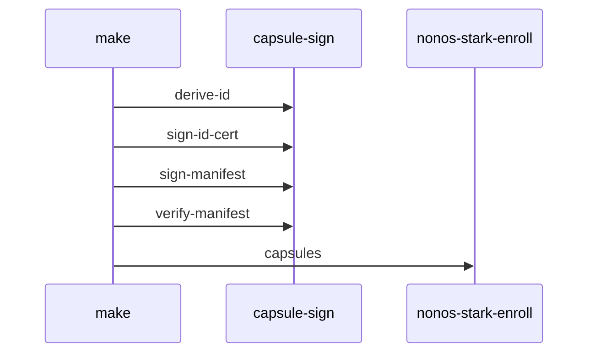

# Signing and publisher keys

Every [capsule](../overview/glossary.md#capsule) is signed with two hybrid key pairs and enrolled once with the rest of the set, and the kernel refuses any capsule whose certificate, manifest, signatures or proof do not check out.

## The keys

Two kinds of key sign a capsule, and both come as a hybrid pair: one Ed25519 key and one ML-DSA-65 key.

- The [trust anchor](../overview/glossary.md#trust-anchor) signs every [NONOS ID certificate](../overview/glossary.md#nonos-id-certificate). Its public halves are `nonos_trust_anchor_ed25519.pub` and `nonos_trust_anchor_mldsa65.pub` under `nonos-data/trust/keys/` (`tools/nonos_seal/keys.py:32`, `TA_PUBS`). The trust anchor policy built from them is baked into the kernel (`mk/20-build.mk:200-203`, `BAKED_TRUST_ANCHOR_POLICY`).
- A [publisher](../overview/glossary.md#publisher) key pair signs a capsule's [manifest](../overview/glossary.md#manifest). Each capsule has its own pair, named after its binary: `<bin>_publisher_ed25519.pub` and `<bin>_publisher_mldsa65.pub` in the same directory (`nonos-mk/capsule.mk:85`, `CAPSULE_KEY_PUB_PREFIX`). The 19 Linux userland programs share one publisher, `linux_userland_publisher` (`userland/linux_userland/Userland.mk:119-120`, `CAPSULE_KEY_PUB_PREFIX`).

The `.pub` files, certificates, manifests, trailers and the policy are committed under `nonos-data/trust/`. The private halves are seeds kept in `.keys/`, a directory `.gitignore` keeps out of git (`nonos-mk/capsule.mk:56-63`, `NONOS_BAKED_TRUST_DIR`). Key files are self-tagged binary blobs, `NONOSSK1` for a seed and `NONOSPK1` for a public key (`nonos-sign/src/cli/usage.rs:35-37`, `keygen`).

To see which publisher pairs a build needs, list the key prefix of every capsule the make files include:

```sh
python3 tools/nonos-capsule-key-prefixes
```

On this tree it prints 97 names on one line, from `proof_io` and `std_proof` to `power`. The script reads only the `include` lines of the make files, so the shared Linux userland publisher is not among them. Its own description says the key ceremony, `tools/nonos-key-ceremony`, makes one publisher pair per name (`tools/nonos-capsule-key-prefixes:17-19`, `CAPSULE_BIN_NAME`).

## capsule-sign

The host tool is the binary `capsule-sign`, built in `nonos-sign` around the `nonos_capsule_sign` library (`nonos-sign/Cargo.toml:8-14`). Its subcommands are `keygen`, `derive-id`, `mk-trust-policy`, `sign-id-cert`, `sign-manifest`, `sign-release`, `verify-release`, `verify-policy`, `verify-cert` and `verify-manifest` (`nonos-sign/src/cli/dispatch.rs:29-45`, `dispatch`). The `nonos-sign` host tests, 21 of them, passed in the flake checks on this commit.

## How a capsule is signed



The template in `nonos-mk/capsule.mk` drives `capsule-sign` for each capsule, and the seal, `tools/nonos_seal/capsules.py`, runs the same steps with the same arguments read from `tools/nix/capsules.json` (`tools/nonos_seal/capsules.py:77-96`, `sign`).

1. The publisher's NONOS ID is a BLAKE3 hash over the domain string `nonos.id.v1` and the length-prefixed handle, domain and recovery string, so it survives a certificate renewal (`src/security/nonos_id_cert/derive.rs:22-39`, `derive_nonos_id`). The template recomputes it on every signing with `derive-id` (`nonos-mk/capsule.mk:213-218`, `nonos_id`).
2. Before signing, `scripts/check_device_secret_cap.py` refuses DeviceSecret in any capsule but `prove` (`nonos-mk/capsule.mk:255-256`, `check_device_secret_cap`).
3. `sign-id-cert` writes the certificate: serial, NONOS ID, namespace glob, capability ceiling, trust anchor epoch, validity window and both publisher public keys, signed with both trust anchor seeds (`nonos-mk/capsule.mk:257-271`, `CAPSULE_SIGN_BIN`). The seal issues every certificate under epoch 1, valid from 2026-01-01 to 2030-01-01 in Unix milliseconds (`tools/nonos_seal/capsules.py:32-34`, `VALID_FROM_MS`).
4. `sign-manifest` hashes the ELF and signs the manifest with both publisher seeds, then `verify-manifest` checks the result against the trust anchor policy (`nonos-mk/capsule.mk:279-297`, `CAPSULE_SIGN_BIN`).
5. `nonos-stark-enroll capsules` takes every capsule as `CAPS:elf:trailer` and writes the [policy root](../overview/glossary.md#policy-root) and one [attestation trailer](../overview/glossary.md#attestation-trailer) per capsule in one run (`mk/20-build.mk:600-605`, `NONOS_STARK_ENROLL`).

The seal does not repeat a long enrollment it can reuse. When the root and trailers in the tree still pass the [spawn gate](../overview/glossary.md#spawn-gate)'s check for every capsule built, it keeps them; otherwise it enrolls the whole set again (`tools/nonos_seal/capsules.py:104-134`, `enrolled`).

A build with `NONOS_TRUST_REUSE=1` signs nothing at all. It requires the committed certificate and manifest, verifies them under the baked policy and checks that the freshly built ELF measures to the enrolled payload hash; a capsule that drifts fails by name (`nonos-mk/capsule.mk:220-248`, `NONOS_TRUST_REUSE`).

## Make targets and tools

The template gives every included capsule four targets (`nonos-mk/capsule.mk:177`, `NONOS_CAPSULE_RULES` defines them):

| Target | What it does |
|---|---|
| `nonos-mk-<slug>` | builds the ELF |
| `nonos-mk-<slug>-sign` | writes the certificate, the manifest and the trailer |
| `nonos-mk-<slug>-verify` | runs `verify-manifest` on the committed artifacts |
| `nonos-mk-check-<slug>-keys` | fails when a seed or `.pub` file is missing |

Two more cover the whole set: `nonos-mk-stark-enroll-capsules` runs the enrollment and `nonos-mk-all-capsules-attested` builds, signs and attests every capsule in the set (`mk/20-build.mk:608-626`, `ZK_CAPSULE_ROOT`). For example:

```sh
make nonos-mk-hello-sign
```

Not tested in this release.

It needs the two publisher seeds for `hello` and the two trust anchor seeds in `.keys/`, and it stops on the first missing one, naming the file and the `keygen` command that makes it (`nonos-mk/capsule.mk:204-211`).

Two front ends run the whole sequence:

- `nix run .#seal` builds, signs, enrolls and packs an image (`tools/nonos-seal:18-19`, `nonos_seal`). Before it stages anything for git, it refuses a file that looks like a private key (`tools/nonos_seal/keys.py:43-64`, `guard`). [The seal](../build/seal.md) describes it.
- `python3 tools/nonos-enroll --from <dir>` enrolls a set built by a reproducible builder: it checks the artifact is for this commit, verifies every binary against the builder's manifest, places them, then signs and enrolls through `nonos-mk-all-capsules-attested` (`tools/nonos_enroll/__main__.py:40-61`, `run_make`).

```sh
nix run .#seal
python3 tools/nonos-enroll --from <dir>
```

Not tested in this release.
