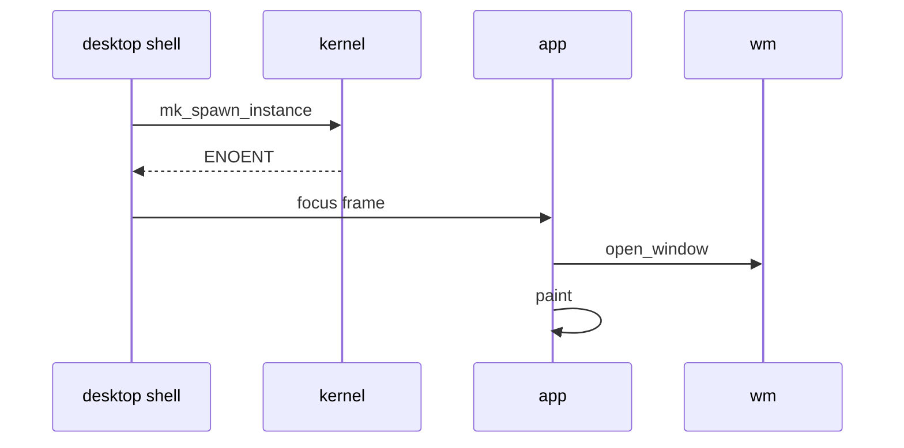

# Writing an app

Write a windowed app [capsule](../overview/glossary.md#capsule) on `nonos_app_skeleton` and test it, step by step on `capsule_hello`, the minimal app the tree keeps as its reference.

## What you build

`capsule_hello` opens a 360 by 180 window titled `Hello NONOS` (`userland/capsule_hello/src/hello/manifest.rs:22-33`, `manifest`), draws four lines of text (`userland/capsule_hello/src/hello/paint.rs:24-31`, `paint`) and closes on `Esc` (`userland/capsule_hello/src/hello/event.rs:19-24`, `on_event`). Every path below is hello's copy; a new app adds the same pieces under its own name. This page covers the program and its tests, and [Shipping an app](shipping-an-app.md) covers the rest, from the declaration to the Launchpad.

| Piece | Where | What it is | Page |
|---|---|---|---|
| Crate | `userland/capsule_hello/` | the `no_std` program and its `README.md` | this one |
| [Proof crate](../overview/glossary.md#proof-crate) | `userland/apps_proofs/` | host tests on the shipping source | this one |
| Declaration | `userland/capsule_hello/Capsule.mk` | identity, [endpoints](../overview/glossary.md#endpoint), [capability word](../overview/glossary.md#capability-word) | [Shipping an app](shipping-an-app.md) |
| Include | `mk/20-build.mk` | the line that makes the build see the capsule | [Shipping an app](shipping-an-app.md) |
| Catalogue | `tools/nix/capsules.json` | what the flake builds and the [seal](../overview/glossary.md#seal) signs | [Shipping an app](shipping-an-app.md) |
| Feature | `Cargo.toml` | `nonos-capsule-hello`, and the feature set that turns it on | [Shipping an app](shipping-an-app.md) |
| [Kernel mirror](../overview/glossary.md#kernel-mirror) | `src/userspace/capsule_hello/` | embeds the capsule and spawns it | [Shipping an app](shipping-an-app.md) |
| Spawn | `src/userspace/init/spawn_plan/apps.rs` | starts it at boot | [Shipping an app](shipping-an-app.md) |
| Launcher row | `userland/capsule_desktop_shell/src/state/apps.rs` | its tile on the dock and in the Launchpad | [Shipping an app](shipping-an-app.md) |

hello has every piece but the proof crate and the launcher row. Nothing in userland names its service `app.hello`, so an image that carries hello spawns it at boot, and it then waits for a focus frame that no part of the desktop sends. [Shipping an app](shipping-an-app.md) says which images carry it and adds the row that opens it.

## Choose the right path first

Every capsule with a row in `LAUNCHER_APPS`, the table behind the dock and the Launchpad, is built on `nonos_app_skeleton` and the toolkit under it. The one row that is not a capsule is Qwen, `tool.qwen`, a window of the [Linux personality](../overview/glossary.md#linux-personality) (`userland/capsule_desktop_shell/src/state/apps.rs:103-105`, `LauncherIcon::Qwen`). Of the 116 entries in `tools/nix/capsules.json`, 31 have a `Cargo.toml` that names `nonos_app_skeleton`, and none names `nonos_runtime` or a crate of `userland/sdk/` (counted on this tree).

- The SDK under `userland/sdk/` and the runtime `nonos_runtime` are not used by any shipped app. No `Capsule.mk` builds an SDK crate, so no SDK app is signed, enrolled or in an image; the one capsule crate that uses one, `capsule_gui_proof`, has no `Capsule.mk` either (`userland/sdk/README.md:20-22`, `capsule_gui_proof`). The examples in `userland/nonos_examples/` and `userland/sdk/examples/` are in the same position. [libc and the Rust runtimes](libc.md) describes both.
- `tools/nonos-app` is the path for an unmodified crates.io command-line program. Its `add` cross-compiles the crate, makes its [publisher](../overview/glossary.md#publisher) keys, writes its `Capsule.mk` and include line, records it in `userland/apps.list`, and rewrites the kernel's tool registry and the desktop's `TOOL_APPS` table (`tools/nonos-app:276-287`, `cmd_add`). Such a tool runs in the Terminal, not in a window of its own: its Launchpad tile hands the Terminal its command line (`userland/capsule_desktop_shell/src/server/handlers/launchpad.rs:78-95`, `tool_command`). [Userland](README.md) lists the seven.
- An unmodified Linux program runs as a [guest](../overview/glossary.md#guest) of the Linux personality, not as a capsule of its own. See [The Linux personality](linux-personality.md).

Use this page for a program with its own window.

## 1. The crate

Put the crate directly under `userland/`, named `capsule_<name>` like the others. The build runs `cargo` in the crate's directory with `--target ../x86_64-nonos-user.json`, so the crate must sit one level down (`nonos-mk/capsule.mk:186-198`, `USERLAND_LIBC`).

hello's `Cargo.toml` names one binary, `hello`, and two dependencies, `nonos_libc` and `nonos_app_skeleton`, and builds its release with `panic = "abort"` (`userland/capsule_hello/Cargo.toml:15-28`, `nonos_app_skeleton`). Its whole program is one call:

```rust
#![no_std]
#![no_main]

extern crate alloc;

mod hello;

use nonos_app_skeleton::run;

#[no_mangle]
pub unsafe extern "C" fn _start() -> ! {
    run(hello::Hello::new)
}
```

`_start` hands `run` a function that builds the app (`userland/capsule_hello/src/main.rs:17-29`, `_start`). `run` exists only with the skeleton's `runtime` feature, which is on by default; a `std` capsule turns it off and drives `run_loop` itself (`userland/app_skeleton/Cargo.toml:14-19`, `runtime`).

Two files go with the crate:

- A committed `Cargo.lock`. The flake builds each capsule from its own directory against its own lock (`tools/nix/capsules.nix:96-101`, `lockFiles`), with `cargo build --frozen` (`tools/nix/capsules.nix:117-119`, `userTarget`).
- A `README.md`. The static checks fail on any `userland/capsule_*` directory without one (`nonos-ci/run-static-checks.sh:4632-4651`, `missing_readmes`).

## 2. The App trait

The skeleton exports the trait and its types from the crate root (`userland/app_skeleton/src/lib.rs:33`, `AppManifest`). An app implements three methods, `manifest`, `on_event` and `paint` (`userland/app_skeleton/src/app/behavior.rs:22-25`, `App`). Everything else has a default. `on_tick` is called every `tick_interval_ms`, 1000 by default, and returns true when the window needs a repaint (`userland/app_skeleton/src/app/behavior.rs:27-33`, `tick_interval_ms`). `busy`, `take_damage`, `wants_full_screen` and `close_requested` cover background work, partial repaints, full screen and a close that would lose work, and `titlebar_accessory_w` with its two companions puts a widget of the app's own in the title bar. hello implements the three and nothing else:

```rust
impl App for Hello {
    fn manifest(&self) -> AppManifest {
        manifest()
    }
    fn on_event(&mut self, event: InputEvent) -> EventOutcome {
        on_event(event)
    }
    fn paint(&mut self, fb: &mut PaintBuffer) {
        paint(fb);
    }
}
```

The skeleton also exports clipboard calls from its root (`userland/app_skeleton/src/lib.rs:34`, `clipboard_copy`), and its `clients` module talks to the desktop's services, `vfs` for files among them.

### The window

`AppManifest` describes the window, not the signed [manifest](../overview/glossary.md#manifest): a title, a 32-bit window id, a kind, an origin, a size and an input mask (`userland/app_skeleton/src/app/manifest.rs:20-29`, `AppManifest`). The kind is `Normal`, `Dialog`, `Tooltip` or `Popup` (`userland/app_skeleton/src/app/window_kind.rs:19-24`, `WindowKind`). hello's window id is the four bytes of `HELO`:

```rust
AppManifest {
    title: b"Hello NONOS",
    window_id: WINDOW_ID,
    kind: WindowKind::Normal,
    initial_x: 360,
    initial_y: 240,
    width: 360,
    height: 180,
    input_kind_mask: INPUT_KEY_DOWN_BIT,
}
```

The size is the whole window, frame included, as drawn at one to one. For a `Normal` window on a display drawn at a larger scale, the skeleton grows the window by what the frame takes beyond that, so the content area stays the same. It then caps the window at `WINDOW_FRACTION`, 88 percent of the display's width and of the height between the menu bar and the dock, a cap that never drops below 480 by 360. A window it had to shrink is centred; any other keeps its origin, pulled fully on screen (`userland/app_skeleton/src/runner/fit_display.rs:34-80`, `WINDOW_FRACTION`).

Bit n of `input_kind_mask` asks for `InputKind` n. The skeleton always adds absolute pointer, wheel, button and touch events, and key-up whenever key-down is asked for (`userland/app_skeleton/src/setup/input_mask.rs:27-40`, `input_mask`).

### Events

An `InputEvent` carries a kind, flags, a code, a position, a wheel delta and a timestamp (`userland/app_skeleton/src/input/event.rs:20-29`, `InputEvent`). The kinds are key down and up, relative and absolute pointer, wheel, button down and up, and touch (`userland/app_skeleton/src/input/kind.rs:19-28`, `InputKind`). Key codes are constants such as `KEY_ESC` and `KEY_ENTER`. The input router sends the volume keys and the power button to the desktop shell whatever has focus (`userland/capsule_input_router/src/route/shell_keys.rs:31-34`, `is_shell_key`), so an app never sees `KEY_MUTE` to `KEY_POWER` (`userland/app_skeleton/src/input/keys.rs:38-44`, `KEY_POWER`).

Positions arrive in content coordinates, with the frame already taken off (`userland/app_skeleton/src/runner/drain_ipc.rs:146-148`, `on_event`). `on_event` answers with an `EventOutcome`, which has five variants (`userland/app_skeleton/src/app/event_outcome.rs:18-24`, `EventOutcome`). Only `Idle`, `Repaint` and `Close` count there; `Minimize` and `Maximize` from `on_event` are ignored, and only the title bar buttons minimise or maximise. A frame whose sender is not the input router never reaches the app, so another capsule cannot type into it (`userland/app_skeleton/src/runner/drain_ipc.rs:72-75`, `from_router`). hello closes on `Esc`:

```rust
pub fn on_event(event: InputEvent) -> EventOutcome {
    if event.kind == InputKind::KeyDown && event.code == KEY_ESC {
        return EventOutcome::Close;
    }
    EventOutcome::Idle
}
```

### Painting

`paint` gets a `PaintBuffer` over the window's pixels, 32-bit ARGB words with a stride, a width and a height (`userland/toolkit/src/paint/buffer.rs:17-22`, `PaintBuffer`). The toolkit gives it `clear`, `fill_rect`, `text`, `text_scaled`, rounded panels, lines and circles, and TrueType text through `text_ttf` (`userland/toolkit/src/paint/text_ttf.rs:24`, `text_ttf`). hello draws an accent bar and four lines:

```rust
pub fn paint(fb: &mut PaintBuffer) {
    fb.clear(BG);
    fb.fill_rect(0, 0, 360, 4, ACCENT);
    fb.text_scaled(24, 40, b"hello, NONOS", ACCENT, 2);
    fb.text(24, 88, b"a signed, attested capsule", TEXT);
    fb.text(24, 110, b"built from the quickstart", TEXT);
    fb.text(24, 148, b"press Esc to close", DIM);
}
```

## 3. How a window opens



A click on the app's tile makes the desktop shell ask the kernel for a new window with `mk_spawn_instance`. For an app the kernel keeps no extra-window entry for, it answers `ENOENT`, and the shell sends the running app a focus frame instead; [Shipping an app](shipping-an-app.md) has the details. The app then opens its window: `open_window` maps a surface and asks the `wm` to place it (`userland/app_skeleton/src/setup/open.rs:26-43`, `announce`), and the app paints.

`run` sets up the heap, then waits in `idle::wait` (`userland/app_skeleton/src/runner/entry.rs:34-45`, `heap_init`). The wait ends only on an 8-byte `NCTL` focus frame whose sender is the desktop shell's pid (`userland/app_skeleton/src/runner/idle.rs:29-47`, `DESKTOP_SHELL`). The Terminal's `run` command sends the same frame from the Terminal's own pid (`userland/capsule_terminal/src/command/builtin/nox/run.rs:44-49`, `mk_ipc_send_to_pid`), which the skeleton drops, so `run` does not open an app built on the skeleton.

On the first focus frame the app looks up the `compositor`, `wm`, `input_router` and `toolkit` services, up to `READY_ATTEMPTS`, 256 times (`userland/app_skeleton/src/discover/require.rs:22-47`, `require_peers`), and keeps what it found; a lookup that fails is tried again on the next focus frame (`userland/app_skeleton/src/runner/open_peers.rs:29-37`, `open_peers`). It then builds the app and runs its frame loop (`userland/app_skeleton/src/runner/entry.rs:48-70`, `frame_loop`). Before the loop, `boot` fits the window to the display, calls `open_window`, subscribes to input and paints the first frame (`userland/app_skeleton/src/runner/boot.rs:57-60`, `prime_frame`).

When the window closes, an app started at boot goes back to waiting. An instance the kernel started for an extra window carries the argument `--nonos-window-instance` and exits instead, so its memory is cleared and its slot freed (`userland/app_skeleton/src/runner/ephemeral.rs:26-27`, `INSTANCE_ARG`). An app that fails says so in one `[APP-FAIL]` line (`userland/app_skeleton/src/log_line.rs:26-29`, `say`), but the kernel takes that line only from a capsule holding Debug (`src/syscall/contract/cap_table/mk.rs:138`, `can_debug`).

## 4. The proof crate

No check requires a proof crate for an app; `check_driver_proofs.py` covers [driver capsules](../overview/glossary.md#driver-capsule) only (`scripts/check_driver_proofs.py:36-48`, `unproved`). The apps that have tests keep their decisions in small files with no drawing or IPC in them, and host tests mount those files unchanged with `#[path]`. Apps without a crate of their own share `userland/apps_proofs`, which mounts, for example, Snake's state files (`userland/apps_proofs/src/lib.rs:409-429`, `snake_state`). It depends on `nonos_app_skeleton` without default features, so the skeleton's types build on the host (`userland/apps_proofs/Cargo.toml:21`, `nonos_app_skeleton`).

hello has no tests in this release. Its `on_event` is such a file, and a test of it in `apps_proofs` would look like this. It is not in the tree and was not compiled for this release:

```rust
// lib.rs
#[path = "../../capsule_hello/src/hello/event.rs"]
pub mod hello_event;
#[cfg(test)]
mod hello_tests;

// hello_tests.rs
use crate::hello_event::on_event;
use nonos_app_skeleton::{EventOutcome, InputEvent, InputKind, KEY_ENTER, KEY_ESC};

fn key(code: u32) -> InputEvent {
    InputEvent { kind: InputKind::KeyDown, flags: 0, code, x: 0, y: 0, delta_x: 0, delta_y: 0, timestamp_ns: 0 }
}

#[test]
fn esc_closes_and_other_keys_do_nothing() {
    assert!(on_event(key(KEY_ESC)) == EventOutcome::Close);
    assert!(on_event(key(KEY_ENTER)) == EventOutcome::Idle);
}
```

At this commit `proofs-apps_proofs` passes with 252 tests, and `proofs-desktop_proofs`, which mounts and tests the launcher table, with 230. A crate of your own goes directly under `userland/` with a name ending in `_proofs` and a committed `Cargo.lock`, or the flake does not run it (`tools/nix/checks.nix:20-21`, `proofDirs`). [Tests and proofs](../contributing/tests-and-proofs.md) covers the rest, from regenerating `inputs.json` to passing clippy.

## 5. Into the image

The program and its tests are half the work. [Shipping an app](shipping-an-app.md) takes the crate the rest of the way: the `Capsule.mk` and its capability word, the include line, the Cargo feature and profile, the kernel mirror, the spawn-plan entry, the `LAUNCHER_APPS` row, the publisher keys and a [development image](../overview/glossary.md#development-image) to boot it in.

## See also

- [Shipping an app](shipping-an-app.md)
- [Userland](README.md)
- [Manifests and capabilities](manifests-and-capabilities.md)
- [Signing and publisher keys](signing-and-publisher-keys.md)
- [IPC services](ipc-services.md)
- [Writing a driver](../drivers/writing-a-driver.md)
- [Processes and capsule spawn](../kernel/processes-and-spawn.md)
- [The desktop](../using/desktop.md)
- [Tests and proofs](../contributing/tests-and-proofs.md)
