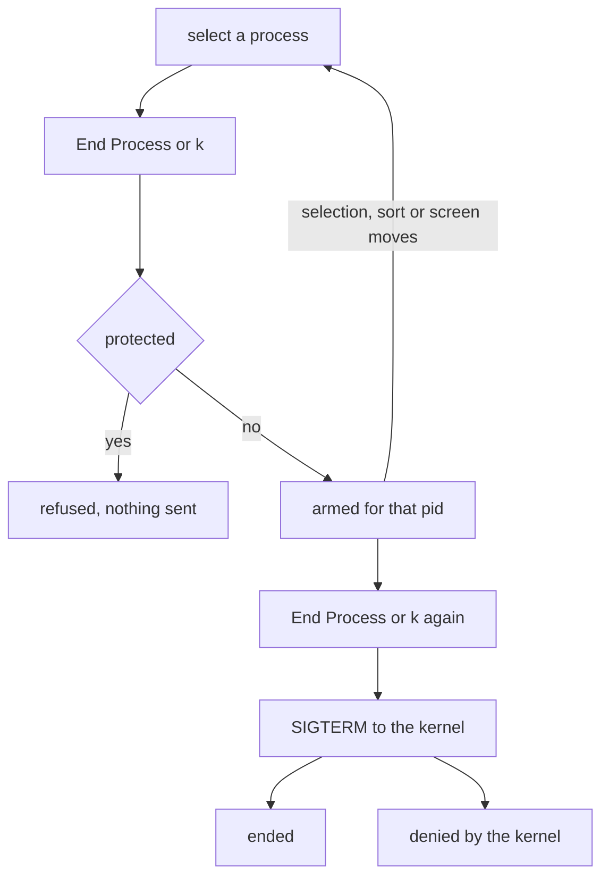
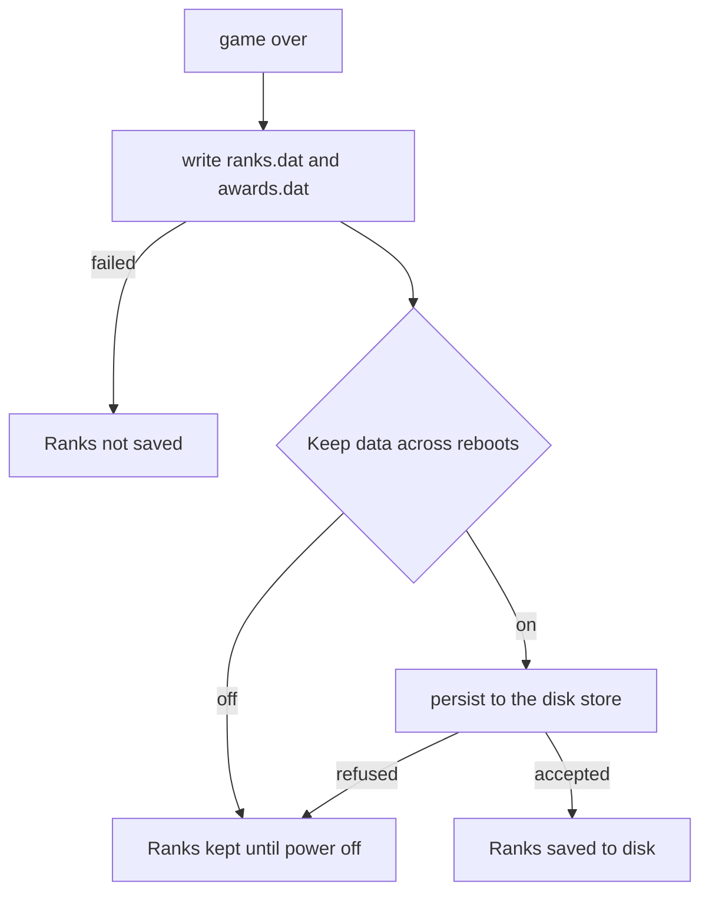

# Everyday apps

How to use Editor, Calculator, Processes and Snake: what each does, its keys, what it keeps and where, its limits and the messages it shows.

## The four apps

Each is a [capsule](../overview/glossary.md#capsule) with a tile on the dock and on the Launchpad. All four are in `microkernel-desktop-offline`, the set every desktop [build profile](../overview/glossary.md#build-profile) includes, so the standard, hardened, air-gapped, qemu and dev images all carry them.

| App | Service | Required capabilities | What it keeps |
|---|---|---|---|
| Editor | `app.text_editor` | `0x1859` | The files you save, in memory only |
| Calculator | `app.calculator` | `0x1819` | Nothing |
| Processes | `app.process_manager` | `0x2001819` | Nothing |
| Snake | `app.snake` | `0x1859` | Its ranks and awards, on disk only on a machine that keeps data |

The required capabilities make up each app's [capability word](../overview/glossary.md#capability-word). All four hold CoreExec, IPC, Memory, GraphicsDisplayQuery and GraphicsSurfaceCreate. Editor and Snake add FileSystem, which the [file store](../overview/glossary.md#file-store) requires of every caller. Processes adds ProcessControl, which lets it read every field of every row of the process table and end other processes. None of them holds Network. An image built with `capsule-serial-debug` (standard, qemu and dev, not hardened or air-gapped) also grants each app Debug, its optional capability `0x100`, so it can write log lines to the serial console.

First-boot setup can turn Editor and Calculator off. Processes and Snake have no switch. A click on an app that setup turned off shows a notice ending `turned off at setup`. The other dock apps are on [The desktop](desktop.md).

## Editor

Editor edits text and code. Every file opens in the code view, with line numbers, and with colours when it is code. `Ctrl+M` switches to the page view, which lays the text out on pages under a formatting ribbon, and back again.

To open a file, use any of these. A file that is already open in a tab is brought to the front, not opened twice.

- Click a desktop icon that is neither a folder nor a picture.
- Open a `.txt`, `.md`, `.log`, `.rs`, `.toml`, `.json` or `.html` file in [Files](files.md).
- In Editor, `Ctrl+O` asks for a path, `Ctrl+P` finds a file by part of its name, and `Ctrl+B` shows the file tree of the whole store.
- The Home screen, second on the activity bar at the left, lists every file in the store and the last 8 files this window opened.

The status bar names the language from the file's extension: Rust, C, C++, Python, JavaScript, TypeScript, Go, Shell, TOML, JSON, YAML, HTML, CSS, Java, Kotlin, Ruby, PHP, Lua or SQL. All of these are coloured by one shared lexer, not a grammar per language: `//`, `#` and `--` comments, `/* */` blocks, strings, numbers and one common set of keywords. Markdown and any other extension are shown as plain text.

### Editor keys

Help, then Keyboard Shortcuts, opens this list as a document. The `editor_proofs` [proof crate](../overview/glossary.md#proof-crate) checks it against the key handlers.

| Keys | Action |
|---|---|
| `Ctrl+N`, `Ctrl+W` | New tab, close tab |
| `Ctrl+O`, `Ctrl+P` | Open by path, open by part of the name |
| `Ctrl+S`, `Ctrl+Shift+S` | Save, save as |
| `Ctrl+E` | Export to Markdown, DOCX or PDF |
| `Ctrl+Z`, then `Ctrl+Y` or `Ctrl+Shift+Z` | Undo, then redo |
| `Ctrl+X`, `Ctrl+C`, `Ctrl+V`, `Ctrl+A` | Cut, copy, paste, select all |
| `Ctrl+Backspace` | Delete a word |
| `Ctrl+F`, `Ctrl+H`, `Ctrl+Shift+H` | Find, replace, replace all |
| `Ctrl+G` | Go to a line by number |
| `Ctrl+D`, `Ctrl+Shift+K`, `Ctrl+/` | Duplicate the line, delete the line, comment or uncomment |
| `Tab`, `Shift+Tab` | Indent, dedent |
| `Ctrl+Left`, `Ctrl+Right`, `Ctrl+Home`, `Ctrl+End` | Move by word, or to either end |
| `Ctrl+=`, `Ctrl+-`, `Ctrl+0` | Zoom in, zoom out, reset |
| `Ctrl+M`, `Ctrl+B`, `Ctrl+K` then `T` | Page or code view, file tree, next theme |
| `Ctrl+Shift+B`, `Ctrl+I`, `Ctrl+U` | Bold, italic, underline |

`Esc` closes a prompt or the find bar, and in the text it clears the selection. It never closes the window.

### Saving and exporting

`Ctrl+S` writes the document to its own path. A new document, or `Ctrl+Shift+S`, asks for a path first. Saving over a different file that already exists asks once more: `a file with that name exists: Enter again replaces it`.

Save writes the text alone. Headings are text, a leading `#`, so they are saved. Bold, italic, underline, strike, colour, font, size and alignment from the ribbon stay beside the text in the window's memory, and the status line says so: `saved the text; formatting goes out with Export (.docx, .pdf, .md)`.

`Ctrl+E` exports. Type a path that ends in `.md`, `.docx` or `.pdf`. Any other ending is refused with `export needs .md, .docx or .pdf`. Export writes out the formatting that Save leaves behind, and Markdown as far as Markdown can say it. A finished export says `exported`. Export does not ask before it replaces a file that is already at that path.

Save does not reach the disk. Editor writes into the file store, which holds every file in memory, and it never asks the store to keep one. The Terminal's `keep` cannot keep a file Editor created either, because only the process that created a file may keep it. A file you save in Editor is gone at power off, even on a NONOS installed to a disk. [Files](files.md) says what is kept, and how.

### Closing and deleting

- On a tab with unsaved changes, the first `Ctrl+W` or close says `unsaved changes: close again to discard them, Ctrl+S to save`. A second close discards them.
- The window's close button does the same for the whole window: `unsaved changes: close the window again to discard them`.
- `Delete` in the file tree's right-click menu acts at once, without asking. On a folder it removes everything inside. There is no trash.

### Editor limits

- A document holds at most 256 KiB.
- A larger file does not open, and no tab opens for it. The status line says `open refused: file is larger than 256 KiB`. A file that is not UTF-8 says `open refused: file is not valid UTF-8`. The open reads one byte past the limit, so a file cut off at 256 KiB is never opened and saved back short.
- Typing that would take a document past 256 KiB does nothing, and the status line says nothing.
- Paste takes at most the first 512 bytes of the clipboard. A longer copy is cut there. A cut that splits a character, or a paste that would take the document past 256 KiB, is refused with `paste rejected`.
- `Ctrl+C` with nothing selected copies the whole document. The clipboard holds at most 64 KiB in one copy and refuses more, and the status line then says `clipboard unavailable`. [Copy and paste](desktop.md#copy-and-paste) says what the clipboard keeps and for how long.
- Undo reaches back at least 400 steps. A run of typing at one place counts as one step.
- The Settings screen has one section, Editing, with two switches: `Highlight the current line` starts on and `Show invisible characters` off. Like the theme and the zoom, they last only as long as the window.

### Editor messages

| Status line | Cause |
|---|---|
| `open failed: file service not reachable` | Editor could not find the file store. |
| `open failed: file could not be read` | The store refused the read. |
| `save failed: file service not reachable` | Editor could not find the file store. |
| `save failed: the file store did not answer; try again` | The store did not answer. |
| `save failed: the file could not be made there; check the folder exists` | The store would not open the file at that path: a missing folder, a folder of that name, a read-only place such as `/capsules`, or no free file slot. |
| `save failed: the file store is full; delete files to make room` | The store ran out of room while writing, at one of the limits listed on [Files](files.md). |

The table lists what a save can reach. Every failure to open the file at a path comes back from the store's client as one reason, so a folder of that name says `could not be made there`, not the editor's `a folder has that name`. An export that fails says the same things, starting `export failed:`.

## Calculator

Calculator does arithmetic in five modes, picked from the rail at the side of its window: Basic, Scientific, Programmer, Convert and History.

- Numbers are fixed point: an `i128` with 8 digits after the point. You can type 16 digits before the point; more are ignored. A result too large stops with an error and never wraps.
- Typing digits after the point has a fault in this release. The first digit after the point lands in the hundredths place, so `1`, `.`, `5` enters 1.05, and only seven digits after the point are taken. A pasted number is typed the same way and has the same fault. Results are not affected: `1`, `/`, `4`, `=` shows 0.25, so enter a fraction as a division. This is read from the code and was not observed on a running image.
- Scientific adds sin, cos and tan and their inverses, ln, log to base 10, exp, `n!`, `x²`, `xʸ`, `π` and `e`. Angles are in radians: there is no degree switch. The factorial `n!` takes a whole number from 0, and `28!` is the largest it can show.
- Programmer works on a 32-bit word in HEX, DEC, OCT or BIN, signed in DEC only, with AND, OR, XOR, NOT, `<<` and `>>`.
- Convert has four groups. Length: millimetre, centimetre, metre, kilometre, inch, foot, mile. Weight: milligram, gram, kilogram, tonne, ounce, pound. Temperature: Celsius, Fahrenheit, Kelvin. Data: bit, byte, kibibyte, mebibyte, gibibyte, tebibyte. There is no currency, on purpose: Calculator has no source of live exchange rates, and fixed ones would give wrong answers that look right.
- History holds the last 32 results, newest first. Scroll it with the wheel or `Up` and `Down`. A click on a row puts its result back on the Basic keypad.

### Calculator keys

Letters work in either case, except `m` and `M`.

| Key | Action |
|---|---|
| `0` to `9`, `.` | Type a number |
| `+`, `-`, `*` or `x`, `/` | Add, subtract, multiply, divide |
| `=` or `Enter` | Equals |
| `%`, `n`, `r`, `q`, `i` | Percent, change sign, square root, square, reciprocal |
| `M`, `m` | Store in memory, recall memory |
| `a`, `s`, `l` | Add to memory, subtract from memory, clear memory |
| `c` or `Backspace` | `AC`: clear the entry, the pending sum and any error |
| `Ctrl+V` or `Shift+Insert` | Paste a number or a sum |
| `Esc` | Close the window |

In Programmer mode `a` to `f` are hex digits, as on its keypad, never memory or clear keys, so `Backspace` is the way to clear there. No key deletes a single digit: `Backspace` clears everything, as `AC` does.

### Calculator errors and limits

- Three errors take the place of a number. `Cannot divide by zero`. `Result too large`, for any overflow, a conversion included. `Not defined`, for the square root of a negative, the logarithm of zero or less, an inverse sine or cosine outside -1 to 1, a tangent that has no finite value, a negative number to a fractional power, or the factorial of a negative or fractional number. After an error, digits and operators are ignored until you clear with `AC`.
- A paste is entered as the keys that would type it: a number such as `1,234.56`, or a sum such as `100/8-2`. Anything else, a word, a date or `3,5`, is refused whole and the display keeps its number.
- Calculator cannot copy its result to the clipboard.
- History, memory and the mode last as long as the window. Calculator holds no FileSystem capability, so it reads and writes no file.

## Processes

Processes shows every process the kernel runs, with its CPU share, memory, capabilities and state, and it can end one. Open it from the dock, from Help then Processes on the menu bar, or with `Ctrl+Alt+Esc` from any window, even one that takes every key. It reads the process table again once a second.

It has six screens: Overview, Processes, CPU, Memory, Authority and Security. Overview and Processes show the table beside an inspector for the selected process. The other four are views of the same reading.

### Processes keys

Press `?` to see this list in the window. Letters work in either case.

| Key | Action |
|---|---|
| `1` to `6`, `Tab` | Go to a screen by its number, go to the next screen |
| `s` | Go to Security, and back to the table |
| `/` | Search by name. `Esc` empties the search. |
| Arrows, `Page Up`, `Page Down`, `Home`, `End` | Move the selection |
| `c`, `m`, `n`, `p`, `i`, `y` | Sort by CPU share, resident memory, name, pid, messages per second, syscalls per second |
| `a`, `e`, `t`, `g` | Show every process, only those with sensitive authority, only the protected core processes, only those the monitor flagged |
| `r` | Read the table again now |
| `k` | End the selected process, pressed twice |
| `Esc` | Close the window |

### Ending a process

1. Click a row, or move to it with the arrows, to select a process.
2. Press End Process in the inspector, or `k`. This first press leaves that pid armed, and the status strip says `press End Process or k again to confirm`. Moving the selection, sorting or changing screen disarms it.
3. Press End Process or `k` again. The second press sends it.

The window asks the kernel to end the process with SIGTERM. The kernel accepts SIGINT, SIGTERM and SIGKILL and tears the process down at once for each, with no handler run, so there is no gentler way and no separate force quit. Without ProcessControl or Admin, the kernel lets a process end only its own children and the Linux guests it supervises. The status strip then shows the kernel's answer:

- `ended`: the process is gone, or had already gone.
- `denied by the kernel: no authority over that process`.
- `the kernel refused the request as invalid`, or `the kernel refused to end it`.

Processes refuses, before it asks the kernel, to end the processes the desktop and the kernel's services stand on: `init`, `login`, `keyring`, `entropy_pool`, `crypto_pool`, `policy`, `input_router`, `vfs_pool`, `net.core`, `compositor`, `wm` and `desktop_shell`. It refuses to end its own window too. For these the inspector shows `Protected: cannot be ended here` where the button would be, and `k` says `protected: a core system process or this window cannot be ended here`. No app is on the list, and neither are other Processes windows.

### What the status strip says

The left of the status strip shows the worst finding of the monitor, or `NO FINDINGS`. The monitor looks for three things only:

- `CRIT`: a watched service it saw running is gone. The watched services are the protected processes above less `login`, which exits on its own.
- `WARN`: one process held 95% or more of the CPU for 3 readings in a row.
- `INFO`: a process other than `init` holds Admin.

`NO FINDINGS` means none of those three was seen. It does not say the system is secure.

A table with no rows says why: `reading process table`, `process table unavailable: the kernel refused the read`, `No process matches the current filter or search`, or `The kernel listed no processes`. Processes reads at most 256 processes at a time, and it keeps the last 60 readings of CPU share and memory, for the whole system and for each live process. It holds no FileSystem capability, so it writes no file.

## Snake

Snake is a game on a 35 by 21 grid. It makes no sound. It has four modes:

| Mode | Rules |
|---|---|
| Arcade | Three lives. The pace climbs with every bite. |
| Classic | One life, one speed, hard walls. The edges never wrap. |
| Time Attack | 90 seconds and one life. The pace climbs. |
| Zen | The edges always wrap, and a move that would crash is refused, so the run never ends and never reaches the ranks. |

Four difficulties set the pace: the time between two steps at the start, the shortest it gets, and how much shorter each bite makes it. Classic keeps the starting pace.

| Difficulty | At the start | Fastest | Per bite |
|---|---|---|---|
| Easy | 200 ms | 120 ms | 3 ms |
| Normal | 160 ms | 80 ms | 4 ms |
| Hard | 120 ms | 60 ms | 5 ms |
| Insane | 90 ms | 45 ms | 6 ms |

The New Run panel also has three switches: `Obstacles` and `Power-ups`, on at first, and `Wrap edges`, off at first. `Wrap edges` is locked in Zen and Classic, which decide wrapping themselves. While a power-up is active the snake moves at half speed and each bite scores double.

On the home screen, the `Daily challenge` card names the day's mode and difficulty, taken from the clock's day number, so all sixteen pairs come round in sixteen days. A click sets that pair on the New Run panel. The `Best run` card opens the ranks.

### Snake keys

| Screen | Keys |
|---|---|
| Home | `Enter` opens the New Run panel. |
| New Run | `Enter` starts, `Esc` goes home. |
| Playing | Arrows or `W`, `A`, `S`, `D` steer, and the first one starts the run. A turn straight back is ignored. `Space`, `P` or `Esc` pauses. |
| Paused | `Space`, `P`, `Esc` or `Enter` resumes. |
| Game over | `Enter` or `Space` plays again, `Esc` goes home. |
| Ranks | `Enter` or `Esc` goes home. |

The buttons under the board are `Pause`, `Restart` and `Home`. The pause panel offers `Resume`, `Restart`, `Settings` and `Home`. In the Safe Mode [boot profile](../overview/glossary.md#boot-profile) the kernel does not start Snake at all.

### Where Snake keeps its ranks

Snake keeps its ten best runs by score, and up to 64 awards, in `/games/snake/ranks.dat` and `/games/snake/awards.dat`. A game over writes both files into the file store, once, never during play. Snake then asks the store to keep them on disk only when the [policy store](../overview/glossary.md#policy-store) field `Keep data across reboots` is on. On an [amnesic boot](../overview/glossary.md#amnesic-boot) it does not ask.

The Ranks screen says, beside Back, what became of the last save or load:

| Line | Meaning |
|---|---|
| `Ranks saved to disk` | Both files reached the disk. |
| `Ranks kept until power off: this boot keeps nothing on disk` | The boot keeps no data, or the store answered `access denied`. |
| `Ranks kept until power off:` with another reason | The store refused to keep them, for that reason. |
| `Ranks not saved:` with a reason | The write into the file store failed. |
| `Stored ranks not read:` with a reason | A ranks or awards file exists but did not read or decode. |

A first game with no files yet says nothing. If the file store stops answering, Snake stops trying for the life of the window, and its ranks then say `Ranks not saved: the file service did not answer`.

On a NONOS installed to a disk, two rules narrow this. The file store lets only the process that created a file keep it, and the disk store replaces a kept file only with one of exactly the same length. The ranks file grows by 12 bytes with each of the first ten runs. A later Snake window, and every window after a restart, finds a ranks file it did not create: the copy read back from the disk at boot belongs to no process. Read from the code, the disk therefore keeps the ranks as the first save that reached it left them, and later saves stay in memory:

- A save of a different length says `Ranks kept until power off: already exists`.
- A save of a file this window did not create says `Ranks kept until power off: this boot keeps nothing on disk`, because Snake reads every `access denied` as an amnesic boot.

This has not been tested on an installed machine in this release.

## Image Viewer and Clock

Image Viewer and Clock are in no image that a build profile makes: no profile turns on `nonos-capsule-image-viewer` or `nonos-capsule-clock`. Their code is in the source tree, and the `apps_proofs` proof crate tests parts of it on the build machine. The image viewer is also built into `microkernel-image-viewer-smoketest`, a test kernel with no desktop that exercises only its rotate, scale and viewport steps.

The desktop still names Image Viewer, so you can meet it:

- The Launchpad has an `Image Viewer` tile, and a click on a picture on the desk (`.png`, `.jpg`, `.jpeg`, `.bmp`, `.gif`) asks for it. The kernel has no window it can open for `app.image_viewer` and answers ENOENT, so the notice reads `Image Viewer is not running; it has one window`. If setup turned the Media apps off, it reads `Image Viewer turned off at setup` instead.
- Files hands a picture to the desktop for Image Viewer, and when that fails it opens the picture in its own preview pane and says `that app could not be started; showing a preview`. The pane shows a picture's bytes as a hexdump, as it does for any file with a zero byte, or more than 30% unprintable bytes, in its first 1024 bytes.

Clock has no tile anywhere, so nothing leads to it. The date and time on the menu bar are drawn by the desktop shell itself.

## Where this comes from

- The four apps: the app set `microkernel-desktop-offline` in `Cargo.toml`, and the profiles in `tools/nix/config.nix`. Capability words: `CAPSULE_REQUIRED_CAPS` and `CAPSULE_OPTIONAL_CAPS` in each app's `Capsule.mk`. Debug on serial builds: `serial_debug_cap` in `src/capabilities/serial_debug.rs`. FileSystem asked of every caller: `userland/capsule_vfs/src/server/fs_gate.rs`. ProcessControl sees every field: `sees_all` in `src/syscall/microkernel/procstat_redact.rs`. Setup switches: `OPTIONAL` in `userland/policy_proto/src/apps/table.rs`.
- Editor: code view and colours, `mode_for_path` in `userland/capsule_text_editor/src/editor/mode.rs`. Last 8 files: `MRU_CAP` in `userland/capsule_text_editor/src/editor/home/mru.rs`. An open file comes to the front: `open_path` at `userland/capsule_text_editor/src/editor/ws_open.rs:32-36`. Language names: `language_name` in `userland/capsule_text_editor/src/editor/language.rs`. One shared lexer: `classify` in `userland/capsule_text_editor/src/editor/highlight.rs`.
- Editor keys: the checked list, `SHORTCUTS` in `userland/capsule_text_editor/src/editor/info_text.rs`. What `Esc` does: `dismiss` in `userland/capsule_text_editor/src/editor/dismiss.rs`.
- Saving and exporting: Save writes the text alone, `write_to` at `userland/capsule_text_editor/src/editor/ctrl_save.rs:44-67`. Export endings: `render` at `userland/capsule_text_editor/src/editor/ctrl_export.rs:44-55`. What Export writes: `ABOUT` in `userland/capsule_text_editor/src/editor/info_text.rs`. Editor makes no `persist` call anywhere in `userland/capsule_text_editor/src`. Only the creator may keep a file: `persistable` in `userland/capsule_vfs/src/store/fdtable/persist.rs`.
- Closing and deleting: close prompts, `request_close` and `confirm_quit` in `userland/capsule_text_editor/src/editor/ws_close.rs`. Delete without asking: `apply_menu_action` in `userland/capsule_text_editor/src/editor/ws_menu.rs`.
- Editor limits: 256 KiB, `CAPACITY` at `userland/capsule_text_editor/src/editor/state.rs:19`. Open refusals: `refuse_open` at `userland/capsule_text_editor/src/editor/open_limit.rs:34-42`. Typing at the limit: `splice` at `userland/capsule_text_editor/src/editor/edit.rs:84-89`. Paste: `ctrl_paste` at `userland/capsule_text_editor/src/editor/ctrl_paste.rs:22-24`. Copy with no selection: `ctrl_copy` in `userland/capsule_text_editor/src/editor/ctrl_copy.rs`. Clipboard cap: `MAX_ENTRY_BYTES` in `userland/capsule_clipboard/src/server/handlers/copy.rs`. Undo depth: `MAX_UNDO` at `userland/capsule_text_editor/src/editor/undo_push.rs:24`.
- Editor messages: one reason for any failure to open at a path, `write_file` at `userland/app_skeleton/src/clients/vfs/write_file.rs:27-41`. Save and export messages: `save_failed` and `export_failed` in `userland/capsule_text_editor/src/editor/save_said.rs`.
- Calculator: modes, `MODES` in `userland/capsule_calculator/src/calc/mode.rs`. Fixed point: `FRAC` at `userland/capsule_calculator/src/calc/fixed.rs:19-20`. Digits after the point, where the shift is one place too many: `decimal_digits_typed` at `userland/capsule_calculator/src/calc/actions/digit.rs:47-58`. Scientific functions: `apply` in `userland/capsule_calculator/src/calc/sci/apply.rs`. Factorial: `factorial` in `userland/capsule_calculator/src/calc/sci/factorial.rs`. Programmer word: `BITS` in `userland/capsule_calculator/src/calc/prog/mask.rs`. Unit groups: `CATEGORIES` in `userland/capsule_calculator/src/calc/convert/units.rs`. History: `CAP` at `userland/capsule_calculator/src/calc/history/ring.rs:20`.
- Calculator keys: letter case, `classify` at `userland/capsule_calculator/src/calc/event/key_classifier.rs:32-65`.
- Calculator errors and limits: the three errors, `error_text` at `userland/capsule_calculator/src/calc/format/error_text.rs:23-30`. Paste as keys: `keys_for` in `userland/capsule_calculator/src/calc/paste.rs`.
- Processes: `Ctrl+Alt+Esc` from any window, `bring_process_manager` in `userland/capsule_desktop_shell/src/server/handlers/escape_chord.rs`. Once a second: `on_tick` keeps the app skeleton's default `tick_interval_ms` of 1000 ms, `userland/capsule_process_manager/src/pm/app.rs:47-55` and `userland/app_skeleton/src/app/behavior.rs:31-33`. Screens: `SCREENS` in `userland/capsule_process_manager/src/pm/state/screen.rs`.
- Processes keys: the key table in `userland/capsule_process_manager/src/pm/ui/keys_table.rs`.
- Ending a process: two presses, `end_selected` at `userland/capsule_process_manager/src/pm/state/kill.rs:39-58`. End Process sends `MkKill` with `SIGTERM`: `userland/capsule_process_manager/src/pm/state/types.rs:31-34`. Who may end what: `sys_kill` at `src/syscall/microkernel/kill.rs:26-62`. The kernel's answer: `kill_note` at `userland/capsule_process_manager/src/pm/state/notes.rs:69-76`. Protected processes: `CRITICAL` at `userland/capsule_process_manager/src/pm/critical.rs:21-34`.
- What the status strip says: findings, `evaluate` in `userland/capsule_process_manager/src/pm/security/monitor.rs`. Watched services: `SERVICES` in `userland/capsule_process_manager/src/pm/security/watchlist.rs`. Empty table: `empty_table` in `userland/capsule_process_manager/src/pm/state/notes.rs`. Process limit: `MAX_PROCS` in `userland/capsule_process_manager/src/pm/state/types.rs`. Readings kept: `SAMPLES` in `userland/capsule_process_manager/src/pm/state/samples.rs`.
- Snake: grid, `COLS` in `userland/capsule_snake/src/snake/grid.rs`. Modes: `userland/capsule_snake/src/snake/state/mode.rs`. Paces: `TABLE` at `userland/capsule_snake/src/snake/state/difficulty.rs:30-35`. Power-ups: `bite_value` and `pace` in `userland/capsule_snake/src/snake/step/pace.rs`. Daily challenge: `pick` at `userland/capsule_snake/src/snake/state/daily.rs:26-31`.
- Snake keys: no Snake in Safe Mode, `NOT_SAFE` at `src/kernel_core/process_spawn/capsule_spawn/runner/profile_refuse.rs:30`.
- Where Snake keeps its ranks: file paths, `RANKS` at `userland/capsule_snake/src/snake/store/paths.rs:17-19`. A `persist` call only when `keeps_state` holds: `userland/capsule_snake/src/snake/store/save.rs:54-56`. Ranks line: `line` at `userland/capsule_snake/src/snake/state/kept.rs:97-104`. Store gate: `userland/capsule_snake/src/snake/store/gate.rs`. On an installed disk, creator only: `persistable` in `userland/capsule_vfs/src/store/fdtable/persist.rs`. Same length only: `permitted` in `userland/capsule_vfs/src/blk/store_rules.rs`. Run record: `RUN_LEN` in `userland/capsule_snake/src/snake/store/codec.rs`. Boot copy owned by no process: `stage` in `userland/capsule_vfs/src/store/fdtable/packages.rs`. Every `access denied` read as amnesic: `of_file` at `userland/capsule_snake/src/snake/state/kept.rs:54-63`.
- Image Viewer and Clock: no profile turns them on, `Cargo.toml` and `tools/nix/config.nix`. Code: `userland/capsule_image_viewer` and `userland/capsule_clock`. No window for `app.image_viewer`: `PendingApp::named` at `src/userspace/init/instance_spawn/named.rs:23-41`. The notice: `not_opened` at `userland/capsule_desktop_shell/src/state/says.rs:46-51`. Preview fallback: `open_selected` in `userland/capsule_file_manager/src/fm/event_open.rs`. Hexdump test: `is_binary` in `userland/capsule_file_manager/src/fm/preview_is_binary.rs`. Menu bar clock: `userland/capsule_desktop_shell/src/render/topbar/status.rs`.

## See also

- [The desktop](desktop.md)
- [Files](files.md)
- [Terminal](terminal.md)
- [Settings](settings.md)
- [Boot modes](../install/boot-modes.md)
- [Profiles](../build/profiles.md)
- [Userland](../userland/README.md)
- [Capsule isolation](../security/capsule-isolation.md)
