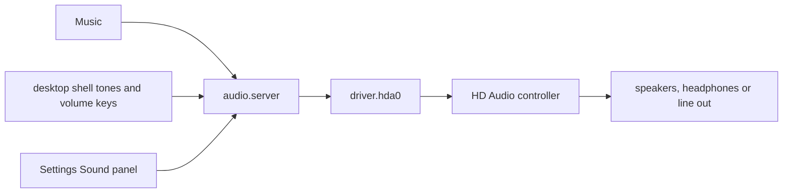

# Sound and media

How to play music and video on NONOS, how the volume works, where the sound comes out, why a machine may stay silent, and why pictures do not open in this release.

## How sound travels

- Music and the desktop shell send sound to the audio service, `audio.server`. It mixes up to four streams at once, at most two from any one program, into 16-bit stereo, and applies the master volume.
- The audio service is the only program the kernel lets send to the sound driver, `driver.hda0`. Apps never reach the hardware.
- The driver plays one output stream at 48 kHz, 16-bit, stereo, on an HD Audio controller: PCI class 0x04 subclass 0x03 from any vendor, or Intel's subclass 0x01.
- Nothing records sound. The driver opens no input stream, so no microphone is read.

## The volume

There is one master volume, from 0 to 100. Every sound passes through it, the desktop's tones included.

- The volume keys step it by 5, and Mute switches it off and on. They work whatever window has focus. A step up or down also unmutes.
- Each press shows a notice: `Volume 45%`, `Muted`, or `No sound output` with the reason in a few words.
- The volume slider and the `M` key in Music set the same master volume, so the keys and the window always agree.
- The level is applied as the square of the setting, so each step down sounds about as much quieter as the last: 50 is 12 dB below full, and 0 is silence.
- The audio service starts at full volume, and the level is not kept across a reboot.

The `Volume` row in [Settings](settings.md) is something else: how loud the desktop's own tones are, before the master volume. `System sound` switches those tones off, and `Alert sounds` adds a tone for warnings and errors.

The volume keys: Works on an x86_64 laptop (Intel Gemini Lake, 8 GB), maintainer hardware report, 6 October 2026; the image commit was not recorded.

## Where the sound comes out

You do not pick an output; the driver plays through every one it can. At start it walks each sound chip (codec), finds each speaker, headphone and line-out pin with a path to a converter that plays 48 kHz 16-bit sound, and drives them all on one codec, the one with speakers when there is one. It reads the headphone jack twice a second: when headphones go in, the speakers go off, and when they come out, the speakers come back.

The `Output device` row in Settings, Sound, says what the hardware reported when the panel opened, for example `Speakers and headphone jack` or `Headphones`.

HDMI and DisplayPort audio are not played: NONOS plays through speakers, headphones and line out only.

## When nothing plays

When a machine cannot play, the driver says why rather than staying silent. Settings shows the sentence, Music shows it on its transport bar, and the volume keys show the short form:

| Short form | Sentence |
|---|---|
| `No sound hardware` | No sound hardware was found on this computer. |
| `Needs Intel SOF firmware` | This laptop's audio needs Intel's DSP firmware (SOF), which NONOS does not support. |
| `No sound chip found` | The sound controller answered, but no sound chip (codec) is connected to it. |
| `HDMI audio only` | Only HDMI or DisplayPort audio was found; NONOS plays through speakers, headphones and line out only. |
| `No usable output` | The sound chip has no speaker, headphone or line output NONOS can drive. |
| `Needs AMD ACP driver` | This computer's audio runs through AMD's audio coprocessor (ACP), which NONOS does not support. |
| `Driver not answering` | The sound driver is not answering. |

Some machines wire their speakers to an audio DSP rather than to an HD Audio codec. Running that DSP needs firmware NONOS does not load: Intel's Sound Open Firmware, or Intel's older Smart Sound Technology engines (PCI 8086:9c36, 8086:9cb6, 8086:0f28, 8086:22a8 and 8086:119a), which the driver never runs as HD Audio controllers. The reasons are on [Audio drivers](../drivers/audio.md).

Intel HD Audio: Works on an x86_64 laptop (Intel Gemini Lake, 8 GB), maintainer hardware report, 6 October 2026; the image commit was not recorded.

## Music

Music (`app.audio_player`) is the music player; its window is titled `Resonare`.

- The library is the MP3 and WAV files in `/home/nonos/music`. Nothing ships in it: add files by downloading them in Music or by copying them there.
- Formats: MP3, decoded by the vendored minimp3 library, and WAV with 8, 16 or 24-bit samples. Every track is converted to 48 kHz for the driver. Any other file is refused with the reason.
- A track may be at most 32 MiB.
- Title, artist and album come from ID3v2.2 to 2.4 and ID3v1 tags. A file without tags shows its file name.
- On the Search page, paste an `https://` address of an MP3 and press `Enter` to download it. The download goes over the network chosen in Settings, through TLS with the certificate chain checked, then lands in `/home/nonos/music`. A download that stopped resumes from where it got to.
- Downloaded files live in the file store in memory, so they are gone at power off. See [Files](files.md#what-is-kept-after-power-off).

| Key | What it does |
|---|---|
| `Space`, `Enter` | Play or pause. |
| `Left`, `Right` | Seek back or forward 10 seconds. |
| `Up`, `Down` | Master volume up or down by 5. |
| `M` | Mute. |
| `N`, `P` | Next or previous track. |
| `S`, `R` | Shuffle; repeat. |
| `/` | Open Search. |

## Video

Video (`app.video_player`) plays Motion-JPEG AVI files and nothing else.

- It has no sound. The AVI's audio stream is not read, and the player shows `Picture only, no sound` where a volume control would be.
- The library lists the `.avi` files in `/`, `/Movies`, `/Series`, `/Downloads` and `/Clips`, up to 256. MP4, MKV and MOV files are not listed, since they would only refuse to play.
- An image built from this tree carries sample films under `/Movies`: five AVI files Video plays, and one MP4 it does not list.
- Where you stopped in a video is remembered while the window stays open, and forgotten when it closes.

| Key | What it does |
|---|---|
| `Space` | Play or pause. |
| `Left`, `Right` | Seek back or forward 10 seconds. |
| `0` | Start again. |
| `L` | Back to the library. |
| `Esc` | Close. |

## Pictures

Pictures do not open in this release. Image Viewer, the gallery and picture viewer, is in no image a build profile makes: no profile turns it on. Its Launchpad tile, and a picture opened on the desk, end in the notice `Image Viewer is not running; it has one window`, and Files, when its hand-off fails, shows the picture's bytes in its own preview pane. See [Image Viewer and Clock](apps.md#image-viewer-and-clock).

## Where this comes from

The source behind the facts above, at the commit in the footer.

- How sound travels
  - The audio service: `audio_server` in `userland/capsule_audio/README.md:3-6`.
  - Four streams, two per program: `MAX_STREAMS` and `PER_OWNER` in `userland/capsule_audio/src/server/streams.rs:19-21`.
  - Only `audio.server` may send to `driver.hda0`: `src/services/registry/held_table.rs:35`.
  - The controllers the driver runs: `hda_controller` in `userland/capsule_driver_hda/src/controller/intel.rs:65-67`.
- The volume
  - One gain over every sample, tones included: `MasterVolume` in `userland/capsule_audio/src/volume.rs:17-30`.
  - Steps of 5: `VOLUME_STEP` in `userland/capsule_desktop_shell/src/state/volume.rs:32`.
  - The level applied as its square: `gain` in `userland/capsule_audio/src/volume.rs:20-37`.
- Where the sound comes out
  - Every output, on the codec with speakers: the walk over each codec `STATESTS` names, `userland/capsule_driver_hda/README.md:106-110`.
  - The jack read twice a second: `POLL_MS` in `userland/capsule_driver_hda/src/server/runner/jack_poll.rs:18-29`.
  - The `Output device` row: `playing_through` in `userland/capsule_settings/src/settings/state/audio_output.rs:53-57`.
- When nothing plays
  - The short forms and sentences: `MESSAGES` and `SHORT` in `userland/audio_proto/src/output.rs:49-62`.
  - The SST engines: `SST` in `userland/capsule_driver_hda/src/controller/sst.rs:33`.
- Music
  - The `Resonare` window: `audio_player` in `userland/capsule_audio_player/README.md:3`.
  - The formats: `DECODERS` in `userland/capsule_audio_player/src/decode/sniff.rs:26`, and 8, 16 or 24-bit WAV in `parse_riff`, `userland/capsule_audio_player/src/decode/wav_pcm.rs:17-51`.
  - 32 MiB per track: `MAX_FILE` in `userland/capsule_audio_player/src/track_limit.rs:26`.
  - The keys: `shortcut` in `userland/capsule_audio_player/src/ui/shortcut.rs:36`, and `key` in `userland/capsule_audio_player/src/ui/event.rs:47`.
- Video
  - Motion-JPEG AVI only: `video_player` in `userland/capsule_video_player/README.md:3-4`.
  - No sound: `NO_SOUND` in `userland/capsule_video_player/src/ui/player/paint.rs:29`.
  - The folders listed: `ROOTS` in `userland/capsule_video_player/src/catalog/folders.rs:23`.
  - The sample films: `NONOS_STORE_MEDIA_ENTRIES` in `mk/40-run.mk:39-45`.
  - The keys: `from_key` in `userland/capsule_video_player/src/event/key.rs:43`.
- Pictures
  - Image Viewer is in `userland/capsule_image_viewer`, and no profile in `tools/nix/config.nix` turns on its `nonos-capsule-image-viewer` feature from `Cargo.toml`.

## See also

- [Settings](settings.md)
- [Files](files.md)
- [The desktop](desktop.md)
- [Audio drivers](../drivers/audio.md)
- [Privacy networks](privacy-network.md)
