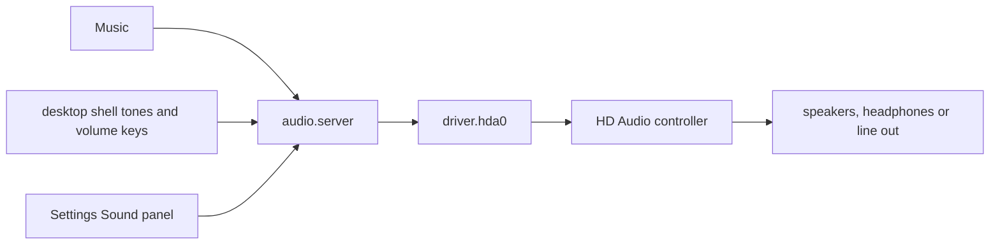

# Sound and media

How to play music and video on NONOS, how the volume works, where the sound comes out, and why a machine may stay silent.

## How sound travels

- Music and the desktop shell send sound to the audio service, `audio.server` (`userland/capsule_audio/README.md`). It mixes up to four streams at once, at most two from any one program, into 16-bit stereo, and applies the master volume (`MAX_STREAMS` and `PER_OWNER` in `userland/capsule_audio/src/server/streams.rs`).
- The audio service is the only program the kernel lets send to the sound driver, `driver.hda0` (`src/services/registry/held_table.rs`). Apps never reach the hardware.
- The driver plays one output stream at 48 kHz, 16-bit, stereo, on an HD Audio controller: PCI class 0x04 subclass 0x03 from any vendor, or Intel's subclass 0x01 (`hda_controller` in `userland/capsule_driver_hda/src/controller/intel.rs:65-67`).
- Nothing records sound. The driver opens no input stream, so no microphone is read.
