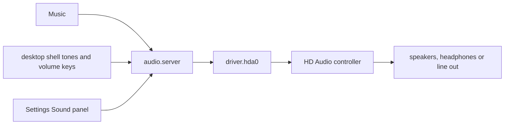

# Sound and media

How to play music and video on NONOS, how the volume works, where the sound comes out, and why a machine may stay silent.

## How sound travels

- Music and the desktop shell send sound to the audio service, `audio.server` (`userland/capsule_audio/README.md`). It mixes up to four streams at once, at most two from any one program, into 16-bit stereo, and applies the master volume (`MAX_STREAMS` and `PER_OWNER` in `userland/capsule_audio/src/server/streams.rs`).
- The audio service is the only program the kernel lets send to the sound driver, `driver.hda0` (`src/services/registry/held_table.rs`). Apps never reach the hardware.
- The driver plays one output stream at 48 kHz, 16-bit, stereo, on an HD Audio controller: PCI class 0x04 subclass 0x03 from any vendor, or Intel's subclass 0x01 (`hda_controller` in `userland/capsule_driver_hda/src/controller/intel.rs:65-67`).
- Nothing records sound. The driver opens no input stream, so no microphone is read.

## The volume

There is one master volume, from 0 to 100. Every sound passes through it, the desktop's tones included (`userland/capsule_audio/src/volume.rs`).

- The volume keys step it by 5, and Mute switches it off and on (`VOLUME_STEP` in `userland/capsule_desktop_shell/src/state/volume.rs`). They work whatever window has focus. A step up or down also unmutes.
- Each press shows a notice: `Volume 45%`, `Muted`, or `No sound output` with the reason in a few words.
- The volume slider and the `M` key in Music set the same master volume, so the keys and the window always agree.
- The level is applied as the square of the setting, so each step down sounds about as much quieter as the last: 50 is 12 dB below full, and 0 is silence (`gain` in `userland/capsule_audio/src/volume.rs`).
- The audio service starts at full volume, and the level is not kept across a reboot.

The `Volume` row in [Settings](settings.md) is something else: how loud the desktop's own tones are, before the master volume. `System sound` switches those tones off, and `Alert sounds` adds a tone for warnings and errors.

The volume keys: Works on an x86_64 laptop (Intel Gemini Lake, 8 GB), maintainer hardware report, 6 October 2026; the image commit was not recorded.

## Where the sound comes out

You do not pick an output; the driver plays through every one it can. At start it walks each sound chip (codec), finds each speaker, headphone and line-out pin with a path to a converter that plays 48 kHz 16-bit sound, and drives them all on one codec, the one with speakers when there is one (`userland/capsule_driver_hda/README.md`). It reads the headphone jack twice a second: when headphones go in, the speakers go off, and when they come out, the speakers come back (`POLL_MS` in `userland/capsule_driver_hda/src/server/runner/jack_poll.rs`).

The `Output device` row in Settings, Sound, says what the hardware reported when the panel opened, for example `Speakers and headphone jack` or `Headphones` (`userland/capsule_settings/src/settings/state/audio_output.rs`).

HDMI and DisplayPort audio are not played: NONOS plays through speakers, headphones and line out only.
