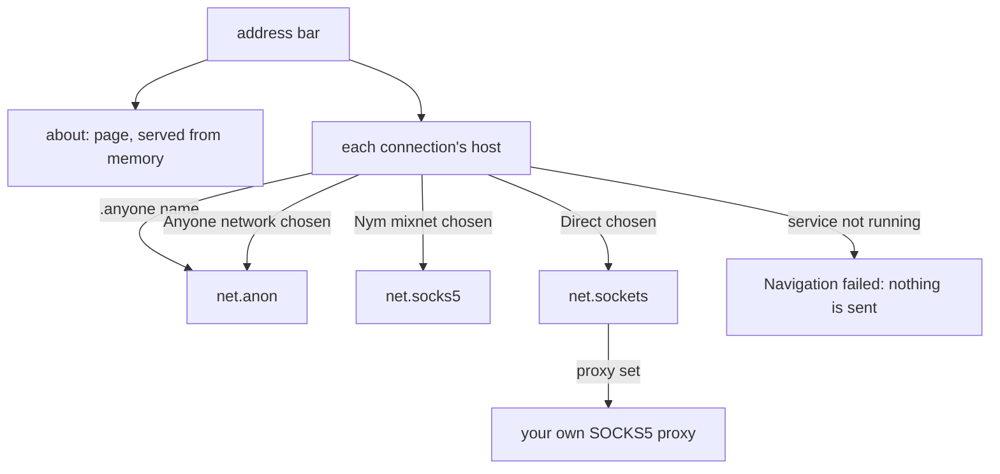

# The Browser

Use the Browser to open web pages and search over the network you choose, and learn what it renders, what it keeps and where it stops.

## Open the Browser

- Click the `Browser` tile on the dock, choose `Go` then `Browser` on the menu bar, or pick `Browser` in the Launchpad. The window is titled `NONOS Browser`.
- It opens on its home page with the caret in the address bar. The home page has a search field, `Search or enter a URL`, and four shortcuts to plain http sites: `neverssl.com`, `example.com`, `info.cern.ch` and `httpforever.com`.
- The Browser is one of the eight optional apps first-boot setup can turn off. A dock click then says the app was `turned off at setup`.
- Init keeps it off on the Safe Mode, Air-Gapped and Recovery [boot profiles](../overview/glossary.md#boot-profile).
- An image built with the `airgapped` [build profile](../overview/glossary.md#build-profile) does not carry it at all: that profile drops `nonos-capsule-browser` with every other network feature.

The toolbar holds, from the left, Back, Forward, Reload (a Stop cross while a page loads), Home, the address bar, and at the right end the menu button that opens the Browser's own Settings panel. The right end of the address bar always names the network the next request leaves through, for example `Network: Nym mixnet`.

## Open a page or search

Type in the address bar and press `Enter`. What you typed decides what happens:

| You type | The Browser |
|---|---|
| An address that starts `http://` or `https://` | opens it as typed |
| A host name with a real top-level name, such as `example.org/news` | opens it over `https://` |
| `localhost` or a name ending in `.localhost`, an IPv4 address, or a name ending in `.anyone` | opens it over plain `http://` |
| `about:loads`, `about:engine` or any other `about:` name | shows a page the Browser serves itself |
| `proxy socks5://host:port` or `proxy off` | sets or clears your own SOCKS5 proxy, see below |
| Anything else, words with spaces included | searches for it |

Searches go to `https://html.duckduckgo.com/html/?q=%s`, the version of DuckDuckGo that works without scripts. The Settings panel shows it as `Search: html.duckduckgo.com`, and nothing changes it. Another scheme typed in the bar, such as `ftp:` or `file:`, is searched for, not opened.

An `.anyone` name opens over plain http because the onion circuit already encrypts the stream end to end and proves the service's key, and no certificate authority signs `.anyone` names.

While a page loads, Reload turns into a Stop cross, and the page on screen, or the home page, stays until the new page arrives to replace it. The stage a load has reached and its host, `Connecting to`, `Securing`, `Requesting`, `Downloading` or `Rendering`, go to the window's status line, which the page area shows only while it has no page to draw. Short messages, such as the notice when you change network, also show for six seconds in a bubble at the foot of the page, when a page is on screen.

## Keys

| Key | Where | What it does |
|---|---|---|
| `Ctrl+L`, `Alt+D`, `F6` | anywhere | puts the caret in the address bar |
| `Enter` | address bar | opens the address or searches |
| `Esc` | address bar | puts back the address of the page on screen and hands the keyboard to the page |
| `Ctrl+A`, `Ctrl+C`, `Ctrl+X`, `Ctrl+V` | address bar | select all, copy, cut and paste, through the desktop clipboard |
| `Ctrl+Left`, `Ctrl+Right`, `Ctrl+Backspace`, `Ctrl+Delete` | address bar | move or delete by word; `Shift` extends the selection |
| `Up`, `Down`, `Page Up`, `Page Down`, `Space`, `Shift+Space`, `Home`, `End` | page | scroll |
| `Tab`, `Shift+Tab` | page | move between form fields |
| `Esc` | page | leaves a form field, or stops a page that is loading |

While the page has the keyboard, its scripts hear each key first, and a script that cancels a key keeps it. The wheel scrolls the page. There are no keys for Back, Forward, Reload, zoom or find in page: in the address bar, `Ctrl` with any letter but `A`, `C`, `X`, `V` and `L` does nothing.

## Links, forms and windows

- A click on a link opens it in the same window, and a link to another part of the page scrolls there. Links to `javascript:`, `mailto:`, `tel:` or any scheme other than http and https do nothing. Pointing at a link shows its address at the bottom of the page.
- Text fields, text areas, check boxes, radio buttons, lists and buttons work. A form is sent as a GET or a urlencoded POST. A file field is left out, so nothing can be uploaded, and a form with more than 512 fields is not sent.
- There are no tabs. Each window is a process of its own, with its own cookies, history and network choice.
- One process, `app.browser`, starts at boot with the other apps and waits without a window. A window you open is normally a new process, `app.browser.1`, `app.browser.2` or `app.browser.3`, each an [endpoint](../overview/glossary.md#endpoint) declared in the Browser's signed [manifest](../overview/glossary.md#manifest). With all three open, a request for another raises one of them instead.
- The dock tile and `Go` then `Browser` raise a Browser window that is already open, and open a new one only when there is none. `Browser` in the Launchpad asks for a new window each time.
- Closing a window ends its process, and what the process held in memory goes with it. The boot-time `app.browser` process draws a window only when the kernel will not queue a new one; it then goes back to waiting when that window closes, and keeps what it holds in memory.

## The about: pages

- `about:loads` lists how this window's page loads ended, newest last: the stage each stopped in and why, how long it took, how much arrived, and the network it went over. It keeps the last 60. Open it when a page will not load.
- The same lines go to the [serial console](../overview/glossary.md#serial-console) as `[BROWSER]` lines, but only in an image built with `capsule-serial-debug`, which gives the Browser its optional Debug [capability](../overview/glossary.md#capability). The `hardened` and `airgapped` build profiles leave it out.
- `about:engine` is a demo page for the layout and script engines, and every other `about:` name shows it too.
- Both are served from memory and never touch the network.

## Which network a page leaves through

The Browser uses the same three networks as the rest of NONOS: the [Nym mixnet](../overview/glossary.md#nym-mixnet), the [Anyone network](../overview/glossary.md#anyone-network) and Direct. The panel calls them `Nym mixnet`, `Anyone network` and `Direct, not anonymised`.

### The network a window starts on

A Browser process reads the system's `Default network` once, when it starts, from the [policy store](../overview/glossary.md#policy-store). With no value, a value it does not know, or no answer, it starts on Nym. Each new window is a new process, so a window opened after you change `Default network` in [Settings](settings.md) starts on the new network, and a window already open keeps the one it has.

### Switch the network for this window

1. Open the menu at the right end of the toolbar. The Settings panel lists the three networks with the chosen one marked, then the proxy row and the search engine.
2. Click a network. The panel closes and a notice says, for example, `Anyone network from the next request.`

A page already loading keeps the network it started on, with one exception: once you leave Direct, nothing more of it leaves directly (see No fallback below). While the panel is open, keys do nothing, and a click outside it closes it. The choice lasts as long as the window's process, is written nowhere, and leaves the system default as it was.

### How each connection leaves

Every connection takes its way from its own host when it opens:

- Nym mixnet chosen: through `net.socks5`, the SOCKS5 front of the mixnet. The exit looks the name up.
- Anyone network chosen: through `net.anon`. The exit looks the name up.
- Direct chosen: through `net.sockets`, with names looked up in the clear by `net.dns`.
- An `.anyone` name always goes through `net.anon`, whatever you chose, and is refused when `net.anon` is not running.
- A page reached at an `.anyone` address is a page of the Anyone network: everything it loads leaves through Anyone, its images on ordinary hosts too.

### No fallback

When the chosen network's service is not running, the page fails and nothing is sent: `The Nym mixnet is chosen, but its service net.socks5 is not running, so nothing was sent.` Nothing is tried over another network. Nothing leaves directly unless the page's network is Direct and Direct is still your choice.

The Browser offers one switch of its own. When Nym exits stop answering, or the mixnet does not connect within its wait, the error page carries a link, `Switch to the Anyone network and load this page again`. The switch lasts until you choose another network in the panel. A page cannot make it for you: the link works only on that error page.

### Short .anyone names

A full `.anyone` address has 56 characters before `.anyone`. A shorter one is looked up in a list the Anyone DNS services sign. While such a page is on screen, a band under the toolbar says: `Reached by a short .anyone name from the list the Anyone DNS services sign. A short name is weaker than the full address: the list decides where it points. NONOS refuses a name that changes service within a boot.` Type the full address when you have it.

## Your own SOCKS5 proxy

- Type `proxy socks5://host:port` in the address bar and press `Enter`, or click `Set proxy (type host:port)` in the Settings panel, which fills in `proxy socks5://` for you. Type `proxy off`, or click `Turn proxy off`, to clear it.
- It carries traffic only on Direct: with a proxy set and Direct chosen, connections go to your proxy instead of straight to the site, and the address bar reads `Network: direct, SOCKS5 proxy host:port`. With Nym or Anyone chosen it is kept for Direct and carries nothing: a network's own proxy is never stacked on yours.
- The proxy must take connections without a password: the Browser offers only the no-authentication method. One that asks gets `The SOCKS proxy you set asks for a password, which this browser cannot give.`
- The host may not hold `/`, `@` or spaces, and the port must be 1 to 65535.
- The site's name travels to the proxy inside the SOCKS5 request, so the proxy looks it up.
- Each window opens without a proxy, and the proxy is forgotten when its window closes.

## How long a page may wait

A mixnet holds every packet at every hop on purpose, so its waits are the longest:

| Network | With nothing arriving | Whole fetch |
|---|---|---|
| Direct | 12 seconds, and 8 seconds to connect | 2 minutes |
| Nym mixnet | 3 minutes | 15 minutes |
| Anyone network | 30 seconds | 5 minutes |

- A response whose headers have arrived when time runs out is shown as far as it got.
- While Nym or Anyone is still coming up, or its service has no room, the fetch asks again every second for up to 3 minutes.
- A failure that might not happen again (no connection, a send that broke, no answer, a proxy that restarted, silent Nym exits) is tried up to twice more before the error page shows. A certificate or TLS failure is never tried again, nor a form sent with POST once its request may have left.

## Secure connections

- HTTPS is TLS 1.3 only, through the shared `nonos_tls` client, with ChaCha20-Poly1305 or AES-128-GCM and an X25519 or P-256 key exchange. A site that speaks only TLS 1.2 fails with `This site only speaks TLS 1.2, which this browser does not support yet.`
- The Browser accepts a server's certificates only when the first names the host among the DNS names of its subjectAltName (a `*.` name covers one label), every certificate is inside its validity window by this machine's clock, each is signed by the next, each issuer is a CA, there are at most ten, and the top one is a trusted root or was signed by one.
- The roots are fixed at build: 145 root certificates, Mozilla's root set as last updated by Mozilla on 11 February 2026, compiled into `nonos_tls`. Nothing adds a root, removes one, or lets you go past a refused certificate.
- There is no revocation check, no OCSP and no CRL. A revoked certificate still inside its validity window is accepted.
- A wrong clock makes good certificates look expired or not yet valid. The message then shows the time the check used, as `it reads 2026-10-06 12:00 UTC` or `the clock could not be read`.

## What a site learns

- Every request carries `Host`, `User-Agent`, `Accept`, `Accept-Language: en-US,en;q=0.5`, `Accept-Encoding: gzip, deflate` and `Connection`, plus `Cookie` when the jar holds one and the form headers on a POST. It carries no `Referer` and nothing else.
- The `User-Agent` is the Firefox 128 ESR on Windows string that Tor Browser sends from every platform, so a site sees a common string, not one only NONOS sends. A page's `navigator.userAgent` says the same.
- Over Direct with no proxy of your own, every site sees this machine's address and your local network sees each name looked up. Over Nym or Anyone, the exit sees the host name and the content of a plain http page. An `.anyone` service is reached inside the Anyone network, with no exit.

## What renders

- HTML goes through a tokenizer and a tree builder with the standard's insertion modes, tables and SVG content. Text is converted to UTF-8 from the encoding its header, a `meta` tag or its bytes declare.
- CSS: selectors with hover, focus and target states, custom properties with `var()`, `calc()` and `clamp()`, nesting and `@media` queries.
- Layout: block and inline flow with bidirectional text, flexbox, grid with named areas, tables, floats, positioned boxes and transforms.
- Images: PNG, JPEG, GIF (its first frame only), BMP, WebP lossy and lossless, SVG, ICO and `data:` images.
- Web fonts: TrueType, OpenType, WOFF and WOFF2. EOT and SVG fonts are passed over.
- `text/html` and XHTML show as pages, other `text/` types and JSON as plain text, and a response with no `Content-Type` as a page. Anything else, an image address opened on its own included, shows `Unsupported content:` with its status and size, and cannot be saved.
- Pages get no video or audio playback, no `canvas` drawing and no frames: nothing in the Browser's fetch code loads the source of a `video`, `audio` or `iframe` element, and scripts get no `canvas` context.

## What page scripts can do

- Scripts run in QuickJS-ng through `nonos_qjs`, in document order, with module scripts and `defer` scripts that have a `src` after the rest.
- Every script is evaluated as a classic script, so a module that uses `import` or `export` fails.
- They get the document and its elements, events for clicks, input, submits and keys, timers, `location`, `history`, `matchMedia`, scrolling, and cookies through `document.cookie`, never the HttpOnly ones.
- When the script engine cannot start, most likely for want of memory, the page shows without its scripts and a notice says so.
- A script cannot open a connection of its own: there is no `fetch`, `XMLHttpRequest` or `WebSocket`. It can still send the window to another address through `location`, and that page loads under the same network rules as any other.
- `localStorage` and `sessionStorage` last only as long as the page. There is no WebAssembly, WebGL or worker.
- `alert`, `confirm` and `prompt` open no dialog. The page is answered at once, `confirm` with No and `prompt` with no text, and a notice says what it asked, for example `This page says:` followed by its message.
- A page's scripts share 32 MiB of heap. Each script may run 10 seconds as the page loads, and each later call, an event or a timer, 2 seconds.
- A script past either limit is stopped, the page stays as it left it, and a notice says `A script on this page ran too long and was stopped.` or `A script on this page ran out of memory and was stopped.`
- A page runs at most 24 external scripts.

## What the Browser keeps

Nothing is written to disk. The Browser is a [capsule](../overview/glossary.md#capsule) whose manifest requires `0x183d`: CoreExec, Network, IPC, Memory, Crypto, GraphicsDisplayQuery and GraphicsSurfaceCreate, with no FileSystem. Its only optional bit is Debug, so its [capability word](../overview/glossary.md#capability-word) is `0x183d`, or `0x193d` in an image built with `capsule-serial-debug`. There are no downloads, bookmarks or saved history, and nothing is cached on disk. To fetch a URL outside the Browser, the Terminal's `curl` uses the network chosen in Settings; see [Terminal](terminal.md).

| What | Held | Gone |
|---|---|---|
| Cookies | in memory, one jar per network | when the window's process ends, which is when you close it |
| History, for Back and Forward | in memory, up to 100 entries a window | when the window closes |
| `localStorage`, `sessionStorage` | in memory | when the page is left |
| Network choice, `about:loads` | in memory, per process | when the process ends |
| Your SOCKS5 proxy | in memory | when the window closes |
| Name lookups on Direct | in memory, up to 64 names | after 5 minutes each |

- The jar keeps at most 300 cookies, and 50 for one domain, the oldest going first. That is below the 3000 RFC 6265 asks for, since nothing is kept past the process. A script cannot replace an HttpOnly cookie, and a plain http page cannot replace a Secure one.
- Each network has its own jar, so a cookie set over Nym is never sent over Direct or Anyone.
- The boot-time `app.browser` process, when it does draw a window, outlives that window, so what it holds stays until the process ends, at the latest at restart.

## Limits

| Limit | Value |
|---|---|
| Browser heap | 96 MiB |
| One response, as received | 4 MiB |
| A body after gzip or deflate | 4 MiB, a page cut there shows what arrived |
| A server's TLS handshake | 512 KiB |
| Redirects | five followed, then `too many redirects` |
| Connections | eight in all, six to one host |
| Connections through Nym or Anyone | four |
| A kept connection | closed after 20 seconds unused |
| One document | 60,000 nodes, past which the address bar shows `page truncated` |
| A PNG, GIF or BMP image | 4,000,000 pixels |
| Back and Forward history | 100 entries a window |

## When a page does not load

The error page reads `Navigation failed`, then the reason, then `The browser stopped before rendering untrusted or incomplete content.` The address bar keeps the address that failed, Reload tries it again, and `about:loads` has the detail.

| The page says | What it means |
|---|---|
| `The Nym mixnet is chosen, but its service net.socks5 is not running, so nothing was sent.` | The mixnet's service is down. Choose another network in the panel, or wait. Anyone says the same of `net.anon`. |
| `An .anyone address is reached only inside the Anyone network, which is not running.` | `net.anon` is down, and an `.anyone` page goes no other way. |
| `The Nym mixnet did not finish connecting in 3 minutes, so nothing was sent.` | The mixnet never came up. The page offers the switch to Anyone. |
| `Nym exits are not answering right now; try Anyone.` | `net.socks5` gave up on exits that stayed silent. The page offers the switch to Anyone. |
| `No answer came back through the Nym mixnet in 3 minutes.` | Nothing arrived within the wait. Through Anyone the wait is 30 seconds. |
| `example.org did not answer in 12 seconds.` | Direct: the site is down or overloaded. |
| `No address was found for example.org.` | The name does not exist. Check the spelling. |
| `Name lookup is not answering: no DNS server is reachable` | Direct: no DNS server answered. Check the network, or choose Nym or Anyone, whose exits look names up. |
| `certificate not trusted: it was issued by an authority this browser does not trust` | The chain ends at a root that is not compiled in. |
| `certificate name mismatch: the certificate is for a different name, not example.org` | The certificate belongs to another host. |
| `certificate expired: the site's certificate has expired, or this machine's clock is wrong` | Check the clock the message shows. |
| `This site only speaks TLS 1.2, which this browser does not support yet.` | The site offers no TLS 1.3. |
| `The page is larger than 4 MB, the most this browser reads.` | The response passed the size limit. |
| `The SOCKS proxy you set did not take the request.` | Your own proxy is not running or refused. Type `proxy off` to clear it. |
| `The page was cut short:` and how many bytes arrived | The connection closed before the whole page came. Reload. |

## What is tested

The [proof crates](../overview/glossary.md#proof-crate) that compile the Browser's own modules on the host pass on this commit: `capsule_browser_proofs` (612 tests), `capsule_browser_html_proofs` (43) and `browser_http_proofs` (32), with `tls_proofs` (129) for the TLS client, `route_link_proofs` (73) for the route rules, and the `qjs-prelude` check of the script bindings. They hold, among other rules, the way each connection takes and the sentence each failure gets. A booted image loading pages through a live Nym gateway or a live Anyone circuit is not tested in this release.

The real-hardware report for this path covers browser traffic over Wi-Fi on the Realtek RTL8821CE, PCI `10ec:c821`: Works on an x86_64 laptop (Intel Gemini Lake, 8 GB), maintainer hardware report, 6 October 2026; the image commit was not recorded. See [Wi-Fi and networking](wifi-and-networking.md).

## Where this comes from

- Open the Browser
  - Launcher entries: `LAUNCHER_APPS` in `userland/capsule_desktop_shell/src/state/apps.rs`; home page shortcuts: `SHORTCUTS` in `userland/capsule_browser/src/browser/paint/home_page/shortcut_data.rs`.
  - Optional at setup: `OPTIONAL` in `userland/policy_proto/src/apps/table.rs`; off on three boot profiles: `withheld` in `src/userspace/init/app_choice/profile.rs:37-43`.
  - Left out of airgapped images: `networkFeatures` in `tools/nix/config.nix:50-58`; the toolbar: `on_toolbar` in `userland/capsule_browser/src/browser/event/on_toolbar.rs`.
- Open a page or search
  - A `proxy` command is read first and the rest is sorted by kind: `commit` in `userland/capsule_browser/src/browser/event/omnibox_commit.rs:25-43`, `classify` in `userland/capsule_browser/src/browser/omnibox/classify.rs:41-73`.
  - The search address: `SEARCH_TEMPLATE` in `userland/capsule_browser/src/browser/settings/search.rs:20`; plain http for `.anyone` names: `HostKind` in `userland/capsule_browser/src/browser/omnibox/classify_host.rs:19-28`.
  - The page on screen stays until the new one arrives: `commit_doc` in `userland/capsule_browser/src/browser/fetch/commit_doc.rs:25`; load stages: `phase_label` in `userland/capsule_browser/src/browser/fetch/progress.rs:24-35`.
  - The status line shows only without a page: `paint` in `userland/capsule_browser/src/browser/paint/document.rs:25-30`; six-second notices: `tell` in `userland/capsule_browser/src/browser/state/tell.rs:31-35`.
- Keys
  - The keys: `edit_key` in `userland/capsule_browser/src/browser/omnibox/edit_key_map.rs` and `on_page_key` in `userland/capsule_browser/src/browser/event/on_page_key.rs`; scripts hear keys first: `on_keydown` in `userland/capsule_browser/src/browser/event/on_keydown.rs`; no other `Ctrl` letters: `shortcut` in `userland/capsule_browser/src/browser/omnibox/edit_key_map.rs:57-66`.
- Links, forms and windows
  - Link schemes: `link_action` in `userland/capsule_browser/src/browser/omnibox/link_action.rs`; the 512-field cap: `MAX_FIELDS` in `userland/capsule_browser/src/browser/event/form_fields.rs:27`.
  - Three window endpoints: `CAPSULE_INSTANCE_ENDPOINTS` in `userland/capsule_browser/Capsule.mk:13-16`; a fourth request raises one: `spawn_next` in `src/kernel_core/process_spawn/capsule_spawn/instance/mod.rs:67-88`.
  - Dock and menu bar raise an open window: `handle` in `userland/capsule_desktop_shell/src/server/handlers/launcher_focus.rs:26-47`, `launch` in `userland/capsule_desktop_shell/src/server/handlers/menubar_action.rs:47-55`; the Launchpad opens a new one: `open` in `userland/capsule_desktop_shell/src/apps_off/open.rs:42-60`.
  - A closed window's memory goes with it: `ephemeral` in `userland/app_skeleton/src/runner/entry.rs:70-74`; when the boot-time process draws a window: `request_service` in `userland/capsule_desktop_shell/src/server/handlers/launcher_request.rs:59-71`.
- The about: pages
  - The last 60 loads: `KEPT` in `userland/capsule_browser/src/browser/fetch/load_log.rs:32`; the optional Debug capability: `CAPSULE_OPTIONAL_CAPS` in `userland/capsule_browser/Capsule.mk:19-21`.
  - Left out of hardened and airgapped images: `debugFeatures` in `tools/nix/config.nix:62`; every other `about:` name: `about_page` in `userland/capsule_browser/src/browser/fetch/about_page.rs:30-41`.
- Which network a page leaves through
  - The panel's labels: `label` in `userland/capsule_browser/src/browser/net/mixnet/choice.rs:38-44`; the starting network: `from_system_default` in `userland/capsule_browser/src/browser/net/mixnet/system_default.rs:24-33`.
  - The switch notice: `on_click` in `userland/capsule_browser/src/browser/settings/click.rs:32-40`; each connection's way: `way` in `userland/capsule_browser/src/browser/net/mixnet/way.rs:104-117`.
  - The `.anyone` names: `for_host` in `userland/nonos_route_link/src/pick.rs:117-123`; everything an `.anyone` page loads: `for_page` in `userland/capsule_browser/src/browser/net/mixnet/way.rs:98-101`.
  - No fallback: `absent` in `userland/capsule_browser/src/browser/net/mixnet/refusal.rs:58-72`, `direct` in `userland/capsule_browser/src/browser/net/mixnet/way.rs:123-125`; the switch to Anyone: `switch_to_anyone` in `userland/capsule_browser/src/browser/fetch/exits/offer.rs:53-63`.
  - Short names: `ONION_LEN` in `userland/nonos_route_link/src/pick.rs:80`, `SHORT_NOTICE` in `userland/nonos_route_link/src/pick.rs:106-108`.
- Your own SOCKS5 proxy
  - The address bar line: `network_line` in `userland/capsule_browser/src/browser/settings/panel.rs:30-37`; no password: `hello` in `userland/capsule_browser/src/browser/fetch/socks/hello.rs:20-26`.
  - Host and port rules: `parse_socks5` in `userland/capsule_browser/src/browser/proxy/parse_socks5.rs:21-34`; the name sent to the proxy: `request` in `userland/capsule_browser/src/browser/fetch/socks/request.rs`.
- How long a page may wait
  - The waits: `budget` in `userland/capsule_browser/src/browser/fetch/budget.rs:67-73`; a response shown as far as it got: `expire` in `userland/capsule_browser/src/browser/fetch/expire.rs:24-37`; asking again every second: `HOLD_MS` in `userland/capsule_browser/src/browser/fetch/socks/hold.rs:38`.
  - Two more tries: `MAX_RETRIES` in `userland/capsule_browser/src/browser/fetch/constants.rs:20`; failures never tried again: `retry_nav` in `userland/capsule_browser/src/browser/fetch/retryable_error.rs:39-43`.
- Secure connections
  - TLS 1.3 and its ciphers: `TLS13` in `userland/nonos_tls/src/constants.rs:21-25`; the certificate rules: `verify_chain` in `userland/nonos_tls/src/chain_walk.rs:29-67`.
  - The 145 roots: `nonos-data/cacert.pem`, compiled under `userland/nonos_tls/src/roots/`; the clock in the message: `clock` in `userland/capsule_browser/src/browser/fetch/tls_reason.rs:79-92`.
- What a site learns
  - The headers: `request` in `userland/capsule_browser/src/browser/http/request.rs:46-76`; the user agent: `USER_AGENT` in `userland/capsule_browser/src/browser/http/request.rs:30`.
- What renders
  - HTML: `userland/capsule_browser/src/browser/html/tokenizer/` and `userland/capsule_browser/src/browser/dom/builder/`; character sets: `userland/capsule_browser/src/browser/http/response/charset/`; CSS: `userland/capsule_browser/src/browser/css/`; layout: `userland/capsule_browser/src/browser/layout/boxmodel/`; image formats: `userland/capsule_browser/src/browser/image/decode.rs`.
  - Font formats: `pick_src` in `userland/capsule_browser/src/browser/fonts/pick_src.rs:28-42`; content types: `content_kind` in `userland/capsule_browser/src/browser/http/response/parse.rs:51-64`.
- What page scripts can do
  - Script order: `plan` in `userland/capsule_browser/src/browser/js/script_plan.rs:59-92`; 24 external scripts: `MAX_EXTERNAL` in `userland/capsule_browser/src/browser/js/script_plan.rs:26`.
  - Every script classic: `JS_EVAL_TYPE_GLOBAL` in `userland/nonos_qjs/vendor/eval_shim.c:166`; the bindings: `userland/nonos_qjs/vendor/`, such as `dom_prelude_2.inc` and `dom_cookie.inc`.
  - The notice when scripts cannot run: `SCRIPTS_NOT_RUN` in `userland/capsule_browser/src/browser/fetch/commit_html.rs:75-77`; navigation from a script: `take_script_nav` in `userland/capsule_browser/src/browser/event/script_nav.rs:32-57`.
  - Dialogs: `dialog_line` in `userland/capsule_browser/src/browser/event/dialog_line.rs:45-63`; heap and time: `SCRIPT_HEAP` in `userland/capsule_browser/src/browser/qjs_run.rs:33`, `PAGE_SCRIPT_BUDGET_MS` in `userland/capsule_browser/src/browser/qjs_run.rs:61`.
- What the Browser keeps
  - Required capabilities: `CAPSULE_REQUIRED_CAPS` in `userland/capsule_browser/Capsule.mk:17-18`; the capability word: `browser_caps` in `src/userspace/capsule_browser/spawn.rs:39-48`.
  - Cookie limits: `MAX_COOKIES` in `userland/capsule_browser/src/browser/cookie/jar.rs:26`; one jar per network: `Jars` in `userland/capsule_browser/src/browser/cookie/jars.rs:29-33`.
- Limits
  - Heap: `BROWSER_HEAP` in `userland/capsule_browser/src/main.rs:33`; after gzip or deflate: `MAX_OUT` in `userland/inflate/src/tables.rs:21`.
  - Response, handshake and redirects: `MAX_BODY` in `userland/capsule_browser/src/browser/fetch/constants.rs:17`, `MAX_TLS_FLIGHT` in `userland/capsule_browser/src/browser/fetch/constants.rs:18`, `MAX_REDIRECTS` in `userland/capsule_browser/src/browser/fetch/constants.rs:19`.
  - Connections: `IN_ALL` in `userland/capsule_browser/src/browser/fetch/pool/limits.rs:24-25`, `PROXIED_IN_ALL` in `userland/capsule_browser/src/browser/fetch/pool/limits.rs:31-32`; kept connections: `IDLE_MAX_MS` in `userland/capsule_browser/src/browser/fetch/pool/kept.rs:26`.
  - Nodes, pixels and history: `MAX_NODES` in `userland/capsule_browser/src/browser/dom/limits.rs:17`, `MAX_PIXELS` in `userland/capsule_browser/src/browser/image/decode_full.rs:27`, `HISTORY_CAP` in `userland/capsule_browser/src/browser/omnibox/history.rs:21`.
- When a page does not load
  - The error page: `render_error` in `userland/capsule_browser/src/browser/fetch/render_error.rs:26-41`; the reasons: `words` in `userland/capsule_browser/src/browser/fetch/words.rs` and `reason` in `userland/capsule_browser/src/browser/fetch/tls_reason.rs`.
- What is tested
  - The Wi-Fi chip's PCI ID: `PCI_DEVICE_RTL8821CE` in `userland/capsule_driver_rtl8821ce/src/constants/mod.rs:25-26`.

## See also

- [Privacy networks](privacy-network.md)
- [The desktop](desktop.md)
- [Settings](settings.md)
- [Wi-Fi and networking](wifi-and-networking.md)
- [Terminal](terminal.md)
- [Boot modes](../install/boot-modes.md)
- [Manifests and capabilities](../userland/manifests-and-capabilities.md)
- [What NONOS protects against](../security/protections-and-limits.md)
