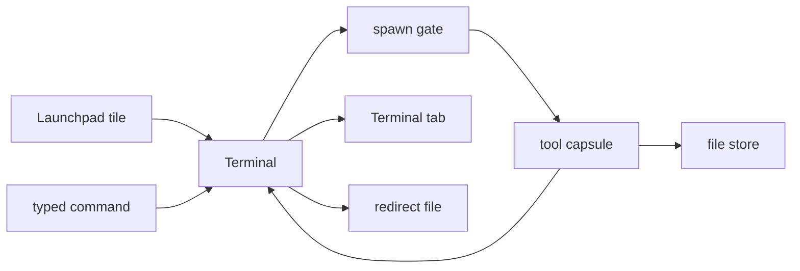

# Command-line tools

Run the seven command-line programs that ship with the NONOS desktop: what each one does, how to start it, how to give it a file, and where each one stops.

## The seven tools

Each tool is a program from crates.io, built for NONOS from source kept in the NONOS source tree and shipped as its own signed [capsule](../overview/glossary.md#capsule). One line per tool in the list of apps registers it.

| Tool | Version | What it does | How it takes a file |
|---|---|---|---|
| `grex` | 1.4.6 | Writes a regular expression that matches the example strings you give it. | `-f <file>`, one example per line |
| `dotenv-linter` | 4.0.0 | Checks `.env` files for mistakes such as a duplicated key. | `check <file>` |
| `pastel` | 0.12.0 | Shows, converts and mixes colours. | It takes colours, not files |
| `jsonxf` | 1.1.1 | Pretty-prints or minimises JSON. | `-i <file>` to read, `-o <file>` to write |
| `tokei` | 14.0.0 | Counts lines of code, comments and blank lines per language. | A file or a folder |
| `huniq` | 2.7.0 | Prints each line once and drops the repeats. | None: it reads only the keyboard |
| `csview` | 1.3.4 | Draws a CSV file as an aligned table. | The file name |

The tools are baked into the kernel image by the `nonos-tool-capsules` feature. `microkernel-desktop-gui` and `microkernel-setup-wizard` both turn it on, and every [build profile](../overview/glossary.md#build-profile) except `core` builds on one of them. In a build without the feature the Terminal answers `grex: not installed in this build`.

## Start a tool

### From the Terminal

Type the tool's name and its arguments, as in any shell. The Terminal looks the name up in its table of tools and asks the kernel to start the capsule `tool.<name>`.

- `help` shows a `tools` row that names every installed tool.
- `help jsonxf` prints `an installed tool; run it with --help for its own options`.
- `type jsonxf` prints `jsonxf is an installed tool, spawned as capsule tool.jsonxf`.
- `--help` after any tool's name prints all of its options.
- `Tab` completes a tool's name as it completes a command.

The same table holds `linux`, which runs a Linux program through the [Linux personality](../overview/glossary.md#linux-personality). It is described on [Linux programs](linux-programs.md).

### From the Launchpad

Each tool has a tile in the Launchpad, labelled with its name. See [The desktop](desktop.md) for the Launchpad itself.

1. Open the Launchpad from the dock.
2. Type a few letters of the tool's name, such as `jso`.
3. Click the tile, or press `Enter` to open the first match.

A tile opens the Terminal and hands it the tool's command line:

- `pastel` runs at once. With nothing after its name it prints its help.
- Every other tile types the tool's name on the prompt, followed by a space, and runs nothing. Add the arguments and press `Enter`.

The other six are typed, not run, because none of them does anything useful with no arguments. `jsonxf` and `huniq`, run bare, would read the keyboard until `Ctrl+C`.

When the Terminal is already open, the command goes into the current tab if nothing has run there yet and its prompt is empty, and into a new tab otherwise. With all nine tabs open, it goes into the current tab only when that tab's prompt is empty and nothing runs in it. Otherwise the Terminal prints the command followed by `: every tab is busy, close one and click the tile again`. A tile's command waits at most 10 seconds for a Terminal window to take it, then is dropped.

### When a tool does not start

The Terminal prints the tool's name and one reason:

| Message | What it means |
|---|---|
| `not installed in this build` | The kernel has no tool by that name. |
| `one is already running` | Another copy of the same tool is running. |
| `the kernel refused to start it` | Any other refusal, such as a capsule the spawn gate did not accept. |

Each tool owns two fixed [endpoints](../overview/glossary.md#endpoint), a service port and a reply port, so one copy of a tool runs at a time. A second `jsonxf`, in another tab or in the background, is refused with `jsonxf: one is already running`. The kernel frees a tool's endpoints a little after it ends, and the Terminal asks again only for `linux`, so a tool started straight after its last run ended can get the same answer for a moment. Run it again.

## How a tool runs



A typed command, or a Launchpad tile, reaches the Terminal. The Terminal asks the kernel to run `tool.<name>`, with the words you typed as the tool's arguments. The kernel's [spawn gate](../overview/glossary.md#spawn-gate) checks the tool capsule's [NONOS ID certificate](../overview/glossary.md#nonos-id-certificate), its [manifest](../overview/glossary.md#manifest) and its [attestation trailer](../overview/glossary.md#attestation-trailer) under the trust anchor baked into the kernel, then starts it as a child of the Terminal. The tool opens files through the [file store](../overview/glossary.md#file-store). What it prints comes back to the Terminal, which shows it in the Terminal tab or, after `>`, writes it to the redirect file.

Every tool runs with the same four [capabilities](../overview/glossary.md#capability), `0x59` in all:

| Bit | Capability | What it is for |
|---|---|---|
| `0x01` | `CoreExec` | Running at all. |
| `0x08` | `IPC` | Reaching the file store. |
| `0x10` | `Memory` | The program's heap. |
| `0x40` | `FileSystem` | Opening files. The file store serves only a holder of this bit. |

No tool holds `Network` (`0x04`). The kernel refuses a send to any of the eleven network services, `net.tcp`, `net.dns` and `net.sockets` among them, from a process without it, so a tool cannot talk to the network stack. It holds no device or graphics bit either.

Each run is a new process that ends when the program does. The tool keeps nothing between runs; only the files it wrote remain.

## Give a tool a file

Name every file by its full path, starting with `/`. `cd` moves only the Terminal. A tool reports `/` as its working directory, and a name without a leading `/` is not looked up in the Terminal's directory.

- Files live in the file store, in memory, and are gone at power off unless kept. [Files](files.md) says what survives and when `keep` works.
- Only the process that created a file may keep it. A file the Terminal wrote for you with `>` is the Terminal's, so `keep` can take it. A file the tool wrote itself, as with `jsonxf -o`, is the tool's, and `keep` refuses it. Copy it with `cp` to a new name first: the copy is the Terminal's.
- Writes under `/capsules` are refused.
- A path may be at most 255 bytes long, or the tool gets `bad path`.

## Input, output and pipes

### The keyboard

A tool that reads its input reads the keyboard. The Terminal edits the line and sends it on `Enter`. `Backspace` deletes a character, `Ctrl+U` clears the line and `Ctrl+W` deletes a word.

A tool's keyboard input has no end in this release. `Ctrl+D` on an empty line prints `^D (end of input is not delivered to this program)`. A program that waits for the end of its input waits until you press `Ctrl+C`, so give it a file instead.

### Redirects

`>` and `>>` work. The Terminal holds what the tool prints, puts it in the file when the tool ends, and then prints `wrote to <path>`. The path after `>` belongs to the Terminal, so a short name lands in the Terminal's current directory.

- `>` empties the file before the tool starts.
- `> /dev/null` runs the tool and keeps nothing.
- A redirect keeps at most 1 MiB. Past that the Terminal prints `<path>: the output past 1 MiB was not kept`. A `>>` that would grow the file past 1 MiB writes nothing.
- Error messages go into the file too. A NONOS program's error stream is its output stream, so a failed run shows only `wrote to` on screen. Run `echo $?` afterwards: `0` means the tool succeeded.
- `2>` and `2>&1` are refused with `redirect: a numbered stream (2>, 2>&1) is not taken; only <, > and >> are`.
- A tool whose output goes to a file is told its output is not a terminal, so a tool that checks before it colours its text writes plain text there.

`<` is refused for these seven tools, before the tool starts:

```text
jsonxf: < is not taken: this program has no end of input to be given after a file
```

The Terminal could only hand the file over as keyboard input, and a tool's input has no end to follow it. `< /dev/null` is refused the same way. Use the tool's own file option from the table at the top of this page.

### Pipes

A tool cannot stand on either side of a `|`.

- After a `|`, only ten built-ins read the piped lines: `grep`, `sort`, `uniq`, `cut`, `nl`, `wc`, `head`, `tail`, `tac` and `rev`. In `cat /home/nonos/tools.json | jsonxf`, `cat` runs and the line stops at `jsonxf` with `pipe: jsonxf does not read from a pipe; these do: grep sort uniq cut nl wc head tail tac rev`.
- Before a `|`, a tool is refused: `tokei /home/nonos | head` prints `tokei: a tool's output does not feed a pipe; use > file, then the filter on the file`.

Do it in two steps instead:

```sh
tokei /home/nonos/workspace > /home/nonos/lines.txt
grep Rust /home/nonos/lines.txt
```

Not tested in this release.

### Stopping a tool

`Ctrl+C` sends SIGINT (2) to the tool in front and ends its job. The kernel ends a child its parent signals this way. The Terminal prints `^C` and `interrupted`, and `$?` becomes 130. With a redirect, nothing is written: the Terminal prints `<path>: not written: the program was interrupted`, and the file stays as it was before the command, empty after `>` and unchanged after `>>`.

### Eight words per command

The Terminal reads at most eight words per command, counting the tool's name, its options, `>` and the file name. Words past the eighth are dropped without a message. Put a long list in a file instead. Quote a word that holds a space, or a `<`, `>`, `|` or `;`, with `'` or `"`. An empty word such as `''` never reaches the tool: the kernel drops empty arguments.

## Each tool, with an example

Every example below writes its own small file in `/home/nonos` with the built-in `echo` first, so it works on a fresh boot.

### grex

`grex` writes one regular expression, anchored with `^` and `$`, that matches every example string it is given.

```sh
echo 2026-10-05 > /home/nonos/dates.txt
echo 2026-10-06 >> /home/nonos/dates.txt
echo 2026-11-01 >> /home/nonos/dates.txt
grex -f /home/nonos/dates.txt
```

Not tested in this release.

`-d` turns digits into `\d`, `-r` folds repeated parts into quantifiers, and `-i` ignores case. A few examples fit on the line itself, as in `grex cat car cart`.

### dotenv-linter

`dotenv-linter check` reads `.env` files and prints one line for each problem: the file, the line number, the name of the check and a message, then a count of the problems found. Upstream's checks include `DuplicatedKey` and `LowercaseKey`.

```sh
echo DB_HOST=localhost > /home/nonos/workspace/.env
echo db_port=5432 >> /home/nonos/workspace/.env
echo DB_HOST=example.org >> /home/nonos/workspace/.env
dotenv-linter check /home/nonos/workspace/.env
```

Not tested in this release.

`fix` rewrites the files and makes a backup first unless you add `--no-backup`. `fix --dry-run` prints the fixed text and saves nothing. `diff` compares the keys of the files you name, and `--plain` turns colours off. The upstream check for newer versions is not built in, since the tools are built without their default features.

### pastel

`pastel` shows, converts and mixes colours. A colour can be a name such as `lightslategray`, a hex code such as `#778899`, or `'rgb(119, 136, 153)'`; quote a colour that holds spaces.

```sh
pastel color lightslategray
pastel format hsl lightslategray
pastel format hex lightslategray > /home/nonos/colour.txt
```

Not tested in this release.

`pastel color` describes a colour, `pastel format` converts it, and `pastel mix red blue` blends two. `pastel list` shows the named colours. Always name the colour on the line: with no colour, and the keyboard as its input, `pastel` stops and says that a colour argument needs to be provided.

### jsonxf

`jsonxf` pretty-prints JSON with a two-space indent, or minimises it with `-m`.

```sh
echo '{"name":"nonos","tools":["grex","tokei"]}' > /home/nonos/tools.json
jsonxf -i /home/nonos/tools.json
jsonxf -m -i /home/nonos/tools.json -o /home/nonos/tools.min.json
```

Not tested in this release.

The second line prints the object over several indented lines. The third writes it back on one line to `/home/nonos/tools.min.json`. `-t` sets another indent, and `-s` takes the JSON from the line instead of a file, as in `jsonxf -s '{"a":1}'`. With neither `-i` nor `-s`, `jsonxf` reads the keyboard.

### tokei

`tokei` counts the lines of code, comments and blank lines in a folder, per language.

```sh
tokei /home/nonos/workspace
tokei -o json /home/nonos/workspace > /home/nonos/lines.json
jsonxf -i /home/nonos/lines.json
```

Not tested in this release.

Always give a path: with none, `tokei` does not count the Terminal's directory. `--files` lists each file, `-s code` sorts by a column (`files`, `lines`, `blanks`, `code` or `comments`), `-t Rust` keeps one language, and `-l` lists the languages `tokei` knows. `-o` writes JSON only. The YAML and CBOR outputs are not built in.

### huniq

`huniq` prints each line of its input once, the first time it sees it. It reads only the keyboard: it takes no file name, `<` is refused, and it cannot follow a `|`. In this release it works on lines you type.

```sh
huniq
```

Not tested in this release.

Type a line and press `Enter`. A line it has not seen before is printed back, and a repeat is not. Press `Ctrl+C` when you are done. `-c`, `-s` and `-S` count and sort, and print only when the input ends, which keyboard input to a tool never does in this release.

For a file, use the built-ins: `sort -u /home/nonos/names.txt` prints each line once, sorted, and `uniq -c /home/nonos/names.txt` counts runs of the same line.

### csview

`csview` draws a CSV file as a table with aligned columns. The first row is the header.

```sh
echo tool,version > /home/nonos/tools.csv
echo grex,1.4.6 >> /home/nonos/tools.csv
echo csview,1.3.4 >> /home/nonos/tools.csv
csview /home/nonos/tools.csv
csview -s markdown /home/nonos/tools.csv > /home/nonos/tools.md
```

Not tested in this release.

`-H` says there is no header row, `-t` reads tab-separated files, `-d ';'` sets another separator, and `-n` numbers the rows. `-s` picks the border: `none`, `ascii`, `ascii2`, `sharp` (the default), `rounded`, `reinforced`, `markdown` or `grid`. The last line above writes a Markdown table, which Files opens in Editor. There is no pager in this build, so a long table scrolls in the Terminal.

## How far this is tested

- The Terminal's tool table, its refusals of `<` and `|` for tools, and the Launchpad tiles' command lines are covered by the `terminal_line_proofs` and `desktop_proofs` [proof crates](../overview/glossary.md#proof-crate), which pass on this commit.
- The kernel can run each tool once at boot with `--version`, or `-h` for `jsonxf`, under the `nonos-tool-selftest` feature. No build in this tree turns that feature on.
- No test runs the examples on this page. They follow the code and each tool's own options, and are not tested in this release.

## Where this comes from

- The seven tools: upstream source in `userland/upstream-src`, and each version in the tool's `Cargo.toml`, for example `userland/upstream-src/jsonxf/Cargo.toml`. One line per tool, with its service and reply ports, in [`userland/apps.list`](../../userland/apps.list). The `nonos-tool-capsules` feature: `Cargo.toml`, with the profiles in `tools/nix/config.nix`.
- From the Terminal: the tool table, `TOOLS` at `userland/capsule_terminal/src/command/builtin/tool.rs:25-35`. The `tools` row of `help`: `userland/capsule_terminal/src/command/builtin/help_tools.rs`. Help for a tool name: `userland/capsule_terminal/src/command/builtin/help_unknown.rs`. Completion: `command_candidates` at `userland/capsule_terminal/src/event/complete.rs:143-145`.
- From the Launchpad: tiles, `TOOL_APPS` in `userland/capsule_desktop_shell/src/state/tool_apps.rs`. Command line per tile: `tool_command` at `userland/capsule_desktop_shell/src/state/open_arg.rs:80-96`. Which tile runs at once: `RUNS_BARE` at `userland/capsule_desktop_shell/src/state/open_arg.rs:50-58`. Busy tabs: `BUSY` at `userland/capsule_terminal/src/term/terminal/take_handed.rs:31`. The 10 second wait: `COMMAND_TTL_MS` at `userland/capsule_desktop_shell/src/state/open_arg.rs:48`.
- When a tool does not start: the reasons, `refused` at `userland/capsule_terminal/src/command/builtin/tool_refused.rs:26-32`. Asking again only for `linux`: `may_be_ending` at `userland/capsule_terminal/src/command/builtin/tool_busy.rs:36-38`.
- How a tool runs: started as a child of the Terminal, `spawn_with_args` in `src/userspace/tool_capsules/spec.rs`. The four capabilities: `SANDBOX_CAPS` at `src/userspace/tool_capsules/spec.rs:42-45`. Network services need `Network`: `required_caps` at `src/services/registry/policy.rs:40-44`.
- Give a tool a file: working directory, `getcwd` at `toolchain/nonos-std/sys/pal/nonos/os.rs:19-21`. Names without a leading slash: `path_bytes` at `toolchain/nonos-std/sys/fs/nonos/transport/path.rs:42-61`. Creator only: `persistable` in `userland/capsule_vfs/src/store/fdtable/persist.rs`. Read-only `/capsules`: `userland/capsule_vfs/src/server/handlers/path/is_read_only.rs`.
- The keyboard: line editing in `userland/capsule_terminal/src/event/fg_cooked.rs`. No end of input: `end_input` at `userland/capsule_terminal/src/event/fg_cooked.rs:36-46`.
- Redirects: emptied first, `userland/capsule_terminal/src/jobs/tool_redirect.rs`. The 1 MiB cap: `REDIRECT_MAX` at `userland/capsule_terminal/src/command/dispatch/write_redirect.rs:25`. Error stream as output: `Stderr` at `toolchain/nonos-std/sys/stdio/nonos.rs:66`. Numbered streams refused: `plan` at `userland/capsule_terminal/src/command/dispatch/redirect.rs:53-66`. Not a terminal: `streams` at `userland/capsule_terminal/src/jobs/tty.rs:47-56`. Input redirect refused for tools: `admit` at `userland/capsule_terminal/src/command/dispatch/tool_admit.rs:32-52`.
- Pipes: the ten filters, `FILTERS` at `userland/capsule_terminal/src/command/dispatch/filter/input.rs:29-30`.
- Stopping a tool: `interrupt` in `userland/capsule_terminal/src/event/interrupt.rs`. A parent ends its child: `sys_kill` in `src/syscall/microkernel/kill.rs`. Exit status 130: `step` at `userland/capsule_terminal/src/jobs/work.rs:59-77`.
- Eight words per command: `MAX_ARGS` at `userland/capsule_terminal/src/command/parse/types.rs:17`. Empty arguments dropped: `spawn_with_args` at `src/userspace/tool_capsules/spec.rs:54-78`.
- Each tool, with an example: the dotenv-linter report in `userland/upstream-src/dotenv-linter/src/output/check.rs`. Default features off: `NONOS_TOOL_FEATURES_DEFAULT` at `mk/20-build.mk:347`. The colour message of `pastel`: `userland/upstream-src/pastel/src/cli/commands/io.rs`. No YAML or CBOR in `tokei`: `tokei_CARGO_FEATURES` at `mk/20-build.mk:349`.
- How far this is tested: the boot self-test, `run_tool_selftest` at `src/userspace/init/entry.rs:131-141`. No build turns it on: `scripts/baselines/dark-features.txt`.

## See also

- [Terminal](terminal.md)
- [The desktop](desktop.md)
- [Files](files.md)
- [Linux programs](linux-programs.md)
- [The capsule model](../userland/README.md)
- [Manifests and capabilities](../userland/manifests-and-capabilities.md)
- [Capsule isolation](../security/capsule-isolation.md)
