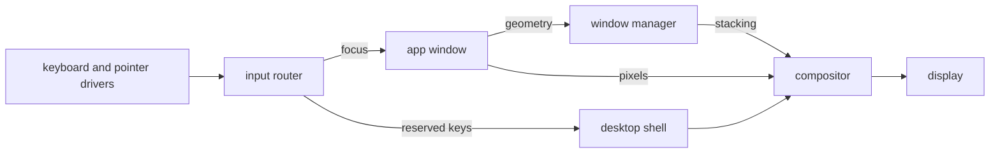

# The desktop

How to work the NONOS desktop: the menu bar, the dock, the Launchpad, windows, the apps that ship, the few keys the desktop itself answers, and copy and paste between apps.

The screenshot does not show this commit. The places of the menu bar, the desktop icons and the dock are as described here, but it has no menu titles and no magnifier, its icons are the entries of `/` rather than of the home folder, its dock has other tiles, and it shows a battery percentage, which this commit cannot show, since its kernel gives no charge.

## The menu bar

The bar runs across the top of the screen and stays there, even over a full-screen window.

- The brand at the left end brings the dock back for a moment when a full-screen window hides it.
- Five menu titles follow it. The first is named after the app whose window has focus, or reads `Desktop` when none has. Each menu has these fixed rows:

| Menu | Rows |
|---|---|
| App name, or `Desktop` | `Focus Window` (or `Refresh Desktop`), `Show All Apps`, `About This System` |
| `File` | `New Folder`, `New File`, `Open Files` |
| `View` | `Show Launchpad`, `Show Dock`, `Refresh Desktop` |
| `Go` | `Terminal`, `Browser`, `Settings` |
| `Help` | `About This System`, `Processes` |

- A menu row that opens an app brings that app's window forward if it has one, and opens a window only when it has none.
- The status area at the right end holds, in order, the battery label, a network mark that dims while there is no DHCP lease, the magnifier, and the date and time.
- Apps may put short text labels in the tray, just left of the status area. Labels that do not fit are counted as `+N`.
- The magnifier opens the Launchpad with its search field, and closes it when it is open.
- The clock follows the time zone and the 24-hour switch in [Settings](settings.md).

The battery label never shows a charge. It reads `No battery` when the firmware declares none, and `Battery status unavailable` otherwise. The kernel never reports a percentage, because reading a battery needs an ACPI AML interpreter and the kernel does not have one.

## The dock

The dock sits at the bottom of the screen. It holds fifteen app tiles and, last, the Launchpad button.

- A click on a tile raises the app's window, restoring it if it was minimised. If the app has no window, a new one opens and a notice says `opening a new window`.
- If nothing opens, a notice names the app and the reason, for example `did not open: no window in 30 s`, or `turned off at setup` for an app turned off during first-boot setup.
- While a full-screen window is up, the dock is hidden. Touch the bottom edge of the screen with the pointer to bring it back over the window. It hides again when the pointer leaves it. A click on the brand shows it for 1.8 seconds.

## The Launchpad

The Launchpad is a full-screen grid of everything you can start. Open it with the Launchpad button at the end of the dock, with `View` then `Show Launchpad`, or with the magnifier on the menu bar.

- Type to filter the tiles. `Enter` starts the first tile left. `Backspace` erases. `Ctrl+V` pastes the first line of the clipboard into the search.
- `Esc` clears the search, and a second `Esc` closes the Launchpad. A click on empty space closes it too.
- The mouse wheel, or the dots, turn the pages.

There are four kinds of tile:

- An app opens its window.
- A tool opens the [Terminal](terminal.md) with the tool's command line. `pastel` runs at once; every other tool is typed at the prompt with the cursor after it, ready for its arguments.
- An installed program asks `Launch third-party app?` each time, and starts only on `Approve`.
- A `.nonos` package file waiting in `/pkgs` shows what it holds and asks you to confirm its install. See [Install a package file](marketplace.md#install-a-package-file).

This screenshot does not show this commit either. It has no search field, it shows `Clock` and `choose` tiles that this commit does not have and other names for two media apps, and it has no Marketplace, Qwen, Video or Install tile. The tables on this page are the ones in the code.

Search matches the names of all four kinds of tile, in any case. It does not search files: use the search in [Files](files.md) for that.

## Desktop icons

The icons on the desk are the entries of the home folder, `/home/nonos`.

- A click opens an icon in the app that suits it: a folder in Files, anything else but a picture in Editor. A picture (`.png`, `.jpg`, `.jpeg`, `.bmp`, `.gif`) is handed to Image Viewer, which no image in this release carries, so a notice says `Image Viewer is not running; it has one window` instead. See [Image Viewer and Clock](apps.md#image-viewer-and-clock).
- Drag an icon onto a folder icon to move it into that folder.
- Right-click empty desk space for `New Folder` and `New File`. Right-click an icon for `Open`, `Rename` and `Delete`.
- `Delete` on a folder removes the folder and everything in it. There is no trash.

## Windows

Every app window has a title bar with three round buttons at its left end: close, minimise, and the green button.

- Drag the title bar to move the window. A window cannot be dragged under the menu bar.
- Drag the right or bottom border to resize. The new size is applied when you let go.
- The green button makes the window full screen: the whole width, from the foot of the menu bar to the bottom edge, over the dock's band. Press it again to get the old size back.
- A click in a window raises it and gives it the keyboard in one step.
- The first new window opens in the middle of the work area, between the menu bar and the dock. Each later one, in runs of five, steps down and to the right so its title bar stays reachable.

A window that hangs, or takes every key, can always be ended: press `Ctrl+Alt+Esc` to bring Processes forward and end it there.

## Apps that ship

These are the apps the dock and the Launchpad know, in dock order:

| Label | Service | What it is |
|---|---|---|
| Terminal | `app.terminal` | The shell, with tabs and jobs. See [Terminal](terminal.md). |
| Files | `app.file_manager` | The file browser. See [Files](files.md). |
| Editor | `app.text_editor` | A text and code editor. See [Everyday apps](apps.md#editor). |
| Settings | `app.settings` | The settings window. See [Settings](settings.md). |
| Processes | `app.process_manager` | Every process with its CPU, memory, capabilities and state; it can end one. See [Everyday apps](apps.md#processes). |
| About | `app.about` | The machine's account of itself. See [About and its Proofs screen](#about-and-its-proofs-screen). |
| Marketplace | `app.store` | Browse and install signed apps. See [Marketplace](marketplace.md). |
| Calculator | `app.calculator` | Arithmetic, scientific and programmer modes, and unit conversion. See [Everyday apps](apps.md#calculator). |
| Wallet | `app.nonos_wallet` | Keys and payments. See [Wallet](wallet.md). |
| Browser | `app.browser` | Web pages over the network you chose. See [The Browser](browser.md). |
| Qwen | `tool.qwen` | A chat with the local Qwen model. It is not a [capsule](../overview/glossary.md#capsule): the [Linux personality](../overview/glossary.md#linux-personality) runs it in a window of its own. See [Local model](local-ai.md). |
| Music | `app.audio_player` | The music player, titled `Resonare`. See [Sound and media](audio.md). |
| Video | `app.video_player` | The video player. See [Sound and media](audio.md). |
| Snake | `app.snake` | A game. See [Everyday apps](apps.md#snake). |
| Install | `app.install` | Writes NONOS onto a disk you choose. See [Install to disk](../install/install-to-disk.md). |
| Image Viewer | `app.image_viewer` | A picture viewer that no image in this release carries. It has a Launchpad tile and no dock tile, and both the tile and an opened picture end in a notice. See [Image Viewer and Clock](apps.md#image-viewer-and-clock). |

First-boot setup can turn off eight optional groups: Browser, Wallet, the app store (Marketplace), Files, the text editor, Calculator, the media apps (Music, Video, Image Viewer), and Linux with Qwen. Setup shows the desktop, Terminal, Settings and Processes as always on, and About, Snake and Install have no switch either. Settings has no switch to turn an optional app back on in this release: the `Apps turned off at setup` field is not among the fields it lists.

The seven command-line tools also have Launchpad tiles: `grex`, `dotenv-linter`, `pastel`, `jsonxf`, `tokei`, `huniq` and `csview`. They run in the Terminal; see [Command-line tools](command-line-tools.md).

## Keys the desktop answers

These keys go to the desktop shell whatever window has focus:

| Key | What it does |
|---|---|
| `Ctrl+Alt+Esc` | Closes the Launchpad and menus, and brings Processes forward, opening it if needed. No window ever sees this chord. |
| Volume Up, Volume Down | Steps the master volume by 5 out of 100 and shows a notice such as `Volume 45%`. See [Sound and media](audio.md). |
| Mute | Mutes or unmutes, and shows `Muted` or the level. |
| Power | Shows `Power off is not available from the desktop`. |

One more chord never reaches a window: `Ctrl+Alt+Space` cycles the keyboard layout inside the keyboard driver. See [Keyboard layouts](keyboard-layouts.md).

The power key does not power the machine off, whether it comes from a keyboard or from the machine's ACPI power button, which the kernel turns into the same key. The desktop has no Shut Down in this release: the power service capsule is built but not started, and the shell offers no shutdown action.

The power button and the volume keys: Works on an x86_64 laptop (Intel Gemini Lake, 8 GB), maintainer hardware report, 6 October 2026; the image commit was not recorded.

## Copy and paste

All apps share one clipboard, the `clipboard` service. It holds text only, and every desktop image carries it. The keys differ from app to app:

| App | Copy | Paste |
|---|---|---|
| Terminal | `Ctrl+Shift+C`: the selection, or the line you are typing when nothing is selected | `Ctrl+V`, `Ctrl+Shift+V` or `Shift+Insert` at the prompt, first line only. While a program runs it owns `Ctrl+V`, and `Ctrl+Shift+V` pastes up to 16 KiB to it. |
| Editor | `Ctrl+C` copies the selection, or the whole document when nothing is selected. `Ctrl+X` cuts. | `Ctrl+V`, at most the first 512 bytes |
| Browser | `Ctrl+C`, `Ctrl+X` in the address bar | `Ctrl+V` in the address bar |
| Wallet | `Copy address`, `Copy the private address`, `Copy faucet address` | `Ctrl+V` into the recipient of a payment or a shield payment |
| Launchpad | | `Ctrl+V` into the search |
| Settings, Calculator | | `Ctrl+V` or `Shift+Insert` into the field being edited; Calculator takes a number or a sum |
| Files, Processes, Music | | `Ctrl+V` or `Shift+Insert` into the search or filter field |

In the Terminal, `help keys` names the Shift keys. A one-line field takes the first line of the clipboard, with the spaces around it trimmed. Text on a web page cannot be copied: the address bar is the only part of the Browser that uses the clipboard. Files' own `c`, `x` and `p` keys copy and move files, with a list kept inside Files, not text through the clipboard.

The wallet copies addresses only, never a key or the recovery words, and its recipient field takes a paste only when it is one whole address, `0x` and 40 hex digits; anything else leaves the field unchanged. See [Wallet](wallet.md).

What the clipboard holds, and for how long:

- The last 16 copies, at most 64 KiB each and 256 KiB together. A new copy that would pass 16 copies or 256 KiB pushes out the oldest. One copy over 64 KiB is refused, and the app says so: `clipboard unavailable` in Editor, `copy: clipboard unavailable` in the Terminal, `the clipboard did not take it` in the Wallet.
- A paste always takes the newest copy. The older ones stay in the service, but no app in this release lets you pick one.
- Ten minutes after the last copy or paste, the clipboard empties itself. The service can be told another time, but no program in the image does that, so ten minutes always applies.
- Memory only. The service holds IPC and Memory and nothing else, no FileSystem and no Debug, so it writes nothing to a disk or to the log. What you copied is gone at power off.
- It does not ask who is reading. Any program that can send it a message can paste what you copied, so copy nothing secret you would not show every running program.

## About and its Proofs screen

About is the machine's account of itself. Its sidebar has seven sections: Overview, Proofs, System, Trust, Verify, Display and Licenses.

- Overview shows the version and this window's admission badge. The badge reads `Verified` only when the kernel admitted the window under a proof. `Signed, no proof`, `Not admitted` and `Unknown` are never drawn as a pass.
- Proofs answers two questions in one headline: is this boot [attested](../overview/glossary.md#attestation), and is its traffic anonymous. It reads the boot verdicts and the process table from the kernel, the chosen network from the policy store, and the latest route proof from the `attest` service.
- System shows the build, memory and uptime. Trust decodes the [capability word](../overview/glossary.md#capability-word) the kernel recorded for this window. Verify runs the checks the machine can do on itself. Display names the framebuffer size and whether the compositor presents through virtio-gpu or the firmware framebuffer. Licenses holds the text of the AGPL-3.0-or-later licence the image is under, and the third-party licences.

The Proofs headline is one of six sentences:

| Headline | When |
|---|---|
| `Attested, and anonymous over the Nym mixnet` | Every check holds and the route proof says Nym carries the traffic. |
| `Attested, and anonymous over the Anyone network` | The same, over Anyone. |
| `Attested, not anonymous: the direct route shows this machine` | Every check holds, and Direct is the chosen network. |
| `Attested; the anonymity route is not up, so nothing leaves` | Every check holds, and the chosen network is not carrying traffic yet. |
| `Not attested: a check below failed` | A check is broken. |
| `Not established: something below could not be read` | A check, or the route proof, could not be read. |

A part that could not be read is shown as unknown, never as a pass. About writes nothing and asks no network anything.

## What draws the screen

Three capsules make the desktop, and every pixel reaches the display through the compositor.

- The compositor draws every pixel a window shows. It presents through the virtio-gpu driver when one answers, otherwise through the kernel's copy to the UEFI framebuffer.
- The window manager keeps each window's place, size, stacking order and focus. It never sees pixels.
- The desktop shell owns two full-screen layers: the desk under every window, with the desktop icons, and the chrome over every window, with the menu bar, the dock, the Launchpad, menus and notices.

The keyboard and pointer drivers send their events to the input router. A window gets the keys while it has focus. A small set of reserved keys never reaches a window and always goes to the desktop shell: they are listed under [Keys the desktop answers](#keys-the-desktop-answers). The app tells the window manager its geometry, and the window manager keeps the stacking the compositor draws.

## Where this comes from

The code behind each section, at the commit in the footer.

- The menu bar
  - The five titles and their fixed rows: `APP_ITEMS` to `HELP_ITEMS` in `userland/capsule_desktop_shell/src/render/menubar_menu/items.rs:28-33`.
  - A menu row raises an open window before it opens one: `launch` in `userland/capsule_desktop_shell/src/server/handlers/menubar_action.rs:44-55`.
  - The status area, in order: `status` in `userland/capsule_desktop_shell/src/render/topbar/status.rs:35-70`.
  - The two battery labels: `NO_BATTERY` and `UNAVAILABLE` in `userland/capsule_desktop_shell/src/state/indicators/battery_text.rs:26-27`.
  - No percentage without an AML interpreter: `sys_battery_status` in `src/syscall/microkernel/battery.rs:35-44`.
- The dock
  - Fifteen dock tiles, Image Viewer left off: `DOCK_APPS` in `userland/capsule_desktop_shell/src/state/apps.rs:136-142`.
  - The notices when nothing opens: `NO_WINDOW` and `OFF_AT_SETUP` in `userland/capsule_desktop_shell/src/state/says.rs:34-36`.
  - The brand shows the dock for 1800 ms: `BRAND_REVEAL_MS` in `userland/capsule_desktop_shell/src/state/taskbar/dock_rule.rs:41`.
- The Launchpad
  - The four kinds of tile: `launch` in `userland/capsule_desktop_shell/src/server/handlers/launchpad.rs:75-102`.
  - The package file prompt: `begin` in `userland/capsule_desktop_shell/src/server/handlers/pkg_install.rs:18-24`.
  - Search over every tile's name, in any case: `rebuild` in `userland/capsule_desktop_shell/src/render/launchpad/view.rs:20-43`.
- Desktop icons
  - The desk lists the home folder: `HOME` in `userland/capsule_desktop_shell/src/server/desktop/home.rs:28`.
  - A folder goes with everything in it: `RECURSIVE` in `userland/capsule_desktop_shell/src/vfs_client/remove.rs:29-31`.
- Windows
  - The three title bar buttons: `DecorationHit` in `userland/toolkit/src/decorations/hit_test.rs:22-31`.
  - A resize applied on release: `ResizeTo` in `userland/app_skeleton/src/runner/drag.rs:133-140`.
  - The green button's full-screen frame: `full_screen` in `userland/app_skeleton/src/runner/chrome.rs:110-121`.
  - New windows centred, then stepped in runs of five: `cascade` and `CASCADE_WRAP` in `userland/capsule_wm/src/server/handlers/window_open/cascade.rs:21-29`.
- Apps that ship
  - Labels, services and dock order: `LAUNCHER_APPS` in `userland/capsule_desktop_shell/src/state/apps.rs:47-132`.
  - The eight setup switches, and what setup shows as always on: `OPTIONAL` and `REQUIRED` in `userland/policy_proto/src/apps/table.rs:29-47`.
  - No Settings field for apps turned off: `ALL_FIELDS` in `userland/capsule_settings/src/settings/schema/all_fields.rs:24-41`.
  - The seven tools, `grex` first: `userland/apps.list:4-10`.
- Keys the desktop answers
  - `Ctrl+Alt+Esc` held back from every window: `is_reserved_chord` in `userland/capsule_input_router/src/route/chord.rs:34-36`.
  - Mute, volume and power keys sent to the shell: `is_shell_key` in `userland/capsule_input_router/src/route/shell_keys.rs:26-34`.
  - The ACPI power button posted as the Power key: `KEYCODE_POWER` in `src/arch/x86_64/acpi/power_button.rs:44`.
  - The Power key's notice: `POWER_OFF_UNAVAILABLE` in `userland/capsule_desktop_shell/src/state/system_key.rs:47`.
- Copy and paste
  - In every desktop image: `nonos-capsule-clipboard` in the `microkernel-desktop-offline` list of `Cargo.toml`.
  - The Terminal's Shift keys: `clip_key` in `userland/capsule_terminal/src/event/clip.rs:24`.
  - A one-line field takes the first line, trimmed: `first_line` in `userland/app_skeleton/src/input/text/paste_line.rs:33-35`.
  - The wallet takes one whole address only: `pasted` in `userland/capsule_wallet_nonos/src/wallet/event/address_text.rs:27-29`.
  - 16 copies, 64 KiB each, 256 KiB in all, ten minutes idle: `MAX_DEPTH` to `DEFAULT_IDLE_TIMEOUT_MS` in `userland/capsule_clipboard/src/protocol/limits.rs:17-24`.
  - IPC and Memory only: `CAPSULE_REQUIRED_CAPS` in `userland/capsule_clipboard/Capsule.mk:13`.
  - No check on who reads: `route` in `userland/capsule_clipboard/src/server/handlers/router.rs:25`.
- About and its Proofs screen
  - The seven sections: `SECTIONS` in `userland/capsule_about/src/about/section.rs:32`.
  - The six headlines: `headline` in `userland/capsule_about/src/about/data/proofs/words.rs:25-32`.
  - Unknown never drawn as a pass: `Mark` in `userland/capsule_about/src/about/data/proofs/session.rs:20-31`.
- What draws the screen
  - The compositor and its two ways to the display: `MkSurfacePresent` in `userland/compositor/README.md:5-10`.
  - The window manager owns no pixels: `capsule_wm` in `userland/capsule_wm/README.md:5-7`.
  - The desk and the chrome layers: `capsule_desktop_shell` in `userland/capsule_desktop_shell/README.md:5-9`.

## See also

- [Everyday apps](apps.md)
- [Terminal](terminal.md)
- [Files](files.md)
- [Settings](settings.md)
- [Marketplace](marketplace.md)
- [Keyboard layouts](keyboard-layouts.md)
- [Sound and media](audio.md)
- [Capsule isolation](../security/capsule-isolation.md)
- [STARK attestation](../security/stark-attestation.md)
- [Display drivers](../drivers/display.md)
