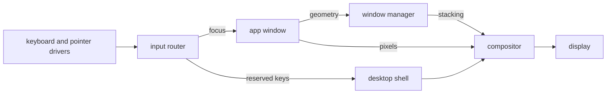
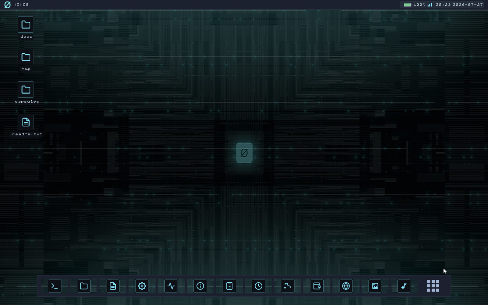
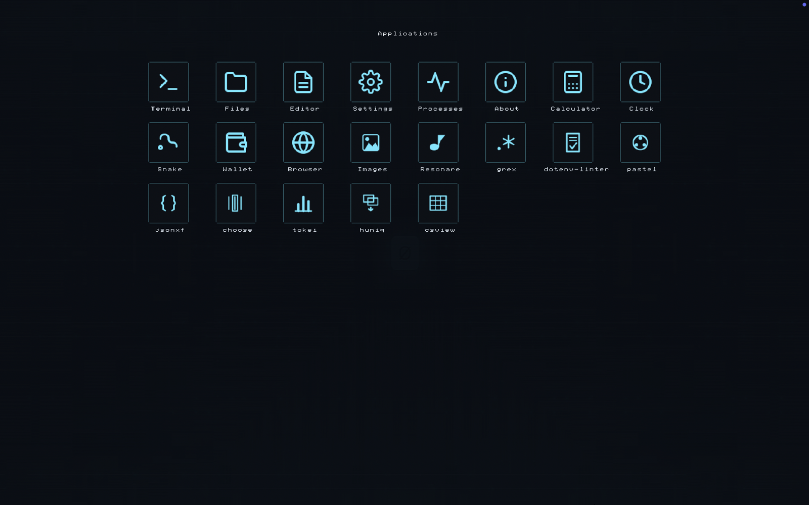

# The desktop

How to work the NONOS desktop: the menu bar, the dock, the Launchpad, windows, the apps that ship, and the few keys the desktop itself answers.

## What draws the screen

Three [capsules](../overview/glossary.md#capsule) make the desktop, and every pixel reaches the display through the compositor.

- The compositor draws every pixel a window shows. It presents through the virtio-gpu driver when one answers, otherwise through the kernel's copy to the UEFI framebuffer (`userland/compositor/README.md`).
- The window manager keeps each window's place, size, stacking order and focus. It never sees pixels (`userland/capsule_wm/README.md`).
- The desktop shell owns two full-screen layers: the desk under every window, with the desktop icons, and the chrome over every window, with the menu bar, the dock, the Launchpad, menus and notices (`userland/capsule_desktop_shell/README.md`).

The keyboard and pointer drivers send their events to the input router. A window gets the keys while it has focus. A small set of reserved keys never reaches a window and always goes to the desktop shell: they are listed under [Keys the desktop answers](#keys-the-desktop-answers). The app tells the window manager its geometry, and the window manager keeps the stacking the compositor draws.

The screenshot does not show this commit. The places of the menu bar, the desktop icons and the dock are as described here, but it has no menu titles and no magnifier, its icons are the entries of `/` rather than of the home folder, its dock has other tiles, and it shows a battery percentage, which this commit cannot show, since its kernel gives no charge.

## The menu bar

The bar runs across the top of the screen and stays there, even over a full-screen window.

- The brand at the left end brings the dock back for a moment when a full-screen window hides it.
- Five menu titles follow it. The first is named after the app whose window has focus, or reads `Desktop` when none has. The rows of each menu are fixed (`userland/capsule_desktop_shell/src/render/menubar_menu/items.rs`):

| Menu | Rows |
|---|---|
| App name, or `Desktop` | `Focus Window` (or `Refresh Desktop`), `Show All Apps`, `About This System` |
| `File` | `New Folder`, `New File`, `Open Files` |
| `View` | `Show Launchpad`, `Show Dock`, `Refresh Desktop` |
| `Go` | `Terminal`, `Browser`, `Settings` |
| `Help` | `About This System`, `Processes` |

- A menu row that opens an app brings that app's window forward if it has one, and opens a window only when it has none (`userland/capsule_desktop_shell/src/server/handlers/menubar_action.rs`).
- The status area at the right end holds, in order, the battery label, a network mark that dims while there is no DHCP lease, the magnifier, and the date and time (`userland/capsule_desktop_shell/src/render/topbar/status.rs`).
- Apps may put short text labels in the tray, just left of the status area. Labels that do not fit are counted as `+N`.
- The magnifier opens the Launchpad with its search field, and closes it when it is open.
- The clock follows the time zone and the 24-hour switch in [Settings](settings.md).

The battery label never shows a charge. It reads `No battery` when the firmware declares none, and `Battery status unavailable` otherwise (`userland/capsule_desktop_shell/src/state/indicators/battery_text.rs`). The kernel call behind it, `sys_battery_status`, never returns a percentage, because reading a battery needs an ACPI AML interpreter and the kernel does not have one (`src/syscall/microkernel/battery.rs:35-44`).

## The dock

The dock sits at the bottom of the screen. It holds fifteen app tiles and, last, the Launchpad button (`userland/capsule_desktop_shell/src/state/apps.rs`).

- A click on a tile raises the app's window, restoring it if it was minimised. If the app has no window, a new one opens and a notice says `opening a new window`.
- If nothing opens, a notice names the app and the reason, for example `did not open: no window in 30 s`, or `turned off at setup` for an app turned off during first-boot setup (`userland/capsule_desktop_shell/src/state/says.rs`).
- While a full-screen window is up, the dock is hidden. Touch the bottom edge of the screen with the pointer to bring it back over the window. It hides again when the pointer leaves it. A click on the brand shows it for 1.8 seconds (`BRAND_REVEAL_MS` in `userland/capsule_desktop_shell/src/state/taskbar/dock_rule.rs`).

## The Launchpad

The Launchpad is a full-screen grid of everything you can start. Open it with the Launchpad button at the end of the dock, with `View` then `Show Launchpad`, or with the magnifier on the menu bar.

- Type to filter the tiles. `Enter` starts the first tile left. `Backspace` erases. `Ctrl+V` pastes the first line of the clipboard into the search.
- `Esc` clears the search, and a second `Esc` closes the Launchpad. A click on empty space closes it too.
- The mouse wheel, or the dots, turn the pages.

There are four kinds of tile (`userland/capsule_desktop_shell/src/server/handlers/launchpad.rs`):

- An app opens its window.
- A tool opens the [Terminal](terminal.md) with the tool's command line. `pastel` runs at once; every other tool is typed at the prompt with the cursor after it, ready for its arguments.
- An installed program asks for your consent before it runs.
- A `.nonos` package file waiting in `/pkgs` shows what it holds and asks you to confirm its install (`userland/capsule_desktop_shell/src/server/handlers/pkg_install.rs`).

This screenshot does not show this commit either. It has no search field, it shows `Clock` and `choose` tiles that this commit does not have and other names for two media apps, and it has no Marketplace, Qwen, Video or Install tile. The tables on this page are the ones in the code.

Search matches the names of all four kinds of tile, in any case (`rebuild` in `userland/capsule_desktop_shell/src/render/launchpad/view.rs`). It does not search files: use the search in [Files](files.md) for that.

## Desktop icons

The icons on the desk are the entries of the home folder, `/home/nonos` (`userland/capsule_desktop_shell/src/server/desktop/home.rs`).

- A click opens an icon in the app that suits it: a folder in Files, a picture (`.png`, `.jpg`, `.jpeg`, `.bmp`, `.gif`) in Image Viewer, anything else in Editor.
- Drag an icon onto a folder icon to move it into that folder.
- Right-click empty desk space for `New Folder` and `New File`. Right-click an icon for `Open`, `Rename` and `Delete`.
- `Delete` on a folder removes the folder and everything in it (`userland/capsule_desktop_shell/src/vfs_client/remove.rs`). There is no trash.

## Windows

Every app window has a title bar with three round buttons at its left end: close, minimise, and the green button (`userland/toolkit/src/decorations/hit_test.rs`).

- Drag the title bar to move the window. A window cannot be dragged under the menu bar.
- Drag the right or bottom border to resize. The new size is applied when you let go (`userland/app_skeleton/src/runner/drag.rs`).
- The green button makes the window full screen: the whole width, from the foot of the menu bar to the bottom edge, over the dock's band. Press it again to get the old size back (`userland/app_skeleton/src/runner/chrome.rs`).
- A click in a window raises it and gives it the keyboard in one step.
- The first new window opens in the middle of the work area, between the menu bar and the dock. Each later one, in runs of five, steps down and to the right so its title bar stays reachable (`userland/capsule_wm/src/server/handlers/window_open/cascade.rs`).

A window that hangs, or takes every key, can always be ended: press `Ctrl+Alt+Esc` to bring Processes forward and end it there.

## Apps that ship

These are the apps the dock and the Launchpad know, in dock order (`LAUNCHER_APPS` in `userland/capsule_desktop_shell/src/state/apps.rs`):

| Label | Service | What it is |
|---|---|---|
| Terminal | `app.terminal` | The shell, with tabs and jobs. See [Terminal](terminal.md). |
| Files | `app.file_manager` | The file browser. See [Files](files.md). |
| Editor | `app.text_editor` | A text and code editor. |
| Settings | `app.settings` | The settings window. See [Settings](settings.md). |
| Processes | `app.process_manager` | Every process with its CPU, memory, capabilities and state; it can end one. |
| About | `app.about` | The machine's account of itself. See [About and its Proofs screen](#about-and-its-proofs-screen). |
| Marketplace | `app.store` | Browse and install signed apps. See [Marketplace](marketplace.md). |
| Calculator | `app.calculator` | Arithmetic. |
| Wallet | `app.nonos_wallet` | Keys and payments. See [Wallet](wallet.md). |
| Browser | `app.browser` | Web pages over the network you chose. See [Privacy networks](privacy-network.md). |
| Qwen | `tool.qwen` | A chat with the local Qwen model. It is not a capsule: the [Linux personality](../overview/glossary.md#linux-personality) runs it in a window of its own. See [Local model](local-ai.md). |
| Music | `app.audio_player` | The music player, titled `Resonare`. See [Sound and media](audio.md). |
| Video | `app.video_player` | The video player. See [Sound and media](audio.md). |
| Snake | `app.snake` | A game. |
| Install | `app.install` | Writes NONOS onto a disk you choose. See [Install to disk](../install/install-to-disk.md). |
| Image Viewer | `app.image_viewer` | A gallery of the PNG, JPEG, BMP and GIF files in the file store, and a view of one picture. It has no dock tile: open it from the Launchpad, or by opening a picture. |

First-boot setup can turn off eight optional groups: Browser, Wallet, the app store (Marketplace), Files, the text editor, Calculator, the media apps (Music, Video, Image Viewer), and Linux with Qwen (`OPTIONAL` in `userland/policy_proto/src/apps/table.rs`). Setup shows the desktop, Terminal, Settings and Processes as always on, and About, Snake and Install have no switch either. Settings has no switch to turn an optional app back on in this release: the `Apps turned off at setup` field is not among the fields it lists (`ALL_FIELDS` in `userland/capsule_settings/src/settings/schema/all_fields.rs`).

The seven command-line tools in `userland/apps.list` also have Launchpad tiles: `grex`, `dotenv-linter`, `pastel`, `jsonxf`, `tokei`, `huniq` and `csview`. They run in the Terminal.

## Keys the desktop answers

These keys go to the desktop shell whatever window has focus (`userland/capsule_input_router/src/route/chord.rs`, `userland/capsule_input_router/src/route/shell_keys.rs`):

| Key | What it does |
|---|---|
| `Ctrl+Alt+Esc` | Closes the Launchpad and menus, and brings Processes forward, opening it if needed. No window ever sees this chord. |
| Volume Up, Volume Down | Steps the master volume by 5 out of 100 and shows a notice such as `Volume 45%`. See [Sound and media](audio.md). |
| Mute | Mutes or unmutes, and shows `Muted` or the level. |
| Power | Shows `Power off is not available from the desktop`. |

One more chord never reaches a window: `Ctrl+Alt+Space` cycles the keyboard layout inside the keyboard driver. See [Keyboard layouts](keyboard-layouts.md).

The power key does not power the machine off, whether it comes from a keyboard or from the machine's ACPI power button, which the kernel turns into the same key (`src/arch/x86_64/acpi/power_button.rs`). The desktop has no Shut Down in this release: the power service capsule is built but not started, and the shell offers no shutdown action (`POWER_OFF_UNAVAILABLE` in `userland/capsule_desktop_shell/src/state/system_key.rs`).

The power button and the volume keys: Works on an x86_64 laptop (Intel Gemini Lake, 8 GB), maintainer hardware report, 6 October 2026; the image commit was not recorded.
