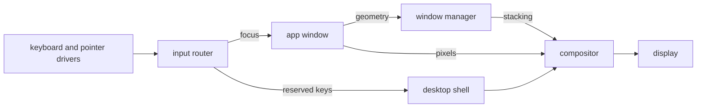

# The desktop

How to work the NONOS desktop: the menu bar, the dock, the Launchpad, windows, the apps that ship, and the few keys the desktop itself answers.

## What draws the screen

Three [capsules](../overview/glossary.md#capsule) make the desktop, and every pixel reaches the display through the compositor.

- The compositor draws every pixel a window shows. It presents through the virtio-gpu driver when one answers, otherwise through the kernel's copy to the UEFI framebuffer (`userland/compositor/README.md`).
- The window manager keeps each window's place, size, stacking order and focus. It never sees pixels (`userland/capsule_wm/README.md`).
- The desktop shell owns two full-screen layers: the desk under every window, with the desktop icons, and the chrome over every window, with the menu bar, the dock, the Launchpad, menus and notices (`userland/capsule_desktop_shell/README.md`).

The keyboard and pointer drivers send their events to the input router. A window gets the keys while it has focus. A small set of reserved keys never reaches a window and always goes to the desktop shell: they are listed under [Keys the desktop answers](#keys-the-desktop-answers). The app tells the window manager its geometry, and the window manager keeps the stacking the compositor draws.

The screenshot does not show this commit. The places of the menu bar, the desktop icons and the dock are as described here, but it has no menu titles and no magnifier, its icons are the entries of `/` rather than of the home folder, its dock has other tiles, and it shows a battery percentage, which this commit cannot show, since its kernel gives no charge.

## The menu bar

The bar runs across the top of the screen and stays there, even over a full-screen window.

- The brand at the left end brings the dock back for a moment when a full-screen window hides it.
- Five menu titles follow it. The first is named after the app whose window has focus, or reads `Desktop` when none has. The rows of each menu are fixed (`userland/capsule_desktop_shell/src/render/menubar_menu/items.rs`):

| Menu | Rows |
|---|---|
| App name, or `Desktop` | `Focus Window` (or `Refresh Desktop`), `Show All Apps`, `About This System` |
| `File` | `New Folder`, `New File`, `Open Files` |
| `View` | `Show Launchpad`, `Show Dock`, `Refresh Desktop` |
| `Go` | `Terminal`, `Browser`, `Settings` |
| `Help` | `About This System`, `Processes` |

- A menu row that opens an app brings that app's window forward if it has one, and opens a window only when it has none (`userland/capsule_desktop_shell/src/server/handlers/menubar_action.rs`).
- The status area at the right end holds, in order, the battery label, a network mark that dims while there is no DHCP lease, the magnifier, and the date and time (`userland/capsule_desktop_shell/src/render/topbar/status.rs`).
- Apps may put short text labels in the tray, just left of the status area. Labels that do not fit are counted as `+N`.
- The magnifier opens the Launchpad with its search field, and closes it when it is open.
- The clock follows the time zone and the 24-hour switch in [Settings](settings.md).

The battery label never shows a charge. It reads `No battery` when the firmware declares none, and `Battery status unavailable` otherwise (`userland/capsule_desktop_shell/src/state/indicators/battery_text.rs`). The kernel call behind it, `sys_battery_status`, never returns a percentage, because reading a battery needs an ACPI AML interpreter and the kernel does not have one (`src/syscall/microkernel/battery.rs:35-44`).

## The dock

The dock sits at the bottom of the screen. It holds fifteen app tiles and, last, the Launchpad button (`userland/capsule_desktop_shell/src/state/apps.rs`).

- A click on a tile raises the app's window, restoring it if it was minimised. If the app has no window, a new one opens and a notice says `opening a new window`.
- If nothing opens, a notice names the app and the reason, for example `did not open: no window in 30 s`, or `turned off at setup` for an app turned off during first-boot setup (`userland/capsule_desktop_shell/src/state/says.rs`).
- While a full-screen window is up, the dock is hidden. Touch the bottom edge of the screen with the pointer to bring it back over the window. It hides again when the pointer leaves it. A click on the brand shows it for 1.8 seconds (`BRAND_REVEAL_MS` in `userland/capsule_desktop_shell/src/state/taskbar/dock_rule.rs`).
